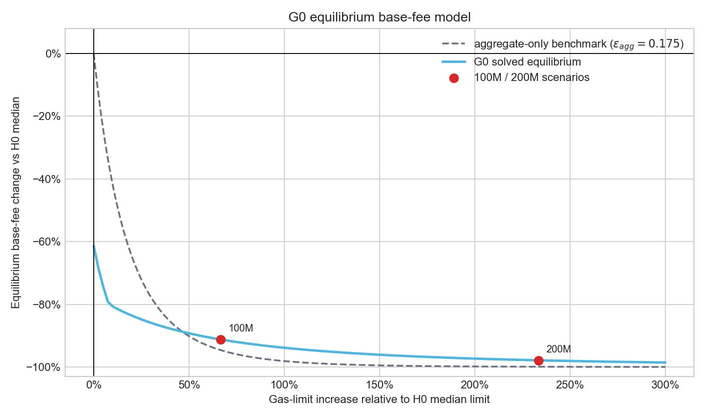
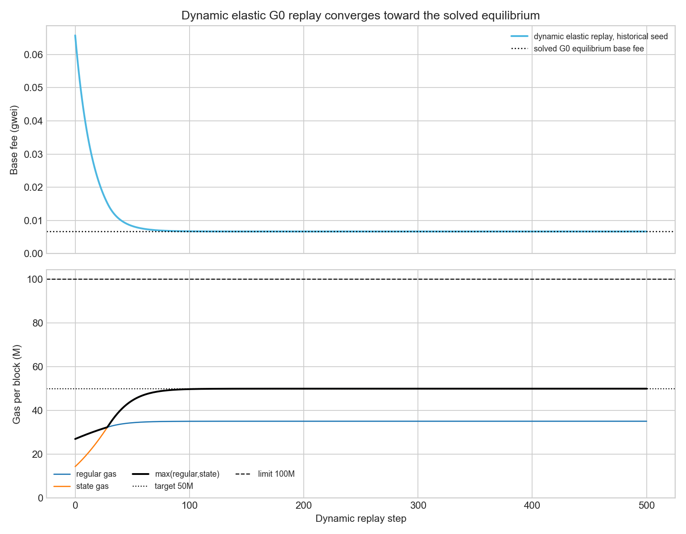

# Glamsterdam Equilibrium Base-Fee Model

Status: working research note

Primary notebook: `notebooks/1.6-g0-elastic-reference.ipynb`

Main data outputs: `data/g0_reference_decomposition_24120001_24120500.csv`, `data/g0_elastic_reference_results_24120001_24120500.csv`, `data/g0_equilibrium_base_fee_model_24120001_24120500.csv`

## 1. Purpose

This note explains the Glamsterdam equilibrium calculation used before moving
to multi-dimension.

```text
state:  EIP-8037 state gas
data:   EIP-7976 calldata floor + EIP-7981 access-list data surcharge
fee:    one shared EIP-1559 base fee
input:  max(regular gas, state gas)
```

There is no separate state base fee in Glamsterdam. There is also no bandwidth base fee
yet. BAL bytes are not priced in Glamsterdam.

The question is:

> Given observed activity, Glamsterdam repricing, and derived behavioral priors,
> what Glamsterdam base fee would make the expected bottleneck resource hit the target?

For the central Glamsterdam case:

```text
gas limit  = 100M
gas target = 50M
```

## 2. Inputs From The 500-Block Pilot

The numerical anchor comes from blocks `24,120,001` to `24,120,500`.

Historical observed mean quantities:

| Resource | historical mean gas/block |
|---|--------------------------:|
| Execution |                    24.46M |
| Data |                     1.07M |
| State |                     4.94M |

Passive Glamsterdam repriced mean quantities:

| Resource | Glamsterdam passive mean gas/block |
|---|---:|
| Execution | 25.04M |
| Data | 2.04M |
| State | 28.67M |
| Regular = execution + data | 27.09M |
| `max(regular, state)` | 33.32M |

This gives the average historical-to-Glamsterdam metering multipliers:

| Resource | Metering multiplier |
|---|---:|
| Execution | 1.024x |
| Data | 1.906x |
| State | 5.808x |

Interpretation:

```text
m_i = Glamsterdam gas for the same physical activity / historical gas for that activity
```

So state is repriced much more heavily than execution, and data is repriced
through EIP-7976/EIP-7981.

## 3. Behavioral Priors

The Glamsterdam equilibrium does not estimate new elasticities from the 500-block pilot.
It transports external historical behavioral priors:

| Parameter | Central value | Source / role                           |
|---|---:|-----------------------------------------|
| `epsilon_agg` | 0.175 | Prior gas-limit increase event estimate |
| `eta_state` | 0.43 | Prior state-vs-rest share response      |
| `epsilon_data_prior` | 0.487 | EIP-7623 calldata event study           |

The data prior is carried as a fixed own-price prior:

$$
\epsilon_{\mathrm{data}}^{\mathrm{prior}} \approx 0.487
$$

The nested demand model internally uses an $\eta_{\mathrm{data}}$ parameter. For
the 500-block historical pilot anchor, the fixed data prior converts to:

$$
\eta_{\mathrm{data}}^{\mathrm{model}} \approx 0.398
$$

This conversion is only a modeling bridge. The central empirical object we carry
from the EIP-7623 event is the data elasticity prior, not a sample-specific data
elasticity re-derived from the 500-block pilot.

## 4. Metering Multipliers And Effective Prices

Glamsterdam still has one shared base fee, but different activities face different
effective prices because their gas metering changes.

Let:

$$
m_i
=
\frac{\text{Glamsterdam gas for resource }i}{\text{historical gas for resource }i}
$$

and let:

$$
p
=
\text{candidate Glamsterdam base fee}
$$

The effective price ratio for resource $i$ is:

$$
r_i
=
\frac{p\,m_i}{p_{\mathrm{historical}}}
$$

where $p_{\mathrm{historical}}$ is the historical reference base fee. In the
notebook this is the median base fee of the 500-block window, about:

$p_{\mathrm{historical}} = 0.0761 \text{ gwei}$


So:

$m_i$ = mechanical metering change

$r_i$ = combined effective price change


This distinction matters. State can be repriced upward, with `m_state > 1`, but
still become cheaper in effective-price terms if the Glamsterdam equilibrium base fee
falls enough.

## 5. Demand Response

For each candidate Glamsterdam base fee, the model computes:

```text
execution demand
data demand
state demand
```

using the effective price ratios:

$$
r_{\text{execution}} = \frac{p * m_{\text{execution}}}{p_{\text{historical}}},
\quad
r_{\text{data}}      = \frac{p * m_{\text{data}}}{p_{\text{historical}}},
\quad
r_{\text{state}}     = \frac{p * m_{\text{state}}}{p_{\text{historical}}}.
$$

The model has three layers:

**total demand responds to the aggregate price index;**

**state share responds to state effective price;**

**data/execution share responds to relative data vs execution price;**


Then the physical quantities are mapped back into Glamsterdam metered gas:

$$
g_{\mathrm{regular}}(p)
=
m_{\mathrm{execution}}q_{\mathrm{execution}}(p) +
m_{\mathrm{data}}q_{\mathrm{data}}(p)
$$

$$
g_{\mathrm{state}}(p) = m_{\mathrm{state}}q_{\mathrm{state}}(p)
$$

The fee-market input is:

$$
u_{\mathrm{Glamsterdam}}(p)
=
\max\left(g_{\mathrm{regular}}(p),\ g_{\mathrm{state}}(p)\right)
$$

## 6. Equilibrium Condition

For a 100M gas limit, the target is 50M:

$$
T = 50{,}000{,}000
$$

The equilibrium base fee is the value of $p$ such that:

$$
u_{\mathrm{Glamsterdam}}(p) = T
$$

or:

$$
\max\left(g_{\mathrm{regular}}(p),\ g_{\mathrm{state}}(p)\right)
=
50{,}000{,}000
$$

If the max is above target, the base fee is too low. If the max is below target,
the base fee is too high.

## 7. Two Ways To Solve The Equilibrium

There are two related ways to reason about the Glamsterdam equilibrium base fee.

### Method 1: Direct Equilibrium Solve

The direct solver searches over candidate base fees. For each candidate base fee,
it:

```text
1. computes resource effective prices
2. applies the elastic demand model
3. maps physical demand into Glamsterdam metered gas
4. computes max(regular gas, state gas)
5. finds the base fee where max(...) equals the target
```

For the 100M case, this directly solves:

$$
\max\left(g_{\mathrm{regular}}(p),\ g_{\mathrm{state}}(p)\right)
=
50{,}000{,}000
$$

and returns:

```text
p_Glamsterdam = 0.00668 gwei
```

The direct-solve equilibrium curve is:



### Method 2: Dynamic Elastic Convergence Check

The dynamic check starts from the historical base fee and lets the EIP-1559
update rule play forward. At each step:

```text
1. current base fee determines current effective prices
2. elastic demand responds to those prices
3. max(regular gas, state gas) feeds the EIP-1559 update
4. the next base fee is computed
```

If the direct equilibrium is internally consistent, this dynamic path should
move toward the same solved equilibrium base fee.



This second method is a consistency check, not an independent empirical
estimate. It uses the same demand system as the direct solve. The value is that
it shows the EIP-1559 dynamics move in the expected direction when seeded away
from equilibrium.

## 8. Central 100M Result

The solved central 100M Glamsterdam equilibrium is:

| Quantity | Value |
|---|---:|
| Glamsterdam equilibrium base fee | 0.00668 gwei |
| Base fee / historical median base fee | 0.0879x |
| Demand expansion | 1.377x |
| Execution physical demand | 32.25M |
| Data physical demand | 1.10M |
| State physical demand | 8.61M |
| Regular metered gas | 35.11M |
| State metered gas | 50.00M |
| Base-fee input `max(regular, state)` | 50.00M |
| Binding branch | State |

The key row is:

```text
regular metered gas = 35.11M
state metered gas   = 50.00M
max(...)            = 50.00M
```

So state is the binding branch.

## 9. What "State Binding" Means

State binding does not mean there is a separate state base fee in Glamsterdam. It means
that the shared Glamsterdam base fee is disciplined by the state branch of the max:

$$
g_{\mathrm{state}} > g_{\mathrm{regular}}
$$

At the central equilibrium:

```text
state gas is exactly at the 50M target
regular gas is below target
```

The solver therefore finds the base fee needed to make repriced state demand hit
the target. At that same base fee, regular execution/data demand only reaches
about 35M.

## 10. Why State Can Bind Even If Base Fee Falls

The equilibrium base fee is much lower than the historical median base fee:

```text
p_Glamsterdam / p_historical = 0.0879
```

But the state metering multiplier is large:

```text
m_state = 5.808
```

So the state effective price ratio is roughly:

$$
r_{\mathrm{state}}
\approx
0.0879 \times 5.808
\approx
0.51
$$

State activity is still cheaper in effective-price terms than in the historical
baseline, even though it is mechanically repriced upward. That is possible
because the larger 100M limit pushes the equilibrium base fee down strongly.

The combination is:

```text
state metering gets much heavier
base fee gets much lower
net state effective price still falls
state demand expands
state metered gas reaches the 50M target
```

That is why the equilibrium solve is necessary. We cannot infer the result from
repricing alone.

## 11. Gas-Limit Sensitivity

Using the same central priors, the solved equilibrium curve gives:

| Gas limit | Target | Base fee | Base fee / historical median | Demand expansion | Regular gas | State gas | Binding branch |
|---:|---:|---:|---:|---:|---:|---:|---|
| 60M | 30M | 0.0293 gwei | 0.386x | 1.063x | 30.00M | 22.61M | Regular |
| 100M | 50M | 0.00668 gwei | 0.0879x | 1.377x | 35.11M | 50.00M | State |
| 150M | 75M | 0.00299 gwei | 0.0393x | 1.585x | 37.26M | 75.00M | State |
| 200M | 100M | 0.00164 gwei | 0.0215x | 1.761x | 38.37M | 100.00M | State |

In this pilot, the bottleneck switches from regular to state somewhere between
the current-size limit and the 100M scenario.

## 12. Limitations

The biggest limitation is that the behavioral priors are historical:

```text
epsilon_agg from historical gas-limit events
eta_state from Maria's state-vs-rest analysis
epsilon_data_prior from EIP-7623
```

Glamsterdam changes metering, so the true Glamsterdam elasticities may differ.
The model captures the mechanical repricing and the demand response implied by
the transported priors. It does not prove that users would keep exactly the same
behavioral elasticities after Glamsterdam.

Therefore the result should be read as:

> Given the best historical behavioral priors we have, what does the Glamsterdam
> 100M equilibrium look like?

not:

> This is the true observed Glamsterdam equilibrium.

The central result should be paired with sensitivity over:

```text
epsilon_agg
eta_state
epsilon_data_prior
state/data metering assumptions
gas limit and target
```

## 13. Bottom Line

The Glamsterdam 100M central equilibrium is state-binding:

```text
regular metered gas = 35.11M
state metered gas   = 50.00M
```

The solved base fee is much lower than the historical median:

```text
0.00668 gwei, or 8.8% of the historical median base fee
```

This does not contradict state repricing. State metering rises by about `5.8x`,
but the equilibrium base fee falls enough that the effective state price is still
below the historical baseline. State demand expands and, after applying the
Glamsterdam state metering multiplier, becomes the branch that hits the 50M
target.

This Glamsterdam equilibrium is the bridge from historical empirical priors to
later Mechanism A/B simulations. It gives the Glamsterdam-local resource mix and
base-fee anchor that the separate EIP-7999 dimensions will build on.
