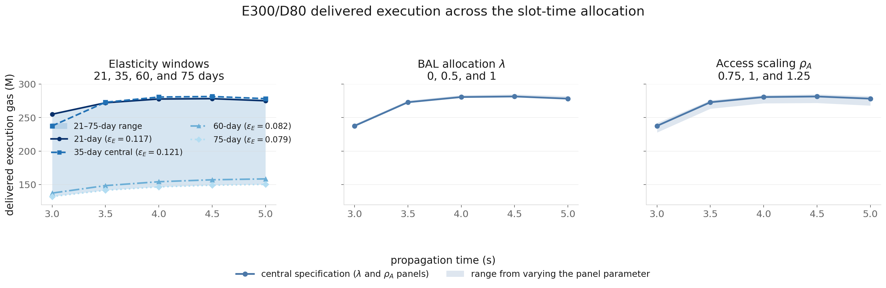
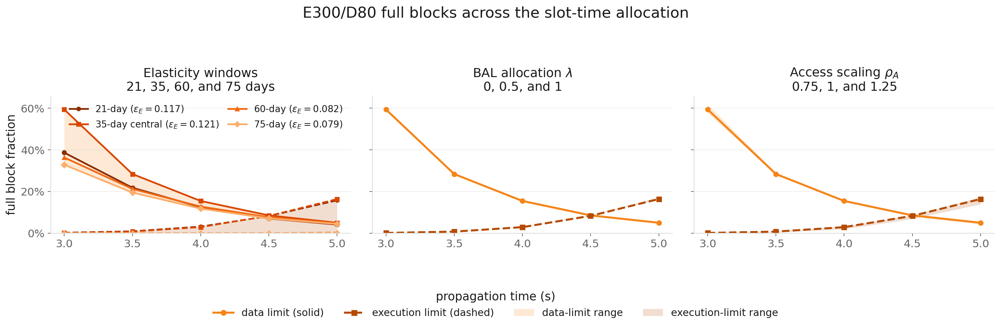

# Dynamic Simulation of a Bundle-Priced EIP-7999 Multidimensional Fee Market

## Overview

In the previous [EIP-7999 bundle-priced equilibrium analysis](bundle_priced_7999_equilibrium_report.md), we identified the execution-clearing boundary—the maximum execution target that can clear before the execution equilibrium fee reaches one wei for a given data target. Building on that equilibrium analysis, this post simulates the multidimensional fee market block by block under empirical demand variation and the protocol fee-update rules.

We recover three demand shocks—execution, static data, and state creation—and one BAL access-intensity shock from 430,605 consecutive blocks from 2 April to 31 May 2026. We jointly resample them while preserving recurring demand patterns, serial dependence, and cross-resource co-movement.

We first evaluate 63 target combinations under a fixed execution target-to-limit ratio of one-half. We then vary the physical execution and data limits by changing the share of a nine-second budget allocated to propagation and execution. Each configuration is simulated over the same 32 bootstrap paths, with a one-day burn-in followed by seven measured days, or 50,400 measured blocks. The results describe steady-state block-level dynamics under the sampled workload: delivered resources, hard-limit pressure, fee-floor operation, and effective-price variation.

The slot-time experiment exposes a physical substitution: more propagation time admits a larger payload but leaves less time for execution. It therefore reveals when data capacity releases execution bundles and when the shorter execution window becomes the new bottleneck. These are conditional capacity scenarios, not recommendations for attestation or PTC deadlines under ePBS.

The data-pull instructions and four-notebook reproduction sequence are available in the repository's [`notebooks/7999_simulation`](https://github.com/M1kuW1ll/eip-7999-research/tree/main/notebooks/7999_simulation) directory. Throughout, “E300/D80” denotes a configuration with a 300M execution target and an 80M data target; other configurations are written analogously.

### Main results

1. **Larger execution targets do not always deliver more execution.** When a high data fee suppresses BAL-producing activity or the data limit excludes BAL-carrying bundles, raising the execution target can primarily increase underutilization.
2. **Execution becomes floor-bound at both low and high data targets for different reasons.** Low data targets make BAL expensive; high targets remove burst headroom and cause data-limit exclusion. Intermediate data targets provide the strongest execution support.
3. **Under the fixed one-half execution target-to-limit grid, the data target ratio is the main determinant of data-limit pressure.** In the physical slot-time experiment, reallocating time toward propagation initially raises delivered execution by reducing BAL-related bundle exclusion, even though the execution limit falls.
4. **The highest mean delivered execution in the tested grid is approximately 282M gas per block.** It occurs around 4.0–4.5 seconds of propagation, but the selected configurations still spend substantial time at hard limits and the one-wei execution floor.
5. **A historically anchored lower-pressure rule selects approximately 243M execution gas per block.** Under the central calibration, E250/D52.5 is selected at both 3.5 and 4.0 seconds of propagation.

## Notation and central specification

| Group | Notation | Meaning |
|---|---|---|
| Resources | $i\in\{\mathrm{execution},\mathrm{data},\mathrm{state}\}$ | The three separately priced EIP-7999 resources |
| Fees | $b_{i,t}$, $P_{i,t}$, $p_t$, $p^0$ | Resource base fee, BAL-inclusive effective activity price, and the observed and reference historical shared base fees used to recover shocks |
| Capacity | $T_i$, $L_i$, $h_i$ | Gas target, hard limit, and normalization denominator; $h_i=L_i$ for execution and data and $h_i=T_i$ for state |
| Block quantities | $g_{i,t}^{\mathrm{offered}}$, $g_{i,t}^{\mathrm{included}}$ | Gas demanded before packing and gas included after applying the hard limits |
| Demand quantities | $q_{i,t}$, $q_i^0$, $q_{i,t}^{\mathrm{obs}}$ | Counterfactual parent activity, historical quantity anchor, and observed historical activity; the data parent quantity is static transaction data before BAL |
| Demand parameters | $\widetilde s_{i,t}$, $s_{i,t}$, $\epsilon_i$, $m_i$ | Raw recovered shock, simulated shock, own-price elasticity, and metering multiplier |
| BAL | $w_{\mathrm{execution}}$, $\bar w_{\mathrm{execution}}(R)$, $w_{\mathrm{state}}$, $\lambda$, $\rho_A$, $a_t$ | Reference and realized average execution-linked BAL intensity, state-linked BAL intensity, co-produced-BAL allocation, access scaling, and access-intensity shock |
| Outcomes | $\bar g_i$, $U_i$ | Mean included gas and target utilization $U_i=\bar g_i/T_i$ |

Unless stated otherwise, the central specification uses the 35-day elasticities $(\epsilon_{\mathrm{execution}},\epsilon_{\mathrm{data}},\epsilon_{\mathrm{state}})=(0.121,0.229,0.335)$, $\lambda=0$, $\rho_A=1$, and a 75M state target. The initial target grid uses a 90M data limit and the convention $L_{\mathrm{execution}}=2T_{\mathrm{execution}}$. This convention holds the execution target-to-limit ratio at one-half; it is not a physical three-second slot-time scenario. The blob-linked data reserve is disabled because the experiment does not specify a counterfactual blob-fee path.

## Dynamic simulation and empirical workload

The simulation uses the expanded, bundle-priced EIP-7999 mechanism described in the open [multi-resource pull request](https://github.com/ethereum/EIPs/pull/11835). Execution, data, and state each have their own fee and EIP-4844-style fake-exponential controller. A transaction's execution and state-creation activity also generate EIP-8279 runtime BAL, so users respond to BAL-inclusive parent prices:

$$
P_{\mathrm{execution}}=m_{\mathrm{execution}}b_{\mathrm{execution}}+\bar w_{\mathrm{execution}}(R_{\mathrm{execution}})b_{\mathrm{data}},
\qquad
P_{\mathrm{state}}=m_{\mathrm{state}}b_{\mathrm{state}}+w_{\mathrm{state}}b_{\mathrm{data}}.
$$

In each block, current effective prices determine movement along the demand curves while the sampled shocks shift those curves:

$$
q_{i,t}=q_i^0s_{i,t}\left(\frac{P_{i,t}}{p^0}\right)^{-\epsilon_i},
\qquad i\in\{\mathrm{execution},\mathrm{static\ data},\mathrm{state}\}.
$$

Realized execution and state activity generate runtime BAL. Offered bundles are then packed subject to the execution and data limits; when the data limit binds, parent activity and its linked BAL are excluded together. Each controller updates from included gas. Every configuration starts from its solved equilibrium fees, passes through a one-day burn-in, and is evaluated over the following seven days.

The block-scale and hourly workload components are constructed from 430,605 consecutive Ethereum blocks between 2 April and 31 May 2026; the slow daily component uses a longer 120-day accounting panel. For execution, static data, and state creation, observed activity is adjusted for the response predicted by the historical shared fee:

$$
\widetilde s_{i,t}
=
\frac{q_{i,t}^{\mathrm{obs}}}{q_i^0}
\left(\frac{p_t}{p^0}\right)^{\epsilon_i}.
$$

This is a price-adjusted demand condition under the maintained elasticity, not a causally identified shock. It is decomposed into a jointly sampled daily factor, a recurring UTC-hour profile, and a fast within-day residual:

$$
s_{i,t}^{\mathrm{sim}}=D_{i,d(t)}H_{i,h(t)}U_{i,t}.
$$

Runtime BAL receives a fourth, access-composition shock $a_t$, defined as observed BAL relative to the amount predicted by the block's execution and state activity. The BAL level predicted from parent activity is

$$
B_t^{\mathrm{parent}}
=w_{\mathrm{execution}}q_{\mathrm{execution}}^0
R_{\mathrm{execution},t}^{\rho_A}
+w_{\mathrm{state}}q_{\mathrm{state},t}^{\mathrm{obs}},
\qquad
R_{\mathrm{execution},t}
=\frac{q_{\mathrm{execution},t}^{\mathrm{obs}}}{q_{\mathrm{execution}}^0}.
$$

Equivalently, execution-linked BAL can be written as $\bar w_{\mathrm{execution}}(R_{\mathrm{execution},t})q_{\mathrm{execution},t}^{\mathrm{obs}}$, where $\bar w_{\mathrm{execution}}(R)=w_{\mathrm{execution}}R^{\rho_A-1}$. This captures changes in how access-intensive the transaction mix is without assigning BAL an independent demand curve. The preceding [BAL demand report](bundle_priced_bal_demand_model_report.md) attributes 11.4% of runtime-metered BAL directly to state creation and 88.6% to access-related activity.

| Component | Historical input | Role in the simulation |
|---|---|---|
| $s_{\mathrm{execution},t}$ | Observed execution activity | Shifts the execution demand curve |
| $s_{\mathrm{data},t}$ | Observed static transaction data | Shifts demand for calldata and other static data |
| $s_{\mathrm{state},t}$ | Observed persistent state creation | Shifts the state-creation demand curve |
| $a_t$ | Runtime BAL relative to BAL predicted by parent activity | Changes the access intensity of the transaction mix |

The fast four-dimensional residual $(U_{\mathrm{execution},t},U_{\mathrm{data},t},U_{\mathrm{state},t},a_t)$ is resampled in contiguous 3,200-block segments. The source daily, hourly, and fast-factor distributions are normalized once so their unconditional means preserve the historical quantity anchors. Individual simulated paths are not renormalized and may therefore represent unusually busy or quiet weeks.

Every configuration receives the same 32 multiscale paths. Differences between configurations therefore arise from targets, limits, and fee dynamics rather than different sampled workloads. Appendix A documents the fee update, shock recovery, source period, normalization, and validation in more detail.

### Outcome metrics

| Metric | Interpretation |
|---|---|
| Delivered execution | Mean included execution gas across measured blocks and bootstrap paths |
| Execution target utilization | Delivered execution divided by the configured execution target |
| Full block fraction | Fraction of blocks whose included quantity equals the data or execution hard limit |
| Execution fee bounded at one wei | Fraction of blocks with a one-wei execution fee while included execution remains below target |
| Mean absolute target deviation | Mean of $|g_{i,t}-T_i|/T_i$ across measured blocks |
| Effective-price variation | Standard deviation of block-to-block changes in the log BAL-inclusive activity price |

The one-wei metric distinguishes a fee that merely touches one wei from a controller that would reduce the fee further if the protocol allowed it. Full-block fractions use included quantities after packing, rather than offered demand before packing.

## Target grid under a fixed one-half execution target-to-limit ratio

This first experiment fixes $L_{\mathrm{data}}=90$M, $L_{\mathrm{execution}}=2T_{\mathrm{execution}}$, and $T_{\mathrm{state}}=75$M. It is a controlled target-grid convention: every execution target has the same one-half target-to-limit ratio. It should not be read as the physical three-second allocation introduced later, where every target is evaluated against the same 600M execution limit. The grid covers seven execution targets from 150M to 300M and nine data targets from 22.5M to 80M, producing 63 configurations.

### Execution support and one-wei operation

> Left: delivered execution as a fraction of the execution target. Right: the fraction of blocks in which the execution fee is bounded at one wei. Each cell is the mean across 32 seven-day measured paths.

Reading across an execution-target row, minimum-bound operation is U-shaped. It is frequent at very low and very high data targets and reaches its minimum around $T_{\mathrm{data}}=60$–$67.5$M. The two sides of the U have different causes.

**At low data targets, execution is price-constrained.** A low target requires a high data fee to contract static-data demand. The same data fee prices the BAL generated by execution, so the execution controller reduces its own fee until it reaches one wei. At D22.5, delivered execution plateaus near 156.7M from E225 through E300 even though the data limit binds in only 0.13% of blocks. The data price, rather than the data limit, creates the execution ceiling.

**At high data targets, execution is hard-limit-constrained.** D80 leaves only 10M of headroom beneath the 90M data limit. At E300, offered data averages 119.5M and the data limit is reached in 59.2% of measured blocks. Bundle-consistent packing removes parent execution together with its BAL, so execution underfills even while execution-limit capacity remains available.

The static equilibrium boundary is therefore necessary but insufficient for dynamic design. E300/D77 lies close to the one-wei equilibrium frontier, yet it delivers only 248.6M, or 82.9% of its target, and the execution fee is dynamically bounded at one wei in 71.0% of blocks.

| E300 row | D22.5 | D36 | D45 | D60 | **D67.5** | D77 | D80 |
|---|---:|---:|---:|---:|---:|---:|---:|
| Execution target utilization | 52.2% | 70.1% | 79.6% | 88.6% | **88.6%** | 82.9% | 79.3% |
| Execution fee bounded at one wei | 95.9% | 85.1% | 76.3% | 60.5% | **59.2%** | 71.0% | 77.5% |
| Delivered execution | 156.7M | 210.4M | 238.8M | 265.7M | **265.7M** | 248.6M | 238.0M |

Under the central calibration, no data target makes E300 dynamically comfortable: execution is priced out on the left, packed out on the right, and bounded at one wei in at least 59.2% of blocks across the row. Lower execution targets produce a deeper middle region; at D60 the one-wei bound applies in 1.8% of blocks at E200 and 5.6% at E225.

### Data-limit pressure and included-data composition

> Left: the fraction of blocks whose included data gas equals the 90M limit. Right: BAL as a share of included data gas.

The data-limit panel is almost columnar. At a fixed data target ratio, changing the execution target moves the full-data-block fraction much less than changing the data target. At $T_{\mathrm{data}}/L_{\mathrm{data}}=0.5$, the fraction remains between 5.2% and 5.9% across execution targets from 150M to 300M; across the full data-target range, it rises from approximately 0.1% to 59%.

Raising the execution target can even reduce data-limit pressure slightly. At D60, the data limit frequency falls from 20.2% at E150 to 19.2% at E300. The data controller holds mean included data near the same 60M target, but the composition changes:

| D60 column | E150 | E300 | Change |
|---|---:|---:|---:|
| Mean data fee | 103.9 wei | 148.2 wei | +43% |
| Static data offered | 60.26M | 53.42M | −6.84M |
| BAL offered | 8.12M | 13.73M | +5.61M |
| Total offered data | 68.39M | 67.15M | −1.24M |
| BAL share of included data | 12.5% | 21.4% | +8.9% |

A higher execution target lowers the execution fee, expands execution, and produces more BAL. The data controller responds by raising the data fee, which contracts static-data demand. The included data target is unchanged, but roughly 6M gas per block shifts from static data toward execution-linked BAL. This composition response slightly reduces the upper tail of total offered data even as the BAL share rises. It is a second-order effect: changing the data target still moves data-limit pressure by tens of percentage points, while doubling the execution target moves it by roughly one percentage point in this comparison.

### Effective-price variation

> Standard deviation of block-to-block log changes in the effective activity prices. Left: execution. Right: data.

Data-price variation generally rises with the data target ratio and changes little with the execution target. The data controller divides the included-gas gap by the fixed 90M limit, so the same proportional demand swing produces a larger absolute gas gap at a larger target. Along the E300 row, data-price variation rises from 0.029 at D22.5 to 0.125 at D77, before falling slightly to 0.121 at D80 as persistent clipping compresses the response.

Execution-price variation is non-monotonic. It peaks in the middle of the grid and falls to 0.027 at E300/D80, but this low value does not indicate comfortable market clearing. The execution base fee is bounded at one wei in 77.5% of blocks, which mechanically compresses variation in its own-fee component. A low variation statistic can therefore reflect an interior equilibrium, dominance by the BAL data charge, or one-wei floor compression; it must be read together with target utilization and limit pressure.

| Setting | Data target ratio | Delivered execution | Target utilization | Full on data | Execution fee bounded at one wei | Execution-price variation | Data-price variation |
|---|---:|---:|---:|---:|---:|---:|---:|
| E200/D45 | 0.500 | 198.8M | 99.4% | 5.4% | 3.8% | 0.052 | 0.055 |
| E225/D52.5 | 0.583 | 222.8M | 99.0% | 11.0% | 7.1% | 0.064 | 0.062 |
| E250/D60 | 0.667 | 244.8M | 97.9% | 19.3% | 18.6% | 0.081 | 0.073 |
| E275/D67.5 | 0.750 | 258.6M | 94.0% | 30.4% | 41.0% | 0.076 | 0.095 |
| E300/D77 | 0.856 | 248.6M | 82.9% | 51.4% | 71.0% | 0.035 | 0.125 |

## Changing the physical slot-time allocation

We now replace the fixed-ratio convention with physical limit pairs derived from a modeled nine-second propagation-plus-execution budget. More propagation time permits a larger payload and data limit but leaves less time for execution:

$$
L_{\mathrm{data}}=16\,\mathrm{payload}(t_{\mathrm{prop}}),
\qquad
L_{\mathrm{execution}}=v_{\mathrm{execution}}(9-t_{\mathrm{prop}}),
$$

where $v_{\mathrm{execution}}=100$M gas per second. The empirical-p90 propagation fit estimated from MEV-Boost blocks is

$$
t_{\mathrm{prop}}(\mathrm{ms})
=0.443\,S_{\mathrm{payload}}(\mathrm{KiB})+569\,\mathrm{ms}.
$$

| Propagation time | Execution time | Data limit | Execution limit |
|---:|---:|---:|---:|
| 3.0s | 6.0s | 90M | 600M |
| 3.5s | 5.5s | 108.4M | 550M |
| 4.0s | 5.0s | 126.9M | 500M |
| 4.5s | 4.5s | 145.4M | 450M |
| 5.0s | 4.0s | 163.9M | 400M |

Another half-second of propagation adds approximately 18.5M data gas of capacity and removes 50M execution gas of capacity under these conversions.

The propagation fit produces an 89.9M data limit at three seconds, rounded to 90M in the tables. For E300 alone, the earlier convention also gives $L_{\mathrm{execution}}=600$M, so the E300/D80 grid cell coincides with the rounded 3.0-second physical row. Other execution-target rows do not: the fixed-ratio grid assigns each one its own execution limit.

### Holding E300/D80 fixed

E300/D80 is feasible at every tested split, allowing the targets to remain fixed while only the hard limits change.

| Propagation time | Execution limit | Data limit | Mean data fee | Demanded data gas | Delivered execution / utilization | Full on data | Full on execution | Execution fee bounded at 1 wei |
|---:|---:|---:|---:|---:|---:|---:|---:|---:|
| 3.0s | 600M | 90M | 5.01 wei | 119.5M | 237.8M / 79.3% | 59.2% | 0.1% | 77.5% |
| 3.5s | 550M | 108.4M | 18.18 wei | 95.6M | 272.9M / 91.0% | 28.4% | 0.8% | 52.1% |
| 4.0s | 500M | 126.9M | 43.86 wei | 88.0M | 280.7M / 93.6% | 15.5% | 2.9% | 45.2% |
| 4.5s | 450M | 145.4M | 56.05 wei | 84.9M | **281.5M / 93.8%** | 8.5% | 8.3% | **45.1%** |
| 5.0s | 400M | 163.9M | 60.31 wei | 83.6M | 278.3M / 92.8% | 5.0% | 16.4% | 48.9% |

Demanded data gas is total offered static data plus execution- and state-linked BAL before hard-limit clipping.

> The targets remain fixed while propagation time raises the data limit and reduces the execution limit. The figure reports the changing hard-limit frequencies and mean delivered execution.

Moving from 3.0s to 4.0s gives up 100M of execution limit, gains approximately 37M of data limit, and raises delivered execution by approximately 43.0M. At three seconds, data is full in 59.2% of blocks while the execution limit is almost never reached. The data limit therefore removes execution bundles even though nominal execution capacity remains unused. Additional propagation headroom releases this trapped execution.

The additional propagation capacity does not merely include more of the original 119.5M of offered data demand. It changes the fee equilibrium: the controller prices offered demand downward while allowing much more parent execution to survive inclusion. At three seconds, the 90M data limit censors demand only 10M above the 80M target, keeping the mean data fee at 5.01 wei. Raising the limit to 126.9M exposes more demand above the target to the controller and raises the mean data fee to 43.86 wei. Static-data demand consequently contracts from 103.8M to 73.4M, bringing total offered data down from 119.5M to 88.0M even though mean included data remains close to the 80M target. The higher data fee also reduces offered execution from 325.4M to 302.5M through the BAL-inclusive execution price. However, the reduction in data-side rationing more than offsets that contraction, so included execution rises from 237.8M to 280.7M.

The marginal benefit diminishes as the bottleneck changes hands. Full data blocks fall from 59.2% to 5.0%, full execution blocks rise from 0.1% to 16.4%, and the two frequencies cross near 4.5s. Delivered execution peaks at 4.5s and then falls because the shrinking execution limit costs more capacity than the additional data headroom releases.

## Selecting candidate targets under each physical split

The complete target grid is rerun under every physical limit pair. Two transparent selection rules summarize the resulting design surface; neither is a welfare optimum.

> The figure follows the maximum-throughput candidate and the historically anchored lower-pressure candidate across the physical splits.

### Maximum throughput

For each propagation time, the table retains the configuration with the highest mean delivered execution across the 32 paths. This is a point selection from the tested grid; small differences between neighboring configurations need not be statistically meaningful.

| Propagation | Configuration | Equilibrium execution fee | Delivered execution | Execution fee bounded at one wei | Full on execution | Full on data |
|---:|---|---:|---:|---:|---:|---:|
| 3.0s | E300/D60 | 1.000 wei (bounded) | 265.652M | 60.59% | 0.41% | 19.20% |
| 3.5s | E300/D67.5 | 1.000 wei (bounded) | 275.481M | 51.39% | 1.33% | 14.61% |
| 4.0s | E300/D80 | 1.205 wei | 280.700M | 45.23% | 2.90% | 15.47% |
| 4.5s | E300/D90 | 1.619 wei | 281.679M | 44.08% | 6.54% | 14.12% |
| 5.0s | E300/D90 | 1.619 wei | 280.032M | 46.42% | 15.67% | 8.40% |

Every maximum-throughput configuration has a 300M execution target—the top of the tested grid—while the selected data target rises from 60M at three seconds to 90M at 4.5 and five seconds. Mean delivered execution rises from 265.7M to 281.7M before easing to 280.0M.

### Historically anchored candidate selection

The lower-pressure rule uses current mainnet operation as an external benchmark. Across 860,505 canonical blocks from February through May 2026, 4.734% of blocks reach at least 98% of the gas limit and the mean absolute distance from the EIP-1559 target is 35.346%. The rule permits a 20% tolerance around both values, giving ceilings of 5.681% for near-limit frequency and 42.415% for execution target deviation. It also requires the solved reserve-free execution equilibrium fee to exceed one wei. Among the qualifying configurations, the one delivering the most execution is selected at each split.

| Propagation | Configuration | Equilibrium execution fee | Delivered execution | Execution deviation | Blocks near either limit |
|---:|---|---:|---:|---:|---:|
| 3.0s | E200/D36 | 10.844 wei | 196.183M | 32.06% | 1.83% |
| 3.5s | E250/D52.5 | 2.052 wei | **243.025M** | 31.54% | 5.60% |
| 4.0s | E250/D52.5 | 2.052 wei | 242.918M | 31.58% | 4.75% |
| 4.5s | E225/D60 | 19.415 wei | 223.854M | 31.48% | 5.26% |
| 5.0s | E200/D67.5 | 58.176 wei | 199.852M | 31.39% | 5.51% |

The historically anchored choice changes with the physical limits. E250/D52.5 delivers approximately 243M under both the 3.5-second and four-second splits. At four seconds, the maximum-throughput candidate delivers 280.7M, but the lower-pressure candidate reduces exact hard-limit saturation from 18.37% to 4.17% and near-limit frequency from 19.40% to 4.75% while raising execution target utilization from 93.6% to 97.2%.

This rule narrows the candidate set but does not define protocol welfare. The 98% near-limit threshold and 20% tolerance are explicit design choices imported from a different, one-dimensional fee mechanism. The static equilibrium-fee condition is only a preliminary eligibility check: it does not guarantee infrequent dynamic floor binding. Data and state target deviations remain diagnostics because the historical market provides no separate benchmark for them.

## Robustness of the physical result and candidate selection

The sensitivity parameters affect different stages of the design problem. We first hold E300/D80 fixed and replay all 36 combinations of four elasticity windows, $\lambda\in\{0,0.5,1\}$, and $\rho_A\in\{0.75,1,1.25\}$ at every physical split. These figures isolate how the same target pair responds to alternative maintained specifications. Their shaded regions are specification ranges, not confidence intervals: each panel varies its named parameter while holding the other two at their central values.

> Delivered execution under fixed E300/D80 targets. The elasticity panel reports all four estimation windows. The other panels vary BAL allocation or access scaling around the central specification; each shaded region spans the values named in that panel.

> Full data and execution block fractions under fixed E300/D80 targets. Solid lines report the data limit and dashed lines report the execution limit. Each shaded region spans the values of the parameter named in that panel while the other parameters remain at their central values.

BAL allocation has the smallest effect: varying $\lambda$ moves fixed-design delivered execution by no more than 3.9M across the tested splits. Access scaling has a moderate effect, producing a 12.3M–14.2M range as faster access growth increases execution-linked BAL pressure. Neither change removes the handover from data pressure to execution pressure.

The elasticity window is qualitatively different because it determines demand feasibility. Under the 21- and 35-day estimates, demand can support the larger execution targets, so the trade-off between data headroom and execution time produces an interior peak around 4.0–4.5 seconds. Under the 60- and 75-day estimates, execution reaches its one-wei demand ceiling near 161M and 152M. Execution then remains below every tested physical limit, and delivered execution continues to rise modestly through five seconds as data-side exclusion falls.

To test the actual design choice, we rerun the complete target surface under the central specification and seven alternatives: the other three elasticity windows, two other $\lambda$ values, and two other $\rho_A$ values. Each alternative changes one parameter while the others remain central. Within each specification, we select once across all propagation times and target pairs. Because the elasticity estimates divide the results into two economically different regimes, the main comparison summarizes those regimes rather than listing every specification separately.

| Calibration regime | Maximum-throughput result | Historically anchored result | Interpretation |
|---|---|---|---|
| Demand-feasible: 21-/35-day and structural sensitivities | 4.5s, E300/D80–D90; 276–285M execution | 3.5–4.0s, usually E250/D52.5; 223–247M | Propagation region is stable; exact targets vary |
| Demand-constrained: 60-/75-day | Approximately 150–159M execution regardless of high target | Approximately 142–146M | Demand curve, not slot-time capacity, is binding |

All six demand-feasible maximum-throughput selections occur at 4.5 seconds. The historically anchored rule selects 3.5 seconds under the central specification and 4.0 seconds under the other five demand-feasible specifications. The 60- and 75-day cases select five seconds only because execution remains below every tested physical limit while additional data headroom reduces bundle exclusion. Neither calibration yields a qualifying historically anchored candidate at 3.0 or 3.5 seconds, and the 75-day calibration has none at 4.0 seconds. The physical bottleneck-handover region is therefore more stable than the exact target pair.

## Limitations

**Physical capacity mapping.** The slot-time results depend on the empirical-p90 propagation curve, a 100M-gas-per-second execution rate, and a nine-second propagation-plus-execution budget. Runtime-metered BAL and final encoded BAL are also different physical objects. The reported limit pairs are conditional capacity scenarios rather than network-safety recommendations.

**Aggregate inclusion and no backlog.** The packer excludes parent activity and linked BAL proportionally rather than selecting individual transactions. Demand excluded from one block is treated as unserved flow rather than a queue that retries later. The model therefore captures bundle-consistent capacity pressure but not builder selection, mempool accumulation, or waiting time.

**Demand and BAL extrapolation.** The isoelastic demand curves, access-scaling parameter, and BAL attribution are transported beyond their historical calibration range. These assumptions particularly affect whether execution targets above approximately 200M–250M are supported.

**Candidate selection.** The target grids are discrete, and the maximum-throughput and historically anchored rules encode different design preferences. They identify candidates within the tested surface, not a unique welfare optimum.

## Conclusion

The dynamic simulation changes how the static execution-clearing boundary should be interpreted. A target combination can clear under mean demand yet operate poorly block by block. With a low data target, the resulting high data fee raises the BAL-inclusive execution price and suppresses execution even when its own fee has reached one wei. With a data target close to its hard limit, positive shocks instead cause bundle exclusion: execution is removed together with the BAL it generates, again leaving the execution fee unable to fall further. The dynamically useful region lies between these two failure modes.

Under the fixed one-half execution target-to-limit grid, a 90M data limit leaves no comfortable data target for E300. In the physical experiment, reallocating slot time toward propagation relieves this data bottleneck and initially increases delivered execution despite reducing the execution limit. Under the central calibration, delivered execution reaches approximately 282M around 4.0–4.5 seconds of propagation, after which the shrinking execution window becomes the dominant constraint. The historically anchored lower-pressure rule instead selects approximately 243M around 3.5–4.0 seconds. These are conditional candidate designs rather than protocol recommendations.

The analysis establishes how execution and data targets interact through BAL, how fee floors and hard limits create distinct underfill regimes, and how propagation and execution time jointly determine usable capacity. The next comparison is against a physically optimized shared-fee market using EIP-8279 transaction floors, a recalibrated aggregate data multiplier, the same multiscale demand paths, and the same slot-time budget. That matched benchmark can test whether separate resource pricing delivers more execution, better controls state growth and payload size, or changes fee variation and hard-limit pressure relative to the strongest one-dimensional alternative.

## Appendix A: Simulation methodology

### Fee update and validation

EIP-7999 accumulates a normalized excess-gas counter for each resource and exponentiates it. Away from integer rounding, the resulting fee movement is approximately

$$
b_{i,t+1}
\approx
\max\!\left\{
1\text{ wei},
b_{i,t}
\exp\!\left[
2\ln(1.125)
\frac{g_{i,t}^{\mathrm{included}}-T_i}{h_i}
\right]
\right\},
$$

where $h_i=L_i$ for execution and data and $h_i=T_i$ for state, which has no hard limit in this experiment. Usage at the target leaves the fee unchanged; persistent above-target usage raises it, and persistent below-target usage lowers it subject to the one-wei minimum. When $T_i=L_i/2$, a full execution or data block raises the fee by approximately 12.5%, while an empty block lowers it by approximately 11.1%. The vectorized transition used for the simulations was checked against the integer `fake_exponential` implementation and agreed on all 3,943 tested values.

### Recovering price-adjusted demand conditions

Observed gas usage combines underlying willingness to transact with movement along the historical demand curve. Replaying it directly would retain the historical price response and apply a second response under counterfactual fees. For parent resource $i$, the maintained historical equation is

$$
q_{i,t}^{\mathrm{obs}}
=q_i^0\widetilde s_{i,t}
\left(\frac{p_t}{p^0}\right)^{-\epsilon_i},
$$

which gives the price-adjusted demand condition reported in the main text. For illustration, if execution activity is 20% above its historical mean while the fee is twice its reference value, then under $\epsilon_{\mathrm{execution}}=0.121$,

$$
\widetilde s_{\mathrm{execution},t}
=1.20\times2^{0.121}\approx1.30.
$$

The recovered condition is approximately 30% above normal because the high observed fee was already suppressing execution. This adjustment is conditional on the elasticity estimate and is not a causal identification strategy.

### Recovering access intensity

The raw access-intensity ratio is

$$
\widetilde a_t
=\frac{g_{\mathrm{BAL},t}^{\mathrm{obs}}}{B_t^{\mathrm{parent}}},
$$

with $B_t^{\mathrm{parent}}$ defined by the BAL-level equation in the main text. We compare this ratio with its centered 201-block rolling median so that $a_t$ captures unusually high or low access intensity relative to the surrounding transaction mix. The factor is then centered using predicted BAL as the weight: a percentage surprise in a block carrying 10M predicted BAL affects the aggregate anchor ten times as much as the same surprise in a block carrying 1M. This preserves average historical BAL without introducing an independent BAL demand curve.

### Source panels and path construction

The fast panel covers blocks 24,788,193 through 25,218,797, or 430,605 consecutive blocks from 2 April through 31 May 2026. Block-level execution, static data, state creation, and historical fees are collected from Xatu-derived tables, and the EIP-8279 runtime BAL meter is reconstructed from RPC block and receipt data. The slow daily factors use complete UTC days from the longer February–May 2026 accounting panel.

The recurring UTC-hour profile is estimated jointly for the three parent resources. Daily factors are sampled jointly in contiguous eight-day strips, while the four fast residuals are copied together in contiguous 3,200-block strips, approximately 10.7 hours. The latter length is selected from 400–6,400-block candidates using serial-correlation, cross-resource-correlation, and clustered-extreme diagnostics.

Hourly, daily, and fast source components are each centered once at the distribution level. They are then multiplied to produce each complete path. No path-specific recentering is applied, so a path that samples several busy days remains a busy path. The 7,200-block burn-in and 50,400-block measurement window together form one eight-day replay, and every target or limit configuration receives identical paths for paired comparison.
