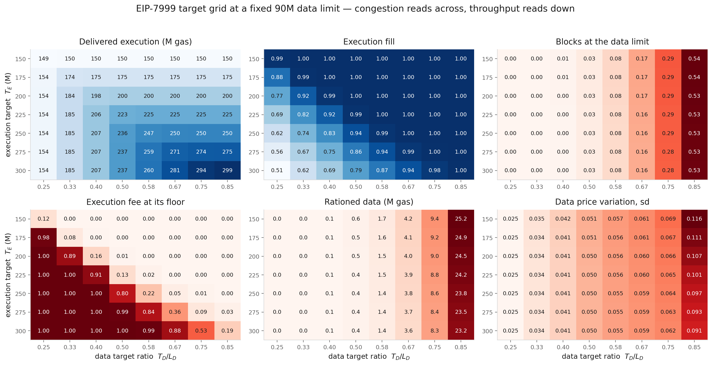

# Dynamic Simulation of the Bundle-Priced EIP-7999 Fee Market

The [equilibrium analysis](bundle_priced_7999_equilibrium_report.md) answers a
static question: which target configurations admit an all-target-clearing fixed
point. That is a necessary condition for a workable design, but it is not
sufficient. A configuration that clears in steady state can still be unusable
block to block, because real demand arrives in bursts and the protocol's hard
limits, not its prices, absorb the excess.

This report runs the mechanism block by block under empirically measured demand
variation, as a three-part experiment:

1. **sweep** the EIP-7999 execution and data targets over a grid, holding the
   data limit fixed at the protocol constant;
2. **select** candidate configurations from that grid by a stated rule;
3. **compare** those candidates against Glamsterdam under the same latent
   workload.

Everything below follows that order. Diagnostics that belong to none of the
three parts — how the market behaves at launch, and what one configuration's
steady state looks like in detail — are in the appendix.

**Main results**

1. **The two target choices are close to separable.** Data congestion is almost
   entirely a function of the ratio $T_D/L_D$: at a fixed ratio it moves from
   0.028 to 0.033 as $T_E$ goes 150M to 300M, but from 0.000 to 0.533 across
   ratios at fixed $T_E$. Pick the ratio from tolerable congestion, then pick
   the execution target for throughput.
2. **A fixed data limit, not the execution target, sets achievable
   throughput**, and the binding symptom is the execution fee rather than the
   gas counter. Beyond the ceiling, extra execution target buys delivered gas
   only by pushing the execution fee onto its one-wei floor, where execution is
   permitted rather than priced.
3. **Three candidates span the useful range** under a 90M data limit:
   **E200/D36** delivers 198M with 2.2% of blocks at a hard limit, **E225/D45**
   delivers 223M at 2.9%, and **E250/D60** delivers 250M at 16.1%.
4. **Saturation compresses the price signal.** As $T_D$ approaches $L_D$ the
   block is clipped before the fee can respond, so scarcity is resolved by
   exclusion rather than price. The most congested design has the *smallest*
   fee response — a failure that reads as stability on any volatility metric.
5. **Against Glamsterdam at 200M, EIP-7999 delivers 3.5× the execution with 27%
   less state creation**, because one shared fee cannot separate execution from
   state and the most elastic resource absorbs the headroom.
6. **Separate pricing decouples the three prices, and moves cost onto state.**
   Under Glamsterdam all three effective activity prices are multiples of one
   fee and vary identically (sd 0.058); under EIP-7999 they separate — execution
   0.050, data 0.050, state 0.185. An execution-heavy bundle becomes almost
   free while a state-creating bundle costs 2.3× more.

---

## 1. Experimental design

Each configuration is solved for its static equilibrium, warm-started there, and
advanced through the same bootstrap shock paths from the same seeds, with a
common one-day burn-in discarded before any statistic is taken. Comparisons are
therefore paired and seed noise cancels.

### 1.1 What the simulator does

Each block, every resource's demand is evaluated at the price that resource
currently faces, runtime BAL is generated from realised parent activity, offered
gas is clipped at the hard limits, and each fee updates from what was included.

The EIP-7999 side carries the bundle-priced parent prices from the
[BAL demand model](bundle_priced_bal_demand_model_report.md):

$$
P_{\mathrm{execution}}
=m_{\mathrm{execution}}b_{\mathrm{execution}}
+\bar w_{\mathrm{execution}}b_{\mathrm{data}},
\qquad
P_{\mathrm{state}}
=m_{\mathrm{state}}b_{\mathrm{state}}
+w_{\mathrm{state}}b_{\mathrm{data}},
$$

so a higher data fee suppresses the activity that produces BAL, and BAL follows
realised activity rather than a capacity target.

The fee recursion is sequential in time, so the only axis available for
vectorisation is the trajectory. One time loop advances every design, seed and
model specification together, with statistics accumulated online: a full
robustness sweep is order $10^8$ block updates, and storing even one field per
block per trajectory would run to gigabytes.

#### Validation

The kernel is checked against the reference implementation rather than assumed
correct.

| Check | Result |
|---|---|
| Vectorised fee transition against the integer `fake_exponential` | exact on all 3,943 values tested from 1 wei to 3.58 gwei |
| Excess-gas recursion over 20,000 blocks, three fee regimes | zero drift |
| Warm start at a solved equilibrium under unit shocks | fees stationary to $4\times10^{-5}$ |
| Floor-bound execution fill against the static solver | 0.9350 and 0.8500 against 0.934982 and 0.849983 |

The last is the strongest: the dynamic path independently reproduces the static
solver's execution fill for designs where execution underfills at the one-wei
floor.

One defect was found this way. The reference floors each normalised excess
delta before applying it; a float recursion that does not drifts from it within
a few hundred blocks. Left unfixed, every long-horizon volatility and floor
statistic would have been unreliable.

### 1.2 Modelling the shocks

The dynamic questions all depend on persistence: how long congestion lasts, how
extreme a burst gets, how quickly a fee recovers. None of that is identified by
the 6,000-block calibration sample used elsewhere in this project, because its
blocks are spaced about 102 apart.

Two contiguous panels were pulled for this report, both over the same 14 days
and 100,439 consecutive blocks. The first carries block-level execution, static
data and state creation from Xatu's block, transaction and diff tables. The
second reconstructs the EIP-8279 runtime meter over the same range.

#### From observed quantities to shocks

An observed quantity is not a shock. Dividing out the demand curve at the
observed price removes the mechanical fee response, and removing the intraday
profile and the day-level mean removes variation that is predictable rather than
stochastic. Both corrections matter: the day-level term alone cuts the measured
correlation time of the data residual from 86 blocks to 38.

The access-composition residual is the observed runtime BAL relative to what
this block's own parent activity predicts:

$$
a_t=\frac{g_{\mathrm{BAL},t}}
{w_{\mathrm{execution}}q_{\mathrm{execution}}^0R_{\mathrm{execution},t}^{\rho_A}
+w_{\mathrm{state}}q_{\mathrm{state},t}}.
$$

#### What the panel shows

| | execution | static data | state | access |
|---|---:|---:|---:|---:|
| sd of log residual | 0.592 | 0.698 | 0.842 | 0.189 |
| autocorrelation at lag 1 | −0.090 | −0.041 | +0.039 | +0.200 |
| integrated correlation time | 7.4 | 30.4 | 30.1 | 6.6 blocks |
| tail clustering, $P(\text{high}\mid\text{high})$ | 0.148 | 0.163 | 0.174 | 0.159 |

Three features rule out simpler samplers. Persistence is real but sits past lag
one, so an AR(1) fitted at lag one would miss it. Extreme blocks cluster at
roughly three times the independent rate, so tail behaviour is not captured by
matching variance. And the residuals co-move strongly — execution with data at
0.81, execution with state at 0.62 — so independent sampling would understate
simultaneous pressure across resources.

The access residual correlates **−0.19** with execution, which is why it cannot
be drawn separately: unusually execution-heavy blocks are on average slightly
less BAL-intensive once parent activity is accounted for. This is a reduced-form
composition relationship, not a causal coefficient; some negative correlation is
mechanical, since execution appears in the denominator.

A vector moving-block bootstrap draws all four residuals at common offsets, so
both the cross-resource correlation and each resource's own persistence survive
resampling. Block length is chosen by measurement rather than rule of thumb:
1600 blocks minimises the reproduction error on integrated correlation time.
Blocks of 8 to 64, which the measured correlation times would suggest,
reproduce the data residual's correlation time as 5 to 8 against a source value
of 30, because the autocorrelation has a long low-level tail.

> **A caution on scope.** Fourteen contiguous days identify ordinary block
> variation, joint structure and short congestion runs. Resampling them
> thousands of times estimates the distribution implied by those fourteen days
> very precisely; it does not create tail regimes that fortnight did not
> contain. Extreme-value claims need a longer source panel.

### 1.3 What is varied, and what is not

The design variables are the ones a protocol author chooses:

$$
T_{\mathrm{execution}},\quad L_{\mathrm{execution}},\quad T_{\mathrm{data}}.
$$

The data limit $L_{\mathrm{data}}$ is a protocol constant, fixed at 90M
throughout, so the only data-side choice is the target and the burst headroom
is whatever the target leaves. The execution limit is held at
$L_{\mathrm{execution}}=2T_{\mathrm{execution}}$: execution is price-constrained
rather than capacity-constrained in every regime examined here, sitting at or
near the one-wei floor while underfilling, so headroom above a target it cannot
reach does nothing. The state target is held at 75M.

Separately, $\lambda$, $\rho_A$ and the elasticity vector are **not** design
variables. They are what the model is uncertain about, and they are used to ask
whether a design survives them rather than optimised over.

Every design and specification sees identical shock paths from the same seeds,
so comparisons between them are paired and seed noise cancels. Uncertainty is
reported across weekly replications rather than across blocks, since block
observations are serially dependent.

### 1.4 What is measured

Every configuration reports the same metric set, per resource:

| Group | Metrics |
|---|---|
| Throughput | mean included gas; fill against target, $u_i/T_i$ |
| Congestion | fraction of blocks at a hard limit; longest run at the limit |
| Rationing | mean offered minus included gas |
| Floor operation | fraction of blocks with $b_i = 1$ wei |
| Price variation | sd of $\Delta\log P_i$, and its 95th and 99th percentiles |

Price variation is measured on **effective activity prices**, not base fees:

$$
P_{\mathrm{execution}}=m_{\mathrm{execution}}b_{\mathrm{execution}}
+\bar w_{\mathrm{execution}}b_{\mathrm{data}},
\qquad
P_{\mathrm{data}}=m_{\mathrm{data}}b_{\mathrm{data}},
\qquad
P_{\mathrm{state}}=m_{\mathrm{state}}b_{\mathrm{state}}+w_{\mathrm{state}}b_{\mathrm{data}}.
$$

An execution unit pays its own metered gas *and* the BAL data gas it generates,
so both parent prices carry $b_{\mathrm{data}}$. This is not cosmetic: at the
central configuration the execution base fee varies with sd 0.091 while the
price a user actually faces varies with sd 0.050, because the two fees do not
move together. Raw base fees also price different gas units under the two
mechanisms and cannot be compared across them at all; these prices can.

### 1.5 How Glamsterdam sees the same workload

Glamsterdam runs at a 200M gas limit with a 100M target, metering execution and
data in one branch against state in the other, and pricing both with one base
fee. Its three effective prices are $P_i = m_i^G b_G$ — fixed multiples of the
shared fee, so they move together exactly.

Both mechanisms are driven by the same latent workload
$(s_E, s_D, s_S, a)$. Identical shocks do not mean identical metered gas, and
the difference is the object under test:

| Shock | Under EIP-7999 | Under Glamsterdam |
|---|---|---|
| $s_E$ | execution activity and execution-generated BAL | the regular branch |
| $s_D$ | static data | the regular branch |
| $s_S$ | state creation and state-generated BAL | the state branch |
| $a$ | BAL intensity, priced as data gas | BAL payload only — unpriced |

The access shock is the sharp case. Under EIP-7999 it moves fee-controlled gas,
because BAL is a metered resource; under Glamsterdam it moves a payload that no
fee responds to. That payload is still recorded — Glamsterdam produces 3.6M
gas-equivalent of BAL per block at its central limit, which no price acts on.

---

## 2. The EIP-7999 target grid

With $L_D$ fixed at 90M, $L_E = 2T_E$ and $T_S = 75$M, the design space is the
pair $(T_E, T_D)$. Seven execution targets and eight target ratios are swept.

**Congestion reads across; throughput reads down.** In the top-right panel every
row is nearly identical: at a half ratio, data-limit pressure is 0.028–0.033
across the whole 150M–300M range of execution targets, while along a single row
it runs 0.000 to 0.533. The two design choices barely interact, so they can be
made in either order.

**Delivered execution saturates, and the fee says where.** Reading along any row
of the top-left panel, delivered gas climbs and then flattens: at a half ratio,
targets of 250M, 275M and 300M all deliver about 237M. The gas counter alone
does not say whether that is a good design. The bottom-left panel does. Above
the ceiling the execution fee sits on its one-wei floor — 0.80 of blocks at
E250 with a half ratio, 1.00 at E300 — meaning execution has stopped being
priced and is merely being permitted. The clean diagonal in that panel is the
real design boundary, and it is invisible in throughput and utilisation alone.

**Two readings of "deliverable execution".** Ranking by delivered gas alone and
ranking among designs that clear their own target give materially different
answers:

| tolerance on data-limit hits | most gas delivered | at | fill | largest target actually met | at | fill |
|---|---:|---|---:|---:|---|---:|
| ≤ 1% | 206.7M | E300, r=0.40 | 0.69 | 198.1M | E200, r=0.40 | 0.99 |
| **≤ 5%** | **236.8M** | **E300, r=0.50** | **0.79** | **223.3M** | **E225, r=0.50** | **0.99** |
| ≤ 10% | 260.1M | E300, r=0.583 | 0.87 | 224.8M | E225, r=0.583 | 1.00 |
| ≤ 25% | 281.3M | E300, r=0.667 | 0.94 | 249.6M | E250, r=0.667 | 1.00 |

The left figures are real throughput — those blocks genuinely carry that gas.
But they come from targets the data side cannot support, and at the ≤5% entry
the execution fee is on its floor in 99.9% of blocks.

> The data limit is the dominant lever throughout. The 60M value written in
> [ethereum/EIPs#11835](https://github.com/ethereum/EIPs/pull/11835) costs
> roughly 50M of deliverable execution at every tolerance; the 90M used here is
> a counterfactual, consistent with the equilibrium report. Both are in the
> results table.

---

## 3. Candidate configurations

At each tolerance for data-limit pressure, the candidate is the design
delivering the most execution **among those that clear their own target**
($\text{fill} \ge 0.99$). That rule is what separates the two columns above.

| | conservative | central | aggressive |
|---|---:|---:|---:|
| design | E200/D36 | E225/D45 | E250/D60 |
| target ratio $T_D/L_D$ | 0.400 | 0.500 | 0.667 |
| delivered execution | 198.2M | 223.3M | 249.6M |
| execution fill | 0.991 | 0.993 | 0.998 |
| blocks at a hard limit | 2.2% | 2.9% | 16.1% |
| rationed data | 0.09M | 0.46M | 3.78M |
| execution fee at its floor | 15.8% | 13.3% | 5.0% |
| execution per unit of state | 2.64 | 2.98 | 3.33 |

The aggressive configuration buys its extra 26M of execution with a 5.5× rise
in congestion and an 8× rise in rationing. The conservative one pays 25M of
throughput for a third of the congestion. Note that floor operation *falls*
across the three: a larger data target lifts the data fee's contribution to the
execution price, which pulls execution off its floor — so the least congested
design is also the one where execution is least often priced.

---

## 4. Why target-to-limit headroom matters

The grid shows congestion rising with the target ratio. It does not show why
that matters beyond the congestion itself, which is this: pushing $T_D$ toward
$L_D$ changes *how* scarcity is resolved, not just how often.

Headroom is what the ratio buys. With $L_D$ fixed, the burst capacity above
target is

$$
\frac{L_D-T_D}{T_D}=\frac{1-r_D}{r_D},
\qquad r_D=T_D/L_D,
$$

so a half ratio leaves a full target of headroom, two-thirds leaves half a
target, and 0.944 leaves six percent. The fee mechanism can only respond to
demand it observes, and demand above the limit is never included.

| design | $T_D/L_D$ | data-limit hits | peak data-fee multiple | rationed data |
|---|---:|---:|---:|---:|
| E200/D45 | 0.500 | 2.9% | 18.2× | 0.45M |
| E225/D45 | 0.500 | 2.8% | 16.3× | 0.41M |
| E250/D60 | 0.667 | 15.7% | 18.4× | 3.60M |
| E300/D77 | 0.856 | 52.8% | 13.7× | 22.6M |
| **E300/D85** | **0.944** | **79.4%** | **5.9×** | **61.4M** |

The most congested design has the *smallest* fee response. Once the block is
clipped in four blocks out of five, the fee controller never observes the demand
that was turned away, so the price stops rising and exclusion does the
allocating instead. The two panels move together up to a ratio of about
two-thirds and then diverge: congestion keeps climbing while the price response
turns over and falls to a third of its value at the lower ratios.

This matters for how designs are screened. Low fee volatility normally reads as
a good property; here it is the signature of a mechanism that has stopped
functioning as a price. Fee stability cannot be used as a screening axis without
a congestion metric beside it.

### Why fees are volatile even without stress

Peak data-fee multiples of 14 to 20× within a day occur under ordinary
variation, with no stress applied. That follows from the calibration rather than
from any design flaw: clearing a quantity shock through an isoelastic curve
requires

$$
\Delta\ln p\approx\frac{\Delta\ln s}{\epsilon_{\mathrm{data}}},
$$

and with $\epsilon_{\mathrm{data}}\approx0.23$ against a measured block-level
shock standard deviation of 0.70 in logs, order-of-magnitude fee movement is the
arithmetic consequence. Inelastic demand and real block-level variation produce
this in any mechanism that prices to a target.

---

## 5. EIP-7999 against Glamsterdam

The three candidates and Glamsterdam at its 200M central limit, over identical
shock draws.

| Metric | conservative | central | aggressive | Glamsterdam 200M |
|---|---:|---:|---:|---:|
| delivered execution | 198.2M | 223.3M | 249.6M | 64.4M |
| execution fill | 0.991 | 0.993 | 0.998 | — |
| state gas created | 75.0M | 75.0M | 75.0M | 103.2M |
| execution per unit of state | 2.64 | 2.98 | 3.33 | **0.62** |
| blocks at a hard limit | 2.2% | 2.9% | 16.1% | 9.1% |
| rationed data | 0.09M | 0.46M | 3.78M | 10.34M |
| execution price, sd | 0.042 | 0.050 | 0.062 | 0.058 |
| data price, sd | 0.041 | 0.050 | 0.059 | 0.058 |
| state price, sd | 0.185 | 0.185 | 0.185 | 0.058 |
| state price, p99 | 0.705 | 0.705 | 0.705 | 0.120 |
| execution fee at floor | 15.8% | 13.3% | 5.0% | 0.0% |

**Throughput.** At its central parameters EIP-7999 delivers **3.5× the execution
with 27% less state creation**. Scaling Glamsterdam does not close the gap:
execution per unit of state *falls* as capacity rises, because lowering the
shared fee expands the most elastic resource fastest. State creation has the
largest estimated elasticity, so it absorbs the headroom — the state branch
already sets the fee in 64% of blocks at a 200M limit, rising to 97% at 600M.

| | execution | state gas | execution per unit state |
|---|---:|---:|---:|
| Glamsterdam, 100M limit | 42.8M | 33.9M | 1.26 |
| **Glamsterdam, 200M limit** | **64.5M** | **102.6M** | **0.63** |
| Glamsterdam, 300M limit | 76.6M | 164.3M | 0.47 |
| Glamsterdam, 600M limit | 99.4M | 337.3M | 0.29 |
| **EIP-7999, E225/D45** | **223.4M** | **75.0M** | **2.98** |

**Prices.** Under Glamsterdam the three effective prices are fixed multiples of
one fee, so they vary identically — sd 0.058 and p99 0.120 for all three, by
construction rather than by measurement. Under EIP-7999 they separate: execution
and data near 0.050, state at 0.185 with a p99 of 0.705. Separate pricing does
not make every price calmer. It makes each price track its own resource, and
state — the most elastic and most variable of the three — becomes markedly more
volatile than a shared fee would make it.

**Who pays.** Cost for representative bundles, in gwei at mean prices:

| bundle | conservative | central | aggressive | Glamsterdam 200M |
|---|---:|---:|---:|---:|
| execution-heavy | 0.04 | 0.02 | 0.01 | 515.8 |
| data-heavy | 0.33 | 0.10 | 0.02 | 427.8 |
| state-creating | 1378.7 | 1378.7 | 1378.7 | 588.1 |
| mixed | 344.8 | 344.7 | 344.7 | 464.4 |

This is the mechanism doing what separate pricing is for. Execution and data
become nearly free while state creation costs 2.3× more, because the externality
is now priced where it is produced instead of being averaged into one fee.

The caveat is capacity, and it is large. These EIP-7999 configurations carry
three to four times Glamsterdam's total block capacity, which is most of why
execution clears at single-digit wei. The comparison is each mechanism at its
own proposed parameters, which is the intended frame, but the cost rows should
be read as the *direction* cost moves under separate pricing rather than as a
forecast of fee levels.

---

## 6. Robustness

The full grid of three $\lambda$ values, three $\rho_A$ values and four
elasticity windows is run on each design. Half of it does not test what it
appears to test.

Under the 60- and 75-day elasticity vectors, execution demand cannot reach a
300M target at a one-wei fee *even with no BAL charge at all* — their
zero-charge ceilings are 160.9M and 152.0M. Those specifications are
demand-constrained, and no data capacity can change the outcome. Reporting them
alongside the rest would attribute demand infeasibility to data parameters.

The two regimes separate cleanly, with no overlap on any marker:

| 300M designs | execution fee | blocks at the floor | execution fill |
|---|---|---|---|
| capacity-constrained (21-, 35-day) | 1.91–3.60 wei | 0.100–0.466 | 0.990–0.998 |
| demand-constrained (60-, 75-day) | **1.00 wei** | **1.000** | **0.529–0.562** |

Once demand-constrained, the data parameters stop mattering: execution fill
varies by only 0.040 across every structural parameter and data limit tested.

**Within the capacity-constrained regime the design conclusion holds.** Across
all nine $\lambda\times\rho_A$ combinations at the 35-day window, data-limit
hits stay within a percentage point of their central value for every design —
E225/D45 at 0.029–0.034, E250/D60 at 0.161–0.169, E300/D77 at 0.530–0.537. The
structural assumptions move the result far less than the target ratio does.

---

## Limitations

**Fourteen days of source data.** Enough for ordinary variation, joint structure
and short congestion runs. Not enough for weekly or monthly extremes; the
longest-run figures above are supporting evidence, not the basis of any
conclusion here.

**Stress response is diluted in whole-window averages.** A pulse with a
120-block half-life materially affects roughly 500 of 7,200 blocks, so
window-averaged congestion metrics understate it by about an order of magnitude.
Peak-fee metrics respond correctly. Stress results should be measured in a
window around the pulse and as paired differences against the same seed's
baseline.

**User costs are directional, not absolute.** Comparing on effective activity
prices removes the unit mismatch between the two mechanisms, but not the
capacity mismatch: at their own parameters they deliver very different
throughput, so the cost rows show which way separate pricing moves cost, not
what users would pay. A level comparison needs an explicit per-unit-of-service
normalisation.

**Isoelastic extrapolation.** Demand curves are carried well beyond the range
the event windows observed, particularly at Glamsterdam limits above 300M. The
100M–300M rows are the defensible ones, and the ordering is already decisive
there.

**Access composition is a reduced form.** The −0.19 correlation between the
access residual and execution is preserved as measured, but it is not
interpreted causally, and some of it is mechanical.

---

## Appendix A. Cold start and steady state

These describe the mechanism rather than any design choice, so they sit outside
the three parts above.

### A.1 The launch transient

**Each fee starts somewhere different and arrives separately.** Activation gives
every resource the same starting point in cost terms — the effective price that
resource carried at the historical anchor — but not the same distance to travel.
Under separate pricing each resource has its own equilibrium, set by its own
target against its own demand, and the three are nowhere near each other.

Execution begins about $10^7$ times above its equilibrium, data about
$1.4\times10^5$, and state only about 11 times. That ordering is the point: a
225M execution target is enormous relative to what the anchor workload actually
wanted, so the execution fee has to fall almost to its floor, while the state
target of 75M is close to what the anchor was already producing, so its fee
barely moves.

Across all five designs the state fee meets its warm path in 153–194 blocks,
data in 176–238, and execution in 364–725. Everything has settled within about
725 blocks — under two and a half hours — so a cold start is a launch-day
artefact rather than a design consideration. But the three fees do not arrive
together, and execution is the slow one.

**The distance travelled is not what makes it slow.** Splitting the execution
transient at ten times equilibrium separates two phases that behave oppositely:

| design | warm equilibrium | equilibrium excess gas | fall to 10× | 10× → 1× | total |
|---|---:|---:|---:|---:|---:|
| E200/D45 | 46 wei | 1.63×10¹⁰ | 184 | 479 | 663 |
| E225/D45 | 7 wei | 8.26×10⁹ | 223 | 502 | 725 |
| E250/D60 | 6 wei | 7.61×10⁹ | 207 | 325 | 532 |
| E300/D77 | 1 wei | 0 | 217 | 186 | 403 |
| E300/D85 | 2 wei | 2.94×10⁹ | 209 | 155 | 364 |

The fall is ordered by distance and is nearly identical everywhere: 184 to 223
blocks, because the fee decays geometrically and the designs start from the same
place. For E200/D45 that first phase is a 145,000-fold fall in 184 blocks. The
final tenfold then takes 479.

That last phase is what separates the designs, and it runs opposite to distance.
The excess-gas recursion is clamped at zero, so a design whose equilibrium fee is
the one-wei floor has an equilibrium excess of exactly zero: its cold path does
not converge onto an interior level, it runs its excess down until the clamp
catches it, and arrives. A design whose equilibrium sits well above the floor
must approach asymptotically instead — as the fee nears equilibrium demand
recovers toward the target, $|u-T|\to0$, and the per-block drift vanishes with
it. So E300/D85 starts furthest from its equilibrium, pays for that in the fast
phase, and still converges soonest, because it is aimed at the floor.

### A.2 Steady state at the central configuration

**All three fees range over more than a decade.**

At E225/D45, 90% of blocks put the execution fee between 1 and 48 wei, the data
fee between 131 and 1,284 wei, and the state fee between 0.65M and 20.0M wei.
The three curves have nearly the same shape once each is measured against its
own median, which is what the volatility arithmetic in §4 predicts: the spread
comes from clearing quantity shocks through inelastic demand, and applies to
every resource that prices to a target.

Execution is the one to read carefully. Its fee settles at a median of 13 wei,
so it prices in single-digit-to-tens of wei and its distribution is visibly
discrete — the steps in the blue curve are individual integer wei. It sits on
the 1 wei floor in 9.6% of blocks. That is a mild version of the floor-bound
regime the equilibrium report derives statically, and it is worth watching,
because a design only slightly larger crosses fully into it: at E250/D45, the
same data target with a 25M larger execution target, the execution fee is on the
floor in 80% of blocks and takes 19 distinct values in the entire run. That
design is past its own ceiling — see §2.

The right panel shows why congestion, not utilisation, is the metric that

---

## Reproducing

The kernel and sampler are `src/dynamics/batched_replay.py`,
`src/dynamics/glamsterdam_replay.py` and `src/dynamics/empirical_shocks.py`.
The contiguous panels are rebuilt by `scripts/build_contiguous_block_panel.py`
and `scripts/build_contiguous_runtime_bal.py`; block ranges, seeds and the
selected bootstrap block length are recorded in
`data/7999/stage_a_manifest.json`.

The three parts run in order:

| Part | Script | Result table |
|---|---|---|
| 1. target grid | `scripts/run_design_surface.py` | `data/7999/design_surface.csv` |
| 2. candidates vs Glamsterdam | `scripts/run_mechanism_comparison.py` | `data/7999/mechanism_comparison.csv` |
| supporting: headroom | `scripts/run_stage_b_stresses.py` | `data/7999/stage_b_stresses.csv` |
| supporting: robustness | `scripts/run_stage_c_robustness.py` | `data/7999/stage_c_robustness.csv` |
| supporting: Glamsterdam sweep | `scripts/run_glamsterdam_comparison.py` | `data/7999/glamsterdam_comparison.csv` |

`scripts/make_pipeline_figures.py` draws the grid, candidate and comparison
figures from those tables; `scripts/make_dynamic_report_figures.py` draws the
saturation, frontier and appendix figures, re-running the cold and warm replays
the appendix needs.
