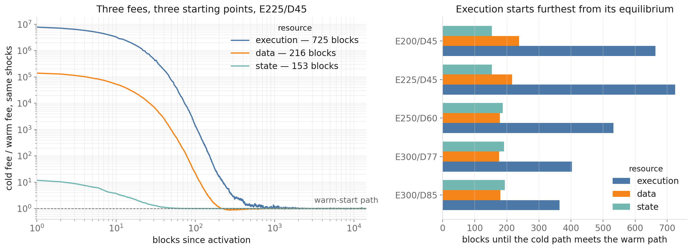
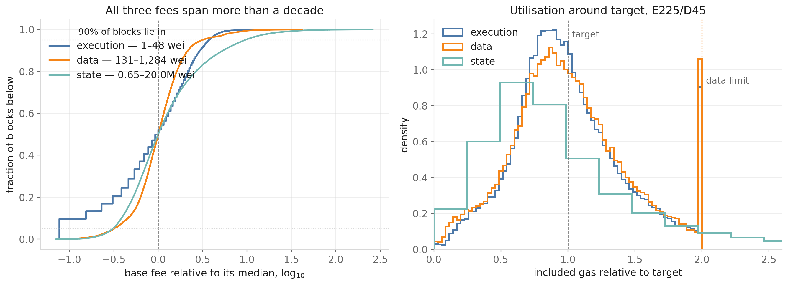
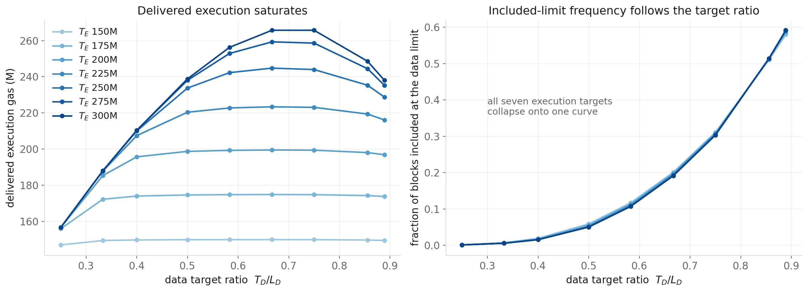
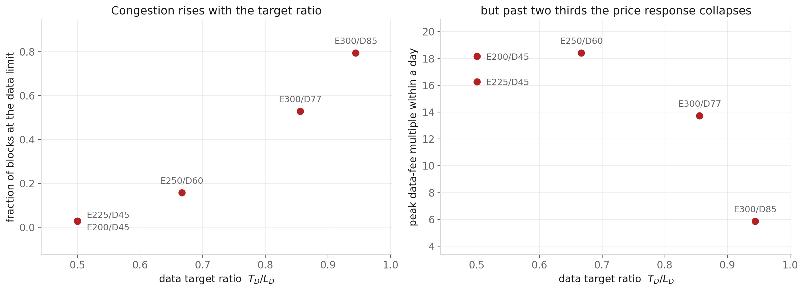
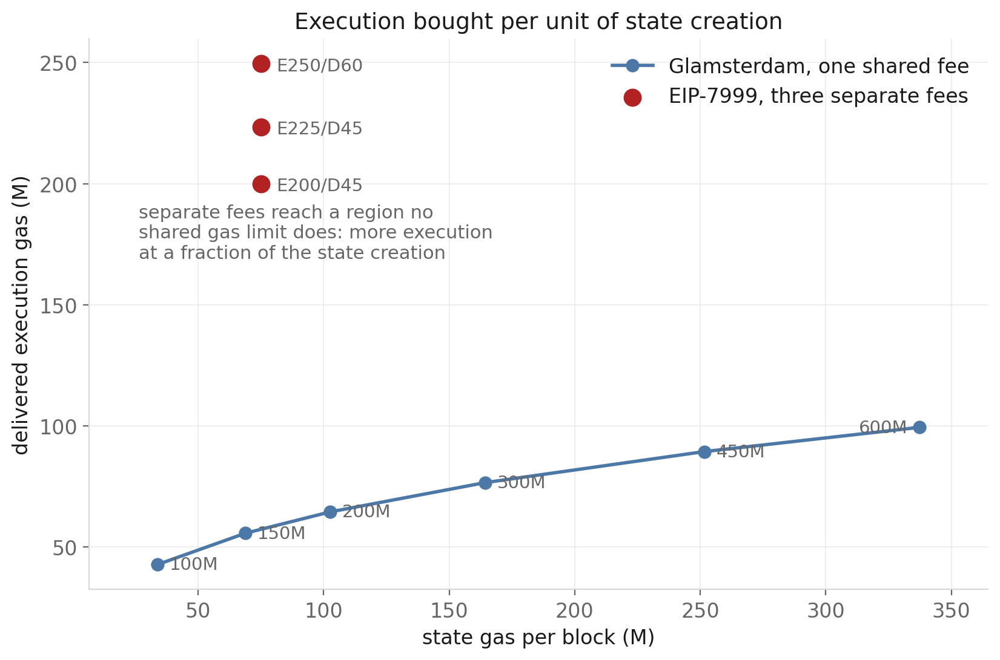

# Dynamic Simulation of the Bundle-Priced EIP-7999 Fee Market

The [equilibrium analysis](bundle_priced_7999_equilibrium_report.md) answers a
static question: which target configurations admit an all-target-clearing fixed
point. That is a necessary condition for a workable design, but it is not
sufficient. A configuration that clears in steady state can still be unusable
block to block, because real demand arrives in bursts and the protocol's hard
limits, not its prices, absorb the excess.

This report simulates the mechanism block by block under empirically measured
demand variation. It establishes three things the static calculation cannot:
how much execution a fixed data limit can actually deliver, what happens when a
target is pushed close to its limit, and how the mechanism compares with
Glamsterdam when both run at their own proposed parameters.

**Main results**

1. **A fixed data limit, not the execution target, sets the achievable
   throughput.** Under a 90M data limit and with data-limit pressure held under
   5% of blocks, **223M** of execution is deliverable by a target the mechanism
   actually clears, and **237M** if a target that is never met is acceptable.
   Reaching 300M requires a data target at 86% of the limit and puts **53%** of
   blocks at it.
2. **The two target choices are close to separable.** Data-limit pressure is
   almost entirely a function of the target ratio $T_D/L_D$: it moves from
   0.033 to 0.028 as the execution target goes 150M to 300M, but from 0.001 to
   0.528 across target ratios.
3. **Saturation compresses the price signal.** As the data target approaches
   its limit, the block is clipped before the fee can respond, so scarcity is
   resolved by exclusion rather than by price. The most congested design has the
   *smallest* fee response, which is a failure that reads as stability on any
   volatility metric.
4. **Half the elasticity calibrations cannot reach 300M at all**, at any data
   capacity, and they announce themselves with an execution fee pinned at one
   wei in every block.
5. **Against Glamsterdam at a 200M limit, EIP-7999 delivers 3.5× the execution
   with 27% less state creation**, because one shared fee cannot separate
   execution from state and the most elastic resource absorbs the headroom.

---

## 1. What the simulator does

Each block, every resource's demand is evaluated at the price that resource
currently faces, runtime BAL is generated from realised parent activity, offered
gas is clipped at the hard limits, and each fee updates from what was included.

The EIP-7999 side carries the bundle-priced parent prices from the
[BAL demand model](bundle_priced_bal_demand_model_report.md):

$$
P_{\mathrm{execution}}
=m_{\mathrm{execution}}b_{\mathrm{execution}}
+\bar w_{\mathrm{execution}}b_{\mathrm{data}},
\qquad
P_{\mathrm{state}}
=m_{\mathrm{state}}b_{\mathrm{state}}
+w_{\mathrm{state}}b_{\mathrm{data}},
$$

so a higher data fee suppresses the activity that produces BAL, and BAL follows
realised activity rather than a capacity target.

The fee recursion is sequential in time, so the only axis available for
vectorisation is the trajectory. One time loop advances every design, seed and
model specification together, with statistics accumulated online: a full
robustness sweep is order $10^8$ block updates, and storing even one field per
block per trajectory would run to gigabytes.

### Validation

The kernel is checked against the reference implementation rather than assumed
correct.

| Check | Result |
|---|---|
| Vectorised fee transition against the integer `fake_exponential` | exact on all 3,943 values tested from 1 wei to 3.58 gwei |
| Excess-gas recursion over 20,000 blocks, three fee regimes | zero drift |
| Warm start at a solved equilibrium under unit shocks | fees stationary to $4\times10^{-5}$ |
| Floor-bound execution fill against the static solver | 0.9350 and 0.8500 against 0.934982 and 0.849983 |

The last is the strongest: the dynamic path independently reproduces the static
solver's execution fill for designs where execution underfills at the one-wei
floor.

One defect was found this way. The reference floors each normalised excess
delta before applying it; a float recursion that does not drifts from it within
a few hundred blocks. Left unfixed, every long-horizon volatility and floor
statistic would have been unreliable.

---

## 2. Modelling the shocks

The dynamic questions all depend on persistence: how long congestion lasts, how
extreme a burst gets, how quickly a fee recovers. None of that is identified by
the 6,000-block calibration sample used elsewhere in this project, because its
blocks are spaced about 102 apart.

Two contiguous panels were pulled for this report, both over the same 14 days
and 100,439 consecutive blocks. The first carries block-level execution, static
data and state creation from Xatu's block, transaction and diff tables. The
second reconstructs the EIP-8279 runtime meter over the same range.

### From observed quantities to shocks

An observed quantity is not a shock. Dividing out the demand curve at the
observed price removes the mechanical fee response, and removing the intraday
profile and the day-level mean removes variation that is predictable rather than
stochastic. Both corrections matter: the day-level term alone cuts the measured
correlation time of the data residual from 86 blocks to 38.

The access-composition residual is the observed runtime BAL relative to what
this block's own parent activity predicts:

$$
a_t=\frac{g_{\mathrm{BAL},t}}
{w_{\mathrm{execution}}q_{\mathrm{execution}}^0R_{\mathrm{execution},t}^{\rho_A}
+w_{\mathrm{state}}q_{\mathrm{state},t}}.
$$

### What the panel shows

| | execution | static data | state | access |
|---|---:|---:|---:|---:|
| sd of log residual | 0.592 | 0.698 | 0.842 | 0.189 |
| autocorrelation at lag 1 | −0.090 | −0.041 | +0.039 | +0.200 |
| integrated correlation time | 7.4 | 30.4 | 30.1 | 6.6 blocks |
| tail clustering, $P(\text{high}\mid\text{high})$ | 0.148 | 0.163 | 0.174 | 0.159 |

Three features rule out simpler samplers. Persistence is real but sits past lag
one, so an AR(1) fitted at lag one would miss it. Extreme blocks cluster at
roughly three times the independent rate, so tail behaviour is not captured by
matching variance. And the residuals co-move strongly — execution with data at
0.81, execution with state at 0.62 — so independent sampling would understate
simultaneous pressure across resources.

The access residual correlates **−0.19** with execution, which is why it cannot
be drawn separately: unusually execution-heavy blocks are on average slightly
less BAL-intensive once parent activity is accounted for. This is a reduced-form
composition relationship, not a causal coefficient; some negative correlation is
mechanical, since execution appears in the denominator.

A vector moving-block bootstrap draws all four residuals at common offsets, so
both the cross-resource correlation and each resource's own persistence survive
resampling. Block length is chosen by measurement rather than rule of thumb:
1600 blocks minimises the reproduction error on integrated correlation time.
Blocks of 8 to 64, which the measured correlation times would suggest,
reproduce the data residual's correlation time as 5 to 8 against a source value
of 30, because the autocorrelation has a long low-level tail.

> **A caution on scope.** Fourteen contiguous days identify ordinary block
> variation, joint structure and short congestion runs. Resampling them
> thousands of times estimates the distribution implied by those fourteen days
> very precisely; it does not create tail regimes that fortnight did not
> contain. Extreme-value claims need a longer source panel.

---

## 3. What is varied, and what is not

The design variables are the ones a protocol author chooses:

$$
T_{\mathrm{execution}},\quad L_{\mathrm{execution}},\quad T_{\mathrm{data}}.
$$

The data limit $L_{\mathrm{data}}$ is a protocol constant, fixed at 90M
throughout, so the only data-side choice is the target and the burst headroom
is whatever the target leaves. The execution limit is held at
$L_{\mathrm{execution}}=2T_{\mathrm{execution}}$: execution is price-constrained
rather than capacity-constrained in every regime examined here, sitting at or
near the one-wei floor while underfilling, so headroom above a target it cannot
reach does nothing. The state target is held at 75M.

Separately, $\lambda$, $\rho_A$ and the elasticity vector are **not** design
variables. They are what the model is uncertain about, and they are used to ask
whether a design survives them rather than optimised over.

Every design and specification sees identical shock paths from the same seeds,
so comparisons between them are paired and seed noise cancels. Uncertainty is
reported across weekly replications rather than across blocks, since block
observations are serially dependent.

---

## 4. Cold start and steady state

Before comparing designs, two questions about the mechanism itself: how long the
launch transient lasts, and what the market looks like once it has passed.

**Each fee starts somewhere different and arrives separately.** Activation gives
every resource the same starting point in cost terms — the effective price that
resource carried at the historical anchor — but not the same distance to travel.
Under separate pricing each resource has its own equilibrium, set by its own
target against its own demand, and the three are nowhere near each other.

Execution begins about $10^7$ times above its equilibrium, data about
$1.4\times10^5$, and state only about 11 times. That ordering is the point: a
225M execution target is enormous relative to what the anchor workload actually
wanted, so the execution fee has to fall almost to its floor, while the state
target of 75M is close to what the anchor was already producing, so its fee
barely moves.

Convergence times follow that distance. Across all five designs the state fee
meets its warm path in 153–194 blocks, data in 176–238, and execution in
364–725. Everything has settled within about 725 blocks — under two and a half
hours. The transient is governed by the fee update rate, which caps how fast a
base fee can fall, so a cold start is a launch-day artefact rather than a design
consideration; but it is worth knowing that the three fees do not arrive
together, and that execution is the slow one.

**In steady state all three fees range over more than a decade.**

At E225/D45, 90% of blocks put the execution fee between 1 and 48 wei, the data
fee between 131 and 1,284 wei, and the state fee between 0.65M and 20.0M wei.
The three curves have nearly the same shape once each is measured against its
own median, which is what the volatility arithmetic in §6 predicts: the spread
comes from clearing quantity shocks through inelastic demand, and applies to
every resource that prices to a target.

Execution is the one to read carefully. Its fee settles at a median of 13 wei,
so it prices in single-digit-to-tens of wei and its distribution is visibly
discrete — the steps in the blue curve are individual integer wei. It sits on
the 1 wei floor in 9.6% of blocks. That is a mild version of the floor-bound
regime the equilibrium report derives statically, and it is worth watching,
because a design only slightly larger crosses fully into it: at E250/D45, the
same data target with a 25M larger execution target, the execution fee is on the
floor in 80% of blocks and takes 19 distinct values in the entire run. That
design is past its own ceiling — see §5.

The right panel shows why congestion, not utilisation, is the metric that
separates designs. All three resources sit below target on average — the modes
are near 0.85 — and their bulk shapes are similar. What distinguishes the data
resource is the spike at exactly 2.0, the data limit at this design: blocks
clipped by the limit rather than cleared by the price.

---

## 5. How much execution a fixed data limit delivers

Sweeping both targets independently, rather than coupling them through the
static frontier, separates two effects that the frontier confounds.

**Data-limit pressure is governed by the target ratio, not the execution
target.** Reading down any column below, the values barely move; reading across,
they change by three orders of magnitude.

Data-limit hit fraction, $L_{\mathrm{data}}=90$M:

| $T_E$ \ $T_D/L_D$ | 0.25 | 0.40 | 0.50 | 0.667 | 0.855 |
|---:|---:|---:|---:|---:|---:|
| 150M | 0.000 | 0.006 | 0.033 | 0.170 | 0.538 |
| 200M | 0.000 | 0.004 | 0.030 | 0.165 | 0.534 |
| 250M | 0.000 | 0.004 | 0.028 | 0.161 | 0.531 |
| 300M | 0.000 | 0.004 | 0.028 | 0.159 | 0.528 |

The two design choices are therefore close to separable: pick the target ratio
from the tolerable congestion, then pick the execution target for throughput.

The right panel is the separability result over the full grid: all seven
execution targets collapse onto one curve, so congestion is a function of the
target ratio alone. The left panel is the ceiling — each execution target's
curve flattens once the data side stops supporting more.

**Delivered execution saturates.** At a half target ratio, execution targets of
250M, 275M and 300M all deliver about 236.8M. Configuring a target above what
the data side supports lowers utilisation without adding throughput — the
static result that the execution target drops out once it is floor-bound,
appearing here as a design ceiling.

**Deliverable execution against congestion tolerance.** Ranking designs by
delivered gas alone is misleading, because the largest delivered figure at every
tolerance comes from a 300M target that is never met. Both readings are given:

| tolerance on data-limit hits | most gas delivered | at | fill | largest target actually met | at | fill |
|---|---:|---|---:|---:|---|---:|
| ≤ 1% | 206.7M | E300, r=0.40 | 0.69 | 198.1M | E200, r=0.40 | 0.99 |
| **≤ 5%** | **236.8M** | **E300, r=0.50** | **0.79** | **223.3M** | **E225, r=0.50** | **0.99** |
| ≤ 10% | 260.1M | E300, r=0.583 | 0.87 | 224.8M | E225, r=0.583 | 1.00 |
| ≤ 25% | 281.3M | E300, r=0.667 | 0.94 | 249.6M | E250, r=0.667 | 1.00 |

The left figures are real throughput — those blocks genuinely carry that much
execution gas. But they are produced by configuring a target the data side
cannot support, and the symptom is visible in the fee: at the ≤5% entry the
execution fee is on its one-wei floor in 99.9% of blocks, so execution is not
being priced at all, merely permitted. The right figures are the largest targets
that the mechanism actually clears.

**At a half target ratio, E225/D45 is the useful design.** It delivers 223.3M at
99.3% fill with the execution fee off its floor in 87% of blocks. Raising the
target to 250M buys 12M more delivered gas and costs the execution price signal:
fill drops to 94% and the fee sits on the floor in 80% of blocks. The 300M
target that the static frontier admits at $T_D=77$M needs a ratio of 0.855 and
puts more than half of blocks at the data limit.

> The data limit is the dominant lever. The 60M value written in
> [ethereum/EIPs#11835](https://github.com/ethereum/EIPs/pull/11835) costs
> roughly 50M of deliverable execution at every tolerance; the 90M used here is
> a counterfactual, consistent with the equilibrium report.

---

## 6. Saturation compresses the price signal

Pushing the data target toward its limit does not merely increase congestion. It
changes how scarcity is resolved.

| design | $T_D/L_D$ | data-limit hits | peak data-fee multiple | rationed data |
|---|---:|---:|---:|---:|
| E200/D45 | 0.500 | 2.9% | 18.2× | 0.45M |
| E225/D45 | 0.500 | 2.8% | 16.3× | 0.41M |
| E250/D60 | 0.667 | 15.7% | 18.4× | 3.60M |
| E300/D77 | 0.856 | 52.8% | 13.7× | 22.6M |
| **E300/D85** | **0.944** | **79.4%** | **5.9×** | **61.4M** |

The most congested design has the *smallest* fee response. Once the block is
clipped in four blocks out of five, the fee controller never observes the
demand that was turned away, so the price stops rising and exclusion does the
allocating instead. The two panels move together up to a ratio of about
two-thirds and then diverge: congestion keeps climbing while the price response
turns over and falls to a third of its value at the lower ratios.

This matters for how designs are screened. Low fee volatility normally reads as
a good property; here it is the signature of a mechanism that has stopped
functioning as a price. Fee stability cannot be used as a screening axis without
a congestion metric beside it.

### Why fees are volatile even without stress

Peak data-fee multiples of 14 to 20× within a day occur under ordinary
variation, with no stress applied. That follows from the calibration rather than
from any design flaw: clearing a quantity shock through an isoelastic curve
requires

$$
\Delta\ln p\approx\frac{\Delta\ln s}{\epsilon_{\mathrm{data}}},
$$

and with $\epsilon_{\mathrm{data}}\approx0.23$ against a measured block-level
shock standard deviation of 0.70 in logs, order-of-magnitude fee movement is the
arithmetic consequence. Inelastic demand and real block-level variation produce
this in any mechanism that prices to a target.

---

## 7. Robustness, and when the question has no answer

The full grid of three $\lambda$ values, three $\rho_A$ values and four
elasticity windows is run on each design. Half of it does not test what it
appears to test.

Under the 60- and 75-day elasticity vectors, execution demand cannot reach a
300M target at a one-wei fee *even with no BAL charge at all* — their
zero-charge ceilings are 160.9M and 152.0M. Those specifications are
demand-constrained, and no data capacity can change the outcome. Reporting them
alongside the rest would attribute demand infeasibility to data parameters.

The two regimes separate cleanly, with no overlap on any marker:

| 300M designs | execution fee | blocks at the floor | execution fill |
|---|---|---|---|
| capacity-constrained (21-, 35-day) | 1.91–3.60 wei | 0.100–0.466 | 0.990–0.998 |
| demand-constrained (60-, 75-day) | **1.00 wei** | **1.000** | **0.529–0.562** |

Once demand-constrained, the data parameters stop mattering: execution fill
varies by only 0.040 across every structural parameter and data limit tested.

**Within the capacity-constrained regime the design conclusion holds.** Across
all nine $\lambda\times\rho_A$ combinations at the 35-day window, data-limit
hits stay within a percentage point of their central value for every design —
E225/D45 at 0.029–0.034, E250/D60 at 0.161–0.169, E300/D77 at 0.530–0.537. The
structural assumptions move the result far less than the target ratio does.

---

## 8. Comparison with Glamsterdam

Both mechanisms run at their own proposed parameters over identical shock
paths. Glamsterdam is a 200M gas limit with a 100M target, metering execution
and data in one branch against state in the other and pricing both with a
single base fee.

Matching the two on delivered execution is not possible in a meaningful way.
Because one shared fee cannot separate execution from state, forcing Glamsterdam
to EIP-7999's execution throughput requires lowering the shared fee until state
creation reaches 31 to 94 times the level EIP-7999 holds it at. That trade-off
is the structural difference under test, so it is reported directly.

| | execution | state gas | execution per unit state |
|---|---:|---:|---:|
| Glamsterdam, 100M limit | 42.8M | 33.9M | 1.26 |
| **Glamsterdam, 200M limit** | **64.5M** | **102.6M** | **0.63** |
| Glamsterdam, 300M limit | 76.6M | 164.3M | 0.47 |
| Glamsterdam, 600M limit | 99.4M | 337.3M | 0.29 |
| **EIP-7999, E225/D45** | **223.4M** | **75.0M** | **2.98** |

At its central parameters EIP-7999 delivers **3.5× the execution with 27% less
state creation**. Scaling Glamsterdam does not close the gap: execution per unit
of state *falls* as capacity rises, because lowering the shared fee expands the
most elastic resource fastest. State creation has the largest estimated
elasticity, so it absorbs the headroom — the state branch already sets the fee
in 64% of blocks at a 200M limit, rising to 97% at 600M.

This is the dynamic counterpart of the static finding that state becomes the
binding branch at higher capacity. Under one shared fee, buying execution
throughput means buying state growth with it.

---

## Limitations

**Fourteen days of source data.** Enough for ordinary variation, joint structure
and short congestion runs. Not enough for weekly or monthly extremes; the
longest-run figures above are supporting evidence, not the basis of any
conclusion here.

**Stress response is diluted in whole-window averages.** A pulse with a
120-block half-life materially affects roughly 500 of 7,200 blocks, so
window-averaged congestion metrics understate it by about an order of magnitude.
Peak-fee metrics respond correctly. Stress results should be measured in a
window around the pulse and as paired differences against the same seed's
baseline.

**User-cost comparison is unresolved.** Representative transaction bundles were
computed for both mechanisms, but at their own parameters the two operate at
completely different fee levels while delivering completely different
throughput, so the ratios are not interpretable. A usable cost comparison needs
either matched delivered service, which section 7 shows is impossible, or an
explicit per-unit-of-service normalisation.

**Isoelastic extrapolation.** Demand curves are carried well beyond the range
the event windows observed, particularly at Glamsterdam limits above 300M. The
100M–300M rows are the defensible ones, and the ordering is already decisive
there.

**Access composition is a reduced form.** The −0.19 correlation between the
access residual and execution is preserved as measured, but it is not
interpreted causally, and some of it is mechanical.

---

## Reproducing

The kernel and sampler are `src/dynamics/batched_replay.py`,
`src/dynamics/glamsterdam_replay.py` and `src/dynamics/empirical_shocks.py`.
The contiguous panels are rebuilt by `scripts/build_contiguous_block_panel.py`
and `scripts/build_contiguous_runtime_bal.py`; block ranges, seeds and the
selected bootstrap block length are recorded in
`data/7999/stage_a_manifest.json`. The experiments are
`scripts/run_design_surface.py`, `scripts/run_stage_b_stresses.py`,
`scripts/run_stage_c_robustness.py` and
`scripts/run_glamsterdam_comparison.py`, each writing its result table to
`data/7999/`. `scripts/make_dynamic_report_figures.py` draws the five figures
from those tables, re-running the cold and warm replays it needs for §4.
