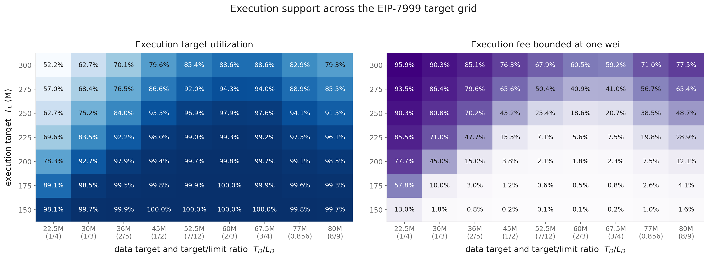
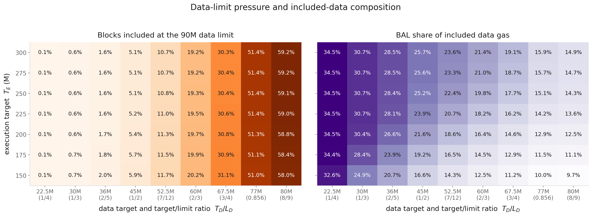
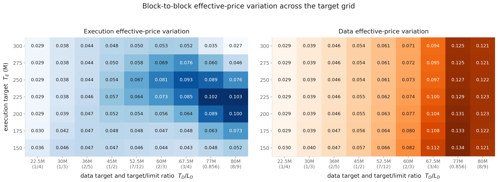
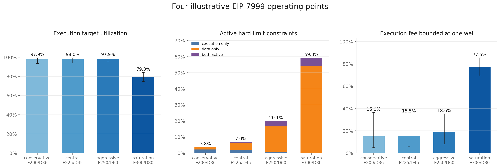
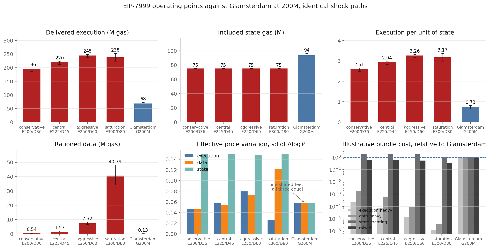
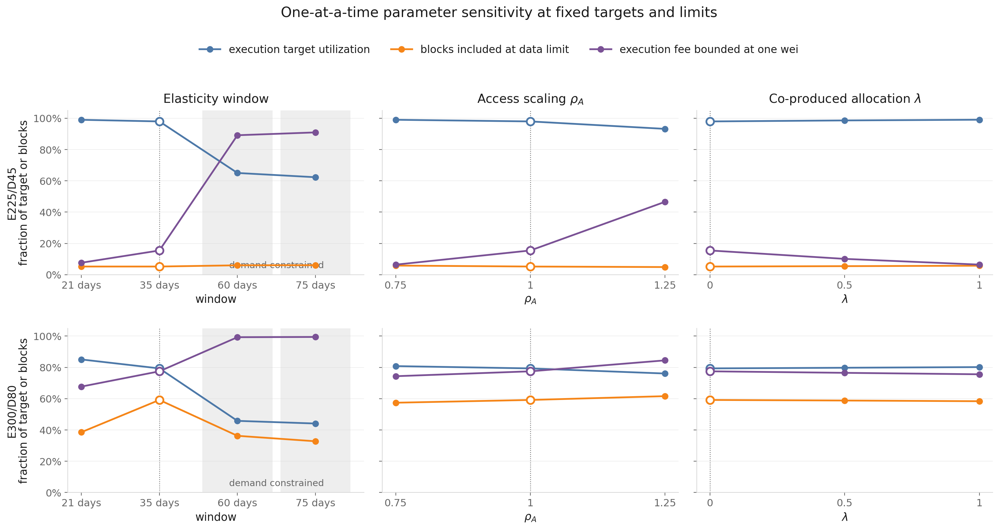

# Dynamic Simulation of the Bundle-Priced EIP-7999 Fee Market

The [bundle-priced equilibrium analysis](bundle_priced_7999_equilibrium_report.md) identifies the execution and data targets that can clear simultaneously under steady demand. This report adds block-level demand variation and the protocol fee-update rules. It asks how often hard limits bind, how much offered gas is excluded, how the three prices move, and whether the static capacity rankings remain valid under shocks.

As in the two preceding reports, the EIP-7999 mechanism follows the open [multi-resource EIP-7999 pull request](https://github.com/ethereum/EIPs/pull/11835). The 90M data limit used for the main analysis is a capacity counterfactual; the result files also retain the pull request's 60M value.

We recover execution, static-data, state, and access-composition shocks from 430,605 consecutive blocks over 60 days. A multiscale bootstrap combines the recurring hourly profile, jointly sampled daily demand factors, and jointly sampled fast residuals while preserving cross-resource co-movement. Each EIP-7999 configuration is simulated with separate fake-exponential fee updates, while the Glamsterdam benchmark uses its shared EIP-1559 update. Both mechanisms receive the same shock paths.

The analysis first sweeps execution and data targets, then examines four operating points, compares them with Glamsterdam, and varies the elasticity and BAL-structure parameters. Launch and steady-state diagnostics are reported in the appendix.

### Main results

1. **The data target ratio is the main determinant of data-limit pressure.** At a fixed $T_{\mathrm{data}}/L_{\mathrm{data}}$, the fraction of blocks included at the data limit changes little as the execution target rises. Across the selected settings, it increases from **1.7% to 59.2%** as the data target approaches the fixed 90M limit.
2. **Larger execution targets do not always deliver more execution.** E250/D60 delivers **244.8M** execution gas, while the more aggressive E300/D80 delivers only **238.0M**, because data-limit rationing excludes parent execution together with its linked BAL.
3. **The execution fee is bounded at one wei at both low and high data targets, for different reasons.** At low data targets, a high data fee suppresses BAL-producing execution; near the data limit, insufficient headroom causes bundle exclusion and execution underfill. At E300/D80, the execution fee is one wei while included execution remains below target in **77.5%** of blocks, so the controller would lower the fee further if the protocol minimum allowed it.
4. **E225/D45 remains a useful reference point, but the longer calibration places it close to the chosen guardrails rather than clearly inside them.** It delivers **220.4M** execution gas at 98.0% target utilization, reaches the data limit in 5.2% of blocks, and is bounded at one wei in 15.5% of blocks. These thresholds are design preferences, so the report treats E225/D45 as an illustrative comparison point rather than a universal optimum.
5. **The qualitative results are more sensitive to access scaling and demand elasticities than to BAL allocation.** Varying $\lambda$ has little effect in the displayed designs, while $\rho_A$ and the elasticity vector materially affect supportable execution. Under the 60- and 75-day calibrations, demand cannot support the larger execution targets even before BAL charges are added.

## Notation and reference specification

The dynamic model combines quantities from the demand, BAL, and equilibrium reports with new time-series objects for shocks, offered gas, included gas, and fee states. The table collects those objects before the simulation is introduced and fixes the central specification used throughout the results.

| Group | Notation | Meaning |
|---|---|---|
| Fees | $b_i$, $P_i$ | Base fee and effective activity price for resource $i$ |
| Fee state | $x_{i,t}$ | Normalized excess-gas counter for resource $i$ |
| Capacity | $T_i$, $L_i$ | Gas target and hard gas limit |
| Block quantities | $g_{i,t}^{\mathrm{offered}}$, $g_{i,t}^{\mathrm{included}}$ | Gas demanded before packing and gas included after enforcing limits |
| Shocks | $s_{\mathrm{execution},t}$, $s_{\mathrm{data},t}$, $s_{\mathrm{state},t}$, $a_t$ | Execution, static-data, state, and BAL-access shocks |
| BAL structure | $\lambda$, $\rho_A$ | Co-produced-BAL routing and access-scaling parameters |
| Outcomes | $\overline g_i$, $U_i$ | Mean included gas and target utilization $\overline g_i/T_i$ |

Unless stated otherwise, results use:

- the 35-day elasticity estimates, $(\epsilon_{\mathrm{execution}},\epsilon_{\mathrm{data}}, \epsilon_{\mathrm{state}})=(0.121,0.229,0.335)$;
- $\lambda=0$ and $\rho_A=1$;
- a 90M data limit and 75M state target;
- an execution limit equal to twice its target; and
- 32 bootstrap paths, with a one-day burn-in followed by seven measured days.

The blob-linked data reserve is disabled in the central dynamic comparison. Reserve scenarios require a counterfactual blob-fee path and remain separate from the mechanism comparison reported here.

## Dynamic simulation

The equilibrium analysis describes where fees and activity settle under constant demand. It cannot show the path to that point or what happens when demand varies from block to block. The dynamic simulation adds this missing time dimension: demand shocks move resource usage, included usage updates the fees, and the new fees affect demand in the next block. This feedback determines fee variation, whether the one-wei minimum prevents further downward adjustment, hard-limit pressure, and recovery after congestion.

Each configuration begins at its historical cost-equivalent reference fees and is advanced through a one-day burn-in before any statistic is taken. The burn-in allows the three fee states to adjust to the counterfactual targets and the beginning of each bootstrap path. Configurations are then advanced through the same measured shock paths from the same seeds, so comparisons are paired and seed noise largely cancels. The separate Stage-B steady-state check uses a unit-shock warm start where the report explicitly labels it as such.

### Block-level mechanism

The simulation must preserve the order in which the mechanism operates. Users respond to the current prices; their execution and state activity then generate BAL; the block builder can include only quantities that fit under the hard limits; and the protocol updates the next block's fees from what was actually included. Each simulated block follows this sequence. The aggregate inclusion rule keeps rejected parent activity and its linked BAL together. When the data limit binds, it proportionally scales the remaining transaction bundle, so excluded execution and its BAL leave together.

The EIP-7999 side carries the bundle-priced parent prices from the [BAL demand model](bundle_priced_bal_demand_model_report.md):

$$
P_{\mathrm{execution}}
=m_{\mathrm{execution}}b_{\mathrm{execution}}
+\bar w_{\mathrm{execution}}b_{\mathrm{data}},
\qquad
P_{\mathrm{state}}
=m_{\mathrm{state}}b_{\mathrm{state}}
+w_{\mathrm{state}}b_{\mathrm{data}},
$$

so a higher data fee suppresses the activity that produces BAL, and BAL follows realized activity rather than a capacity target.

For intuition, the fixed-point normalization and update fraction can be combined into the following continuous approximation for each EIP-7999 resource:

$$
b_{i,t+1}
\approx
\max\!\left\{
1\text{ wei},
b_{i,t}
\exp\!\left[
2\ln(1.125)
\frac{g_{i,t}^{\mathrm{included}}-T_i}{h_i}
\right]
\right\}.
$$

Here $h_i$ is the hard limit for execution and data and the target for state, which has no hard limit. Usage at the target leaves the fee unchanged. When the target is half the limit, a single full block raises the fee by approximately 12.5%, while a single empty block applies the inverse adjustment and lowers the current fee by approximately 11.1%. These are block-level movements: away from the one-wei floor and the reserve rule, a stable excess-gas counter implies average included usage equal to the target. The protocol stores the adjustment through a normalized excess-gas counter and evaluates `fake_exponential(1, x, 4_245_093_508)` using integer arithmetic. The simulator implements that exact counter recursion; the equation above cancels the protocol's $10^9$ fixed-point scale to make the economic response easier to read.

### Validation

The dynamic results are meaningful only if the simulator reproduces both the protocol's integer fee updates and the equilibrium model it extends. We therefore test the fee transition, the accumulated excess-gas state, the steady-state connection to the static solver, and the parent--BAL link under binding limits before using the simulator for counterfactual comparisons.

The following checks compare the simulation kernel with the reference integer implementations and the static equilibrium solver.

| Check | Result |
|---|---|
| Vectorized fee transition against the integer `fake_exponential` | exact on all 3,943 values tested from 1 wei to 3.58 gwei |
| Excess-gas recursion over 20,000 blocks, three fee regimes | zero drift |
| Warm start at a solved equilibrium under unit shocks | fees stationary to $4\times10^{-5}$ |
| Floor-bound execution target utilization against the static solver | 0.9350 and 0.8500 against 0.934982 and 0.849983 |
| Parent–BAL inclusion under binding execution and data limits | linked execution, state and BAL scale together exactly |

The last two checks verify the links between the static model and the dynamic simulation: floor-bound configurations reproduce the static solver's execution target utilization, and hard-limit packing preserves the parent--BAL bundle.

## Empirical demand shocks

The fee mechanism needs a block-by-block demand path before it can answer how long congestion lasts, how extreme a burst becomes, or how quickly a fee recovers. Repeating average demand would test convergence but would say nothing about these dynamic outcomes. We therefore recover the demand variation embedded in historical blocks and use it to construct counterfactual shock paths.

The empirical fast-shock window runs from **2 April 2026 to 31 May 2026 UTC**, covering 430,605 consecutive blocks from **24,788,193 to 25,218,797**. Two aligned inputs cover exactly this range. The first carries block-level execution, transaction data, state creation, historical base fees, and timestamps from Xatu's block, transaction, and state-diff tables. The second reconstructs the EIP-8279 runtime BAL meter. The slower daily factors are estimated separately from the 120-day accounting panel covering February through May 2026.

### Why four shocks?

The simulation uses four shocks because EIP-7999 has three priced resources but four economically distinct sources of block-level variation. Execution, static transaction data, and persistent state creation each have an independently modeled demand curve, so each requires a shock that shifts how much of that activity users want at a given price. BAL belongs to the data resource, but users do not choose BAL bytes independently. Their execution and state activity produce BAL through the accounts and storage keys that transactions access.

The preceding [BAL demand report](bundle_priced_bal_demand_model_report.md) finds that **11.4%** of runtime-metered BAL is matched directly to persistent state creation. The remaining **88.6%** is access-related: 37.9% is co-produced access inside state-creating transactions and 50.7% comes from transactions with no observed state creation. The bundle model therefore predicts the average amount of BAL from realized execution/access and state-creation activity.

Parent activity alone does not determine BAL exactly because the transaction mix changes across blocks. Two blocks can contain the same total execution and state creation while producing different BAL: one may be compute-heavy, while the other repeatedly accesses accounts and storage. The fourth shock, $a_t$, captures this conditional access intensity. It scales the BAL generated per unit of parent activity, while the three parent demand curves remain the behavioral source of BAL demand.

The four shocks and their historical inputs are:

| Shock | Historical input | Role in the simulation |
|---|---|---|
| $s_{\mathrm{execution},t}$ | execution activity, $q_{\mathrm{execution},t}^{\mathrm{obs}}$ | shifts the execution demand curve |
| $s_{\mathrm{data},t}$ | static transaction-data activity, $g_{\mathrm{static},t}^{\mathrm{obs}}$ | shifts demand for calldata and other static data |
| $s_{\mathrm{state},t}$ | persistent state creation, $q_{\mathrm{state},t}^{\mathrm{obs}}$ | shifts the state-creation demand curve |
| $a_t$ | runtime BAL relative to BAL predicted by parent activity | changes the access intensity of the transaction mix |

### Recovering demand shocks

**Observed gas usage is not itself the demand shock.** A block can carry high activity for two reasons: the historical base fee is low and demand expands along the demand curve, or the underlying willingness to transact is unusually high. Replaying observed usage directly would preserve the historical price response and then apply another price response under the counterfactual fee market. We therefore use the demand model to predict activity at each block's observed fee and treat the difference between predicted and observed activity as the underlying demand condition.

For execution, static data, and state, let $x_{i,t}^{\mathrm{obs}}$ denote the observed activity, $x_i^0$ its historical anchor, $p_t$ the historical shared base fee, and $p^0$ the anchor fee. The maintained demand equation is

$$
x_{i,t}^{\mathrm{obs}}
=x_i^0\widetilde s_{i,t}
\left(\frac{p_t}{p^0}\right)^{-\epsilon_i}.
$$

Solving backward gives the raw multiplicative demand condition:

$$
\widetilde s_{i,t}
=\frac{x_{i,t}^{\mathrm{obs}}}{x_i^0}
\left(\frac{p_t}{p^0}\right)^{\epsilon_i}.
$$

This inversion asks how unusual activity was after accounting for the fee that users faced. For example, execution 20% above its anchor at twice the anchor fee implies $\widetilde s_{\mathrm{execution}}\approx1.30$ when $\epsilon_{\mathrm{execution}}=0.121$: the fee-suppressed demand condition was approximately 30% above normal.

The inversion is performed separately for execution, static data, and state creation. These are the three primitive demand shocks. BAL is handled afterward because its quantity is induced by the realized parent activities.

Removing the fee response does not yet isolate the short-run demand variation needed for the replay. The raw shifters also contain recurring differences across hours and calendar days: activity at a normally busy UTC hour should not automatically be classified as an unusual burst, and an entire busy day should not appear as thousands of consecutive positive block shocks. We work in logs so that these multiplicative differences become additive. For each resource, the pipeline first subtracts the median log shifter for the same UTC hour and then subtracts the median of the hour-adjusted residuals within each calendar day. The remaining residual records whether demand in a block was unusually high or low relative to both the usual time of day and the overall demand condition of that day. It preserves within-day bursts, their persistence, and their cross-resource co-movement while deliberately excluding the slower movement between busy and quiet days. A sequence of positive residuals caused only by an unusually busy day is therefore removed from the short-run shock panel as a day-level demand difference.

This detrending determines the pattern of shocks but does not yet ensure that their average is consistent with the demand anchors. Let $u_{i,t}$ denote the resulting log residual. The multiplicative shock used by the simulator is

$$
s_{i,t}
=\frac{\exp(u_{i,t})}
{\operatorname{mean}_t[\exp(u_{i,t})]},
$$

so each resource satisfies $\operatorname{mean}_t(s_{i,t})=1$. This final rescaling leaves the relative size, ordering, persistence, and correlation of the block shocks unchanged; it only fixes their average. If we instead centered only the median log residual, the typical shock would equal one but large positive observations would raise the arithmetic mean above one. This matters because the demand anchors are mean quantities per block. Before the mean-one adjustment, the state shocks averaged 1.39 in levels, which would make simulated state demand 39% above its historical anchor even at the reference price.

After normalization, $s_{i,t}=1$ means the baseline demand curve, which equals the anchor quantity at the reference price. Values of $s_{i,t}=1.5$ and $s_{i,t}=0.7$ shift demand 50% above and 30% below that baseline curve at whatever price the simulated block faces.

After recovering the three primitive shocks, we measure whether the transactions in each block are more or less access-intensive than the BAL model predicts. The raw access ratio is observed runtime BAL divided by the BAL implied by that block's execution and state activity:

$$
\widetilde a_t=\frac{g_{\mathrm{BAL},t}}
{w_{\mathrm{execution}}q_{\mathrm{execution}}^0R_{\mathrm{execution},t}^{\rho_A}
+w_{\mathrm{state}}q_{\mathrm{state},t}}.
$$

For example, $\widetilde a_t=1.2$ means the block produces 20% more runtime BAL than its parent activity predicts. This ratio also contains slower changes in transaction composition. The pipeline subtracts a centered 201-block rolling median of $\log\widetilde a_t$, approximately 40 minutes, and uses the remaining block-scale variation as the access shock. Because the resulting $a_t$ multiplies parent-generated BAL, it is normalized using predicted BAL as the weight. If $B_t^{\mathrm{parent}}$ denotes the denominator above, the implementation enforces

$$
\frac{\sum_t a_tB_t^{\mathrm{parent}}}
{\sum_t B_t^{\mathrm{parent}}}=1.
$$

This convention preserves the runtime-BAL anchor while retaining the measured correlation between access composition and parent activity. Its unweighted mean is 1.0190; forcing that mean to one instead would lower mean simulated BAL by approximately 1.9%.

The four-column empirical shock vector is therefore

$$
\mathbf s_t=
\left(s_{\mathrm{execution},t},s_{\mathrm{data},t},
s_{\mathrm{state},t},a_t\right).
$$

The first three entries describe how much parent activity users want at a given price. The fourth describes how BAL-intensive that activity is in the block.

### Empirical properties of the shocks

Recovering the shocks gives one four-dimensional observation for every historical block. Before resampling them, we need to understand four properties. Dispersion measures how much demand varies; next-block correlation measures whether a shock immediately continues or reverses; the total correlation span summarizes dependence over many subsequent blocks; and tail clustering measures whether unusually large shocks arrive together. Cross-resource correlations then show whether pressure tends to occur in one resource at a time or across several resources simultaneously.

| | execution | static data | state | access |
|---|---:|---:|---:|---:|
| standard deviation of log shock | 0.593 | 0.746 | 0.767 | 0.188 |
| correlation with the next block | −0.102 | +0.025 | +0.071 | +0.169 |
| total correlation span | 12.2 blocks | 39.5 blocks | 62.5 blocks | 10.0 blocks |
| chance next block is also in top 5%, conditional on a top-5% block | 13.8% | 27.4% | 28.3% | 15.9% |

**Shock size.** State creation and static data vary the most across blocks. A one-standard-deviation movement in their log shocks corresponds to multiplying demand by approximately $e^{0.767}=2.15$ and $e^{0.746}=2.11$. The corresponding factors are 1.81 for execution and 1.21 for conditional BAL access intensity. This ordering is consistent with state creation being comparatively sparse and lumpy and with static data changing sharply when calldata-heavy transactions or batches arrive, while execution aggregates a broader set of activity. The access shock is narrower because execution and state activity already explain most of the level of BAL; $a_t$ captures only the remaining change in access intensity. The data establish this ordering, while these mechanisms provide plausible interpretations of it.

**Persistence.** The next-block correlations distinguish immediate continuation from reversal. Execution has a small negative value, so an unusually high block is followed on average by a modest reversal. Static data and state have small positive next-block correlations, while the access correlation of 0.17 means an access-intensive transaction mix is more likely to continue into the following block. The next-block statistic does not capture dependence at longer lags. Summing that dependence gives total correlation spans of approximately 12 blocks for execution, 39 for static data, 62 for state, and 10 for access, equivalent to roughly 2.4, 7.9, 12.5, and 2.0 minutes at 12-second blocks. These spans summarize aggregate serial dependence and should not be read as the duration of every individual burst. The longer static-data and state spans are consistent with application activity, transaction batches, or state-creating episodes extending across several blocks.

**Tail clustering.** A top-5% shock would be followed by another top-5% shock only 5% of the time if blocks were independent. In the data, the conditional probabilities range from 13.8% to 28.3%, approximately three to six times that benchmark. Extreme static-data and state demand therefore arrives in short runs much more often than an independent sampler would generate. This matters for the fee market because several consecutive high-demand blocks can push a fee or excess-gas counter much further than isolated shocks with the same marginal distribution.

**Cross-resource co-movement.** Execution correlates with static data at 0.78 and with state at 0.71, while static data and state correlate at 0.61. This pattern is consistent with transaction bundles consuming several resources together and with demand episodes raising multiple types of activity at once. Sampling the three demand shocks independently would remove this observed joint pressure and understate how often several resource fees or limits come under pressure during the same sequence of blocks.

**Access composition.** The access shock correlates **−0.20** with execution. Conditional on the parent-activity formula, unusually execution-heavy blocks therefore tend to produce slightly less BAL per unit of parent activity. This is consistent with the transaction mix shifting toward relatively compute-heavy activity in those blocks, although part of the relationship may be mechanical because execution appears in the denominator used to construct $\widetilde a_t$. The simulation preserves the measured relationship without assigning it a causal interpretation. Fixing access intensity at its average would discard this transaction-composition channel.

### From the historical panel to simulated paths

One historical sequence provides only one realization of demand. We need multiple simulated weeks to measure how sensitive the outcomes are to the particular shocks that occur, while still retaining the ordering found in the data. Drawing individual blocks independently would preserve the distribution of each shock but destroy the observed bursts, persistence, and cross-resource co-movement. We therefore use a moving-block bootstrap: the sampler copies contiguous strips of historical blocks and joins those strips to form new paths.

The chosen fast-residual strip length is **3,200 blocks**, approximately 10.7 hours. This does not mean that a demand shock is assumed to last 3,200 blocks. It means that within each strip, the simulation preserves the exact historical ordering of all four fast residuals for 3,200 consecutive blocks; only the join between two strips breaks that ordering. A longer strip creates fewer artificial joins but produces less variety across simulated paths. We evaluate lengths of 400, 800, 1,600, 3,200, and 6,400 blocks against the source panel's integrated correlation time, cross-resource correlations, and top-5% tail clustering. The 3,200-block candidate gives the best overall balance: 1,600 preserves slightly less of the long correlation tail, while 6,400 reduces resampling diversity without improving the combined diagnostics.

Each simulated path contains **57,600 blocks**. The fast sampler draws 18 historical starting positions with replacement, copies the following 3,200 rows from all four residual columns at each position, and joins the 18 strips. All four columns are copied together, so a historical block with simultaneously high execution, data, and state shocks retains that combination. Consecutive rows remain together within each strip, preserving bursts and clustered extremes.

The full workload restores the slower components removed during residual estimation. The recurring UTC-hour profile is multiplied back into execution, static-data, and state demand. Daily factors are then sampled jointly from the 120-day accounting panel in eight-day segments, preserving both cross-resource daily co-movement and consecutive-day persistence. The access-composition shock has no separate hourly or daily factor; it remains the measured fast residual around parent activity. The complete workload is normalized around the historical quantity anchors and verified by reconstructing the source decomposition before replay.

The first 7,200 blocks form the one-day burn-in and are excluded from the results; the remaining 50,400 blocks form the measured seven-day path. We generate **32** such paths. Within each comparison experiment, every design or parameter specification receives the same fast and slow draws, so path 1 presents the same latent sequence of demand conditions to every mechanism being compared.

The construction can be summarized as:

> observed activity and historical fees $\rightarrow$ remove the modeled historical price response $\rightarrow$ separate hourly, daily, and fast components $\rightarrow$ jointly resample the slow factors and contiguous four-dimensional fast segments $\rightarrow$ multiply the components back together around the historical anchors.

The elasticity vector affects the first inversion. The central shock panel is constructed with the 35-day elasticities; the later elasticity sensitivity holds the realized shock paths fixed while changing the counterfactual demand response. This controlled comparison does not re-estimate the historical shock decomposition under every elasticity vector.

### How the shocks enter a simulated block

The recovered shocks describe demand at a given price; they do not replace the demand curves. In each counterfactual block, the current effective price determines movement along the relevant demand curve, while the sampled shock shifts that entire curve inward or outward. This separation allows the same latent demand condition to produce different activity under EIP-7999 and Glamsterdam.

At block $t$, the simulator begins with the current effective prices $P_{\mathrm{execution},t}$ and $P_{\mathrm{state},t}$ defined above. The three primitive shocks shift the corresponding demand curves:

$$
q_{\mathrm{execution},t}
=q_{\mathrm{execution}}^0s_{\mathrm{execution},t}
\left(\frac{P_{\mathrm{execution},t}}{p^0}\right)^{-\epsilon_{\mathrm{execution}}},
$$

When $\rho_A\ne1$, the execution price and execution-linked BAL intensity depend on the realized execution ratio, so the simulator solves this relation self-consistently.

$$
q_{\mathrm{state},t}
=q_{\mathrm{state}}^0s_{\mathrm{state},t}
\left(\frac{P_{\mathrm{state},t}}{p^0}\right)^{-\epsilon_{\mathrm{state}}},
$$

and

$$
g_{\mathrm{static},t}
=g_{\mathrm{static}}^0s_{\mathrm{data},t}
\left(\frac{m_{\mathrm{data}}b_{\mathrm{data},t}}{p^0}\right)^{-\epsilon_{\mathrm{data}}}.
$$

Runtime BAL is generated after parent activity is realized:

$$
g_{\mathrm{BAL},t}
=a_t\left[
w_{\mathrm{execution}}q_{\mathrm{execution}}^0
R_{\mathrm{execution},t}^{\rho_A}
+w_{\mathrm{state}}q_{\mathrm{state},t}
\right].
$$

The offered resource quantities are then

$$
g_{\mathrm{execution},t}^{\mathrm{offered}}
=m_{\mathrm{execution}}q_{\mathrm{execution},t},
\qquad
g_{\mathrm{state},t}^{\mathrm{offered}}
=m_{\mathrm{state}}q_{\mathrm{state},t},
$$

$$
g_{\mathrm{data},t}^{\mathrm{offered}}
=g_{\mathrm{static},t}+g_{\mathrm{BAL},t}.
$$

Bundle-consistent packing applies the hard limits, and the next fees depend on included rather than offered gas. One simulated block therefore follows:

> current fees $\rightarrow$ shock-adjusted parent and static-data demand $\rightarrow$ runtime BAL $\rightarrow$ bundle-consistent inclusion $\rightarrow$ next-block fees.

## Simulation design and outcome metrics

With the block mechanism and shock process specified, the next step is to separate protocol choices from uncertainty in the demand model and to define how a simulated design will be judged. This distinction matters because targets and limits are candidate protocol parameters, while elasticities and BAL-scaling assumptions describe uncertainty about user behavior.

### Design variables and parameter uncertainty

We first vary the capacity parameters that protocol designers can choose:

$$
T_{\mathrm{execution}},\quad L_{\mathrm{execution}},\quad T_{\mathrm{data}}.
$$

The data limit $L_{\mathrm{data}}$ is treated as a fixed protocol parameter and set to the report's 90M counterfactual throughout the main grid, so the only data-side choice is the target and the burst headroom is whatever the target leaves. The execution limit is held at $L_{\mathrm{execution}}=2T_{\mathrm{execution}}$: execution is price-constrained rather than persistently capacity-constrained in the regimes examined here. Its mean included quantity remains below target even though short shocks can still activate the execution cap. Additional execution-limit headroom therefore has little effect in the studied range. The state target is held at 75M.

The parameters $\lambda$, $\rho_A$, and the elasticity vector describe model uncertainty. The sensitivity analysis varies them while holding the resource targets and limits fixed.

Every design and specification sees identical shock paths from the same seeds, so comparisons between them are paired and seed noise cancels. Uncertainty is reported across weekly replications rather than across blocks, since block observations are serially dependent.

### Outcome metrics

No single outcome determines whether a configuration performs well. Mean utilization measures delivered capacity, limit frequency measures congestion, rationing measures excluded demand, and price variation measures how aggressively fees adjust. A fee can appear stable because demand is genuinely stable, because it is pinned at its floor, or because a hard limit excludes demand before the controller observes it. Every configuration therefore reports the same metric set, per resource:

| Group | Metrics |
|---|---|
| Throughput | mean included gas; target utilization, $\overline g_i/T_i$ |
| Offered pressure | fraction of blocks whose offered quantity reaches or exceeds the hard limit |
| Included limit | fraction of blocks whose included quantity equals the hard limit; longest run at the limit |
| Active constraint | fraction of blocks in which a resource cap reduces its parent bundle; fraction in which it determines the final bundle scale |
| Rationing | mean offered minus included gas |
| Data composition | mean offered and included static data, execution-linked BAL, and state-linked BAL; BAL share of included data gas |
| Minimum-bound operation | fraction of blocks with $b_i=1$ wei and included usage below target |
| Price variation | sd of $\Delta\log P_i$, and its 95th and 99th percentiles |
| Equilibrium distance | root mean square of $\log(P_i/P_i^*)$, together with the geometric-mean ratio $P_i/P_i^*$ |

These congestion quantities answer different questions:

$$
\Pr\!\left(g_i^{\mathrm{offered}}\ge L_i\right)
\quad\text{is offered-limit pressure},
$$

$$
\Pr\!\left(g_i^{\mathrm{included}}=L_i\right)
\quad\text{is the fraction of blocks included at the limit},
$$

and the scale-determining fraction records which resource sets the common bundle scale after the caps are applied. Offered execution and data can both exceed their limits in one block even though only one resource determines the final scale. The report therefore uses “blocks included at the limit” for the second metric and does not use “limit hit” for offered demand.

The execution fee is counted as **bounded at one wei** when

$$
\Pr\!\left(b_{i,t}=1,\;g_{i,t}^{\mathrm{included}}<T_i\right).
$$

The fee governing the current block is then already one wei and included usage still asks the controller for a downward adjustment. The protocol minimum prevents that adjustment from appearing in the base fee. Merely observing a one-wei fee is insufficient: a block with usage at or above target is excluded because the controller is not trying to lower the fee in that block.

Price variation is measured on the **effective activity prices**:

$$
P_{\mathrm{execution}}=m_{\mathrm{execution}}b_{\mathrm{execution}}
+\bar w_{\mathrm{execution}}b_{\mathrm{data}},
\qquad
P_{\mathrm{data}}=m_{\mathrm{data}}b_{\mathrm{data}},
\qquad
P_{\mathrm{state}}=m_{\mathrm{state}}b_{\mathrm{state}}+w_{\mathrm{state}}b_{\mathrm{data}}.
$$

An execution unit pays its own metered gas *and* the BAL data gas it generates, so both parent prices carry $b_{\mathrm{data}}$. The execution base fee and the price a user faces can therefore vary differently because the execution and data fees need not move together. The effective prices provide a common activity-cost measure across mechanisms whose raw base fees price different gas units.

The reported p95 and p99 price changes are percentiles of $|\Delta\log P_i|$, calculated within each simulated path. The implementation uses the upper edge of the corresponding histogram bin, so these tail values are conservative to the plotted resolution.

Block-to-block price variation and displacement from equilibrium answer different questions. Subtracting a fixed equilibrium price before taking a conventional standard deviation does not help, because $\operatorname{sd}(P_i-P_i^*)=\operatorname{sd}(P_i)$. We instead measure the root mean square log distance from the reserve-free, unit-shock equilibrium effective price:

$$
D_i^{\mathrm{eq}}
=\sqrt{
\frac{1}{ST}
\sum_{s=1}^{S}\sum_{t=1}^{T}
\left[
\log\!\left(\frac{P_{i,s,t}}{P_i^*}\right)
\right]^2
}.
$$

The report presents $\exp(D_i^{\mathrm{eq}})$ as an equilibrium-distance factor. A value of two means that the root mean square log distance equals the log of a factor-two deviation. Since this statistic does not show direction, it is paired with

$$
G_i^{\mathrm{eq}}
=\exp\!\left[
\frac{1}{ST}
\sum_{s=1}^{S}\sum_{t=1}^{T}
\log\!\left(\frac{P_{i,s,t}}{P_i^*}\right)
\right],
$$

the geometric-mean effective price divided by its equilibrium value. Values below one indicate that the simulated price is usually below the deterministic equilibrium benchmark. Effective prices are used because they include the BAL data charge actually faced by execution and state activity; comparing their raw base fees alone would omit part of the bundle price.

### Glamsterdam benchmark

The EIP-7999 results are difficult to interpret without a benchmark. We therefore expose Glamsterdam to the same latent demand paths while retaining its own metering structure and fee-update rule. This comparison asks how shared and separate prices transmit the same demand variation; it does not isolate a pure treatment effect because the displayed mechanisms also use different capacity vectors.

Glamsterdam runs at a 200M gas limit with a 100M target, metering execution and data in one branch against state in the other, and pricing both with one base fee. Its three effective prices are $P_i = m_i^G b_G$ — fixed multiples of the shared fee, so they move together exactly.

**The two mechanisms update their fees by different rules, and each is simulated with its own.** Glamsterdam is a hard fork of the current chain and keeps EIP-1559, which moves the fee itself by a fraction of the relative gap to target:

$$
b_{t+1}=
\begin{cases}
b_t+\max\!\left(\left\lfloor\dfrac{b_t(u_t-T)}{8T}\right\rfloor,1\right), & u_t>T,\\[4pt]
b_t-\left\lfloor\dfrac{b_t(T-u_t)}{8T}\right\rfloor, & u_t<T,\\[4pt]
b_t, & u_t=T.
\end{cases}
$$

EIP-7999 instead accumulates a normalized excess-gas counter and exponentiates it, $b=\lfloor\exp(\text{excess}/D)\rfloor$. EIP-1559 reaches a 12.5% upward step when the shared limit is twice its target. EIP-7999's maximum movement depends on each resource's target-to-limit ratio; state has no hard limit. The rules share the same fixed point at $u=T$, but differ in the approach to it and at low fees: EIP-7999 clamps its counter at zero and holds a one-wei minimum, while EIP-1559's downward step truncates to zero once the calculated change is below one wei. Volatility, hard-limit, and low-fee statistics are therefore *not* transferable between the two rules. Simulating Glamsterdam with the EIP-7999 update would compare EIP-7999's dynamics against themselves. The EIP-1559 step here reproduces the reference integer arithmetic exactly on all 4,080 cases tested.

Both mechanisms are driven by the same latent workload $(s_{\mathrm{execution}},s_{\mathrm{data}},s_{\mathrm{state}},a)$. The shocks translate into mechanism-specific metered gas as follows:

| Shock | Under EIP-7999 | Under Glamsterdam |
|---|---|---|
| $s_{\mathrm{execution}}$ | execution activity and execution-generated BAL | the regular branch |
| $s_{\mathrm{data}}$ | static data | the regular branch |
| $s_{\mathrm{state}}$ | state creation and state-generated BAL | the state branch |
| $a$ | BAL intensity, priced as data gas | BAL payload only — unpriced |

Under EIP-7999, the access shock changes fee-controlled data gas because BAL is metered. Under Glamsterdam, it changes an unpriced payload. We retain that payload as a diagnostic; Glamsterdam produces 3.7M counterfactual data-gas-equivalent of runtime BAL per block at its central limit.

## EIP-7999 target grid

The static equilibrium identifies which execution and data targets can clear under constant demand. Dynamic feasibility additionally depends on the headroom between each target and its hard limit: two target pairs that clear statically can behave very differently when positive shocks arrive. We therefore sweep the full execution--data target grid before selecting individual operating points.

With $L_{\mathrm{data}}$ fixed at 90M, $L_{\mathrm{execution}}=2T_{\mathrm{execution}}$, and $T_{\mathrm{state}}=75$M, the main design space is the pair $(T_{\mathrm{execution}},T_{\mathrm{data}})$. The grid covers seven execution targets and nine data target ratios, for 63 settings. We separate the results into three figures so that execution support, data-limit pressure, and price variation are not compressed into one multipanel plot.

The first figure asks whether each execution target is supported by delivered activity and by an execution fee that can still adjust downward.

> Each cell is the mean across 32 weekly bootstrap paths under the central parameter specification. The left panel reports included execution relative to its target. The right panel reports the fraction of measured blocks in which the execution fee is one wei and included execution remains below target. In these blocks the controller would lower the fee further, but the protocol minimum prevents it.

The second figure pairs congestion in the data resource with the composition of included data gas.

> The left panel reports the fraction of measured blocks whose included data gas equals the fixed 90M hard limit. The right panel reports BAL gas as a share of total included data gas. Moving right raises the data target within the same limit and therefore reduces burst headroom. Moving upward raises the execution target, which can increase the BAL share because more execution-linked access activity is included.

The third figure compares the variation in the effective prices faced by execution and static-data activity.

> Price variation is the within-path standard deviation of the block-to-block change in log effective price, averaged across the 32 paths. The execution effective price includes both the execution base-fee charge and the data charge on execution-linked BAL. The data effective price is $m_{\mathrm{data}}b_{\mathrm{data}}$.

The grid reads toward larger data targets from left to right and larger execution targets from bottom to top. At a one-half data target ratio, blocks included at the data limit remain between 5.2% and 5.9% across execution targets from 150M to 300M. At a fixed execution target, the same statistic rises from close to zero at the lowest data target ratio to approximately 59% at the highest. The data target ratio is therefore the main determinant of hard-limit pressure. Bundle-consistent inclusion still couples delivered execution to the data target because rejected BAL removes its parent activity as well.

A larger data target does not provide a larger data limit. The limit remains 90M throughout the grid; raising the target moves the fee controller's setpoint closer to that limit. The data fee falls until static data and BAL approximately fill the higher target on average. At E150/D80, for example, the lower execution target generates less BAL than E300/D80, but the data fee falls to 3.62 wei and static-data demand expands. The result is still a 58.0% data-limit frequency. The high target leaves only 10M of headroom for positive shocks, irrespective of which component occupies the target on an average block.

The component accounting measures this composition directly. At E150/D80, included data consists of 70.52M static-data gas and 7.58M BAL gas, so BAL occupies 9.71% of included data. At E300/D80, static data falls to 67.01M while BAL rises to 11.69M, raising the BAL share to 14.85%. The two configurations therefore reach nearly the same included data usage through different mixes of static data and execution-linked BAL.

At lower execution targets, delivered execution rises with the data target until it reaches the execution target. At $T_{\mathrm{execution}}=300$M, delivered execution peaks at an intermediate data target: it reaches 267.5M at $T_{\mathrm{data}}/L_{\mathrm{data}}=0.75$, then falls to 248.6M at 0.856 and 238.0M at 0.889. The execution fee is already at or near one wei in this region and has no remaining downward adjustment to offset the bundles excluded by the data limit.

The selected central-case settings below use the 35-day elasticity estimates, $\rho_A=1$, $\lambda=0$, a 90M data limit and a 75M state target. The result file `data/7999/design_surface.csv` contains these 63 settings and a matching 63-setting sensitivity at a 60M data limit. The tables below report selected settings from the central 90M-limit analysis.

| setting | $T_{\mathrm{data}}/L_{\mathrm{data}}$ | delivered execution | execution target utilization | execution at limit | data at limit | rationed data |
|---|---:|---:|---:|---:|---:|---:|
| E200/D36 | 0.400 | 195.8M [186.8, 199.0] | 97.9% | 2.2% | 1.7% | 0.54M |
| E225/D45 | 0.500 | 220.4M [211.5, 223.8] | 98.0% | 1.8% | 5.2% | 1.57M |
| E250/D60 | 0.667 | 244.8M [238.1, 248.7] | 97.9% | 0.8% | 19.3% | 7.34M |
| E300/D77 | 0.856 | 248.6M [234.4, 263.2] | 82.9% | 0.2% | 51.4% | 31.82M |
| E300/D80 | 0.889 | 238.0M [223.7, 252.7] | 79.3% | 0.1% | 59.2% | 40.79M |

Square brackets report the 5th and 95th percentiles across the 32 weekly paths. The “at limit” columns refer to included quantities. Offered-limit pressure ranges from 2.4% to 5.1% for execution and 1.7% to 59.2% for data across these five settings.

| setting | execution fee bounded at one wei | execution-price variation | data-price variation |
|---|---:|---:|---:|
| E200/D36 | 15.0% | 0.047 | 0.046 |
| E225/D45 | 15.5% | 0.057 | 0.055 |
| E250/D60 | 18.6% | 0.081 | 0.073 |
| E300/D77 | 71.0% | 0.035 | 0.125 |
| E300/D80 | 77.5% | 0.027 | 0.121 |

Each setting is simulated on 32 moving-block-bootstrap paths. After a one-day burn-in, each path contributes seven days, or 50,400 measured blocks. If $g_{\mathrm{execution},s,t}^{\mathrm{included}}$ is the execution gas included on path $s$ in block $t$, then

$$
\overline g_{\mathrm{execution}}
=\frac{1}{32\times50{,}400}
\sum_{s=1}^{32}\sum_{t=1}^{50{,}400}
g_{\mathrm{execution},s,t}^{\mathrm{included}},
\qquad
U_{\mathrm{execution}}
=\frac{\overline g_{\mathrm{execution}}}{T_{\mathrm{execution}}}.
$$

The table calls $\overline g_{\mathrm{execution}}$ delivered execution and $U_{\mathrm{execution}}$ execution target utilization. The “at limit” columns measure included usage equal to the resource limit. The separate offered-limit pressure metric measures offered usage at or above the limit before packing. The two resources can show offered pressure in the same block, while the bundle-scaling rule can leave only one included exactly at its limit. Rationed data is the mean data gas attached to offered transactions that is not included after both hard limits are enforced:

$$
\text{rationed data}
=\operatorname{mean}\!\left[
g_{\mathrm{data}}^{\mathrm{offered}}
-g_{\mathrm{data}}^{\mathrm{included}}
\right].
$$

It includes both static data and BAL from excluded transaction bundles. The minimum-bound result is the fraction of blocks in which the fee governing the block is one wei and included execution remains below its target, so the desired update direction is still downward. It is first calculated for each path and then averaged across the 32 paths. Because the paths have equal length, this is also the average over all simulated blocks.

Execution- and data-price variation are the within-path standard deviations of $\Delta\log P_{\mathrm{execution}}$ and $\Delta\log P_{\mathrm{data}}$, averaged across the 32 paths. Here $P_{\mathrm{execution}}$ includes the BAL data charge, while $P_{\mathrm{data}}=m_{\mathrm{data}}b_{\mathrm{data}}$. The latter has the same log changes as the data base fee because $m_{\mathrm{data}}$ is constant.

### Why minimum-bound execution is U-shaped

The grid shows an initially surprising pattern: at an intermediate execution target, the one-wei minimum often prevents a further fee decrease when the data target is either very low or very high, but does so less often at targets between those extremes. Examining the E225 row separates the two mechanisms behind this U-shape:

| data target | mean data fee | execution target utilization | execution fee bounded at one wei | blocks included at data limit | rationed data |
|---:|---:|---:|---:|---:|---:|
| 22.5M | 32,992 wei | 69.6% | 85.5% | 0.13% | 0.07M |
| 45.0M | 967 wei | 98.0% | 15.5% | 5.2% | 1.57M |
| 60.0M | 134 wei | 99.3% | 5.6% | 19.5% | 7.56M |
| 67.5M | 34 wei | 99.2% | 7.5% | 30.6% | 14.72M |
| 77.0M | 7.7 wei | 97.5% | 19.8% | 51.4% | 32.30M |
| 80.0M | 4.5 wei | 96.1% | 28.9% | 59.0% | 41.08M |

The two sides of the pattern have different causes. At a low data target, the data fee must be high to contract static-data demand. The same fee prices the BAL generated by execution, so it raises the bundle-inclusive execution price and contracts offered execution. The data limit almost never binds at E225/D22.5; execution underfills because the BAL charge is expensive. The execution controller lowers its own fee in response, but cannot go below one wei. The same mechanism explains E300/D22.5: execution reaches only 52.2% of its target and the execution fee is bounded at one wei in 95.9% of blocks, even though included data reaches the 90M limit in only 0.13% of blocks.

The plateau across the D22.5 column shows this constraint from another direction. Raising the execution target from 175M to 300M leaves delivered execution close to 156M, while total included BAL remains approximately 7.77M data gas per block. From E225 upward, the execution fee is bounded at one wei in 85.5% to 95.9% of blocks, whereas included data reaches the 90M limit in only about 0.13% of blocks. BAL follows realized parent activity rather than the configured execution target. Once the execution fee cannot fall further, the approximately 33,000-wei data fee fixes the BAL-inclusive execution price, so a higher execution target generates almost no additional execution or BAL. The low data target therefore creates an endogenous ceiling on delivered execution through the BAL charge, without the data limit itself frequently binding.

At intermediate data targets, the data fee is low enough for execution to reach its target while the distance to the 90M limit absorbs most positive shocks. At high data targets, the remaining headroom becomes small. Positive shocks then push offered data above the hard limit, and bundle-consistent inclusion removes the associated execution and BAL together. Included execution falls below its target in those blocks, so the execution controller again lowers its fee toward one wei. The left side is therefore **price-constrained**, while the right side is **hard-limit-constrained**.

### Varying the execution target at fixed data capacity

The grid also allows the opposite comparison: hold the data target and limit fixed, then ask whether a larger execution target necessarily creates more data congestion through additional BAL. This isolates the effect of execution scaling from the much larger headroom effect created by changing the data target. Increasing the execution target does not materially increase the fraction of blocks at the data limit in this grid. At D60, the included-limit frequency falls slightly from 20.2% at E150 to 19.2% at E300; at D77 it moves by less than one percentage point. These changes are small relative to the effect of moving the data target itself.

The simulation is consistent with a composition effect. A larger execution target lowers the execution fee and generates more execution-linked BAL. To keep total data near the same target, the data controller raises the data fee: at D60, its mean rises from 103.9 wei at E150 to 148.2 wei at E300. Static-data demand therefore contracts as BAL occupies more of the target. The included static-data component falls from 52.49M to 47.16M, while included BAL rises from 7.52M to 12.86M and its share of included data rises from 12.5% to 21.4%. In the empirical shock panel, static data is more dispersed than execution, and the access-composition shock is negatively correlated with execution. Replacing some static data with execution-linked BAL consequently narrows the upper tail slightly. This is a secondary composition effect in the fitted model and should not be generalized into a claim that higher execution targets relieve data congestion.

### Choosing a reference design

There is no configuration that is optimal independently of the weight placed on throughput, fee adjustability, and burst headroom. Earlier analysis used three illustrative guardrails: execution target utilization of at least 98%, blocks included at the data limit of at most 5%, and an execution fee bounded at one wei in at most 15% of blocks. These are design preferences rather than protocol constraints or estimated welfare weights.

Under the 60-day calibration, E225/D45 sits just outside the last two thresholds: it delivers 220.4M execution gas at 98.0% target utilization, reaches the data limit in 5.2% of blocks, and is bounded at one wei in 15.5% of blocks. The report therefore retains it as an illustrative reference point but no longer labels it an optimum selected by those exact cutoffs.

The neighboring cells show the tradeoff. Holding D45 fixed and reducing the execution target to 200M lowers delivered execution to 198.8M and reduces minimum-bound operation to 3.8%. Raising the execution target to 250M delivers 233.7M, but utilization falls to 93.5% and the minimum-bound fraction rises to 43.2%. The extra 25M of configured target above E225 therefore yields only 13.3M more delivered execution while leaving the controller unable to lower its fee further in more than two-fifths of blocks.

Holding E225 fixed gives the data-side tradeoff. Reducing the data target from 45M to 36M lowers data-limit frequency from 5.2% to 1.6%, but the higher data fee suppresses BAL-producing execution: delivered execution falls to 207.5M and the minimum-bound fraction rises to 47.7%. Raising the data target to 52.5M increases delivered execution by 2.4M and reduces the minimum-bound fraction to 7.1%, but more than doubles data-limit frequency to 11.0%. Raising it to 60M produces little further execution gain while increasing data-limit frequency to 19.5%.

E225/D45 remains near a knee of the tested surface: moving toward lower data targets sacrifices execution through a higher BAL charge, while moving toward higher data targets buys little additional execution before data-limit pressure rises sharply. A different tolerance for minimum-bound operation or limit pressure can select a neighboring point.

### Varying execution target ratio

The central grid fixes the execution target at one-half of its hard limit, $T_{\mathrm{execution}}/L_{\mathrm{execution}}=1/2$. To study execution headroom separately from the target, we hold every execution and data target fixed and vary the execution target-to-limit ratio over $\{1/2,3/5,2/3,3/4,4/5\}$. The corresponding execution limit is $L_{\mathrm{execution}}=T_{\mathrm{execution}}/r_{\mathrm{execution}}$, where $r_{\mathrm{execution}}=T_{\mathrm{execution}}/L_{\mathrm{execution}}$. For a 225M execution target, for example, the tested limits are 450M, 375M, 337.5M, 300M and 281.25M.

Changing this ratio affects both burst headroom and the fee update. A full execution block contributes normalized upward pressure $1-r_{\mathrm{execution}}$, while an empty block contributes downward pressure $-r_{\mathrm{execution}}$. Raising the ratio from one-half to four-fifths therefore reduces the maximum upward pressure from 0.5 to 0.2 and increases the magnitude of empty-block downward pressure from 0.5 to 0.8. At the same time, the execution headroom above target falls from 100% to 25% of the target. Positive execution shocks are consequently capped more often, while underfilled blocks push the fee downward more strongly.

> The figure holds the execution and data targets fixed while varying $T_{\mathrm{execution}}/L_{\mathrm{execution}}$ under the full multiscale workload. The execution hard-limit constraint is active when offered execution exceeds its limit before the subsequent data-bundle scaling. Final included execution can therefore finish below the execution limit even when this constraint was active.

The table shows the full multiscale E225/D45 results. Each cell is the mean across the same 32 paired weekly paths used elsewhere in the multiscale sensitivity.

| $T_{\mathrm{execution}}/L_{\mathrm{execution}}$ | execution limit | execution target utilization | execution hard-limit constraint active | execution fee bounded at one wei | blocks included at data limit |
|---:|---:|---:|---:|---:|---:|
| $1/2$ | 450.0M | 97.96% | 2.68% | 15.47% | 5.21% |
| $3/5$ | 375.0M | 97.63% | 8.45% | 18.71% | 5.02% |
| $2/3$ | 337.5M | 97.15% | 13.62% | 23.25% | 4.88% |
| $3/4$ | 300.0M | 95.96% | 22.25% | 31.85% | 4.76% |
| $4/5$ | 281.25M | 94.76% | 28.61% | 37.99% | 4.72% |

The reduction in target utilization follows from clipping the upper tail of execution demand without raising low-demand blocks. The fee attempts to offset the resulting underfill by falling, but the higher ratio also makes downward updates stronger and upward updates weaker. This combination increases the fraction of blocks in which the one-wei minimum prevents a further decrease. The hard-limit-constraint measure rises more sharply than final execution-limit hits in data-constrained settings because execution can first be capped at $L_{\mathrm{execution}}$ and then scaled below that limit when its associated BAL does not fit under the data limit.

The result is stable across the target grid. From a one-half to a four-fifths ratio, execution target utilization falls at all 63 settings, by 3.07 percentage points on average and by as much as 8.94 percentage points. The execution hard-limit constraint becomes more frequent at every setting, increasing by 27.88 percentage points on average. The fraction bounded at one wei rises by 11.13 percentage points on average and by as much as 36.11 percentage points. A few cells fall slightly, by at most 0.13 percentage points, so this last response is strong on average rather than strictly monotonic.

The effect on data congestion is much smaller. Across the grid, moving from one-half to four-fifths lowers the fraction of blocks included at the data limit by 0.63 percentage points on average. At E200/D36, E250/D60 and E300/D80, the reductions are 0.13, 1.36 and 0.23 percentage points, respectively. Lower execution limits admit less execution-linked BAL, but the data target ratio continues to determine most data-limit pressure. The simulation therefore identifies the lower execution limit primarily as a bound on worst-case per-block execution, with a throughput and minimum-bound cost; its relief of data congestion is a secondary spillover.

### The static frontier and dynamic feasibility

The equilibrium frontier is a natural starting point for choosing targets, but it is derived under constant demand and does not account for the burst headroom needed under block-level shocks. We therefore test whether a point that lies on the static frontier also performs as a dynamically feasible operating point. The equilibrium report places the reference one-wei frontier for a 300M execution target at approximately 76.97M of data target. That boundary answers a deterministic question: under unit shocks, with no hard limit binding, what data target allows all three resources to reach their targets while the execution fee is at least one wei? Under correlated shocks and a fixed 90M data limit, the same configuration may still deliver less than its execution target on average.

E300/D77 sits approximately on that deterministic boundary, while E300/D80 lies above it. In the dynamic simulation, however, their data targets leave only 13M and 10M of headroom. They are included at the data limit in 51.4% and 59.2% of blocks. Bundle-consistent exclusion reduces delivered execution to 248.6M and 238.0M, and the execution fee is bounded at one wei in 71.0% and 77.5% of blocks. The controller cannot provide any further downward offset in those blocks after data-limit rationing removes execution.

E300/D77 is therefore better on execution delivery and congestion measures, but E300/D80 is not worse on every outcome. The latter includes about 3M more data gas per average block and supports a lower mean data fee, at the cost of 10.5M less delivered execution, more rationing, and similar data-price variation. The comparison exposes the design trade-off between admitting more data on average and preserving enough burst headroom for bundle-producing execution.

The differences across settings follow from the fee floor and the amount of data headroom. From E200/D36 to E250/D60, the execution base fee and the BAL data charge both move, so execution-price variation rises from 0.047 to 0.081. At E300/D80 the one-wei minimum prevents a further execution-fee decrease in 77.5% of measured blocks. The own-fee component of $P_{\mathrm{execution}}$ is consequently compressed, and the moving BAL charge is only a small part of the total execution price; execution-price variation falls to 0.027. This is floor compression rather than stable execution-market clearing.

Data shows the opposite pattern. E200/D36 is included at the data limit in only 1.7% of blocks and has data-price variation of 0.046. E300/D80 leaves only 10M gas between its 80M target and 90M limit, is included at that limit in 59.2% of blocks and has data-price variation of 0.121. With little headroom, ordinary demand shocks repeatedly move the data market between capped and under-target blocks. The data fee continues to move in response, while exclusion absorbs the pressure that cannot fit under the limit and the execution fee can no longer fall.

> The open [EIP-7999 pull request](https://github.com/ethereum/EIPs/pull/11835) specifies a 60M data limit. The main figure uses the 90M counterfactual from the equilibrium report. Across the tested included-limit tolerances, moving from 90M to 60M lowers the maximum deliverable execution by roughly 50M; both limit sweeps are retained in the result file.

## Illustrative operating points

The grid reveals the overall design surface but makes individual mechanisms difficult to follow. We therefore select four operating points that span low data pressure through a deliberately saturated case and report their quantities and active constraints side by side. They illustrate the transition across regimes without imposing a pass/fail threshold on execution target utilization.

> The four settings trace the transition from ample data headroom to saturation. The left panel reports mean execution target utilization, the middle panel separates blocks in which only the execution cap is active, only the data cap is active, or both are active, and the right panel reports how often the execution fee is one wei while included execution remains below target. Error bars are the 5th--95th percentile range across weekly paths.

| | conservative | central | aggressive | saturation |
|---|---:|---:|---:|---:|
| design | E200/D36 | E225/D45 | E250/D60 | E300/D80 |
| target ratio $T_{\mathrm{data}}/L_{\mathrm{data}}$ | 0.400 | 0.500 | 0.667 | 0.889 |
| equilibrium execution base fee | 10.84 wei | 6.98 wei | 5.94 wei | 1.21 wei |
| equilibrium data base fee | 1,059 wei | 338 wei | 76.5 wei | 19.4 wei |
| equilibrium state base fee | 0.001184 gwei | 0.001184 gwei | 0.001184 gwei | 0.001184 gwei |
| delivered execution | 195.8M | 220.4M | 244.8M | 238.0M |
| execution target utilization | 0.979 | 0.980 | 0.979 | 0.793 |
| blocks included at execution limit | 2.2% | 1.8% | 0.8% | 0.1% |
| blocks included at data limit | 1.7% | 5.2% | 19.3% | 59.2% |
| execution-only cap active | 2.2% | 1.8% | 0.8% | 0.1% |
| data-only cap active | 1.4% | 4.3% | 15.7% | 54.2% |
| both caps active | 0.2% | 0.9% | 3.5% | 5.0% |
| rationed data | 0.54M | 1.57M | 7.32M | 40.79M |
| execution fee bounded at one wei | 15.0% | 15.5% | 18.6% | 77.5% |
| execution local volatility | 0.047 | 0.057 | 0.081 | 0.027 |
| data local volatility | 0.046 | 0.055 | 0.073 | 0.121 |
| state local volatility | 0.150 | 0.150 | 0.149 | 0.150 |
| execution equilibrium-distance factor | 3.36 | 3.25 | 3.09 | 1.86 |
| data equilibrium-distance factor | 3.76 | 3.92 | 4.44 | 9.86 |
| state equilibrium-distance factor | 3.59 | 3.61 | 3.79 | 5.55 |
| execution per unit of state | 2.61 | 2.94 | 3.26 | 3.17 |

The equilibrium rows are the reserve-free, unit-shock target-clearing base fees from the static bundle-priced model. They are initialization benchmarks rather than averages of the simulated fee paths. Each resource has its own fee; the table shows the very small execution and data values in wei and the state value in gwei. “Execution fee bounded at one wei” requires both a one-wei fee and included execution below target in the same block. Local volatility is the standard deviation of the block-to-block log change in effective price, while the equilibrium-distance factor is $\exp(D_i^{\mathrm{eq}})$ and measures the size of deviations from the corresponding equilibrium effective price.

E225/D45 delivers 98.0% of its execution target and serves as the central illustrative operating point. E300/D80 illustrates the saturated regime, in which a larger configured execution target can yield less delivered execution.

The stacked panel uses three mutually exclusive active-cap categories. When both caps are active, the tighter data scale determines the final bundle scale in the simulated cases. The marginal “included at limit” frequencies differ from offered pressure because a resource can exceed its limit before packing without setting the final bundle scale.

## Target-to-limit headroom

The target determines where the fee tries to hold average usage, while the limit determines how much positive demand can fit in a particular block. Their distance is therefore a separate design choice: raising the target without raising the limit admits more data on an average block but leaves less room for bursts. This section isolates that headroom mechanism.

As $T_{\mathrm{data}}$ approaches $L_{\mathrm{data}}$, the mechanism increasingly resolves scarcity through exclusion at the hard limit. With $L_{\mathrm{data}}$ fixed, burst capacity above target is

$$
\frac{L_{\mathrm{data}}-T_{\mathrm{data}}}{T_{\mathrm{data}}}
=\frac{1-r_{\mathrm{data}}}{r_{\mathrm{data}}},
\qquad
r_{\mathrm{data}}=\frac{T_{\mathrm{data}}}{L_{\mathrm{data}}},
$$

so a half ratio leaves a full target of headroom, two-thirds leaves half a target, E300/D80 leaves 10M or 12.5% of its target, and a 0.944 ratio leaves only six percent. The fee mechanism can only respond to demand it observes, and demand above the limit is never included.

The table below is the warm-start baseline from the Stage-B stress experiment: the first 24 one-day paths from the canonical multiscale workload. Its sampling basis differs from the 32 seven-day paths used for the main grid, which explains the small differences where the same setting appears in both sections.

| design | $T_{\mathrm{data}}/L_{\mathrm{data}}$ | blocks included at data limit | post-onset peak / pre-onset median data fee | rationed data |
|---|---:|---:|---:|---:|
| E200/D45 | 0.500 | 5.8% | 64.2× | 1.84M |
| E225/D45 | 0.500 | 5.6% | 57.3× | 1.73M |
| E250/D60 | 0.667 | 19.3% | 63.0× | 7.62M |
| E300/D77 | 0.856 | 52.3% | 23.7× | 32.6M |
| **E300/D80** | **0.889** | **60.0%** | **18.6×** | **41.8M** |
| **E300/D85** | **0.944** | **69.3%** | **6.6×** | **58.0M** |

> Raising the data target toward the fixed 90M limit increases the fraction of blocks included at the cap. Beyond a target ratio of roughly two-thirds, the peak daily fee response falls because the hard limit excludes a growing share of demand before the fee update observes it.

The most congested design has the *smallest* fee response. Once the block is clipped in most blocks, the fee controller never observes the demand that was turned away, so its response to additional latent demand becomes compressed and exclusion does more of the allocating. The two panels move together up to a ratio of about two-thirds and then diverge: congestion keeps climbing while the price response turns over and falls to a third of its value at the lower ratios.

For each one-day path, the peak data-fee multiple is the maximum data base fee after the designated stress-onset block divided by the median fee before that block; the table averages those path-level multiples. In the baseline rows no extra pulse is applied, so the statistic measures the ordinary within-day peak relative to the earlier part of the same path.

The result changes how price variation should be interpreted. A low value can indicate that the hard limit has weakened the fee as a marginal scarcity signal. Price-variation statistics should therefore be reported together with included-limit, offered-pressure, and rationing measures.

### E300/D80 and bundle-consistent inclusion

E300/D80 is the clearest case for understanding why a data limit can reduce execution. At a one-wei execution fee, offered execution is sufficient to approach the 300M target. The difficulty is fitting the BAL and static data generated by that workload beneath the 90M data limit. When the data side overflows, the simulator excludes a common fraction of the transaction bundle: its execution, state activity, and BAL leave together.

The difference is visible by comparing the feasible bundle rule with an independent-cap diagnostic on the same shocks:

| E300/D80 accounting rule | delivered execution | execution target utilization | rationed data |
|---|---:|---:|---:|
| independent gas counters | 293.7M | 0.979 | 41.16M |
| bundle-consistent inclusion | **238.0M** | **0.793** | **40.79M** |

The independent-counter row is an infeasible upper comparison because it retains execution while discarding some of the BAL that execution produced. Under bundle-consistent inclusion, data-limit rationing is transmitted back to execution. The execution fee is bounded at one wei in 77.5% of blocks and has no remaining downward adjustment in those blocks. The data constraint therefore reduces delivered execution to 238.0M.

### Fee variation under ordinary demand shocks

The headroom results also show that fee variation cannot be interpreted without the demand elasticity and the hard limit. Large movements may be the price response required to clear an inelastic market, while small movements may reflect a binding floor or a hard cap that resolves scarcity through exclusion. We first establish the scale of fee movements produced by ordinary empirical shocks.

Peak data-fee multiples of roughly 7 to 64 times within a day occur under ordinary variation. This follows from clearing quantity shocks through an isoelastic demand curve:

$$
\Delta\ln p\approx\frac{\Delta\ln s}{\epsilon_{\mathrm{data}}},
$$

and with $\epsilon_{\mathrm{data}}\approx0.23$ against a measured block-level shock standard deviation of 0.70 in logs, order-of-magnitude fee movement is the arithmetic consequence. Inelastic demand and real block-level variation produce this in any mechanism that prices to a target.

## EIP-7999 and Glamsterdam

The target-grid analysis explains how EIP-7999 behaves internally. We now compare its separate resource prices with Glamsterdam's shared fee under identical shock draws. The comparison focuses on delivered activity, congestion, effective-price variation, and representative bundle costs. Because the capacity vectors differ, the point estimates describe the stated configurations rather than the isolated effect of changing only the fee mechanism.

The figure places the four EIP-7999 operating points beside Glamsterdam at its 200M central limit.

> All operating points receive identical demand-shock paths. The first four columns use EIP-7999's separate fee updates; the final column uses Glamsterdam's shared EIP-1559 fee. Effective-price variation is the standard deviation of block-to-block log changes. Error bars are the 5th--95th percentile range across weekly paths.

| Metric | conservative | central | aggressive | saturation | Glamsterdam 200M |
|---|---:|---:|---:|---:|---:|
| design | E200/D36 | E225/D45 | E250/D60 | E300/D80 | — |
| delivered execution | 195.8M | 220.4M | 244.8M | 238.0M | 68.1M |
| execution target utilization | 0.979 | 0.980 | 0.979 | 0.793 | — |
| included state gas | 75.0M | 75.0M | 75.0M | 75.0M | 93.6M |
| execution per unit of state | 2.61 | 2.94 | 3.26 | 3.17 | **0.73** |
| blocks included at either EIP-7999 limit / Glamsterdam shared limit | 3.8% | 7.0% | 20.1% | 59.3% | 6.2% |
| rationed data component | 0.54M | 1.57M | 7.32M | 40.79M | 0.13M |
| execution local volatility | 0.047 | 0.057 | 0.081 | 0.027 | 0.058 |
| data local volatility | 0.046 | 0.055 | 0.073 | 0.121 | 0.058 |
| state local volatility | 0.150 | 0.150 | 0.149 | 0.150 | 0.058 |
| state price, p99 | 0.537 | 0.537 | 0.531 | 0.531 | 0.120 |
| execution equilibrium-distance factor | 3.36 | 3.25 | 3.09 | 1.86 | 3.05 |
| data equilibrium-distance factor | 3.76 | 3.92 | 4.44 | 9.86 | 3.05 |
| state equilibrium-distance factor | 3.59 | 3.61 | 3.79 | 5.55 | 3.05 |
| execution fee bounded at one wei | 15.0% | 15.5% | 18.6% | 77.5% | — |

The final row records blocks in which EIP-7999's execution fee is one wei and included execution remains below target, so the protocol minimum prevents a further downward adjustment. Glamsterdam's EIP-1559 update has no equivalent explicit floor, and its shared fee remains at or above eight wei throughout these simulations.

Glamsterdam applies its 100M target to the shared bottleneck measure

$$
u_t=\max\!\left(g_{\mathrm{regular},t},g_{\mathrm{state},t}\right).
$$

The state branch has no separate 100M target. The regular branch is larger in 36% of the simulated blocks at the 200M limit. In those blocks it determines the shared fee while state can remain below 100M. The simulation therefore keeps the maximum of the two branches around the shared target, while mean included state gas is 93.6M.

**Throughput.** At the tested central parameterizations, E225/D45 delivers **3.24 times Glamsterdam-200M execution with 19.8% less included state gas**. This point comparison combines different capacity vectors and should not be interpreted as the isolated causal effect of adding separate fees. The more structural result is the execution--state frontier: under Glamsterdam, execution per unit of state falls as capacity rises because the lower shared fee expands the most elastic resource fastest. State creation has the largest estimated elasticity; the state branch sets the fee in 64% of blocks at a 200M limit and 97% at 600M.

| | execution | state gas | execution per unit state |
|---|---:|---:|---:|
| Glamsterdam, 100M limit | 44.6M | 30.5M | 1.46 |
| **Glamsterdam, 200M limit** | **68.1M** | **93.6M** | **0.73** |
| Glamsterdam, 300M limit | 80.6M | 148.5M | 0.54 |
| Glamsterdam, 600M limit | 104.3M | 303.1M | 0.34 |
| **EIP-7999, E225/D45** | **220.4M** | **75.0M** | **2.94** |

> Glamsterdam's shared fee increasingly expands state as its common gas limit rises. The tested EIP-7999 operating points maintain the 75M state target and deliver substantially more execution per unit of included state gas.

**Prices.** Under Glamsterdam the three effective prices are fixed multiples of one fee and therefore share sd 0.058 and p99 0.120. Under the central E225/D45 specification, the standard deviations separate to 0.057 for execution, 0.055 for data, and 0.150 for state; the state-price p99 is 0.537. The higher state-price variation reflects the separate state fee responding to the most elastic and most variable resource.

The equilibrium-distance rows above complement the block-to-block volatility rows with distance from the static equilibrium effective price. The equilibrium-distance factor is $\exp(D_i^{\mathrm{eq}})$ from the metric defined above. Because it records the size but not the direction of deviations, the following geometric-mean ratios show whether each price path lies mainly above or below the equilibrium benchmark.

| Metric | conservative | central | aggressive | saturation | Glamsterdam 200M |
|---|---:|---:|---:|---:|---:|
| execution geometric mean / equilibrium | 1.31 | 1.19 | 0.73 | 0.57 | 0.87 |
| data geometric mean / equilibrium | 0.81 | 0.75 | 0.52 | 0.13 | 0.87 |
| state geometric mean / equilibrium | 0.81 | 0.79 | 0.68 | 0.34 | 0.87 |

The distinction matters most at E300/D80. Its execution price has the smallest block-to-block variation, 0.027, yet its geometric mean is only 57% of the deterministic equilibrium effective price and the one-wei minimum prevents further execution-fee decreases in 77.5% of blocks. The data price is farther from equilibrium still: its equilibrium-distance factor is 9.86 and its geometric mean is 13% of the benchmark. Low local variation in this case reflects persistent displacement and floor compression, rather than close tracking of the static equilibrium.

**Representative bundle costs.** The following fixed recipes are expressed in historical gas-equivalent activity units and used unchanged under both mechanisms:

| bundle | execution | static data | state |
|---|---:|---:|---:|
| execution-heavy | 200,000 | 2,000 | 0 |
| data-heavy | 40,000 | 100,000 | 0 |
| state-creating | 80,000 | 3,000 | 40,000 |
| mixed | 120,000 | 20,000 | 10,000 |

The table reports each recipe's cost in gwei at the mean effective activity prices. Priority fees are excluded. BAL is already charged through the BAL-inclusive execution and state prices, so it is not added again as a fourth recipe component.

| bundle | conservative | central | aggressive | saturation | Glamsterdam 200M |
|---|---:|---:|---:|---:|---:|
| execution-heavy | 0.073 | 0.025 | 0.0049 | 0.00041 | 342.9 |
| data-heavy | 0.562 | 0.179 | 0.026 | 0.00098 | 284.4 |
| state-creating | 774.7 | 757.7 | 673.3 | 424.4 | 391.0 |
| mixed | 193.8 | 189.5 | 168.3 | 106.1 | 308.8 |

In this illustrative accounting exercise, execution and data become inexpensive while the state-creating bundle at E225/D45 costs 1.94 times its Glamsterdam value. The separate fees move the charge toward the resource that generates the state-growth externality.

These EIP-7999 configurations carry three to four times Glamsterdam's total block capacity, which explains much of the low execution fee. The cost rows show the direction of the price reallocation at each mechanism's stated capacity; they are conditional model outputs rather than fee forecasts.

## Parameter sensitivity

The results above condition on one demand calibration and one mapping from parent activity to BAL. We therefore test whether the capacity rankings and congestion mechanisms survive alternative elasticities, access scaling, and BAL allocation. The central specification uses the 35-day elasticity vector, $\rho_A=1$, and $\lambda=0$. Each input is first varied separately while the other two remain central. Resource targets and limits, shock paths, seeds, and initialization are held fixed, so the resulting differences come from the parameter being changed.

| Elasticity window | $\epsilon_{\mathrm{execution}}$ | $\epsilon_{\mathrm{data}}$ | $\epsilon_{\mathrm{state}}$ |
|---:|---:|---:|---:|
| 21 days | 0.117 | 0.202 | 0.478 |
| **35 days, central** | **0.121** | **0.229** | **0.335** |
| 60 days | 0.0817 | 0.205 | 0.280 |
| 75 days | 0.0785 | 0.201 | 0.254 |

The structural sensitivities use $\rho_A\in\{0.75,1,1.25\}$ and $\lambda\in\{0,0.5,1\}$. The elasticity estimates from one window are kept together as a three-resource vector; elasticities from different windows are not mixed.

> Each row holds one design fixed. Each column changes one model input while retaining the central values of the other two. Open markers and dotted lines identify the central specification. The shaded 60- and 75-day cases are demand-constrained before data capacity or BAL allocation is considered.

The capacity-constrained one-at-a-time ranges are:

| design | varied input | execution target utilization | blocks at data limit | execution fee bounded at one wei |
|---|---|---:|---:|---:|
| E225/D45 | elasticity, 21–35 days | 98.0–99.0% | 5.21–5.22% | 7.6–15.5% |
| E225/D45 | $\rho_A$, 0.75–1.25 | 93.2–99.0% | 4.88–5.83% | 6.4–46.6% |
| E225/D45 | $\lambda$, 0–1 | 98.0–99.0% | 5.21–5.73% | 6.4–15.5% |
| E300/D80 | elasticity, 21–35 days | 79.3–85.1% | 38.6–59.2% | 67.7–77.5% |
| E300/D80 | $\rho_A$, 0.75–1.25 | 76.1–80.8% | 57.4–61.6% | 74.4–84.5% |
| E300/D80 | $\lambda$, 0–1 | 79.3–80.2% | 58.4–59.2% | 75.6–77.5% |

The elasticity vector is the largest source of uncertainty for the saturated design: between the capacity-constrained 21- and 35-day estimates, blocks included at the data limit move from 38.6% to 59.2%. The parameter $\rho_A$ changes data-limit frequency less than the elasticity vector but can reduce execution target utilization when access-related BAL grows faster than execution. The allocation parameter $\lambda$ has the smallest effect in these two designs; moving all co-produced BAL toward the state channel changes E300/D80 execution target utilization by less than one percentage point.

### Demand-constrained elasticity estimates

Some sensitivity cases fail before the data resource becomes relevant. Separating these demand-constrained cases prevents low execution utilization caused by the estimated demand curve from being attributed to BAL pricing or insufficient data capacity.

Under the 60- and 75-day elasticity vectors, execution demand cannot reach a 225M or 300M target at a one-wei fee *even with no BAL charge at all* — their zero-charge ceilings are 160.9M and 152.0M. Those specifications are demand-constrained, and no data capacity can change the outcome. Their lower target utilization should therefore be read as uncertainty about extrapolated execution demand rather than as an effect of $\lambda$, $\rho_A$, or the data limit.

The two regimes separate cleanly, with no overlap on any marker:

| 300M designs | execution fee | execution fee bounded at one wei | execution target utilization |
|---|---|---|---|
| capacity-constrained (21-, 35-day) | 1.00–1.19 wei | 61.7–93.2% | 68.4–87.9% |
| demand-constrained (60-, 75-day) | **1.00 wei** | **99.3–99.5%** | **43.9–46.2%** |

Once demand-constrained, execution target utilization remains between 43.9% and 46.2% across every structural parameter and data limit tested.

### Interactions among model inputs

One-at-a-time sensitivities can miss combinations in which two assumptions reinforce each other. The full $4\times3\times3=36$ grid is therefore retained for each design to check whether the individual conclusions survive interactions among the inputs.

**Within the capacity-constrained regime, the congestion ranking holds but the execution target utilization is less robust.** Across all nine $\lambda\times\rho_A$ combinations at the 35-day window, blocks included at the data limit remain bounded at E225/D45 over 4.9–6.1%, E250/D60 over 19.3–20.1%, and E300/D80 over 57.2–61.6%. The same assumptions move execution target utilization over 93.2–99.4%, 94.9–98.9%, and 76.1–81.0% for those three designs. The data-target ratio remains the main congestion lever, while BAL allocation and access scaling matter for how much parent activity survives the cap.

### Weekly-path uncertainty and bootstrap block length

The remaining uncertainty comes from which historical shock segments are drawn and from how long each copied segment is. Since blocks within a path are serially dependent, the weekly path is the uncertainty unit. The headline estimates are means over 32 weekly paths, and the central 90% ranges below are calculated across those paths rather than across individual blocks:

| design | delivered execution | blocks included at data limit | execution fee bounded at one wei |
|---|---:|---:|---:|
| E200/D36 | 195.8M [186.8, 199.0] | 1.66% [1.43, 1.91] | 15.0% [4.8, 36.5] |
| E225/D45 | 220.4M [211.5, 223.8] | 5.21% [4.63, 5.85] | 15.5% [5.7, 34.9] |
| E250/D60 | 244.8M [238.1, 248.7] | 19.3% [18.0, 20.9] | 18.6% [8.1, 35.2] |
| E300/D80 | 238.0M [223.7, 252.7] | 59.2% [56.4, 62.3] | 77.5% [69.3, 85.5] |

The moving-block bootstrap uses 3,200-block fast-residual chunks centrally. Repeating the three main designs with chunks of 400, 800, 1,600, and 3,200 blocks leaves the capacity ranking unchanged:

| design | execution target utilization range | data included-limit range |
|---|---:|---:|
| E225/D45 | 97.96--98.18% | 5.21--5.33% |
| E250/D60 | 97.91--98.08% | 19.02--19.26% |
| E300/D80 | 79.08--79.49% | 58.89--59.48% |

The minimum-bound fraction is more sensitive because longer chunks preserve longer low-demand episodes, but that sensitivity does not change which configurations clear their execution targets or become data constrained.

## Limitations

**Aggregate block packing.** The simulator now keeps parent activity and its BAL together when a hard limit binds. Without transaction-level bids, it allocates a common fraction of the remaining aggregate bundle. A real builder can select less data-intensive transactions first, so the rule is deliberately conservative for delivered execution. Independent resource caps form an infeasible upper comparison because they can retain execution while discarding its BAL.

**Multiscale workload.** The central workload restores the recurring hourly profile and jointly sampled daily factors on top of the fast residuals. The daily factors come from 120 observations and the access-composition shock has no separately estimated hourly or daily component. The replay therefore captures measured multi-day demand variation in the three parent resources, while slower changes in access intensity remain outside the model.

**Sixty days of fast-shock data.** The longer panel improves estimates of persistence, cross-resource co-movement, and clustered high-demand blocks, but it still does not identify very rare monthly or annual regimes. Longest-run and maximum-overshoot statistics therefore remain supporting diagnostics rather than tail-risk estimates.

**Historical capacity censoring.** In the source panel, 13,533 blocks, or 3.1%, use at least 98% of the historical gas limit. Their included execution can be below latent offered demand, so the upper tail of the recovered execution shock may be understated. The current extraction does not reconstruct censored mempool demand beyond the historical limit.

**Stress response is diluted in whole-window averages.** A pulse with a 120-block half-life materially affects roughly 500 of 7,200 blocks, so window-averaged congestion metrics understate it by about an order of magnitude. Peak-fee metrics respond correctly. Stress results should be measured in a window around the pulse and as paired differences against the same seed's baseline.

**Representative user costs.** Effective activity prices resolve the unit mismatch between the two mechanisms, while their capacity settings still differ substantially. The cost rows therefore show how separate pricing reallocates charges across transaction types at the stated capacities. An absolute welfare or user-cost comparison would require a common service level.

**Isoelastic extrapolation.** Demand curves are carried well beyond the range observed in the event windows, particularly at Glamsterdam limits above 300M. The 100M–300M comparisons require less extrapolation, but all reported values remain conditional model results rather than forecasts.

**Access composition is a reduced form.** The −0.20 correlation between the access residual and execution is preserved as measured, but it is not interpreted causally, and some of it is mechanical.

## Conclusion

The dynamic simulation preserves the central result of the equilibrium analysis: execution capacity under EIP-7999 depends jointly on the execution and data targets because BAL generated by execution is charged to the data resource. At the central 90M data limit, moderate target ratios support close to full execution-target utilization, while targets near the data limit produce frequent rationing and can reduce delivered execution even as the configured execution target rises.

The comparison with Glamsterdam illustrates the pricing mechanism under the stated capacity vectors. Separate fees deliver more execution relative to state activity, while the shared Glamsterdam fee allows the more elastic state branch to expand as the common fee falls. Separate pricing does not reduce every price-variation measure: state prices move more under EIP-7999, and a one-wei minimum that prevents further execution-fee decreases can make execution-price variation appear low while the data limit excludes transactions.

The exact operating points remain conditional on the demand elasticities, access scaling, aggregate block-packing rule, 60-day fast-shock panel, and 120-day daily-factor panel. Across the tested specifications, the data target ratio remains the main determinant of data-limit pressure, while the execution elasticity determines whether the configured execution target is supportable at all.

## Appendix: Cold start and steady state

The main results discard an initial burn-in and summarize the subsequent weekly paths. The following diagnostics verify that this choice removes the launch transient and then show the block-level distribution hidden behind the averages reported in the main text.

### Launch transient

The cold-start experiment initializes every resource at its historical cost-equivalent fee. Each resource then follows a separate path because its counterfactual target implies a different distance from that historical starting point to the warm equilibrium.

> The left panel expresses each cold-start fee relative to its paired warm-start path at E225/D45. The right panel reports the first block at which the median cold path meets the warm path for each resource and operating point.

At the central E225/D45 configuration, execution begins roughly $9.5\times10^6$ times above its warm equilibrium fee, data roughly $1.7\times10^5$ times above, and state about 16 times above. A 225M execution target is enormous relative to what the anchor workload demanded, so the execution fee must fall almost to its floor. The 75M state target is much closer to the anchor workload.

The table reports the first block at which the median cold-start path meets the paired warm-start path under the same shocks:

| design | execution | data | state |
|---|---:|---:|---:|
| E200/D45 | 618 | 246 | 280 |
| E225/D45 | 567 | 236 | 280 |
| E250/D60 | 467 | 187 | 237 |
| E300/D77 | 250 | 173 | 206 |
| E300/D80 | 243 | 177 | 245 |
| E300/D85 | 235 | 155 | 251 |

Every fee reaches its warm path within 618 blocks, or about 2.1 hours. Execution is generally the slowest because it travels furthest and, for interior low-fee equilibria, its adjustment becomes small as demand approaches the target. Floor-bound designs can finish sooner when the excess-gas counter reaches its zero clamp.

### Steady state at the central configuration

Mean fees and mean utilization do not show whether the simulated market spends most of its time near those averages or moves across a wide range of states. We therefore inspect the full steady-state distributions at E225/D45 after burn-in. **All three fee distributions are broad.**

> The left panel reports fee distributions relative to each resource's median at E225/D45. The right panel shows included gas relative to target; the spike at twice the data target corresponds to the 90M data limit.

At E225/D45, 90% of blocks put the execution fee between 1 and 96 wei, the data fee between 31 and 2,194 wei, and the state fee between 0.15M and 8.5M wei. The three curves have broad but distinct shapes once each is measured against its own median, reflecting the combination of resource-specific shocks, elasticities, and fee updates.

The execution-fee distribution requires particular care because its median is only a few wei. The visible steps in the blue curve correspond to individual integer-wei values, but the mass at one wei alone does not show whether the minimum constrains the controller. At E225/D45, the fee is one wei while included execution remains below target in 15.5% of blocks. At E250/D45, the same data target with a 25M larger execution target, the minimum-bound fraction rises to 43.2%. This progression is why the report shows minimum-bound operation and execution target utilization continuously instead of imposing a binary cutoff.

The right panel shows included utilization around each target. Limit-hit and rationing statistics complement it by measuring demand excluded above a hard limit.

## Appendix: Reproducing the analysis

The kernel and sampler are `src/dynamics/batched_replay.py`, `src/dynamics/glamsterdam_replay.py`, `src/dynamics/empirical_shocks.py`, and `src/dynamics/multiscale_shocks.py`. The contiguous panels are rebuilt by `scripts/build_contiguous_block_panel.py` and `scripts/build_contiguous_runtime_bal.py`; block ranges, seeds, and the selected bootstrap block length are recorded in the generated manifests and result tables.

The analysis is generated by the following scripts:

| Part | Script | Result table |
|---|---|---|
| Target grid | `scripts/run_multiscale_design_surface.py` | `data/7999/design_surface.csv`; `data/7999/design_surface_multiscale.csv`; `data/7999/design_surface_selected_settings.csv` |
| Execution target-to-limit sensitivity | `scripts/run_execution_target_ratio_sensitivity.py` | `data/7999/execution_target_ratio_sensitivity.csv` |
| Operating points and Glamsterdam comparison | `scripts/run_mechanism_comparison.py` | `data/7999/mechanism_comparison.csv` |
| Target-to-limit headroom | `scripts/run_stage_b_stresses.py` | `data/7999/stage_b_stresses.csv` |
| Parameter sensitivity | `scripts/run_stage_c_robustness.py` | `data/7999/stage_c_robustness.csv`; `data/7999/stage_c_one_at_a_time.csv` |
| Bootstrap block-length sensitivity | `scripts/run_block_length_sensitivity.py` | `data/7999/block_length_sensitivity.csv` |
| Glamsterdam limit sweep | `scripts/run_glamsterdam_comparison.py` | `data/7999/glamsterdam_comparison.csv` |

`scripts/make_pipeline_figures.py` draws the grid, operating-point, mechanism, and parameter-sensitivity figures from those tables; `scripts/make_execution_target_ratio_sensitivity_figure.py` draws the execution target-to-limit sensitivity; `scripts/make_dynamic_report_figures.py` draws the saturation, frontier and appendix figures, re-running the cold and warm replays the appendix needs.
