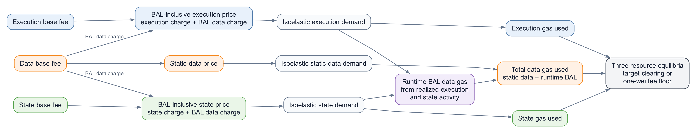
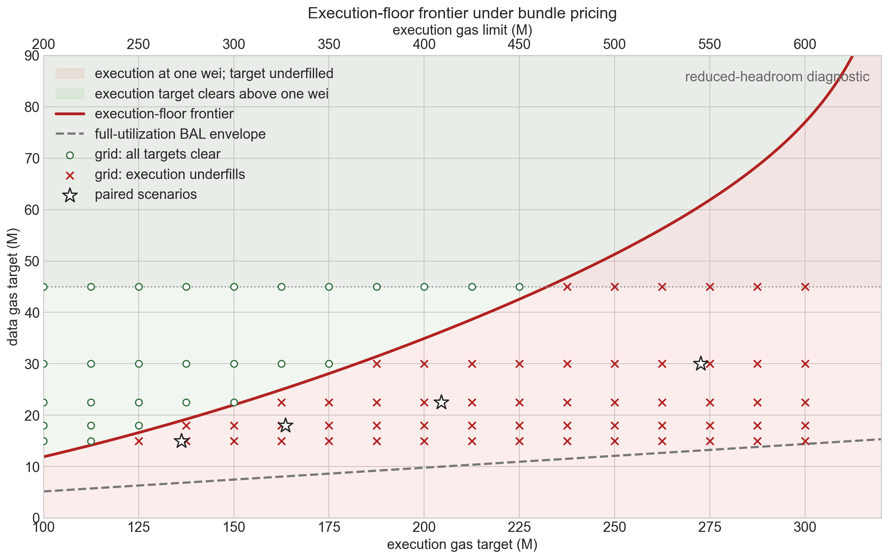
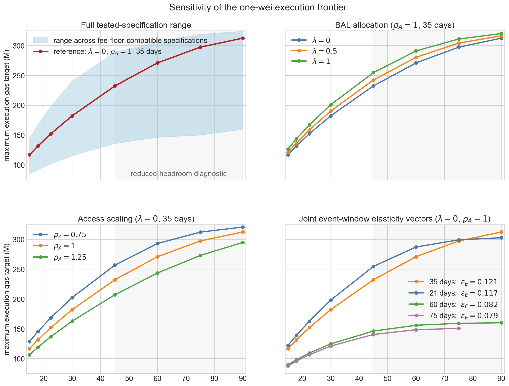
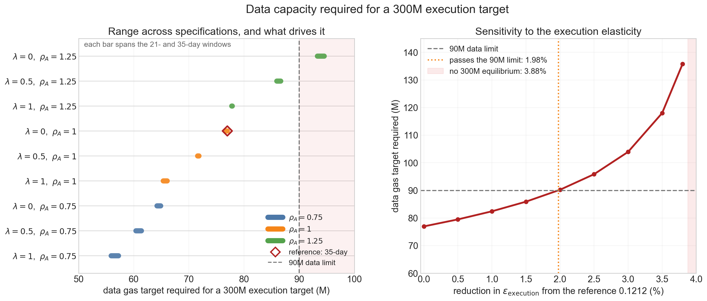

# Bundle-Priced EIP-7999 Equilibrium

EIP-7999 assigns execution, data, and state their own separate gas target, limit and base fees. Runtime block access lists (BALs) consume data gas, but the quantity of BAL produced depends on execution and state activity. A transaction that produces BAL therefore faces both its parent-resource charge and a data charge on the BAL it generates.

This report asks two capacity-design questions: 
- **For a given data target (target ratio), how much BAL-producing execution can clear before the execution base fee reaches its 1-wei minimum?** 
- **For a given execution target, how much data gas is required so that the execution can clear the target with a base fee of at least 1 wei?**

The answer is an execution-clearing frontier in execution/data target space.

> A flowchart showing how each resource is modeled. Execution and state demand respond to parent prices that include their runtime-BAL data charge. Realized parent activity determines execution gas, state gas, and runtime BAL; static data and runtime BAL then combine into total data-gas usage. The three resource markets jointly satisfy their target-clearing and one-wei minimum conditions.

The [resource-elasticity and Glamsterdam equilibrium analysis](/VxOPJuk0RCuQ5nu144LQvQ) provides the independent isoelastic demand estimates and the metering multipliers of execution and state. The [Data metering and BAL demand report](/_u9MS1v4SXW78xzUT6jDWQ) provides the static-data meter, runtime-BAL anchor, BAL source decomposition, and parent-price construction.

Unless stated otherwise, the report assumes the following reference parameterization:
- Central elasticities are derived from the 35-day window around gas limit increase events, i.e.,  $\epsilon_{\mathrm{execution}} = 0.121$, $\epsilon_{\mathrm{data}}=0.229$, $\epsilon_{\mathrm{state}} = 0.335$.
- Coproduced state access from state-creating transactions follows execution activity, i.e., $\lambda=0$. 
- State access intensity does not change as execution scales, i.e., $\rho_A=1$.
- Blob-linked reserve price for data gas is not considered.

### Main results

1. **The execution-clearing boundary is the central design object.** For each data target, it gives the *maximum execution target* that can clear before $b_{\mathrm{execution}}$ reaches 1 wei. In the reference parameterization, data targets of 15M, 18M, 22.5M, 30M, and 45M place the boundary at approximately 116.9M, 131.8M, 152.2M, 182.2M, and 232.4M, respectively.
2. **The boundary moves with the structural and elasticity assumptions.** Across the tested 36 $\lambda\times\rho_A\times$ elasticity-window specifications, the maximum execution target ranges from 84.2M to 145.4M at a 15M data target and from 135.9M to 288.8M at a 45M data target. The elasticity uncertainty is the largest single source of variation.
3. **A 300M execution target requires approximately 77M of data target under the reference calibration.** That is **85.5%** of the fixed 90M data limit and leaves **13.03M** of headroom above it. The required data target ranges from **55.9M to 94.5M**, driven mainly by the access-scaling assumption $\rho_A$.
4. **The data target requirement is locally sensitive to the execution elasticity.** A 1% reduction in $\epsilon_{\mathrm{execution}}$ raises the required data target by **7.1%**, from 76.97M to 82.44M, and a **1.98%** reduction moves it beyond the fixed 90M limit. The response is nonlinear and steepens for larger reductions. Static-data elasticity moves the boundary in the opposite direction and less strongly.
5. **Beyond the boundary, the configured execution target drops out of the equilibrium.** Once execution base fee reaches 1 wei, further target increases leave realized execution, BAL, and the data base fee unchanged; they lower only execution utilization.

## Model inputs and BAL-inclusive demand

All targets and gas quantities below are per block. Base fees are unit prices in wei per unit of the corresponding EIP-7999 gas. BAL-inclusive parent prices and BAL charges are prices per historical parent-activity unit. All equations express prices in a common unit; displayed results convert them to wei.

Superscript $0$ denotes the February--May 2026 historical anchor, and superscript $*$ denotes an equilibrium value.

| Notation                                       | Meaning                                                      |
| ---------------------------------------------- | ------------------------------------------------------------ |
| $q_{\mathrm{execution}}$, $q_{\mathrm{state}}$ | Historical gas-equivalent execution and state activity per block |
| $g_{\mathrm{static}}$, $g_{\mathrm{BAL}}$      | Static-data and runtime-BAL data gas per block               |
| $b_i$, $m_i$, $\epsilon_i$                     | Base fee, metering multiplier, and own-price elasticity of resource $i$ |
| $P_{\mathrm{execution}}$, $P_{\mathrm{state}}$ | BAL-inclusive parent price per historical parent-activity unit |
| $T_i$, $u_i$, $b_{\min}$                       | Gas target, counterfactual gas used, and one-wei fee minimum |
| $w_{\mathrm{execution}}$, $w_{\mathrm{state}}$ | BAL data gas generated per historical unit of parent activity |
| $\lambda$, $\rho_A$                            | Maintained co-produced-BAL routing and access-scaling sensitivity |

The historical common-price anchor is $p^0=0.106928$ gwei per historical gas-equivalent unit. The reference inputs are:

| Resource    | Historical quantity per block | EIP-7999 gas anchor per block | Metering multiplier | 35-day elasticity |
| ----------- | ----------------------------: | ----------------------------: | ------------------: | ----------------: |
| Execution   |                       23.942M |                       36.821M |            1.537898 |          0.121160 |
| Static data |                        1.181M |                     2.133559M |            1.807251 |          0.229476 |
| State       |                        5.244M |                       29.663M |            5.656315 |          0.334864 |
| Runtime BAL |                             — |                     1.919100M |                   — |                 — |

The individual cost-equivalent base-fee anchors $p^0/m_i$ serve as accounting references. Applying all of them simultaneously does not reproduce an EIP-7999 equilibrium: the positive BAL charge raises execution and state parent prices above the historical common-price anchor.

The central elasticity of each resource used in the analysis is derived from the 35-day window around the gas-limit increase events. The remaining windows illustrate how the equilibrium shifts with the elasticity estimate.

| Event window | $\epsilon_{\mathrm{execution}}$ | $\epsilon_{\mathrm{data}}$ | $\epsilon_{\mathrm{state}}$ |
| -----------: | ------------------------------: | -------------------------: | --------------------------: |
|      21 days |                        0.117067 |                   0.201790 |                    0.478438 |
|  **35 days** |                    **0.121160** |               **0.229476** |                **0.334864** |
|      60 days |                        0.081668 |                   0.204691 |                    0.279676 |
|      75 days |                        0.078511 |                   0.201391 |                    0.253556 |

### Runtime-BAL production

The runtime decomposition measures three shares:

$$
d=0.113937,
\qquad
c=0.378791,
\qquad
n=0.507272,
$$

where $d$ is directly state-creation-linked BAL, $c$ is access-related BAL co-produced by state-creating transactions, and $n$ is BAL from transactions with no observed state creation.

The routing parameter $\lambda$ is a maintained modeling assumption. Under the reference resource-based specification, $\lambda=0$: directly state-creation related BAL follows state activity, while other access-related BAL remains attached to execution/access activity. Values $\lambda\in\{0.5,1\}$ serve as structural coupling sensitivities.

Let

$$
R_{\mathrm{execution}}
=\frac{q_{\mathrm{execution}}}{q_{\mathrm{execution}}^0}.
$$

Execution-linked BAL, its average intensity, and total BAL are:

$$
\begin{aligned}
g_{\mathrm{BAL,execution}}
&=w_{\mathrm{execution}}(\lambda)q_{\mathrm{execution}}^0
R_{\mathrm{execution}}^{\rho_A},\\
\bar w_{\mathrm{execution}}
&=w_{\mathrm{execution}}(\lambda)
R_{\mathrm{execution}}^{\rho_A-1},\\
g_{\mathrm{BAL}}
&=g_{\mathrm{BAL,execution}}
+w_{\mathrm{state}}(\lambda)q_{\mathrm{state}}.
\end{aligned}
$$

At $\lambda=0$, $w_{\mathrm{execution}}=0.071023$ data gas per historical execution unit and $w_{\mathrm{state}}=0.041695$ data gas per historical state unit. The reference value $\rho_A=1$ keeps execution-linked BAL intensity (state access intensity) constant, so total execution-linked BAL grows proportionally with execution. Values below or above one allow access intensity to decline or rise as execution expands.

### Parent demand curves

The parent prices are:

$$
P_{\mathrm{execution}}
=m_{\mathrm{execution}}b_{\mathrm{execution}}
+\bar w_{\mathrm{execution}}b_{\mathrm{data}},
\qquad
P_{\mathrm{state}}
=m_{\mathrm{state}}b_{\mathrm{state}}
+w_{\mathrm{state}}b_{\mathrm{data}}.
$$

> For $\rho_A\neq1$, this is an average-cost reduced form: the price uses average BAL intensity $\bar w_{\mathrm{execution}}$, whereas marginal BAL intensity is $\rho_A\bar w_{\mathrm{execution}}$. The two coincide in the reference case $\rho_A=1$.

Each parent price includes the activity's own metered charge and its assigned average runtime-BAL charge. Static transaction data and other cross-resource charges remain outside the parent prices.

The independent isoelastic demand curves are evaluated at the BAL-inclusive parent prices:

$$
\begin{aligned}
q_{\mathrm{execution}}
&=q_{\mathrm{execution}}^0
\left(\frac{P_{\mathrm{execution}}}{p^0}\right)^{-\epsilon_{\mathrm{execution}}},\\
q_{\mathrm{state}}
&=q_{\mathrm{state}}^0
\left(\frac{P_{\mathrm{state}}}{p^0}\right)^{-\epsilon_{\mathrm{state}}},\\
g_{\mathrm{static}}
&=g_{\mathrm{static}}^0
\left(
\frac{m_{\mathrm{data,static}}b_{\mathrm{data}}}{p^0}
\right)^{-\epsilon_{\mathrm{data}}}.
\end{aligned}
$$

For $\rho_A\ne1$, the execution equation is implicit because average BAL intensity changes with realized execution.

## Equilibrium and fee-floor conditions

Counterfactual gas usage of each resource under EIP-7999 is:

$$
u_{\mathrm{execution}}=m_{\mathrm{execution}}q_{\mathrm{execution}},
\qquad
u_{\mathrm{state}}=m_{\mathrm{state}}q_{\mathrm{state}},
\qquad
u_{\mathrm{data}}=g_{\mathrm{static}}+g_{\mathrm{BAL}}.
$$

For each resource $i\in\{\mathrm{execution},\mathrm{data},\mathrm{state}\}$, equilibrium satisfies:

$$
b_i\ge b_{\min},
\qquad
u_i\le T_i,
\qquad
(b_i-b_{\min})(T_i-u_i)=0,
\qquad
b_{\min}=1\text{ wei}.
$$

A base fee above 1 wei requires gas usage at target; a resource may underfill only when its base fee is at 1 wei.

As specified in EIP-8037, the target state growth is 120 GiB/year. With `CPSB = 1530`, this corresponds to a 75M state gas target. State gas has no hard limit because it is not a burst resource. The data gas limit is set at 90M. At 16 gas per byte, it corresponds to 5.364 MiB of metered data. The data target ratio is varied through $1/6$, $1/5$, $1/4$, $1/3$, and $1/2$.
>Replacing runtime-metered BAL with the final BAL RLP encoded object adds roughly 0.0125 MiB in the matched sample. This gives approximately 5.377 MB after the adjustment. The relationship between payload size and propagation safety can be evaluated separately by replicating [Toni's analysis](https://github.com/nerolation/glamsterdam-worst-case-block-size).

<!-- > We evaluate every fee-floor regime, verify the complementarity conditions, and check the analytic execution frontier against the joint numerical solver. The validation details and machine-readable outputs are listed in Appendix C. -->

## Non-existence of the target-filling equilibrium

An equilibrium in which all three resources fill their targets requires each base fee to remain at or above 1 wei. If the implied execution base fee falls below 1 wei, no such equilibrium exists, and the system instead settles into a floor-bound equilibrium where execution underfills.

To check existence, suppose all three base fees are above 1 wei. The execution and state targets would then pin their BAL-inclusive parent prices:

$$
P_{\mathrm{execution}}^*
=p^0\left(
\frac{m_{\mathrm{execution}}q_{\mathrm{execution}}^0}
{T_{\mathrm{execution}}}
\right)^{1/\epsilon_{\mathrm{execution}}},
\qquad
P_{\mathrm{state}}^*
=p^0\left(
\frac{m_{\mathrm{state}}q_{\mathrm{state}}^0}
{T_{\mathrm{state}}}
\right)^{1/\epsilon_{\mathrm{state}}}.
$$

The accounting identity then divides each required parent price between its parent-resource base fee and the BAL data charge:

$$
b_{\mathrm{execution}}^*=
\frac{
P_{\mathrm{execution}}^*
-\bar w_{\mathrm{execution}}(R_{\mathrm{execution}}^*)b_{\mathrm{data}}^*
}{m_{\mathrm{execution}}},
\qquad
b_{\mathrm{state}}^* =
\frac{
P_{\mathrm{state}}^*-w_{\mathrm{state}}b_{\mathrm{data}}^*
}{m_{\mathrm{state}}}.
$$

As long as all three base fees remain above 1 wei, the targets pin parent activity and BAL. The target-filling equilibrium exists only as long as the required parent price exceeds its BAL data charge plus the 1-wei minimum:

$$
P_{\mathrm{execution}}^* >
\bar w_{\mathrm{execution}}(R_{\mathrm{execution}}^*)b_{\mathrm{data}}^*
+m_{\mathrm{execution}}b_{\min}.
$$

<!-- The following diagnostic applies that condition to the four paired comparability scenarios. The required parent price and BAL charge are in wei per historical execution-activity unit; the implied execution base fee is in wei per execution gas.

| Execution/data targets | Required execution parent price (wei / historical execution unit) | BAL charge (wei / historical execution unit) | Charge / price | Implied execution base fee (wei / execution gas) |
| ---------------------: | -------------------------------------------------------------------: | ------------------------------------------------: | -------------: | --------------------------------------------------: |
|         136.3M / 15.0M |                           2,178 |     12,197 |           5.6× |                     −6,514 |
|         163.5M / 18.0M |                             484 |      5,247 |          10.8× |                     −3,097 |
|         204.4M / 22.5M |                              77 |      1,891 |          24.6× |                     −1,179 |
|         272.6M / 30.0M |                               7 |        514 |          72.1× |                       −330 |

In every row the BAL charge exceeds the entire parent price required to fill the execution target before the execution fee is even included. The candidate interior solution would require a negative execution base fee and is therefore invalid. State has substantially more room: it remains above 1 wei in every scenario studied below. -->

## Execution-clearing boundary and capacity regimes
Filling a larger execution target requires a lower BAL-inclusive parent price. The execution base fee can fall to lower that price, but execution also pays the data fee on the BAL bytes it generates. A larger target produces more BAL, which competes for data space and pushes the data fee up; the resulting BAL charge absorbs a larger share of the parent price, leaving less room for the execution base fee. **The execution-clearing boundary is the largest execution target that can be filled while the execution base fee remains at or above 1 wei.** At the boundary the execution base fee is exactly 1 wei; beyond it, filling the target would require a fee below 1 wei, so execution underfills instead.

The condition for an equilibrium to exist can be written directly in target space. If execution and state both fill their targets, full-utilization BAL is:

$$
g_{\mathrm{BAL,full}}
=w_{\mathrm{execution}}q_{\mathrm{execution}}^0
\left(
\frac{T_{\mathrm{execution}}}
{m_{\mathrm{execution}}q_{\mathrm{execution}}^0}
\right)^{\rho_A}
+w_{\mathrm{state}}\frac{T_{\mathrm{state}}}{m_{\mathrm{state}}}.
$$

For a data gas target $T_{\mathrm{data}}>g_{\mathrm{BAL,full}}$, the data base fee that clears the remaining static-data demand is:

$$
b_{\mathrm{data}}^{\mathrm{clear}}
=\frac{p^0}{m_{\mathrm{data,static}}}
\left(
\frac{g_{\mathrm{static}}^0}
{T_{\mathrm{data}}-g_{\mathrm{BAL,full}}}
\right)^{1/\epsilon_{\mathrm{data}}}.
$$

The data-fee cutoff at which the execution base fee reaches 1 wei is:

$$
b_{\mathrm{data}}^{\max}
=\frac{
P_{\mathrm{execution}}^*-m_{\mathrm{execution}}b_{\min}
}{\bar w_{\mathrm{execution}}(R_{\mathrm{execution}}^*)}.
$$

Over the studied range, data and state remain above their own fee floors, and the required execution parent price exceeds its own 1-wei charge. Under those conditions:

$$
b_{\mathrm{execution}}^*>1\text{ wei}
\quad\Longleftrightarrow\quad
b_{\mathrm{data}}^{\mathrm{clear}}<b_{\mathrm{data}}^{\max}
\quad\Longleftrightarrow\quad
T_{\mathrm{data}}>T_{\mathrm{data}}^{\mathrm{frontier}}(T_{\mathrm{execution}}),
$$

where:

$$
T_{\mathrm{data}}^{\mathrm{frontier}}
=g_{\mathrm{BAL,full}}
+g_{\mathrm{static}}^0
\left(
\frac{m_{\mathrm{data,static}}b_{\mathrm{data}}^{\max}}{p^0}
\right)^{-\epsilon_{\mathrm{data}}}.
$$

At equality, execution fills its target with a base fee of 1 wei per execution gas. A data target above the boundary yields an execution base fee above 1 wei; below it, execution base fee reaches 1 wei and the target is underfilled.

> The solid red curve is the exact one-wei execution boundary. Green points clear all three targets; red crosses are execution-floor equilibria; stars mark the paired comparability scenarios. The dashed gray line is runtime BAL generated if execution and state both fill their targets. Star signs represents paired scenarios, where we scale the data/execution historical activity proportionally. 

The coarse scenario grid crosses five data targets — 15M, 18M, 22.5M, 30M, and 45M — with execution targets from 125M to 300M in 25M steps. 
<!-- Of its 40 cells, **11 clear all three targets** and **29 reach the one-wei execution floor**. A denser diagnostic grid uses execution targets from 100M to 300M in 12.5M steps to locate the transitions: 28 of 85 cells are interior and 57 reach the execution floor.  -->
Data and state clear their targets in every cell.

| Data target | Max execution target | Max execution limit | Data fee at boundary (wei / data gas) |
| ----------: | -----------------: | --------------: | ------------------------------------: |
|       15.0M |             116.9M |          233.7M |                                109.0k |
|       18.0M |             131.8M |          263.6M |                                40.45k |
|       22.5M |             152.2M |          304.3M |                                12.34k |
|       30.0M |             182.2M |          364.5M |                                2.764k |
|       45.0M |             232.4M |          464.7M |                                 353.4 |

From another perspective, execution targets of 125M, 150M, 200M, 250M, and 300M place the 1-wei boundary at data targets of 16.6M, 22.0M, 34.9M, 51.3M, and 77.0M. The 77.0M value is an analytic extrapolation above the displayed $1/2$ target ratio.

### Full-utilization BAL envelope

At $\lambda=0$, $\rho_A=1$ and fixed 75M state gas target, the full-utilization BAL gas scales linearly with the execution gas target in equilibrium:

$$
g_{\mathrm{BAL,full}}
\simeq0.55\text{M}+0.046T_{\mathrm{execution}}.
$$

Above this line, the data target has room for BAL generated at full execution and state utilization. On the line, BAL alone fills the entire data target; below it, BAL at full parent utilization exceeds the data target. 

An data equilibrium base fee can still exist under a data target below this line because a higher data fee reduces BAL-producing activity until total data usage reaches its target. In the scenarios studied, execution then remains below target with its base fee at the one-wei minimum, while data and state clear their targets. In other words, data equilibrium and execution equilibrium might not co-exist.

The 1-wei execution boundary is stricter than the BAL envelope at any parameter specification tested because positive static-data demand must also fit at a data base fee that leaves room for an execution base fee above 1 wei. 

### Paired scenarios as comparability benchmarks

The paired scenarios illustrate the floor-bound regime by holding the historical ratio of total counterfactual data gas to metered execution gas constant:

$$
\kappa^0
=\frac{g_{\mathrm{static}}^0+g_{\mathrm{BAL}}^0}
{m_{\mathrm{execution}}q_{\mathrm{execution}}^0}
=0.110065,
\qquad
T_{\mathrm{execution}}=\frac{T_{\mathrm{data}}}{\kappa^0}.
$$

All four points lie below the execution-clearing boundary, so each settles into a valid equilibrium in which execution underfills at 1 wei. These scenarios serve solely as comparability benchmarks. Main-table base fees are unit prices, and the data column is in wei per data gas.

| Execution target | Data target | Regime             | Data base fee (wei / data gas) | Execution target fill | BAL share of data target |
| ---------------: | ----------: | ------------------ | --------------------------------: | -------------: | -----------------------: |
|           136.3M |       15.0M | Execution at 1 wei |        109.0k |          85.8% |                    39.7% |
|           163.5M |       18.0M | Execution at 1 wei |         40.5k |          80.6% |                    36.9% |
|           204.4M |       22.5M | Execution at 1 wei |         12.3k |          74.4% |                    33.7% |
|           272.6M |       30.0M | Execution at 1 wei |         2.76k |          66.9% |                    29.9% |

### Sensitivity and Robustness 

The 1-wei execution boundary is recalculated for all 36 combinations of $\lambda\in\{0,0.5,1\}$, $\rho_A\in\{0.75,1,1.25\}$, and the 21-, 35-, 60-, and 75-day elasticity estimates. Each calculation holds the data and state targets fixed, places the execution base fee at 1 wei, and solves for the largest execution target that can still be fully used.

| Data target | Reference maximum execution target boundary | Maximum execution target range across specifications |
| ----------: | -----------------: | -----------------------------: |
|       15.0M |             116.9M |                  84.2M--145.4M |
|       18.0M |             131.8M |                  91.8M--167.8M |
|       22.5M |             152.2M |                 101.7M--198.2M |
|       30.0M |             182.2M |                 115.7M--240.7M |
|       45.0M |             232.4M |                 135.9M--288.8M |
|       60.0M |             271.0M |                 146.4M--306.2M |
|       75.0M |             297.4M |                 150.1M--319.2M |
|       90.0M |             312.5M |     159.8M--324.2M (19 of 36) |

The two extremes come from the same structural corners at every data target: the lowest boundary combines $\lambda=0$ with $\rho_A=1.25$, and the highest combines $\lambda=1$ with $\rho_A=0.75$. Only the elasticity window changes across the range. The lowest uses the 75-day vector through a 75M data target and the 60-day vector at 90M; the highest uses the 21-day vector through 45M and the 35-day vector from 60M onward.

Every one of the 36 specifications has a valid boundary through a 75M data target. At a 90M data target, which equals the data limit, only 19 of them do; the remaining 17 would require a data fee below one wei, and instead place both base fees at one wei with both resources below their targets.

The directions have a direct interpretation over the studied expansion range. A larger $\rho_A$ generates more execution-linked BAL as execution expands and lowers the supportable execution target. A larger $\lambda$ shifts co-produced BAL toward state activity, which expands less than execution in these scenarios, and therefore raises the boundary.

The elasticity uncertainty under different windows have a larger impact on the execution target boundary than the parameters $\lambda$ or $\rho_A$. Because state remains interior at its fixed target, $\epsilon_{\mathrm{state}}$ changes the state fee while the boundary movement comes from $\epsilon_{\mathrm{execution}}$ and $\epsilon_{\mathrm{data}}$.

## Data capacity required for a 300M execution target

Reading the execution-clearing boundary in reverse, we can ask the question: if we want to scale the execution target to 300M, what is the minimum data target required? 

First of all, whether the question has an answer at all depends on the demand calibration. Under the 60- and 75-day elasticity vectors, execution demand cannot reach a 300M target at a one-wei execution fee *even if BAL carried no data charge whatsoever*; their zero-charge ceilings are 160.9M and 152.0M. The answer below applies to the 21- and 35-day elasticity calibrations.

> Left: the data target each feasible specification requires for a 300M execution target, sorted. Each bar spans the 21- and 35-day elasticity windows; colour gives $\rho_A$ and the rows within each colour give $\lambda$. The diamond marks the reference specification and the dashed line the 90M data limit. Right: how the reference requirement responds to a reduction in $\epsilon_{\mathrm{execution}}$ alone, with the limit crossing and the point beyond which no 300M equilibrium exists.

| Elasticity window | Reference $\lambda=0$, $\rho_A=1$ | Data target range across $\lambda$, $\rho_A$ | 
| ----------------: | --------------------------------: | -------------------------------: |
|           21 days |                            76.81M |                   57.25M--93.33M | 
|       **35 days** |                        **76.97M** |                   55.89M--94.53M |             
|           60 days |                        infeasible |           no-BAL ceiling: 160.9M |             
|           75 days |                        infeasible |           no-BAL ceiling: 152.0M |    

Under the reference calibration the answer is approximately **77M**. Across all calibrations, the minimum data target spans **55.89M to 94.53M**:

- the **lower bound, 55.89M**, comes from $\lambda=1$ with $\rho_A=0.75$ on the 35-day vector, where coproduced state access follow state demand and state access scales sub-proportionally with execution.
- the **upper bound, 94.53M**, comes from $\lambda=0$ with $\rho_A=1.25$, also on the 35-day vector, where coproduced state access follow execution demand and state access scales super-proportionally with execution.

A larger $\rho_A$ generates more execution-linked BAL as execution expands, and a smaller $\lambda$ leaves more of the co-produced access on the execution parent, which expands faster than state here; both raise the data target that 300M execution requires.

Relative to the 90M data gas limit:

$$
\frac{76.97}{90}=85.5\%,
\qquad
90-76.97=13.03\text{M above the target}.
$$

A 300M execution target consumes 85.5% of the data limit as *target*, leaving 13.03M of headroom above it. Because the boundary is defined at a 1-wei execution fee, a strictly interior execution fee requires a data target above that value rather than at it.

The comparison with conventional target ratios:

|                    Data target / target ratio | Largest fully utilized execution target |
| -----------------------------: | --------------------------------------: |
| 45M / $\frac{1}{2}$ |                                  232.4M |
|                60M / $\frac{2}{3}$|                                  271.0M |
|               75M / $\frac{5}{6}$ |                                  297.4M |
|                        **77M** |                                **300M** |
|            90M, the full limit |                                  312.5M |

### How far the boundary moves with the demand elasticities

The reference vector is $\epsilon_{\mathrm{execution}}=0.1212$, $\epsilon_{\mathrm{data}}=0.2295$ and $\epsilon_{\mathrm{state}}=0.3349$, all from the 35-day event windows. Each comparison below perturbs one of them and holds the other two, and every other reference input, fixed.

**Execution elasticity.**

|    Change | $\epsilon_{\mathrm{execution}}$ | Required data target |  Movement |
| --------: | ------------------------------: | -------------------: | --------: |
|  $-3.0\%$ |                         0.11752 |              103.95M | $+35.1\%$ |
|  $-2.0\%$ |                         0.11874 |               90.24M | $+17.2\%$ |
|  $-1.0\%$ |                         0.11995 |               82.44M |  $+7.1\%$ |
|  $-0.5\%$ |                         0.12055 |               79.51M |  $+3.3\%$ |
| reference |                         0.12116 |               76.97M |         — |
|  $+0.5\%$ |                         0.12177 |               74.74M |  $-2.9\%$ |
|  $+1.0\%$ |                         0.12237 |               72.75M |  $-5.5\%$ |
|  $+2.0\%$ |                         0.12358 |               69.29M | $-10.0\%$ |
|  $+3.0\%$ |                         0.12479 |               66.35M | $-13.8\%$ |

Three reductions matter for feasibility. A **1.98%** reduction pushes the required data target past the fixed 90M limit. A **3.88%** reduction drives the compatible data fee below the one-wei floor, so no all-target-clearing 300M equilibrium exists under the two fee floors. A **4.12%** reduction puts 300M beyond execution demand even with no BAL charge at all.

The response is convex, so the direction of the perturbation matters. The local two-sided log-elasticity is $-6.18$, but that is a derivative at the reference point rather than a finite difference: a $+1\%$ perturbation gives a 5.5% reduction in the required data target and a $-1\%$ perturbation gives a 7.1% increase, bracketing the local value. The gap widens with distance — at $-3\%$ the boundary moves 35.1%, about 11.7 times the input change, against 6.6 times at $-0.5\%$. A single slope therefore understates every larger reduction, which is why the thresholds above are the more useful summary.

**Data elasticity.**

|    Change | $\epsilon_{\mathrm{data}}$ | Required data target | Movement |
| --------: | -------------------------: | -------------------: | -------: |
|  $-3.0\%$ |                    0.22259 |               70.94M | $-7.8\%$ |
|  $-2.0\%$ |                    0.22489 |               72.88M | $-5.3\%$ |
|  $-1.0\%$ |                    0.22718 |               74.89M | $-2.7\%$ |
|  $-0.5\%$ |                    0.22833 |               75.92M | $-1.4\%$ |
| reference |                    0.22948 |               76.97M |        — |
|  $+0.5\%$ |                    0.23062 |               78.04M | $+1.4\%$ |
|  $+1.0\%$ |                    0.23177 |               79.12M | $+2.8\%$ |
|  $+2.0\%$ |                    0.23407 |               81.35M | $+5.7\%$ |
|  $+3.0\%$ |                    0.23636 |               83.65M | $+8.7\%$ |

**Data elasticity works against execution elasticity, and about half as strongly.** A 1% increase in $\epsilon_{\mathrm{data}}$ raises the required data target by 2.8%, where a 1% increase in $\epsilon_{\mathrm{execution}}$ lowers it by 5.5%. Its local elasticity is $+2.75$, and unlike execution the response is close to linear over this range, so the local value and the finite effects nearly coincide. The sign follows from where the frontier sits: the clearing data fee there is below the anchor-equivalent static-data fee, so static data is expanded relative to its anchor, and a larger $\epsilon_{\mathrm{data}}$ expands it further and consumes more of the data target.

**State elasticity does not move the boundary at all.** While state clears its target, $q_{\mathrm{state}}$ is fixed at $T_{\mathrm{state}}/m_{\mathrm{state}}$ whatever its elasticity, so the state-linked BAL it generates also fixed. State elasticity moves only the state base fee $b_{\mathrm{state}}$.

## Limitations

**Isoelastic extrapolation.** The calculation carries demand curves far beyond the event windows used to estimate them. Exact wei-level fees and fill rates are conditional functional-form outputs; forecasting future fees would require a dynamic demand and shock model. The regime classification is more stable across the tested assumptions.

**Average and marginal BAL intensity.** For $\rho_A\ne1$, the execution parent price uses average BAL intensity, $\bar w_{\mathrm{execution}}=w_{\mathrm{execution}}R_{\mathrm{execution}}^{\rho_A-1}$. Marginal BAL intensity is $\rho_A\bar w_{\mathrm{execution}}$. The two coincide at the reference value $\rho_A=1$; the off-reference cases are reduced-form access-composition sensitivities.

**Maintained BAL routing.** $\lambda$ determines how co-produced access in state-creating transactions is routed when parent prices move independently. Historical data do not identify this allocation. Values 0, 0.5, and 1 represent maintained structural alternatives.

**Aggregate parent prices.** The BAL-inclusive parent prices include the average runtime-BAL charge generated by execution and state. Parent-associated static transaction data remains on the separate static-data curve. Execution carried by state-creating transactions remains within aggregate execution demand. 

## Conclusion

The execution-clearing boundary is the central result. It traces where, in execution/data target space, the BAL data charge pushes $b_{\mathrm{execution}}$ to its one-wei minimum. In the reference parameterization, a 45M data target places the boundary at a 232.4M execution target, while a 300M execution target places the analytically extrapolated boundary at a 77.0M data target.

The boundary moves with the structural allocation ($\lambda$), access-scaling ($\rho_A$), and elasticity-window assumptions, but retains its qualitative shape across the tested grid. At a 45M data target, the boundary ranges from 135.9M to 288.8M across the tested specifications. The elasticity uncertainty is the largest single source of variation.

Beyond the boundary, further increases to the configured execution target no longer change realized execution, BAL, or the data base fee. 

