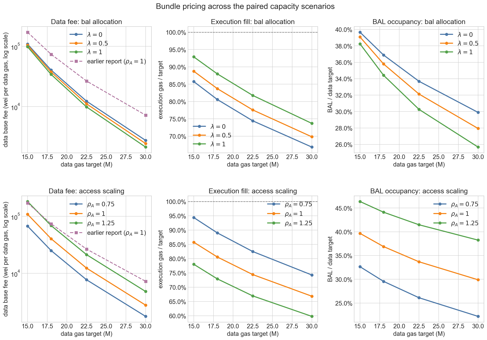

# Bundle-Priced EIP-7999 Equilibrium

## Research question and mechanism

Full EIP-7999 assigns execution, data, and state their own separate base fees. Runtime block access lists (BALs) consume data gas, but the quantity of BAL produced depends on execution and state activity. A transaction that produces BAL therefore faces both its parent-resource charge and a data charge on the BAL it generates.

This report asks a capacity-design question: **for a given data target (target ratio), how much BAL-producing execution can clear before the execution base fee reaches its one-wei minimum?** The answer is an execution-clearing frontier in execution/data target space.

![BAL bundle-pricing mechanism][mechanism-figure]

> A flowchart showing how each resource is modeled. Execution and state demand respond to parent prices that include their runtime-BAL data charge. Realized parent activity determines execution gas, state gas, and runtime BAL; static data and runtime BAL then combine into total data-gas usage. The three resource markets jointly satisfy their target-clearing and one-wei minimum conditions.

The [resource-elasticity report](three_way_resource_elasticity_report.md) provides the independent isoelastic demand estimates. The [Glamsterdam equilibrium report](three_way_glamsterdam_equilibrium_report.md) provides the execution and state metering multipliers, and the [Data metering and BAL demand report](bundle_priced_bal_demand_model_report.md) provides the static-data meter, runtime-BAL anchor, BAL source decomposition, and parent-price construction.

**Reference specification.** Unless stated otherwise, the report uses the 35-day elasticities,
$\lambda=0$, $\rho_A=1$, a 75M state target, a fixed counterfactual 90M data limit, a one-wei
minimum fee, no blob-linked reserve, and continuously valued steady-state fees. The 90M data limit
and paired capacity scenarios are comparison inputs, not protocol recommendations. Frontier
diagnostics extend the data target to 90M; this endpoint equals the data limit and therefore has no
above-target headroom in a dynamic fee path.

## Main results

1. **All four paired comparability scenarios are execution-floor equilibria.** Execution fills
   **66.9--85.8%** of its target, while data and state clear their targets.
2. **The candidate interior solutions are invalid.** At the candidate interior data fee that would
   clear the data market while execution and state both filled their targets, the BAL charge per
   historical execution unit exceeds the total execution parent price required to fill the target
   by factors of **5.6--72.1**. The implied execution base fee is therefore negative.
3. **The main design object is the execution-clearing frontier.** Across data targets from 15M to
   90M, the reference one-wei execution frontier rises from **116.9M to 312.5M**. Reading the same
   boundary in reverse, a 300M execution target requires at least **76.97M** of data target.
4. **Once execution is floor-bound, its configured target drops out of the equilibrium.** Further
   target increases leave realized execution, BAL, and the data base fee unchanged; they lower only
   execution utilization.
5. **The paired-scenario conclusion is stable, while the numerical frontier is sensitive to the
   maintained inputs.** Execution reaches one wei in **140 of 144** paired-scenario sensitivity
   combinations. At a 90M data target, **19 of 36** frontier specifications admit an
   all-target-clearing boundary, ranging from **159.8M to 324.2M**; the other 17 would require a
   data fee below one wei.
6. **The 35-day elasticities are the central benchmark, but the 300M boundary is locally
   sensitive to execution elasticity.** Holding all other reference inputs fixed, reductions of
   0.5%, 1%, and 2% in $\epsilon_{\mathrm{execution}}$ raise the minimum data target from 76.97M to
   **79.51M, 82.44M, and 90.24M**, respectively. The fixed 90M limit is crossed after a
   **1.975%** reduction.

Across the paired scenarios, the BAL data charge prevents execution from reaching its configured
target before $b_{\mathrm{execution}}$ reaches one wei. Once that floor binds, changes in
$b_{\mathrm{data}}$ govern realized execution through $P_{\mathrm{execution}}$. In the reference
$\rho_A=1$ model, the BAL charge $w_{\mathrm{execution}}b_{\mathrm{data}}$ becomes the dominant
marginal component of the BAL-inclusive execution parent price.

## Model inputs and BAL-inclusive demand

All targets and gas quantities below are per block. Base fees are unit prices in wei per unit of the corresponding EIP-7999 gas. BAL-inclusive parent prices and BAL charges are prices per historical parent-activity unit. All equations express prices in a common unit; displayed results convert them to wei.

Superscript $0$ denotes the February--May 2026 historical anchor, and superscript $*$ denotes an equilibrium value.

| Notation                                       | Meaning                                                      |
| ---------------------------------------------- | ------------------------------------------------------------ |
| $q_{\mathrm{execution}}$, $q_{\mathrm{state}}$ | Historical gas-equivalent execution and state activity per block |
| $g_{\mathrm{static}}$, $g_{\mathrm{BAL}}$      | Static-data and runtime-BAL data gas per block               |
| $b_i$, $m_i$, $\epsilon_i$                     | Base fee, metering multiplier, and own-price elasticity of resource $i$ |
| $P_{\mathrm{execution}}$, $P_{\mathrm{state}}$ | BAL-inclusive parent price per historical parent-activity unit |
| $T_i$, $u_i$, $b_{\min}$                       | Gas target, counterfactual gas used, and one-wei fee minimum |
| $w_{\mathrm{execution}}$, $w_{\mathrm{state}}$ | BAL data gas generated per historical unit of parent activity |
| $\lambda$, $\rho_A$                            | Maintained co-produced-BAL routing and access-scaling sensitivity |

The historical common-price anchor is $p^0=0.106928$ gwei per historical gas-equivalent unit. The reference inputs are:

| Resource    | Historical quantity per block | EIP-7999 gas anchor per block | Metering multiplier | 35-day elasticity |
| ----------- | ----------------------------: | ----------------------------: | ------------------: | ----------------: |
| Execution   |                       23.942M |                       36.821M |            1.537898 |          0.121160 |
| Static data |                        1.181M |                     2.133559M |            1.807251 |          0.229476 |
| State       |                        5.244M |                       29.663M |            5.656315 |          0.334864 |
| Runtime BAL |                             — |                     1.919100M |                   — |                 — |

The individual cost-equivalent base-fee anchors $p^0/m_i$ serve as accounting references. Applying all of them simultaneously does not reproduce an EIP-7999 equilibrium: the positive BAL charge raises execution and state parent prices above the historical common-price anchor.

The central elasticity of each resource used in the analysis is derived from the 35-day window around the gas-limit increase events. The remaining windows illustrate how the equilibrium shifts with the elasticity estimate.

| Event window | $\epsilon_{\mathrm{execution}}$ | $\epsilon_{\mathrm{data}}$ | $\epsilon_{\mathrm{state}}$ |
| -----------: | ------------------------------: | -------------------------: | --------------------------: |
|      21 days |                        0.117067 |                   0.201790 |                    0.478438 |
|  **35 days** |                    **0.121160** |               **0.229476** |                **0.334864** |
|      60 days |                        0.081668 |                   0.204691 |                    0.279676 |
|      75 days |                        0.078511 |                   0.201391 |                    0.253556 |

### Runtime-BAL production

The runtime decomposition measures three shares:

$$
d=0.113937,
\qquad
c=0.378791,
\qquad
n=0.507272,
$$

where $d$ is directly state-creation-linked BAL, $c$ is access-related BAL co-produced by state-creating transactions, and $n$ is BAL from transactions with no observed state creation.

The routing parameter $\lambda$ is a maintained modeling assumption. Under the reference resource-based specification, $\lambda=0$: directly state-creation-linked BAL follows state activity, while other access-related BAL remains attached to execution/access activity. Values $\lambda\in\{0.5,1\}$ serve as structural coupling sensitivities.

Let

$$
R_{\mathrm{execution}}
=\frac{q_{\mathrm{execution}}}{q_{\mathrm{execution}}^0}.
$$

Execution-linked BAL, its average intensity, and total BAL are:

$$
\begin{aligned}
g_{\mathrm{BAL,execution}}
&=w_{\mathrm{execution}}(\lambda)q_{\mathrm{execution}}^0
R_{\mathrm{execution}}^{\rho_A},\\
\bar w_{\mathrm{execution}}
&=w_{\mathrm{execution}}(\lambda)
R_{\mathrm{execution}}^{\rho_A-1},\\
g_{\mathrm{BAL}}
&=g_{\mathrm{BAL,execution}}
+w_{\mathrm{state}}(\lambda)q_{\mathrm{state}}.
\end{aligned}
$$

At $\lambda=0$, $w_{\mathrm{execution}}=0.071023$ data gas per historical execution unit and $w_{\mathrm{state}}=0.041695$ data gas per historical state unit. The reference value $\rho_A=1$ keeps execution-linked BAL intensity constant, so total execution-linked BAL grows proportionally with execution. Values below or above one allow access intensity to decline or rise as execution expands.

### Parent demand curves

The parent prices are:

$$
P_{\mathrm{execution}}
=m_{\mathrm{execution}}b_{\mathrm{execution}}
+\bar w_{\mathrm{execution}}b_{\mathrm{data}},
\qquad
P_{\mathrm{state}}
=m_{\mathrm{state}}b_{\mathrm{state}}
+w_{\mathrm{state}}b_{\mathrm{data}}.
$$

> For $\rho_A\neq1$, this is an average-cost reduced form: the price uses average BAL intensity
> $\bar w_{\mathrm{execution}}$, whereas marginal BAL intensity is
> $\rho_A\bar w_{\mathrm{execution}}$. The two coincide in the reference case $\rho_A=1$.

Each parent price includes the activity's own metered charge and its assigned average runtime-BAL charge. Static transaction data and other cross-resource charges remain outside the parent prices.

The independent isoelastic demand curves are evaluated at the BAL-inclusive parent prices:

$$
\begin{aligned}
q_{\mathrm{execution}}
&=q_{\mathrm{execution}}^0
\left(\frac{P_{\mathrm{execution}}}{p^0}\right)^{-\epsilon_{\mathrm{execution}}},\\
q_{\mathrm{state}}
&=q_{\mathrm{state}}^0
\left(\frac{P_{\mathrm{state}}}{p^0}\right)^{-\epsilon_{\mathrm{state}}},\\
g_{\mathrm{static}}
&=g_{\mathrm{static}}^0
\left(
\frac{m_{\mathrm{data,static}}b_{\mathrm{data}}}{p^0}
\right)^{-\epsilon_{\mathrm{data}}}.
\end{aligned}
$$

For $\rho_A\ne1$, the execution equation is implicit because average BAL intensity changes with realized execution.

## Equilibrium and fee-floor conditions

Counterfactual gas usage is:

$$
u_{\mathrm{execution}}=m_{\mathrm{execution}}q_{\mathrm{execution}},
\qquad
u_{\mathrm{state}}=m_{\mathrm{state}}q_{\mathrm{state}},
\qquad
u_{\mathrm{data}}=g_{\mathrm{static}}+g_{\mathrm{BAL}}.
$$

For each resource $i\in\{\mathrm{execution},\mathrm{data},\mathrm{state}\}$, equilibrium satisfies:

$$
b_i\ge b_{\min},
\qquad
u_i\le T_i,
\qquad
(b_i-b_{\min})(T_i-u_i)=0,
\qquad
b_{\min}=1\text{ wei}.
$$

A base fee above one wei requires gas usage at target; a resource may underfill only when its base fee is at one wei.

With `CPSB = 1530`, a 75M state-gas target corresponds to approximately 120 GiB/year of
**EIP-8037-metered state creation**. It does not imply 120 GiB/year of physical execution-client
database growth, which additionally depends on trie structure, database overhead, pruning, and
client implementation. The state resource has no hard limit.

The data gas limit is set at 90M. At 16 gas per byte, it corresponds to 5.364 MiB of metered data.
The relationship between this limit and propagation safety is evaluated separately in the
[bandwidth-capacity analysis](bandwidth_limit_report.md). The paired-scenario and capacity grids
vary the data target ratio through $1/6$, $1/5$, $1/4$, $1/3$, and $1/2$. The frontier analysis
additionally evaluates ratios of $2/3$, $5/6$, and 1 as reduced-headroom diagnostics.

> We evaluate every fee-floor regime, verify the complementarity conditions, and check the analytic execution frontier against the joint numerical solver. The validation details and machine-readable outputs are listed in Appendix C.

## Interior incidence

If execution, data, and state all remain above one wei, the execution and state targets pin their BAL-inclusive parent prices:

$$
P_{\mathrm{execution}}^*
=p^0\left(
\frac{m_{\mathrm{execution}}q_{\mathrm{execution}}^0}
{T_{\mathrm{execution}}}
\right)^{1/\epsilon_{\mathrm{execution}}},
\qquad
P_{\mathrm{state}}^*
=p^0\left(
\frac{m_{\mathrm{state}}q_{\mathrm{state}}^0}
{T_{\mathrm{state}}}
\right)^{1/\epsilon_{\mathrm{state}}}.
$$

The accounting identity then divides each required parent price between its parent-resource base fee and the BAL data charge:

$$
b_{\mathrm{execution}}^*=
\frac{
P_{\mathrm{execution}}^*
-\bar w_{\mathrm{execution}}(R_{\mathrm{execution}}^*)b_{\mathrm{data}}^*
}{m_{\mathrm{execution}}},
\qquad
b_{\mathrm{state}}^* =
\frac{
P_{\mathrm{state}}^*-w_{\mathrm{state}}b_{\mathrm{data}}^*
}{m_{\mathrm{state}}}.
$$

As long as all three base fees remain above one wei, the targets pin parent activity and BAL. The execution fee stays interior only if:

$$
P_{\mathrm{execution}}^* >
\bar w_{\mathrm{execution}}(R_{\mathrm{execution}}^*)b_{\mathrm{data}}^*
+m_{\mathrm{execution}}b_{\min}.
$$

The following diagnostic applies that condition to the four paired comparability scenarios. The
required parent price and BAL charge are in wei per historical execution-activity unit; the implied
execution base fee is in wei per execution gas.

| Execution/data targets | Required execution parent price (wei / historical execution unit) | BAL charge (wei / historical execution unit) | Charge / price | Implied execution base fee (wei / execution gas) |
| ---------------------: | -------------------------------------------------------------------: | ------------------------------------------------: | -------------: | --------------------------------------------------: |
|         136.3M / 15.0M |                           2,178 |     12,197 |           5.6× |                     −6,514 |
|         163.5M / 18.0M |                             484 |      5,247 |          10.8× |                     −3,097 |
|         204.4M / 22.5M |                              77 |      1,891 |          24.6× |                     −1,179 |
|         272.6M / 30.0M |                               7 |        514 |          72.1× |                       −330 |

In every row the BAL charge exceeds the entire parent price required to fill the execution target
before the execution fee is even included. The candidate interior solution would require a negative
execution base fee and is therefore invalid. State has substantially more room: it remains above one
wei in every scenario studied below.

## Execution-clearing frontier and capacity regimes

The interior condition can be written directly in target space. If execution and state both fill
their targets, full-utilization BAL is:

$$
g_{\mathrm{BAL,full}}
=w_{\mathrm{execution}}q_{\mathrm{execution}}^0
\left(
\frac{T_{\mathrm{execution}}}
{m_{\mathrm{execution}}q_{\mathrm{execution}}^0}
\right)^{\rho_A}
+w_{\mathrm{state}}\frac{T_{\mathrm{state}}}{m_{\mathrm{state}}}.
$$

For $T_{\mathrm{data}}>g_{\mathrm{BAL,full}}$, the data base fee that clears the remaining
static-data demand is:

$$
b_{\mathrm{data}}^{\mathrm{clear}}
=\frac{p^0}{m_{\mathrm{data,static}}}
\left(
\frac{g_{\mathrm{static}}^0}
{T_{\mathrm{data}}-g_{\mathrm{BAL,full}}}
\right)^{1/\epsilon_{\mathrm{data}}}.
$$

The data-fee cutoff at which the execution base fee reaches one wei is:

$$
b_{\mathrm{data}}^{\max}
=\frac{
P_{\mathrm{execution}}^*-m_{\mathrm{execution}}b_{\min}
}{\bar w_{\mathrm{execution}}(R_{\mathrm{execution}}^*)}.
$$

Along the reference frontier, data and state remain above their own fee floors, and the required
execution parent price exceeds its own one-wei charge. Under those conditions:

$$
b_{\mathrm{execution}}^*>1\text{ wei}
\quad\Longleftrightarrow\quad
b_{\mathrm{data}}^{\mathrm{clear}}<b_{\mathrm{data}}^{\max}
\quad\Longleftrightarrow\quad
T_{\mathrm{data}}>T_{\mathrm{data}}^{\mathrm{frontier}}(T_{\mathrm{execution}}),
$$

where:

$$
T_{\mathrm{data}}^{\mathrm{frontier}}
=g_{\mathrm{BAL,full}}
+g_{\mathrm{static}}^0
\left(
\frac{m_{\mathrm{data,static}}b_{\mathrm{data}}^{\max}}{p^0}
\right)^{-\epsilon_{\mathrm{data}}}.
$$

At equality, execution fills its target with a base fee of one wei per execution gas. A data target
above the frontier yields an execution base fee above one wei; below it, execution reaches one wei
and underfills.

![Execution-floor frontier][frontier-figure]

> The solid red curve is the exact one-wei execution frontier. Green points clear all three targets;
> red crosses are execution-floor equilibria; stars mark the paired comparability scenarios. The
> dashed gray line is runtime BAL generated if execution and state both fill their targets. The
> shaded region above 45M extends the steady-state comparison beyond a one-half target ratio; at
> 90M, the target equals the fixed data limit and leaves no dynamic headroom.

The coarse scenario grid crosses five data targets — 15M, 18M, 22.5M, 30M, and 45M — with execution
targets from 125M to 300M in 25M steps. Of its 40 cells, **11 clear all three targets** and **29 reach
the one-wei execution floor**. A denser diagnostic grid uses execution targets from 100M to 300M in
12.5M steps to locate the transitions: 28 of 85 cells are interior and 57 reach the execution floor.
Data and state clear their targets in every cell.

| Data target | Execution frontier | Execution limit | Data fee at frontier (wei / data gas) |
| ----------: | -----------------: | --------------: | ------------------------------------: |
|       15.0M |             116.9M |          233.7M |                                109.0k |
|       18.0M |             131.8M |          263.6M |                                40.45k |
|       22.5M |             152.2M |          304.3M |                                12.34k |
|       30.0M |             182.2M |          364.5M |                                2.764k |
|       45.0M |             232.4M |          464.7M |                                 353.4 |
|       60.0M |             271.0M |          542.1M |                                 83.65 |
|       75.0M |             297.4M |          594.9M |                                 27.24 |
|       90.0M |             312.5M |          625.1M |                                 10.84 |

Reading the same frontier from the execution side, execution targets of 125M, 150M, 200M, 250M,
and 300M place the one-wei boundary at data targets of **16.6M, 22.0M, 34.9M, 51.3M, and
76.97M**. The last value now lies inside the extended 15M--90M frontier range. At equality,
execution clears at one wei; a larger data target permits an execution fee above one wei.

### Full-utilization BAL envelope

At $\lambda=0$ and $\rho_A=1$, the dashed BAL-only envelope is approximately:

$$
g_{\mathrm{BAL,full}}
\simeq0.55\text{M}+0.046T_{\mathrm{execution}}.
$$

A point above this line has enough data-target space for the BAL generated at full execution and state
utilization. On the line, BAL alone occupies the entire data target. Below it, the BAL generated at full
parent utilization exceeds the data target. A corner equilibrium can still exist in this region because the
BAL-inclusive data charge reduces execution and, if necessary, state activity until their realized
BAL fits; at least one parent resource then remains below target.

The red frontier is stricter than the dashed envelope because positive static-data demand must also
fit at a data base fee that leaves room for an execution base fee above one wei. Every paired point
lies above the BAL-only envelope but below the execution-clearing frontier.

![Capacity-grid equilibria][capacity-figure]

> Equilibrium outcomes across the dense target grid. Diamonds mark the one-wei boundary for each data
> target; stars mark paired scenarios. Beyond a diamond, realized execution stops following its
> configured target, so the data base fee and BAL occupancy flatten while execution utilization
> falls.

## Paired scenarios as comparability benchmarks

The paired scenarios preserve the historical ratio of total counterfactual data gas to metered
execution gas:

$$
\kappa^0
=\frac{g_{\mathrm{static}}^0+g_{\mathrm{BAL}}^0}
{m_{\mathrm{execution}}q_{\mathrm{execution}}^0}
=0.110065,
\qquad
T_{\mathrm{execution}}=\frac{T_{\mathrm{data}}}{\kappa^0}.
$$

These scenarios are used solely for comparability; selecting protocol targets lies outside this report.
Main-table base fees are unit prices, and the data column is in wei per data gas.

| Execution target | Data target | Regime             | Data base fee (wei / data gas) | Execution fill | BAL share of data target |
| ---------------: | ----------: | ------------------ | --------------------------------: | -------------: | -----------------------: |
|           136.3M |       15.0M | Execution at 1 wei |        109.0k |          85.8% |                    39.7% |
|           163.5M |       18.0M | Execution at 1 wei |         40.5k |          80.6% |                    36.9% |
|           204.4M |       22.5M | Execution at 1 wei |         12.3k |          74.4% |                    33.7% |
|           272.6M |       30.0M | Execution at 1 wei |         2.76k |          66.9% |                    29.9% |

The execution base fee is one wei per execution gas in all four rows. State remains at its 75M
target with a base fee of approximately **1.184M wei per state gas**.

In the 15M scenario, the execution resource contributes approximately 1.54 wei and its BAL charge
contributes 7,742 wei per historical execution-activity unit. The BAL charge therefore accounts for
**99.98%** of the BAL-inclusive execution parent price.

Relative to the no-feedback benchmark, data base fees fall by **36.5--61.8%**. Under feedback, the data
charge reduces execution activity and the BAL it generates.

Once execution reaches one wei, the data base fee determines realized execution. With state
still at target, data clearing satisfies:

$$
g_{\mathrm{static}}(b_{\mathrm{data}})
+g_{\mathrm{BAL,execution}}
\bigl(q_{\mathrm{execution}}(b_{\mathrm{data}})\bigr)
+w_{\mathrm{state}}\frac{T_{\mathrm{state}}}{m_{\mathrm{state}}}
=T_{\mathrm{data}}.
$$

$T_{\mathrm{execution}}$ no longer appears. Raising it further changes only execution utilization.

## Sensitivity and robustness

### Frontier sensitivity

The frontier is recalculated for all 36 combinations of
$\lambda\in\{0,0.5,1\}$, $\rho_A\in\{0.75,1,1.25\}$, and the 21-, 35-, 60-,
and 75-day elasticity estimates. Each calculation holds the data and state targets fixed, places
the execution base fee at one wei, and solves for the largest execution target that can still be
fully used.

![Execution-frontier sensitivity][frontier-sensitivity-figure]

> The upper-left panel compares the reference frontier with the range across fee-floor-compatible
> specifications at eight data targets from 15M through 90M; lines connect those target points. The
> range is a model-sensitivity envelope rather than a confidence interval. The star and dashed
> line locate the 300M execution target. The other panels vary one input at a time while holding
> the remaining inputs at $\lambda=0$, $\rho_A=1$, and the 35-day elasticities. At 90M, the range
> uses the 19 specifications whose target-clearing data fee remains at least one wei.

| Data target | Reference frontier | Fee-floor-compatible range | Available specifications |
| ----------: | -----------------: | ------------------------: | -----------------------: |
|       15.0M |             116.9M |             84.2M--145.4M |                    36/36 |
|       18.0M |             131.8M |             91.8M--167.8M |                    36/36 |
|       22.5M |             152.2M |            101.7M--198.2M |                    36/36 |
|       30.0M |             182.2M |            115.7M--240.7M |                    36/36 |
|       45.0M |             232.4M |            135.9M--288.8M |                    36/36 |
|       60.0M |             271.0M |            146.4M--306.2M |                    36/36 |
|       75.0M |             297.4M |            150.1M--319.2M |                    36/36 |
|       90.0M |             312.5M |            159.8M--324.2M |                    19/36 |

Every specification has an all-target-clearing frontier through a 75M data target. At 90M, 17
unconstrained calculations imply a data fee below one wei. Under the protocol fee floors, those
cases instead place both base fees at one wei and leave both resources below their configured
targets, so they are excluded from the target-clearing range rather than plotted as valid frontiers.

Through 75M, the lowest frontier combines $\lambda=0$, $\rho_A=1.25$, and the 75-day elasticities.
Through 45M, the highest combines $\lambda=1$, $\rho_A=0.75$, and the 21-day elasticities; at 60M
and 75M, the upper endpoint instead uses the 35-day elasticity vector with the same $\lambda$ and
$\rho_A$.
Among the displayed one-at-a-time comparisons, changing the event window moves the frontier more
than changing $\lambda$ or $\rho_A$. At a 45M data target, the window estimates place the frontier
between 140.6M and 254.7M. Holding the 35-day elasticities fixed, the same frontier ranges from
207.2M to 256.8M across $\rho_A$ and from 232.4M to 254.7M across $\lambda$. Each window supplies
the full three-resource elasticity vector. Because state remains interior at its fixed target,
$\epsilon_{\mathrm{state}}$ changes the state fee while the frontier movement comes from
$\epsilon_{\mathrm{execution}}$ and $\epsilon_{\mathrm{data}}$.

The directions have a direct interpretation over the studied expansion range. A larger $\rho_A$
generates more execution-linked BAL as execution expands and lowers the supportable execution
target. A larger $\lambda$ shifts co-produced BAL toward state activity, which expands less than
execution in these scenarios, and therefore raises the frontier. These comparisons are conditional
on the model and target range; they are not universal comparative statics.

### Data target required for 300M execution

The inverse calculation fixes the execution target at 300M and solves for the smallest data target
that allows execution, data, and state to clear while both execution and data base fees remain at
least one wei.

![Data capacity for 300M execution][inverse-300m-figure]

> The left panel reports the range across $\lambda$ and $\rho_A$ for each event-window elasticity
> vector; diamonds show $\lambda=0$, $\rho_A=1$. Crosses indicate windows whose execution demand
> cannot reach 300M even before adding a BAL data charge. The right panel starts from the 35-day
> specification and lowers only $\epsilon_{\mathrm{execution}}$, holding the data and state
> elasticities fixed.

| Elasticity window | Reference $\lambda=0$, $\rho_A=1$ | Range across $\lambda$, $\rho_A$ | Within 90M limit |
| ----------------: | ---------------------------------: | --------------------------------: | ---------------: |
|           21 days |                             76.81M |                    57.25M--93.33M |              8/9 |
|           35 days |                         **76.97M** |                    55.89M--94.53M |              8/9 |
|           60 days |                                  — |          no-BAL ceiling: 160.9M |              0/9 |
|           75 days |                                  — |          no-BAL ceiling: 152.0M |              0/9 |

All nine allocation/access cases under the 21- and 35-day windows have a fee-floor-compatible
300M frontier, although one case in each window requires a data target above the fixed 90M limit.
The 60- and 75-day execution curves cannot support a 300M target at a one-wei execution fee even if
the BAL data charge were zero. Additional data capacity therefore cannot make those cases clear.

The controlled elasticity comparison shows how quickly the reference boundary moves near the fee
floor. Relative to the 76.97M reference, reductions of 0.5%, 1%, 1.5%, 2%, and 3% in
$\epsilon_{\mathrm{execution}}$ move the boundary upward by **2.53M, 5.47M, 8.96M, 13.27M, and
26.98M**, to 79.51M, 82.44M, 85.93M, 90.24M, and 103.95M. The fixed 90M limit is crossed after a
**1.975%** reduction. If the limit were relaxed, the compatible data fee itself reaches one wei
after a **3.877%** reduction; beyond that point, no all-target-clearing 300M equilibrium exists
under the two fee floors.

### Structural allocation sensitivity

$\lambda$ routes co-produced access BAL between execution/access and state activity. The table
reports conditional structural comparisons and carries no confidence-set interpretation.

| $\lambda$ | $b_D^*$ at 15M (wei / data gas) | Execution fill | $b_D^*$ at 30M (wei / data gas) | Execution fill |
| --------: | ------------------------------: | -------------: | ------------------------------: | -------------: |
|     **0** |                      **109.0k** |      **85.8%** |                      **2.764k** |      **66.9%** |
|       0.5 |                          104.5k |          88.7% |                          2.452k |          69.8% |
|         1 |                          98.51k |          92.9% |                          2.142k |          73.7% |

At $\rho_A=1$, execution remains at one wei in all 48 combinations of allocation, elasticity window,
and paired scenario.

### Access-scaling sensitivity

At the expanded execution quantities studied here, a larger $\rho_A$ produces more runtime BAL,
raises the data base fee, and leaves less room for execution at the one-wei execution floor.

| $\rho_A$ | Data base-fee range (wei / data gas) | Execution-fill range | BAL-share range |
| -------: | -----------------------------------: | -------------------: | --------------: |
|     0.75 |                       1.755k--67.50k |          74.3--94.4% |     22.2--32.7% |
|    **1** |                   **2.764k--109.0k** |      **66.9--85.8%** | **29.9--39.7%** |
|     1.25 |                       4.804k--182.1k |          59.8--78.0% |     38.2--46.4% |

Each range spans the four paired scenarios. Event-window results are reported in Appendix
B. Across the full $3\times3\times4\times4$ sensitivity grid, execution reaches one wei in 140 of
144 cases. Data and state remain interior in every case. The four fully interior cases all combine
$\rho_A=0.75$ with $\lambda>0$.

## Limitations

**Isoelastic extrapolation.** The calculation carries demand curves far beyond the event windows
used to estimate them. Exact wei-level fees and fill rates are conditional functional-form outputs;
forecasting future fees would require a dynamic demand and shock model. The regime classification
is more stable across the tested assumptions.

**Average and marginal BAL intensity.** For $\rho_A\ne1$, the execution parent price uses average
BAL intensity,
$\bar w_{\mathrm{execution}}=w_{\mathrm{execution}}R_{\mathrm{execution}}^{\rho_A-1}$.
Marginal BAL intensity is $\rho_A\bar w_{\mathrm{execution}}$. The two coincide at the reference value
$\rho_A=1$; the off-reference cases are reduced-form access-composition sensitivities.

**Maintained BAL routing.** The runtime decomposition measures $d$, $c$, and $n$, while $\lambda$
determines how co-produced access is routed when parent prices move independently. The data do not
identify this allocation. Values 0, 0.5, and 1 represent maintained structural alternatives.

**Aggregate parent prices.** The BAL-inclusive parent prices include the average runtime-BAL charge
generated by execution and state. Parent-associated static transaction data remains on the separate
static-data curve. Execution carried by state-creating transactions remains within aggregate
execution demand. Transaction-by-transaction entry and exit are outside the model.

**Steady-state scope.** The calculation excludes the blob-linked data reserve, discrete updater
paths, demand shocks, volatility, and time spent at a fee floor. These elements belong to the dynamic
simulation.

**Scenario interpretation.** The frontiers are conditional steady-state comparative statics. The
fixed 90M data limit and paired capacities are counterfactual scenarios; forecasting and protocol
target selection require additional evidence beyond this exercise.

## Conclusion

Charging runtime BAL as data gas makes the data base fee part of the price of BAL-producing
execution and state. Under the paired comparability scenarios, that charge pushes execution to its
one-wei minimum before its configured target is filled. Data and state continue to clear their
targets.

The execution-clearing frontier is the main result. In the reference parameterization, a 45M data
target places the one-wei frontier at a 232.4M execution target, and a 90M data target moves it to
312.5M. Reading the boundary in reverse, a 300M execution target requires a 76.97M data target.
Once execution crosses the frontier, larger configured execution targets no longer change the data
base fee, BAL, or realized execution.

The numerical frontier remains assumption-sensitive. At a 90M data target, only 19 of the 36 tested
specifications retain an all-target-clearing frontier, spanning 159.8M--324.2M. Around the 35-day
reference, a 1.975% reduction in execution elasticity is enough to move the 300M boundary beyond
the fixed 90M data limit. These values should therefore be read as conditional capacity benchmarks
rather than precise capacity estimates.

These frontiers are steady-state comparative statics under average BAL intensities and transported
isoelastic elasticities; they are not forecasts of future fee levels.

## Appendix A: Input sensitivities

### Event-window elasticities

| Event window | $\epsilon_{\mathrm{execution}}$ | $\epsilon_{\mathrm{data}}$ | $\epsilon_{\mathrm{state}}$ |
| -----------: | ------------------------------: | -------------------------: | --------------------------: |
|      21 days |                        0.117067 |                   0.201790 |                    0.478438 |
|  **35 days** |                    **0.121160** |               **0.229476** |                **0.334864** |
|      60 days |                        0.081668 |                   0.204691 |                    0.279676 |
|      75 days |                        0.078511 |                   0.201391 |                    0.253556 |

### Conditional BAL intensities

| Maintained $\lambda$ | Execution BAL intensity | State BAL intensity | Per metered execution gas |
| -------------------: | ----------------------: | ------------------: | ------------------------: |
|                **0** |            **0.071023** |        **0.041695** |              **0.046182** |
|                  0.5 |                0.055842 |            0.111005 |                  0.036310 |
|                    1 |                0.040661 |            0.180314 |                  0.026439 |

$w_{\mathrm{execution}}$ is data gas per historical execution unit,
$w_{\mathrm{state}}$ is data gas per historical state unit, and
$w_{\mathrm{execution}}/m_{\mathrm{execution}}$ is data gas per EIP-7999 execution gas.

## Appendix B: Event-window and figure sensitivity

All table entries are equilibrium data base fees in wei per data gas under $\lambda=0$ and
$\rho_A=1$.

| Data target | 21 days |     35 days | 60 days | 75 days |
| ----------: | ------: | ----------: | ------: | ------: |
|       15.0M |  52,857 | **109,004** |  27,064 |  22,878 |
|       18.0M |  17,373 |  **40,453** |   8,978 |   7,465 |
|       22.5M |   4,560 |  **12,336** |   2,409 |   1,965 |
|       30.0M |     839 |   **2,764** |     463 |     368 |

Execution reaches its fee floor under every event window. At the 15M data target, execution fill
ranges from 89.8% under the 21-day estimate to 64.6% under the 75-day estimate.

> Structural sensitivity to $\lambda$ and reduced-form access scaling $\rho_A$. The figure is retained
> as a robustness diagnostic; the execution-clearing frontier is the primary design figure.

The [archived notebook 2.3](../archived/notebooks/2.3-joint-composite-cost-equilibrium.ipynb)
preserves a superseded transaction-class extension. Because its imposed class elasticities fail the
historical aggregation check, it is excluded from the main evidence hierarchy.

## Appendix C: Reproducibility

The executable calculation is in
[notebook 2.4](../notebooks/2.4-bal-bundle-pricing-reference.ipynb). Its generated outputs include:

- [paired equilibria](../data/bundle_pricing_paired_equilibria.csv);
- [execution-floor boundary](../data/bundle_pricing_execution_frontier.csv);
- [execution-frontier sensitivity](../data/bundle_pricing_execution_frontier_sensitivity.csv);
- [minimum data target for 300M execution](../data/bundle_pricing_minimum_data_target_for_300m_execution.csv);
- [controlled execution-elasticity sensitivity](../data/bundle_pricing_execution_elasticity_sensitivity.csv);
- [dense capacity grid](../data/bundle_pricing_capacity_grid.csv); and
- [full sensitivity grid](../data/bundle_pricing_sensitivity.csv).

Notebook 2.4 verifies the runtime-BAL anchor identity, the interior incidence result, the invalid
negative-fee interior solutions, the execution-target dropout property, and agreement between the
analytic frontier and the joint numerical solver. For resource $i$, the complementarity residual is

$$
r_i^{\mathrm{comp}}
=\left|(b_i-b_{\min})(T_i-u_i)\right|.
$$

Across the 512 solver-validated equilibrium rows, every solve evaluates all eight fee-floor pin
sets and retains one economically distinct equilibrium. The frontier-sensitivity export also keeps
17 unconstrained 90M diagnostics that imply a sub-one-wei data fee; they are explicitly marked as
unavailable and excluded from the solver-validated frontier range. The maximum relative target
residual for an interior resource is $7.99\times10^{-15}$; the maximum of
$r_i^{\mathrm{comp}}$ across all resources and rows is $0.0811$ wei per block. Boundary tests also
verify that equivalent free and pinned representations collapse to the same economic solution.

[frontier-figure]: ../plots/bal_bundle_pricing_execution_floor_regime_2026-02-01_2026-06-01.png
[frontier-sensitivity-figure]: ../plots/bal_bundle_pricing_execution_frontier_sensitivity_2026-02-01_2026-06-01.png
[inverse-300m-figure]: ../plots/bal_bundle_pricing_300m_inverse_sensitivity_2026-02-01_2026-06-01.png
[capacity-figure]: ../plots/bal_bundle_pricing_capacity_grid_2026-02-01_2026-06-01.png
[mechanism-figure]: ../plots/bal_bundle_pricing_mechanism.png
