# One-dimensional vs. Multi-dimensional Fee Market: The Case for Ethereum

## Overview

In the previous analysis, we studied the multi-dimensional fee market under varied EIP-7999 configurations. Here, we ask how those outcomes compare with a post-Glamsterdam one-dimensional fee market.

We begin with a **baseline** configuration, which retains the transaction floor metering rate of 64 gas per byte in EIP-8131/8279 and `CPSB = 1530` in EIP-8037. **Floor-adjusted + EIP-8368** then recalibrates the floor and matches CPSB to the common target under each slot-time allocation. **Floor-adjusted + EIP-8372** additionally calibrates state pricing to demand and normalizes state capacity separately, allowing a much lower shared fee at the calibration point.

After establishing these three one-dimensional benchmarks, we compare them with EIP-7999's maximum-throughput and historically anchored designs on the same demand paths. The sensitivity analysis asks how the four complete elasticity vectors change these outcomes and the execution advantage of separate prices. We conclude that analysis with state-demand caps, which test the consequences of weaker expansion beyond the historical anchor.

### Main results

The first four results use the central 35-day elasticity vector and unrestricted state demand. The fifth changes all three resource elasticities together.

1. **With equal raw limits, state determines the shared base fee under unrestricted demand.** The baseline one-dimensional mechanism delivers **82.0M–92.6M execution gas** alongside **180.1M–252.2M state gas**. State demand sustains a common fee that limits execution activity.
2. **Matching CPSB while retaining equal raw limits further constrains execution.** The floor-adjusted + EIP-8368 mechanism delivers **67.5M–70.2M execution gas** and **202.3M–278.8M state gas**. This result describes the equal-raw-limit design.
3. **Demand-calibrated state pricing substantially improves the one-dimensional benchmark.** The floor-adjusted + EIP-8372 design delivers **151.9M–177.9M execution gas** centrally. Both branches clear at its unshocked calibration point, but dynamic normalized state utilization averages **71.6%–73.4%**, corresponding to **86.0–88.1 GiB/year**.
4. **EIP-7999 supports more execution while keeping state gas near its separate target.** Its maximum-throughput designs deliver **252.9M–272.6M execution gas**, and its balanced designs deliver **173.6M–223.0M**, with approximately **75M state gas** in both cases.
5. **EIP-7999's mean execution advantage survives the fixed-design elasticity test, with different state-growth outcomes.** Against the calibrated benchmark, the frozen central historically anchored designs gain **6.8M–69.8M**, and the frozen central maximum-throughput designs gain **23.1M–124.6M**, across the four complete vectors and five propagation allocations. EIP-7999 remains near **120 GiB/year**, so this comparison also reflects greater state utilization.

## Mechanism and notation

Here, *one-dimensional* means a **single-price, two-dimensional metering mechanism**. The shared base fee responds to the larger of regular gas and state gas. EIP-7999 instead maintains separate execution, data, and state base fees, and its bundle-priced demand model includes the data cost of BAL in parent execution and state prices.

| Benchmark                                   | Floor metering rate                           | State pricing                     | Fee update rules                          |
| ------------------------------------------- | --------------------------------------------- | --------------------------------- | ----------------------------------------- |
| Baseline                | 64 gas per counted byte                       | CPSB = 1,530                      | One EIP-1559 fee, two accounting branches |
| Floor-adjusted + EIP-8368 | Derived for each propagation allocation       | CPSB matched to the shared target | One EIP-1559 fee, two accounting branches |
| Floor-adjusted + EIP-8372 | Same floor and common limit as EIP-8368 benchmark | Demand-calibrated CPSB; scaled raw state limit | One EIP-1559 fee, normalized state counter |
| EIP-7999                                    | Separately priced static data and runtime BAL | CPSB = 1,530; state target = 75M  | Three resource fees                       |

These names distinguish three one-dimensional calibration approaches. [EIP-8368](https://eips.ethereum.org/EIPS/eip-8368) proposes matching CPSB to a new reference gas limit; [EIP-8372](https://eips.ethereum.org/EIPS/eip-8372) additionally separates state pricing from normalized state capacity through a one-time demand calibration. Both remain drafts with numerical constants unspecified. Our floor adjustments and calibrated constants are model-based choices for the tested physical configurations.

The one-dimensional specification combines [EIP-8037](https://eips.ethereum.org/EIPS/eip-8037) state accounting, [EIP-8038](https://eips.ethereum.org/EIPS/eip-8038) and [EIP-2780](https://eips.ethereum.org/EIPS/eip-2780) execution repricing, and data pricing which includes the static data and runtime BAL in the transaction floor in [EIP-8131](https://eips.ethereum.org/EIPS/eip-8131) and [EIP-8279](https://eips.ethereum.org/EIPS/eip-8279). 

| Quantity                      | Meaning                                                      |
| ----------------------------- | ------------------------------------------------------------ |
| $i\in\{E,D,S\}$              | Resource index: execution ($E$), transaction data ($D$), or state creation ($S$) |
| $q_i$                         | Activity of resource $i$ in the historical gas-equivalent units used by the demand model |
| $q_i^0$                       | Historical mean activity of resource $i$ per block over February–May 2026, used as its quantity anchor; the superscript $0$ denotes the anchor, not the first simulated block |
| $m_i$                         | Counterfactual metering multiplier for resource $i$          |
| $\epsilon_i$                 | Positive demand-elasticity magnitude governing the response of resource $i$ to its effective price |
| $F$                           | Floor metering rate in gas per counted byte                  |
| $\mathrm{CPSB}$               | State gas charged per state byte under EIP-8037              |
| $p^0$                         | Historical reference base fee used as the price anchor, expressed in the same units as $b$ |
| $b$                           | Single shared base fee                                       |
| $m_i b/p^0$                   | Effective price of resource $i$ relative to the historical price anchor; in the unshocked demand curve, a ratio of one gives $q_i=q_i^0$ |
| $g_{\mathrm{regular}}$        | Repriced execution gas plus transaction-floor/data gas       |
| $g_{\mathrm{state}}$          | EIP-8037 state gas, $m_Sq_S$                                 |
| $g_{\mathrm{shared}}$         | Fee-controlled usage, $\max(g_{\mathrm{regular}},g_{\mathrm{state}})$ |
| $L_G,T_G$                     | Common gas limit and target, with $T_G=L_G/2$                |
| $B_{\max}(t_{\mathrm{prop}})$ | Payload-byte capacity implied by the empirical-p90 propagation fit |

The central benchmark uses the 35-day independent elasticity estimates $(\epsilon_E,\epsilon_D,\epsilon_S)=(0.1212,0.2295,0.3349).$ One shared base fee controls the three activity quantities through their counterfactual effective prices:

$$
q_i(b)=q_i^0\left(\frac{m_i b}{p^0}\right)^{-\epsilon_i},
\qquad i\in\{E,D,S\}.
$$

For the two equal-raw-limit benchmarks, the metered gas branches are:

$$
g_{\mathrm{regular}}(b)=m_Eq_E(b)+m_Dq_D(b),
$$

$$
g_{\mathrm{state}}(b)=m_Sq_S(b),
$$

$$
g_{\mathrm{shared}}(b)=\max\left[g_{\mathrm{regular}}(b),g_{\mathrm{state}}(b)\right].
$$

**EIP-1559-style update rule.** For block $t$, the update rule uses gas usage included in the block after applying the common limit: $g_{\mathrm{shared},t}^{\mathrm{included}}=\max(g_{\mathrm{regular},t}^{\mathrm{included}},g_{\mathrm{state},t}^{\mathrm{included}})$. With $b_t$ measured in wei, the next block's base fee is

$$
b_{t+1}=
\begin{cases}
b_t+\max\!\left(1,\left\lfloor\dfrac{b_t\left(g_{\mathrm{shared},t}^{\mathrm{included}}-T_G\right)}{8T_G}\right\rfloor\right), & g_{\mathrm{shared},t}^{\mathrm{included}}>T_G,\\[6pt]
b_t, & g_{\mathrm{shared},t}^{\mathrm{included}}=T_G,\\[6pt]
b_t-\left\lfloor\dfrac{b_t\left(T_G-g_{\mathrm{shared},t}^{\mathrm{included}}\right)}{8T_G}\right\rfloor, & g_{\mathrm{shared},t}^{\mathrm{included}}<T_G.
\end{cases}
$$

All comparisons use the same demand conditions with 32 bootstrap paths constructed from the 60-day block panel from April to May 2026. Each path has 7,200 burn-in blocks followed by 50,400 measured blocks. Gas usage and block limit frequencies are averaged over measured blocks and then over simulated paths.

## Baseline configuration

The baseline configuration keeps the EIP-8131 and EIP-8279 floor metering rate at 64 gas per byte and `CPSB = 1,530`.

### Data pricing

Under the one-dimensional fee mechanism, EIP-8131 static transaction content bytes and EIP-8279 runtime BAL are priced through the transaction floor. As is [in the previous analysis](https://ethresear.ch/t/data-metering-bal-decomposition-and-bundle-pricing-under-eip-7999/25747), we sample 6,000 deterministic blocks containing 1,899,748 transactions from February through May 2026, and reconstruct the repriced execution gas, static-content floor, and EIP-8279 runtime BAL bytes.

Let $F$ be the floor metering rate, $E_j$ be repriced regular execution gas for transaction $j$, $\Phi_j^{\mathrm{static}}(F)$ its static data gas in the floor, and $M_j$ its runtime-metered BAL bytes. The metered regular-branch gas is:

$$
G_j(F)=\max\left\{E_j,\Phi_j^{\mathrm{static}}(F)+FM_j\right\},
$$

The floor metering rate $F$ is measured in gas per counted byte; the associated monetary amount per counted byte is $Fb$ at shared base fee $b$. At a floor metering rate of 64 gas per byte, execution repricing effects absorb most of the runtime BAL extension in the transaction floor in the historical sample. A cold storage access illustrates the coverage: its 32-byte key contributes $32\times64=2{,}048$ floor gas through runtime BAL, while it consumes 2,100 execution gas. Adding runtime BAL increases metered regular-branch gas for 2.05% of sampled transactions. Transactions already bound by the static floor or within 10% of it account for 75.02% of the BAL-induced gas uplift. Crossings driven primarily by deployed code account for another 15.99% of that uplift, because code deployment consumes state gas rather than regular gas. These percentages describe shares of incremental gas; deployed-code crossings represent only 1.16% of affected transactions.

Consequently, this increment is calibrated into a larger data multiplier of 2.1615.

### Simulation results

For each propagation time $t_{\mathrm{prop}}$, the execution-time gas capacity and the payload-byte budget are:

$$
L_E(t_{\mathrm{prop}})=v_E(9-t_{\mathrm{prop}}),
$$

$$
B_{\max}(t_{\mathrm{prop}})=1024\left(\frac{1000t_{\mathrm{prop}}-569}{0.443}\right).
$$

The gas limit is the smaller between the execution-time gas capacity and the gas usage of a worst-case payload:

$$
L_G^{64}(t_{\mathrm{prop}})
=\min\left[L_E(t_{\mathrm{prop}}),64B_{\max}(t_{\mathrm{prop}})\right].
$$

The derived gas limit is 359.6M at 3 seconds and 433.6M at 3.5 seconds because the fixed floor is the tighter constraint. From four seconds onward, execution capacity sets the gas limit. Unlike EIP-7999 configurations, where we fix the execution/data target and change the limit, we keep the target-to-limit ratio fixed at $1/2$.

| Propagation |      Target / limit | Equilibrium base fee | Mean metered execution | Mean data/floor gas | Mean state gas | State growth | Limit frequency | Fee variation | State as bottleneck |
| ----------: | ------------------: | -------------------: | ---------------------: | ------------------: | -------------: | -----------: | --------------: | ------------: | ------------------: |
|        3.0s |     179.8M / 359.6M |           86,981 wei |                  82.0M |               12.0M |         180.1M |    288.1 GiB |           7.99% |        0.0608 |              92.49% |
|        3.5s |     216.8M / 433.6M |           49,756 wei |                  87.9M |               13.7M |         218.2M |    349.0 GiB |           8.17% |        0.0611 |              95.02% |
|        4.0s | **250.0M / 500.0M** |           32,513 wei |                  92.6M |               15.1M |         252.2M |    403.4 GiB |           8.27% |        0.0613 |              96.27% |
|        4.5s |     225.0M / 450.0M |           44,535 wei |                  89.1M |               14.0M |         226.6M |    362.5 GiB |           8.20% |        0.0612 |              95.39% |
|        5.0s |     200.0M / 400.0M |           63,308 wei |                  85.3M |               12.9M |         200.9M |    321.4 GiB |           8.10% |        0.0610 |              94.08% |

Similar to what we have observed in the [Glamsterdam fee market analysis](https://ethresear.ch/t/demand-model-with-elasticities-for-ethereum-state-data-and-execution-and-glamsterdam-fee-market-analysis/25644), under the unrestricted isoelastic model, state is the bottleneck branch that determines the fee in more than 90% of the simulated blocks. State activity expands more strongly as the shared base fee falls because it has the highest estimated elasticity, while EIP-8037’s repricing assigns substantially more metered gas to each unit of state creation activity. Together, these effects make the state branch reach the common target at a fee that leaves regular-branch usage below target. Thus, the shared base fee needed to accommodate state demand limits the expansion of execution.

Because `CPSB` remains calibrated to a 75M state target with 150M gas limit, while the simulated targets range from 179.8M to 250M, physical state growth rises far above the original 120 GiB/year target.

## Floor-adjusted + EIP-8368

Under a floor metering rate of 64 gas per byte and shorter propagation times, the gas limit is determined by the amount of gas allowed in the worst-case payload. The floor metering rate can be adjusted according to the propagation time so that the execution gas capacity equals to the worst-case payload gas usage, making the allowed gas limit to its maximum. In addition, we adjust the `CPSB` value according to the derived gas limit under each propagation time, so that actual state growth approximates the 120 GiB/year target.

### Choosing the floor metering rate

As mentioned above, the gas limit can be given by 

$$
L_G(t_{\mathrm{prop}})
=\min\left[L_E(t_{\mathrm{prop}}),FB_{\max}(t_{\mathrm{prop}})\right].
$$

When $L_E(t_{\mathrm{prop}}) = FB_{\max}(t_{\mathrm{prop}})$, the gas limit reaches its maximum.

A block full of ETH transfers imposes an additional payload constraint. The assumed transfer construction uses 21,000 gas and approximately 221 physical payload bytes per transaction, giving $R_T=21{,}000/221\approx95.02$ gas per physical byte. This density determines the transfer-implied common-limit ceiling. The corresponding integer floor metering rate rounds up to 96 gas per counted byte; raising it further leaves the transfer constraint unchanged. The common limit and floor metering rate are therefore:

$$
L_G(t)=\min\left[L_E(t),R_TB_{\max}(t)\right], \quad
F^*(t)=\left\lceil\frac{L_G(t)}{B_{\max}(t)}\right\rceil.
$$

### Matching CPSB and state multiplier to the target

EIP-8037's 1,530 CPSB value is derived from a 75M state-gas target and 120 GiB of annual state growth. If the common target changes, preserving the same physical state budget requires:

$$
\mathrm{CPSB}(T_G)=
\frac{T_GN_{\mathrm{blocks/year}}}{S_{\mathrm{target/year}}}.
$$

With $T_G=L_G/2$, this is approximately:

$$
\boxed{
\mathrm{CPSB}(L_G)=1530\frac{L_G}{150\text{M}}.
}
$$

The state multiplier scales with the same ratio.   

### Data multiplier

Similarly, for each derived floor metering rate, we repeat the transaction-level floor calculation on the same historical sample to obtain the corresponding data multiplier.

However, we note that the data multiplier is a reduced-form approximation, especially under higher floor metering rates of 82 and 96. At $F=82$ and $F=96$, a cold storage access consumes 2,624 and 3,072 floor gas, respectively, which means its execution gas charge of 2,100 no longer covers its 32-byte runtime BAL bytes. Therefore, enough cold storage access in a transaction can activate the transaction floor through its generated runtime BAL bytes. The model incorporates the measured uplift through the static data multiplier. However, unlike the multi-dimensional model, where the BAL charge enters parent execution and state prices, representing the floor through the data multiplier omits additional execution and state-demand responses of transactions whose bills change through BAL-related floor exposure.

Nevertheless, even at a floor metering rate of 96 gas per byte, adding runtime BAL increases metered regular-branch gas for 6.79% of sampled transactions, leaving 93.21% unchanged at that rate. The affected group includes transactions whose static floor was already binding. 

The table below summarizes the one-dimensional configurations with adjusted floor metering rate and CPSB.

| Propagation | Shared gas limit | Floor metering rate (gas/byte) | CPSB | State multiplier $m_S$ | Data multiplier $m_D$ | Bottleneck setting the limit |
| ----------: | ---------------: | ---------------------: | ----: | ---------------------: | --------------------: | ---------------------------- |
|        3.0s |           534.0M |                     96 | 5,446 |                20.1349 |                4.0325 | ETH-transfer payload         |
|        3.5s |       **550.0M** |                     82 | 5,610 |                20.7398 |                3.0875 | Execution time               |
|        4.0s |           500.0M |                     64 | 5,100 |                18.8544 |                2.1615 | Execution time               |
|        4.5s |           450.0M |                     50 | 4,590 |                16.9689 |                1.7634 | Execution time               |
|        5.0s |           400.0M |                     40 | 4,080 |                15.0835 |                1.5887 | Execution time               |

### Simulation results

| Propagation |      Target / limit | Equilibrium fee | Mean metered execution | Mean data/floor gas | Mean state gas | State growth | Blocks at common limit | Fee volatility | State as bottleneck |
| ----------: | ------------------: | --------------: | ---------------------: | ------------------: | -------------: | -----------: | ---------------------: | -------------: | ------------------: |
|        3.0s |     267.0M / 534.0M |     332,742 wei |                  70.0M |               14.4M |         270.5M |    121.6 GiB |                  8.47% |         0.0618 |              98.51% |
|        3.5s | **275.0M / 550.0M** |     323,038 wei |                  70.2M |               11.8M |         278.8M |    121.6 GiB |                  8.49% |         0.0618 |              98.73% |
|        4.0s |     250.0M / 500.0M |     355,342 wei |                  69.4M |                8.8M |         253.3M |    121.6 GiB |                  8.48% |         0.0618 |              98.57% |
|        4.5s |     225.0M / 450.0M |     394,824 wei |                  68.5M |                7.3M |         227.9M |    121.5 GiB |                  8.44% |         0.0617 |              98.25% |
|        5.0s |     200.0M / 400.0M |     444,177 wei |                  67.5M |                6.6M |         202.3M |    121.4 GiB |                  8.39% |         0.0616 |              97.73% |

In the floor-adjusted + EIP-8368 configuration, the higher CPSB keeps physical state growth close to the 120 GiB/year objective by assigning more state gas to each byte created. Under the estimated demand curves, keeping metered state usage near the common target then requires a higher shared base fee. State determines the fee update in an even larger fraction of blocks than in the baseline benchmark. Because execution also pays this higher shared fee, the floor-adjusted + EIP-8368 mechanism delivers less execution.

At propagation time of 4.5 and 5 seconds, reducing the floor from 64 to 50 and 40 leaves the equilibrium fees unchanged because the state branch determines the shared fee. Mean data/floor gas falls from 8.6M to 7.3M and from 8.3M to 6.6M, respectively, while mean metered execution changes by less than 0.01M in either setting.

## Floor-adjusted + EIP-8372

The preceding floor-adjusted + EIP-8368 benchmark uses CPSB both to price state bytes and to determine how many bytes fill the state target. A further calibration can separate these roles. As checked on 9 September 2026, [EIP-8372](https://eips.ethereum.org/EIPS/eip-8372) is a draft with CPSB and the state-limit scale unspecified. It proposes calibrating them once, with raw state gas normalized for the block counter and fee update. We implement that accounting within the existing aggregate demand model. <!--ref:eip8372--><!--anchor:section:Specification-->

### Calibrating the two branches

Let $c_0$ be the existing state-budget-matched CPSB, $c$ the calibrated CPSB, and $k=c/c_0$. Before integer rounding, a block creating $z$ state bytes has

$$
c=kc_0,\qquad L_S^{\mathrm{raw}}=kL_G,\qquad
g_S^{\mathrm{raw}}=kc_0z,\qquad N_S=\frac{g_S^{\mathrm{raw}}}{k}=c_0z.
$$

The state-byte price paid in the demand curve is $kc_0b$. The controller uses $\max(g_{\mathrm{regular}},N_S)$. Scaling the raw limit together with CPSB preserves the physical byte capacity $L_G/c_0$, while changing the relative price of state and regular activity.

First solve $g_{\mathrm{regular}}(b_R)=T_G$. Regular gas includes execution and data/floor gas, so execution alone will be below the common target. Let $b_S$ be the state-clearing fee with $k=1$. Because state demand depends on $kb$, setting

$$
k^*=\frac{b_S}{b_R}
$$

aligns both normalized branches at $b_R$. In the continuous model, $b^*(k)=\max(1,b_R,b_S/k)$. This solution relies on the maintained assumption that changing CPSB leaves the regular-demand curve unchanged.

We calibrate once under the full 35-day elasticity vector. The five common limits and floor metering rates are inherited from the floor-adjusted + EIP-8368 benchmark. The state-byte budget is also preserved at approximately 120 GiB/year. CPSB is rounded to an integer; the integer percentage scale is then derived from CPSB relative to integer $c_0$. The appendix gives the exact operations.

| Propagation | Common target / limit | Floor metering rate | Baseline $c_0$ | Calibrated CPSB | Scale $k$ after rounding | Equilibrium shared fee |
|---:|---:|---:|---:|---:|---:|---:|
| 3.0s | 267.0M / 534.0M | 96 | 5,446 | 20,538,083 | 3,771.22 | 88.22 wei |
| 3.5s | 275.0M / 550.0M | 82 | 5,610 | 37,466,671 | 6,678.55 | 48.37 wei |
| 4.0s | 250.0M / 500.0M | 64 | 5,100 | 32,147,026 | 6,303.33 | 56.37 wei |
| 4.5s | 225.0M / 450.0M | 50 | 4,590 | 19,653,155 | 4,281.73 | 92.21 wei |
| 5.0s | 200.0M / 400.0M | 40 | 4,080 | 9,512,074 | 2,331.39 | 190.52 wei |

The large gas coefficients accompany a much lower shared fee. At 3.5 seconds, the state-byte price remains approximately **1.812 gwei per byte**, while the shared equilibrium fee falls from **323,038 wei to 48.37 wei**. Maximum state bytes remain approximately **98,039 per block**. These are model-implied calibration values; the draft supplies no numerical recommendation for them.

The large calibrated CPSB does not imply a proportional reduction in deployable state because the raw state-gas limit scales alongside it. [Appendix: State pricing and deployment capacity](#appendix-state-pricing-and-deployment-capacity) provides a capacity check and an illustrative contract deployment for the three-second configuration.

### Dynamic utilization after calibration

We replay the same 32 multiscale paths with unrestricted state demand. Regular and raw state counters are capped separately, and state is normalized only after inclusion. The shared fee follows the integer EIP-1559 update. Fees start at the ceiling of the solved model equilibrium, followed by the same one-day burn-in and seven measured days.

| Propagation | Mean execution | Regular target utilization | Normalized state target utilization | State growth (GiB/year) | State as bottleneck | Blocks at either hard limit | Fee variation |
|---:|---:|---:|---:|---:|---:|---:|---:|
| 3.0s | 166.9M | 89.2% | 73.4% | 88.1 | 27.89% | 4.05% | 0.0522 |
| 3.5s | 177.9M | 88.5% | 71.6% | 86.0 | 26.50% | 3.65% | 0.0502 |
| 4.0s | 174.7M | 89.2% | 71.7% | 86.0 | 25.78% | 3.56% | 0.0504 |
| 4.5s | 165.3M | 90.0% | 72.5% | 87.0 | 25.82% | 3.67% | 0.0515 |
| 5.0s | 151.9M | 90.6% | 73.2% | 87.8 | 25.92% | 3.80% | 0.0528 |

Utilization is the mean included branch counter divided by its target. State growth is calculated from included raw state gas divided by the calibrated CPSB. **State as bottleneck** is the percentage of measured blocks in which included normalized state gas exceeds included regular gas, averaged across the 32 paths; ties are excluded. It identifies the branch determining the fee update, whether or not usage reaches a target or hard limit. Hard-limit frequency counts either the regular cap or the raw state cap, including cases where integer normalization leaves the state counter one gas below $L_G$. Fee variation is $\operatorname{sd}(\Delta\log P)$; it is identical for the three effective prices because their fixed coefficients multiply the same shared fee.

Calibration removes the large deterministic mismatch between the two branches. At 3.5 seconds, mean execution rises from **70.2M to 177.9M**. Yet aligning their unshocked quantities leaves a dynamic trade-off. A busy state block raises the fee paid by regular activity; a busy regular block raises the state price. The larger branch drives each update, while the other can remain below target. Centrally, state is the larger normalized branch in **25.8%–27.9%** of measured blocks. Across the five settings, regular utilization remains around 89%–91%, while state utilization is around 72%–73%.

## Comparison with EIP-7999

With all three one-dimensional benchmarks established, we compare their execution, state growth, operating pressure, and fees with EIP-7999. EIP-7999's maximum-throughput selection is the configuration with the highest mean delivered execution among tested targets at each propagation time. Its historically anchored selection also requires the near-limit frequency and execution target deviation to stay within 20% of their historical benchmarks, and the execution equilibrium base fee to exceed 1 wei. These thresholds are 5.681% for blocks using at least 98% of either limit and 42.415% for mean absolute execution target deviation, normalized by its target. 

The table summarizes one setting per design family across the five propagation allocations. For each one-dimensional benchmark and the EIP-7999 maximum-throughput family, we select the tested configuration with the highest mean delivered execution. For historically anchored EIP-7999, we maximize the same quantity among eligible configurations. The one-dimensional central selections are four seconds for baseline and 3.5 seconds for both floor-adjusted benchmarks. The EIP-8372 selection is among its five centrally calibrated configurations. The configuration column reports propagation time followed by the shared gas limit or the EIP-7999 execution/data targets.

| Design | Configuration | Equilibrium base fee(s) (wei) | Mean execution | State growth (GiB/year) | Blocks at limit | Mean fee burn / charge proxy (ETH/block)† |
| --- | --- | ---: | ---: | ---: | ---: | ---: |
| Baseline | 4.0s, 500M limit | 32,513 | 92.6M | 403.4 | 8.27% | 0.0000193 |
| Floor-adjusted + EIP-8368 | 3.5s, 550M limit | 323,038 | 70.2M | 121.6 | 8.49% | 0.0001921 |
| Floor-adjusted + EIP-8372 | 3.5s, 550M limit | 48.37 | 177.9M | 86.0 | 3.65% | 0.0002677 |
| EIP-7999: historically anchored | 4.0s, E225/D60 | 11.01 / 73.06 / 1,184,471 | 223.0M | 120.0 | 4.82% | 0.0002381 |
| EIP-7999: maximum-throughput | 4.5s, E300/D90 | 1.00 / 10.88 / 1,184,471 | 272.6M | 120.0 | 19.53% | 0.0002222 |

EIP-7999's equilibrium fees are listed in **execution / data / state** order; each one-dimensional row has one shared fee. These are solved unshocked fees. The last column averages each measured block's included gas multiplied by that block's base fee, then averages the 32 paths. It uses the dynamic fees throughout the replay.

† For EIP-7999, this is modeled base-fee burn summed across the three resources. For the one-dimensional benchmarks, it is a **counter-weighted charge proxy**, using regular plus state gas; EIP-8372 uses its **raw** state counter for this calculation. Transaction-level floor maxima and refunds mean that summing the one-dimensional accounting counters can overstate actual burned ETH. The appendix gives the formulas.

The floor-adjusted + EIP-8368 configuration delivers 70.2M execution gas while keeping state growth near 120 GiB/year. Adding EIP-8372-style calibration raises execution to 177.9M, with realized state growth of 86.0 GiB/year. EIP-7999's historically anchored selection delivers 223.0M with 4.82% hard-limit blocks, and the maximum-throughput selection delivers 272.6M with 19.53%, both near 120 GiB/year. The realized state-growth differences matter when interpreting execution gains. Because the selected propagation times and capacity vectors differ, the figure also compares all five series at each common propagation time.

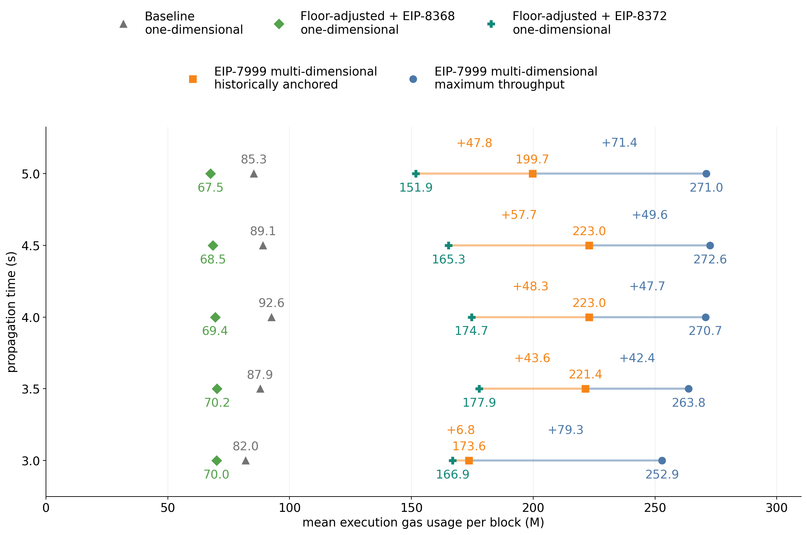

> Each point shows mean included metered execution gas per block across the same 32 workload paths under the 35-day vector. All five series use unrestricted state demand. Orange gap labels compare floor-adjusted + EIP-8372 with historically anchored EIP-7999; blue labels show the additional gain from maximum-throughput selection. All numerical labels are in millions of gas per block.

All points and table rows in this comparison use unrestricted demand. State caps appear only at the end of the sensitivity analysis.

### How a state disturbance reaches execution

The central comparison also raises a mechanism question: when state demand temporarily increases, how much does its fee response affect execution? We isolate this channel at four seconds by doubling the state-demand factor at onset and letting the additional component decay with a 120-block half-life. Each pulse path is compared with its identical no-pulse path over the following 600 blocks; all other sampled shocks remain unchanged.

Floor-adjusted + EIP-8372 loses **6.4M execution gas per block, or 3.7%**, over this window. The two centrally selected EIP-7999 designs change by less than **0.01%**. The common fee makes a state-demand disturbance raise execution's price as well; separate state pricing largely absorbs that disturbance in these tested designs. These results describe transmission under the maintained aggregate model. Execution remains exposed to its own demand conditions and to the data charge on its linked BAL. Additional pulses, effective-price responses, and recovery diagnostics are reported in the appendix.

## Sensitivity to demand assumptions

We compare how all three one-dimensional mechanisms respond to alternative elasticity estimates, looking at both metered execution and physical state growth. We then ask whether the execution gain from EIP-7999 survives. Each mechanism retains its central configuration at each propagation allocation; changing elasticities changes the demand response without retuning the design.

| Estimation window | $\epsilon_E$ | $\epsilon_D$ | $\epsilon_S$ |
|---:|---:|---:|---:|
| 21 days | 0.117067 | 0.201790 | 0.478438 |
| 35 days | 0.121160 | 0.229476 | 0.334864 |
| 60 days | 0.081668 | 0.204691 | 0.279676 |
| 75 days | 0.078511 | 0.201391 | 0.253556 |

All three elasticities change together. We retain $\lambda=0$, $\rho_A=1$, and the same 32 saved multiscale shock paths, including their original 35-day price adjustment. Equilibria are solved again under each alternative vector. The one-dimensional replay starts at its new equilibrium; EIP-7999 retains its cached cost-equivalent initialization. Both discard one burn-in day and measure seven days. This experiment isolates demand-curve sensitivity while holding the recovered workload fixed.

### How one-dimensional performance changes

For baseline and floor-adjusted + EIP-8368, we retain the central common limit, floor, and CPSB at each propagation allocation. These same configurations also maximize mean execution within their tested one-dimensional grids under every vector. For floor-adjusted + EIP-8372, each allocation retains its **own** 35-day-calibrated CPSB and state-limit scale. Its relative-price calibration is therefore tested without being recalibrated to each alternative demand estimate.

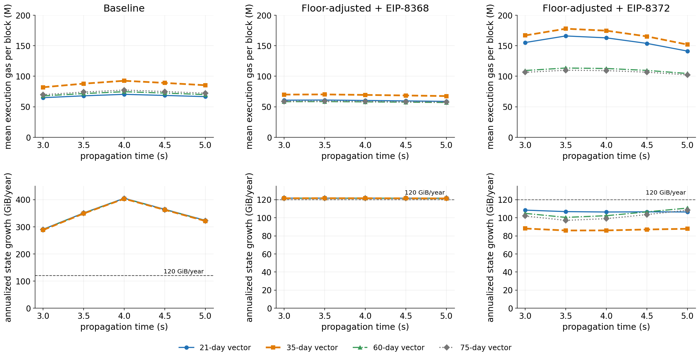

> Columns show baseline, floor-adjusted + EIP-8368, and floor-adjusted + EIP-8372. The top row shows mean included metered execution gas per block; the bottom row shows physical state growth annualized from mean included state bytes. Each point averages the same 32 seven-day paths under a complete elasticity vector, with 35 days emphasized. Execution panels share a vertical scale. The baseline state-growth panel uses a larger scale than the two adjusted panels; dashed lines mark 120 GiB/year. Closely overlapping state-growth curves are a result of the replay, not missing series.

**Baseline.** State determines the shared fee in 92.5%–98.6% of measured blocks across these settings. At a fixed propagation allocation, alternative elasticities change the fee required to sustain state near its target, while physical state growth changes little. Execution responds to that different common fee, producing a wider separation between its curves. Across all allocations and vectors, mean execution ranges from **64.9M to 92.6M**. State growth peaks near four seconds because that configuration has the largest common target while CPSB remains fixed.

**Floor-adjusted + EIP-8368.** Matching CPSB to the common target keeps the intended physical state budget approximately constant across propagation allocations. State remains the larger branch in 97.7%–99.2% of blocks, and realized growth stays within **121.4–121.7 GiB/year** across the four vectors. Execution still varies, from **57.0M to 70.2M**, because the shared fee needed to sustain this state activity depends on the elasticities. For both of these mechanisms, the 21-day execution elasticity is close to the central estimate, but the higher state elasticity supports a higher common fee and less execution. This is why the complete elasticity vector matters.

**Floor-adjusted + EIP-8372.** Its fixed relative-price calibration allows the branches' relative utilization to change more visibly. Mean execution falls from **151.9M–177.9M** centrally to **104.5M–113.5M** under 60 days and **102.3M–109.9M** under 75 days. Physical state growth rises from the central **86.0–88.1 GiB/year** to **97.1–110.7 GiB/year** across the alternative vectors. The state-byte target remains approximately 120 GiB/year throughout, so these differences reflect utilization of the same intended budget. State is the larger branch in 25.8%–27.9% of central blocks, versus 51.8%–73.3% under the alternative vectors.

The rising EIP-8372 state-growth curves toward five seconds under the 60- and 75-day vectors reflect changes in the fee path and branch competition, rather than a larger state-byte target. The relevant state price is CPSB times the shared fee; comparing the base fee alone across configurations can be misleading. The appendix diagnostic measures fees relative to each configuration's state-clearing level, shock–price co-movement, and exclusion. It also finds more frequent zero downward updates at the lower-fee 3.5-second configuration, consistent with integer rounding contributing to underutilization, without identifying the causal contribution of rounding.

### Does the execution advantage survive?

We subtract floor-adjusted + EIP-8372 execution from EIP-7999 execution **within each matched path at the same propagation allocation**, then average the 32 differences. The frozen historically anchored and maximum-throughput names refer to their central selection; alternative demand estimates may change their utilization and eligibility.

The table summarizes the additional execution relative to **floor-adjusted + EIP-8372**, with all limits, target pairs, calibration constants, and matched workload paths retaining their central values. EIP-7999 realizes approximately 120 GiB/year of state growth, whereas the one-dimensional benchmark realizes 86.0–110.7 GiB/year across these settings.

| Elasticity vector | Frozen historically anchored execution gain | Frozen maximum-throughput execution gain |
|---|---:|---:|
| 21-day | 19.1M–69.8M | 96.3M–124.6M |
| 35-day | 6.8M–57.7M | 85.9M–119.2M |
| 60-day | 19.9M–44.5M | 26.5M–45.4M |
| 75-day | 18.3M–39.3M | 23.1M–39.8M |

The ranges span five propagation allocations. **Mean execution gains are positive in all 40 comparisons**, but maximum-throughput gains are substantially smaller under the 60- and 75-day vectors. At the closest central comparison—three seconds, historically anchored—the mean gain is **6.8M**, with a simulated-week p05–p95 range of **−0.7M to 15.6M**. Some simulated weeks therefore favor the one-dimensional design.

Separate pricing reduces transmission of resource-specific disturbances through a common fee, as the state-pulse experiment illustrates. It does not make execution insensitive to demand estimates: the frozen E225/D60 design delivers **146.3M and 139.2M** under the 60- and 75-day vectors, versus **223.0M** centrally. The positive comparative gains and the sensitivity of absolute throughput are distinct findings.

### Caveat: state demand may saturate

Under unrestricted demand, the baseline's unshocked equilibrium requires state activity **6.06–8.43 times the historical anchor** across the five propagation allocations. Matching CPSB to the state-growth budget requires approximately **2.53 times** anchor activity in the adjusted benchmarks. These quantities extend well beyond the historical anchor, and the estimated local elasticities do not establish that state demand will keep expanding that far. We therefore test how the execution outcomes change if state demand saturates.

The comparison uses **three-second propagation under the 35-day vector**. We cap price-driven state expansion at $\kappa$ times its anchor while retaining the empirical shock, so individual blocks can still exceed that quantity. We re-solve equilibria and replay the same 32 paths, keeping each mechanism's limits, floor, CPSB, and EIP-8372 state-limit scale fixed.

| One-dimensional benchmark | Unrestricted execution | Execution with $1.5\times$ cap | Execution with $2\times$ cap |
|---|---:|---:|---:|
| Baseline | 82.0M | 145.9M | 144.9M |
| Floor-adjusted + EIP-8368 | 70.0M | 168.3M | 152.5M |
| Floor-adjusted + EIP-8372 | 166.9M | 173.5M | 169.8M |

**The extent to which state constrains execution depends strongly on the assumed state-demand tail, especially for baseline and EIP-8368.** With unrestricted demand, state is the bottleneck in most blocks and sustains a shared fee that suppresses regular activity. The 1.5x and 2x caps remove their state-controlled equilibria, sharply lower the shared fee, and allow substantially more execution. The low execution outcomes of these two benchmarks are therefore conditional on continued state-demand expansion.

**EIP-8372 improves much less because calibrated state pricing and normalized capacity have already reduced this constraint.** Under unrestricted demand at three seconds, the regular branch (execution plus data/floor gas) determines the fee in **72.1%** of blocks, versus **27.9%** for state. Its equilibrium fee stays approximately **88.22 wei** with or without the low caps; the remaining execution gain comes from reduced dynamic state pressure. State growth falls from **88.1 GiB/year** to **65.7** at $1.5\times$ and **78.7** at $2\times$, where state controls **20.4%** of blocks. A $3\times$ cap changes execution only from **166.9M to 167.0M**. The state-tail assumption therefore matters much more for baseline and EIP-8368 than for EIP-8372.

Against these capped EIP-8372 cases, the unchanged historically anchored EIP-7999 design, **E175/D36**, delivers **173.6M**: its mean advantage is **3.8M** at $2\times$ and only **0.17M** at $1.5\times$. The latter is effectively a throughput tie across these paths: EIP-7999 wins 15 of 32 paired weeks, and the p05–p95 weekly gain is **−5.2M to 5.9M**. The maximum-throughput **E300/D67.5** design delivers **252.9M**, retaining a much larger **79.5M–83.1M** mean gain over the two capped cases, positive in every paired path. It also reaches a hard limit in **30.7%** of blocks, versus **3.0%–3.5%** for capped EIP-8372; historically anchored EIP-7999 is at **1.8%**.

These are separate one-dimensional tail sensitivities against fixed, **unrestricted EIP-7999 references**, which realize approximately 120 GiB/year. They do not establish dominance under a common capped state-demand model. Exact capped dynamics also remain sensitive to the aggregate floor approximation when regular gas controls the fee. The appendix records physical state growth, fees, and the full cap set.

## Limitations and conclusion

**Block-level floor metering.** The floor-rate-specific multiplier reproduces the weighted historical mean of transaction-floor gas. Block-to-block floor exposure also depends on transaction composition and remaining execution headroom. Holding parent demand fixed, regular-gas metering errors have fewer opportunities to change the fee update when state is already the larger branch. They matter more after a state-demand cap makes regular gas controlling.

**Transaction-level demand feedback.** The static-data demand curve already responds to $m_D(F)b$. The model omits the extra execution and state-demand response of transactions affected by BAL-related floor charges. State dominance does not eliminate this limitation: if affected transactions create state, their response can change the controlling state branch itself. At fixed fees, the added charges can discourage their activity; the net equilibrium effect on execution after common-price and composition adjustments remains unidentified. The shared-fee execution estimates therefore have no established upper-bound interpretation.

**One-time state-price calibration.** The floor-adjusted + EIP-8372 experiment holds the regular-demand curve fixed when changing raw state pricing. Transaction participation, refunds, and floor exposure could also change in a transaction-level model. Regular gas drives most central calibrated updates, which makes the aggregate floor approximation especially relevant here. The experiment tests five inherited adjusted configurations, without optimizing a new common-limit surface or recalibrating CPSB to improve stochastic utilization. Integer counter and fee operations are implemented, while transaction quantities and uniform inclusion remain aggregate approximations. The reported equilibrium fees solve the smooth demand equations; integer EIP-1559 updates can sustain small deviations around those roots.

**Demand extrapolation.** The elasticities come from local historical variation. Both sustained expansion beyond the anchor and the assumed saturation of state demand are uncertain. The elasticity experiment changes the demand curves while preserving the original shock paths; it does not include uncertainty from re-estimating those paths. The separate state-tail sensitivity caps baseline and EIP-8368 at all five propagation allocations, and EIP-8372 at three seconds with its calibration frozen. EIP-7999 remains unrestricted, so that experiment does not compare mechanisms under a common capped tail. The main comparison leaves all five series unrestricted.

**Calibration and physical mapping.** The floor calibration uses 6,000 sampled blocks, while the shock construction uses 430,605 consecutive blocks and the 120-day daily anchor. Daily weighting aligns the calibration mean without recovering every change in transaction mix. Runtime BAL is a protocol meter with transaction-local repetition and some mandatory entries covered statically; a complete encoded-payload replay remains separate. The transfer ceiling uses the 221-byte physical construction. The propagation relation is an empirical p90 fit without an additional safety factor, so its capacity values are fit-implied ceilings.

With equal raw limits, state-budget matching sustains a common fee that limits execution. Demand-calibrated state pricing and normalized capacity remove that deterministic mismatch and substantially increase one-dimensional execution. Under fluctuating demand, the calibrated design still leaves both branches below target on average. The tested EIP-7999 configurations deliver more mean execution and realize more of the intended state-growth budget under all four fixed-design elasticity comparisons. The magnitude remains conditional on the demand curves, aggregate floor approximation, selected capacities, and workload. The comparison is therefore between a fixed calibrated relative-price schedule and independently adapting resource prices; the earlier equal-raw-limit result alone cannot establish the broader trade-off.

## Appendix: Transaction accounting and coverage

### Execution repricing

The execution replay applies the current EIP-8038 state-access prices and EIP-2780 intrinsic-gas paths to the observed transactions. Refunds are reconstructed across the full February–May 2026 anchor and the 20% cap is applied. Storage-write repricing remains the largest positive component, while EIP-2780 and the revised refund schedule offset part of the increase.

The resulting multiplier is:

$$
\boxed{m_E=1.447956.}
$$

This value remains fixed throughout the floor-metering-rate and CPSB experiments. Raising the floor changes $m_D(F)$, while changing CPSB changes $m_S$.

### Sample and counterfactual execution path

The floor calibration uses 50 deterministic blocks per day from February 1 through May 31, 2026: **6,000 blocks** and **1,899,748 transactions**. The transaction panel combines exact static-content counts, EIP-8279 runtime-meter components, transaction-specific EIP-8038 and EIP-2780 execution changes, and the calibrated refund correction. Full-period daily weights align the deterministic sample with the 120-day accounting anchor.

For transaction $j$, let $I_j^{2780}$ be the EIP-2780 intrinsic base, let the $C$ terms denote counted static content, let $N_{\mathrm{authorization},j}$ be the number of authorization tuples, and let $M_{j,\mathrm{runtime}}$ be the EIP-8279 runtime counter. At floor metering rate $F$, the successive floors are:

$$
\begin{aligned}
\Phi_j^{7976+7981}(F)
&=I_j^{2780}+F\left(C_{\mathrm{calldata},j}+C_{\mathrm{access\ list},j}\right),\\
\Phi_j^{8131}(F)
&=\Phi_j^{7976+7981}(F)+F\left(C_{\mathrm{authorization},j}+C_{\mathrm{blob\ hash},j}\right),\\
\Phi_{j,\mathrm{static}}^{8279}(F)
&=\Phi_j^{8131}(F)+51F N_{\mathrm{authorization},j},\\
\Phi_j^{8279}(F)
&=\Phi_{j,\mathrm{static}}^{8279}(F)+F M_{j,\mathrm{runtime}}.
\end{aligned}
$$

EIP-8131 counts the 108-byte signed authorization tuple. EIP-8279 adds another 51 statically known BAL bytes per authorization: 20 bytes for the authority address, 23 bytes for delegation code, and 8 bytes for the nonce. The static term is included before runtime metering because authorization processing occurs before ordinary EVM execution.

Let $E_j$ be repriced regular execution gas after EIP-8038 and EIP-2780. EIP-8037 state gas occupies the separate state branch and is excluded from this comparison. Metered regular-branch gas is:

$$
G_j^k(F)=\max\left(E_j,\Phi_j^k(F)\right),
\qquad k\in\{7976+7981,8131,8279\}.
$$

The maximum is applied transaction by transaction. This preserves the fact that execution headroom in one transaction cannot cover the floor deficit of another transaction.

The runtime reconstruction follows EIP-8279's trigger structure. Cold accesses and value-bearing calls inside reverted frames remain observable. Xatu's final storage-diff table cannot recover storage-value bytes written inside a reverted frame, so the reconstruction can understate that specific part of EIP-8279's intentional runtime over-counting.

### Floor activation at 96 gas per byte

The highest calibrated price is needed only for the largest candidate under the three-second propagation budget. Its transaction decomposition is:

| Class | Transactions | Share of all transactions | Share of runtime BAL bytes | Share of EIP-8279 uplift |
|---|---:|---:|---:|---:|
| Already floor-bound under static EIP-8131 | 44,791 | 2.36% | 4.83% | **53.02%** |
| Close to the static floor and pushed across by runtime BAL | 13,820 | 0.73% | 1.09% | **9.50%** |
| Newly floor-bound primarily because of deployed code | 704 | 0.04% | 0.80% | **5.82%** |
| Newly floor-bound through other non-code BAL | 69,656 | 3.67% | 8.63% | **31.66%** |
| Unaffected | 1,770,777 | 93.21% | 84.63% | 0.00% |

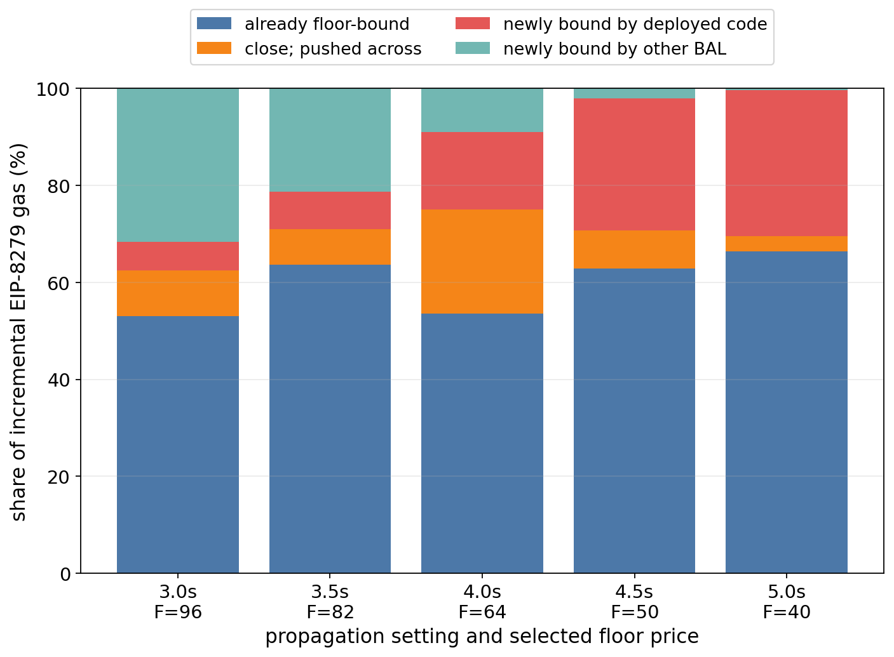

> At 96 gas per byte, affected transactions represent 6.79% of the sample and carry 15.37% of runtime BAL bytes. Transactions already on or close to the static floor contribute 62.52% of the runtime-BAL uplift.

The uplift averages **1.107M weighted gas per block**, or **2.75%** of counterfactual regular-branch gas. State-creating transactions contribute **64.51%** of the uplift, while the highest static-content decile contributes **87.16%**.

### Execution-side coverage of runtime BAL

A cold account access remains covered at the calibrated prices because a 20-byte entry contributes 1,920 floor gas at $F=96$, below its 3,000-gas execution charge. A first cold change to a storage slot contributes 64 runtime bytes—32 for the key and 32 for the changed value—against $2{,}100+10{,}000=12{,}100$ execution gas, so it also remains covered. Pure cold storage reads create the main non-code coverage gap above 65.625 gas per byte.

| Transaction group | BAL-carrying transactions | Non-code BAL-floor gas at $F=96$ | Paired execution gas | Aggregate coverage ratio | Non-code failures |
|---|---:|---:|---:|---:|---:|
| All BAL-carrying transactions | 996,163 | 68.19B | 99.22B | **1.46×** | 44,086 |
| State-creating BAL-carrying transactions | 401,079 | 33.15B | 50.06B | **1.51×** | **3,514** |
| BAL-carrying transactions without state creation | 595,084 | 35.05B | 49.16B | **1.40×** | 40,572 |

Aggregate paired execution charges exceed non-code runtime-BAL floor gas in every group. Transaction-level failures still occur because transactions contain different mixtures of reads, writes, account accesses, and static content. Including deployed code raises the state-creating failure count from 3,514 to 4,243 because EIP-8037 moves code-deposit gas to the state branch.

## Appendix: Full state-demand-tail results

### Selected state-tail diagnostics

The unrestricted mechanism comparison uses unrestricted isoelastic demand. In practice, state activity may saturate before reaching the expansion implied by those curves. The baseline configurations require state activity **6.06–8.43 times the historical anchor** in equilibrium, while floor-adjusted + EIP-8368 requires **2.53 times**. These expansions extrapolate elasticity estimates into an unobserved demand range.

To show how the configuration metrics depend on that extrapolation, we cap the price-driven expansion while preserving the empirical state shock:

$$
q_{S,t}^{\mathrm{cap}}(b_t)
=s_{S,t}q_S^0
\min\left[\left(\frac{m_Sb_t}{p^0}\right)^{-\epsilon_S},\kappa\right].
$$

A positive shock can still take a block above $\kappa q_S^0$. We test caps of $1.5\times$, $2\times$, $3\times$, $4\times$, and $5\times$, alongside unrestricted demand, at all five propagation allocations for baseline and floor-adjusted + EIP-8368, and at three seconds for floor-adjusted + EIP-8372. For EIP-8372, $m_S$ in the demand equation is the **raw state-price multiplier**; normalization applies only to capacity accounting. The 35-day elasticity vector, recovered shock paths, and each configuration's physical and pricing constants stay fixed. EIP-7999 is not capped or reselected. These rows are behavioral sensitivities outside the central comparison.

| Benchmark               | State-demand tail | Equilibrium bottleneck | Equilibrium fee | Mean execution | State growth (GiB/year) |
| ----------------------- | ----------------- | ---------------------- | --------------: | -------------: | ----------------------: |
| Baseline, 3.0s | 1.5x | Regular | 552 wei | 145.9M | 71.4 |
| Baseline, 3.0s | 2x | Regular | 552 wei | 144.9M | 94.5 |
| Baseline, 3.0s | 3x–5x | Regular | 552 wei | 124.5M–140.9M | 139.0–213.5 |
| Baseline, 3.0s | unrestricted | State | 86,981 wei | 82.0M | 288.1 |
| Floor-adjusted + EIP-8368, 3.0s | 1.5x | Regular | 88.22 wei | 168.3M | 68.4 |
| Floor-adjusted + EIP-8368, 3.0s | 2x | Regular | 88.22 wei | 152.5M | 86.9 |
| Floor-adjusted + EIP-8368, 3.0s | 3x | State | 332,742 wei | 110.1M | 110.7 |
| Floor-adjusted + EIP-8368, 3.0s | unrestricted | State | 332,742 wei | 70.0M | 121.6 |
| Floor-adjusted + EIP-8372, 3.0s | 1.5x | Regular | 88.22 wei | 173.5M | 65.7 |
| Floor-adjusted + EIP-8372, 3.0s | 2x | Regular | 88.22 wei | 169.8M | 78.7 |
| Floor-adjusted + EIP-8372, 3.0s | 3x | Both | 88.22 wei | 167.0M | 87.6 |
| Floor-adjusted + EIP-8372, 3.0s | unrestricted | Both | 88.22 wei | 166.9M | 88.1 |

All rows above now use three-second propagation: baseline has a 359.6M common limit, while the two floor-adjusted benchmarks have a 534.0M common limit. Ranges summarize the 3x–5x baseline cases, rather than uncertainty intervals. “Both” denotes the calibrated EIP-8372 equilibrium where the continuous branch quantities agree with the target within the integer-calibration tolerance. Its 1.5x and 2x caps leave state below target at essentially the same fee; the negligible change before rounding is less than 0.001 wei. In contrast, removing state as the equilibrium bottleneck sharply lowers the fee for the two equal-raw-limit benchmarks.

### Baseline state saturation

The elasticity estimates are local to the historical operating point, while the unrestricted baseline equilibria require state activity 6.06–8.43 times the anchor. We therefore cap only the expansion attributed to the lower price:

$$
q_{S,t}^{\mathrm{cap}}(b_t)
=s_{S,t}q_S^0
\min\left[
\left(\frac{m_Sb_t}{p^0}\right)^{-\epsilon_S},
\kappa
\right].
$$

The empirical state shock $s_{S,t}$ remains active, so a realized block can exceed $\kappa q_S^0$. The cap changes the assumed price response rather than truncating every block at a fixed quantity.

| Propagation | State tail | Equilibrium branch | Equilibrium fee | Mean metered execution | Mean data/floor gas | Mean state gas | State growth | Blocks at common limit |
|---:|---:|---|---:|---:|---:|---:|---:|---:|
| 3.0s | $1.5\times$ | Regular | 552 wei | 145.9M | 34.0M | 44.6M | 71.4 GiB | 2.56% |
|  | $2\times$ | Regular | 552 wei | 144.9M | 33.7M | 59.1M | 94.5 GiB | 2.64% |
|  | $3\times$ | Regular | 552 wei | 140.9M | 32.2M | 86.9M | 139.0 GiB | 3.05% |
|  | $4\times$ | Regular | 552 wei | 133.9M | 29.7M | 112.1M | 179.4 GiB | 3.92% |
|  | $5\times$ | Regular | 552 wei | 124.5M | 26.4M | 133.5M | 213.5 GiB | 4.94% |
|  | Unrestricted | State | 86,981 wei | 82.0M | 12.0M | 180.1M | 288.1 GiB | 7.99% |
| 3.5s | $1.5\times$ | Regular | 150 wei | 169.7M | 45.1M | 44.7M | 71.6 GiB | 2.30% |
|  | $2\times$ | Regular | 150 wei | 168.9M | 44.8M | 59.4M | 95.0 GiB | 2.34% |
|  | $3\times$ | Regular | 150 wei | 166.3M | 43.7M | 87.9M | 140.6 GiB | 2.58% |
|  | $4\times$ | Regular | 150 wei | 161.3M | 41.7M | 114.9M | 183.8 GiB | 3.14% |
|  | $5\times$ | Regular | 150 wei | 153.6M | 38.6M | 139.5M | 223.2 GiB | 4.02% |
|  | Unrestricted | State | 49,756 wei | 87.9M | 13.7M | 218.2M | 349.0 GiB | 8.17% |
| 4.0s | $1.5\times$ | Regular | 56 wei | 187.0M | 54.2M | 44.8M | 71.7 GiB | 1.86% |
|  | $2\times$ | Regular | 56 wei | 186.5M | 54.0M | 59.5M | 95.3 GiB | 1.89% |
|  | $3\times$ | Regular | 56 wei | 184.7M | 53.2M | 88.4M | 141.4 GiB | 2.06% |
|  | $4\times$ | Regular | 56 wei | 181.1M | 51.6M | 116.3M | 186.0 GiB | 2.47% |
|  | $5\times$ | Regular | 56 wei | 175.2M | 49.0M | 142.5M | 227.9 GiB | 3.15% |
|  | Unrestricted | State | 32,513 wei | 92.6M | 15.1M | 252.2M | 403.4 GiB | 8.27% |
| 4.5s | $1.5\times$ | Regular | 116 wei | 174.3M | 47.5M | 44.8M | 71.6 GiB | 2.20% |
|  | $2\times$ | Regular | 116 wei | 173.6M | 47.2M | 59.4M | 95.1 GiB | 2.24% |
|  | $3\times$ | Regular | 116 wei | 171.3M | 46.2M | 88.0M | 140.8 GiB | 2.47% |
|  | $4\times$ | Regular | 116 wei | 166.6M | 44.2M | 115.3M | 184.4 GiB | 2.98% |
|  | $5\times$ | Regular | 116 wei | 159.4M | 41.3M | 140.4M | 224.6 GiB | 3.81% |
|  | Unrestricted | State | 44,535 wei | 89.1M | 14.0M | 226.6M | 362.5 GiB | 8.20% |
| 5.0s | $1.5\times$ | Regular | 262 wei | 159.4M | 40.1M | 44.7M | 71.5 GiB | 2.44% |
|  | $2\times$ | Regular | 262 wei | 158.5M | 39.8M | 59.3M | 94.8 GiB | 2.50% |
|  | $3\times$ | Regular | 262 wei | 155.3M | 38.5M | 87.5M | 140.0 GiB | 2.80% |
|  | $4\times$ | Regular | 262 wei | 149.4M | 36.3M | 113.9M | 182.2 GiB | 3.49% |
|  | $5\times$ | Regular | 262 wei | 140.9M | 33.1M | 137.2M | 219.5 GiB | 4.44% |
|  | Unrestricted | State | 63,308 wei | 85.3M | 12.9M | 200.9M | 321.4 GiB | 8.10% |

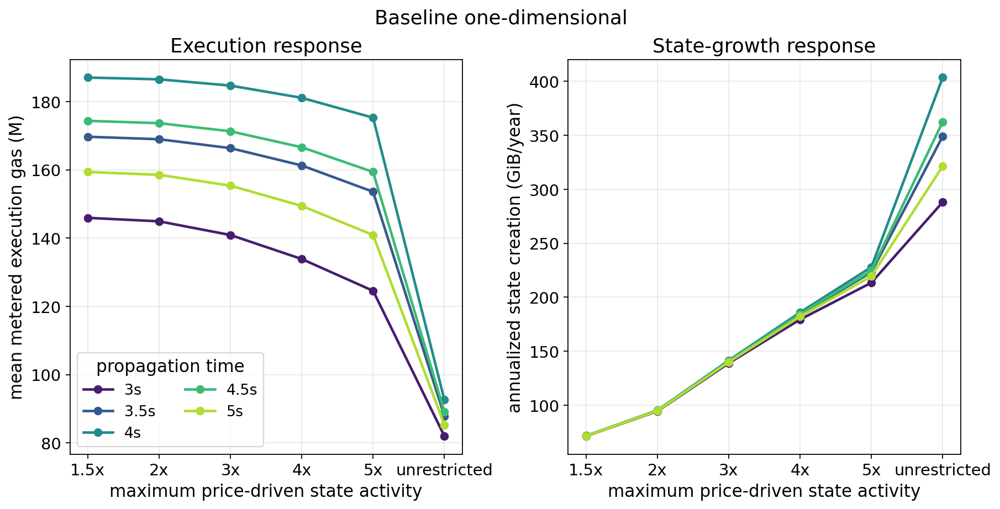

> Caps from $1.5\times$ through $5\times$ leave the unshocked equilibrium on the regular branch. Their equilibrium fee is therefore the same within a propagation setting, although their dynamic outcomes differ because positive state shocks place different pressure on the shared branch.

### Floor-adjusted + EIP-8368 state saturation

The floor-adjusted + EIP-8368 equilibrium needs 2.53 times anchor state activity. The $1.5\times$ and $2\times$ caps lie below that quantity and move the equilibrium to the regular branch. Caps of $3\times$ or more leave the unshocked fee and branch unchanged, but they still reduce state pressure in blocks with positive state-demand shocks.

The lower floor has a larger effect under the $2\times$ cap. At 4.5 seconds, reducing $F$ from 64 to 50 lowers the equilibrium fee from 116 to 92 wei and raises mean metered execution from 147.4M to 150.4M. At five seconds, reducing $F$ to 40 lowers the fee from 262 to 191 wei and raises execution from 135.3M to 139.6M.

| Propagation | State tail | Equilibrium branch | Equilibrium fee | Mean metered execution | Mean data/floor gas | Mean state gas | State growth | Blocks at common limit |
|---:|---:|---|---:|---:|---:|---:|---:|---:|
| 3.0s | $1.5\times$ | Regular | 88 wei | 168.3M | 73.0M | 152.3M | 68.4 GiB | 3.62% |
|  | $2\times$ | Regular | 88 wei | 152.5M | 63.0M | 193.4M | 86.9 GiB | 5.11% |
|  | $3\times$ | State | 332,742 wei | 110.1M | 37.4M | 246.2M | 110.7 GiB | 7.43% |
|  | $4\times$ | State | 332,742 wei | 82.1M | 21.2M | 265.3M | 119.2 GiB | 8.29% |
|  | $5\times$ | State | 332,742 wei | 72.4M | 15.8M | 269.5M | 121.1 GiB | 8.45% |
|  | Unrestricted | State | 332,742 wei | 70.0M | 14.4M | 270.5M | 121.6 GiB | 8.47% |
| 3.5s | $1.5\times$ | Regular | 48 wei | 177.5M | 66.0M | 157.0M | 68.5 GiB | 3.31% |
|  | $2\times$ | Regular | 48 wei | 160.6M | 56.9M | 199.4M | 87.0 GiB | 4.89% |
|  | $3\times$ | State | 323,038 wei | 114.3M | 33.1M | 253.9M | 110.8 GiB | 7.40% |
|  | $4\times$ | State | 323,038 wei | 83.7M | 18.2M | 273.5M | 119.3 GiB | 8.31% |
|  | $5\times$ | State | 323,038 wei | 73.0M | 13.1M | 277.8M | 121.2 GiB | 8.46% |
|  | Unrestricted | State | 323,038 wei | 70.2M | 11.8M | 278.8M | 121.6 GiB | 8.49% |
| 4.0s | $1.5\times$ | Regular | 56 wei | 174.5M | 48.8M | 142.7M | 68.5 GiB | 3.23% |
|  | $2\times$ | Regular | 56 wei | 157.8M | 42.0M | 181.3M | 87.0 GiB | 4.81% |
|  | $3\times$ | State | 355,342 wei | 112.4M | 24.5M | 230.8M | 110.8 GiB | 7.35% |
|  | $4\times$ | State | 355,342 wei | 82.5M | 13.4M | 248.5M | 119.3 GiB | 8.28% |
|  | $5\times$ | State | 355,342 wei | 72.1M | 9.7M | 252.5M | 121.2 GiB | 8.45% |
|  | Unrestricted | State | 355,342 wei | 69.4M | 8.8M | 253.3M | 121.6 GiB | 8.48% |
| 4.5s | $1.5\times$ | Regular | 92 wei | 166.2M | 38.2M | 128.4M | 68.5 GiB | 3.33% |
|  | $2\times$ | Regular | 92 wei | 150.4M | 32.9M | 163.1M | 87.0 GiB | 4.85% |
|  | $3\times$ | State | 394,824 wei | 108.2M | 19.3M | 207.5M | 110.7 GiB | 7.31% |
|  | $4\times$ | State | 394,824 wei | 80.5M | 10.9M | 223.5M | 119.2 GiB | 8.23% |
|  | $5\times$ | State | 394,824 wei | 71.0M | 8.1M | 227.1M | 121.1 GiB | 8.41% |
|  | Unrestricted | State | 394,824 wei | 68.5M | 7.3M | 227.9M | 121.5 GiB | 8.44% |
| 5.0s | $1.5\times$ | Regular | 191 wei | 153.8M | 30.5M | 114.1M | 68.5 GiB | 3.49% |
|  | $2\times$ | Regular | 191 wei | 139.6M | 26.3M | 144.8M | 86.9 GiB | 4.90% |
|  | $3\times$ | State | 444,177 wei | 102.2M | 15.8M | 184.2M | 110.5 GiB | 7.25% |
|  | $4\times$ | State | 444,177 wei | 77.9M | 9.3M | 198.4M | 119.0 GiB | 8.16% |
|  | $5\times$ | State | 444,177 wei | 69.6M | 7.1M | 201.6M | 120.9 GiB | 8.35% |
|  | Unrestricted | State | 444,177 wei | 67.5M | 6.6M | 202.3M | 121.4 GiB | 8.39% |

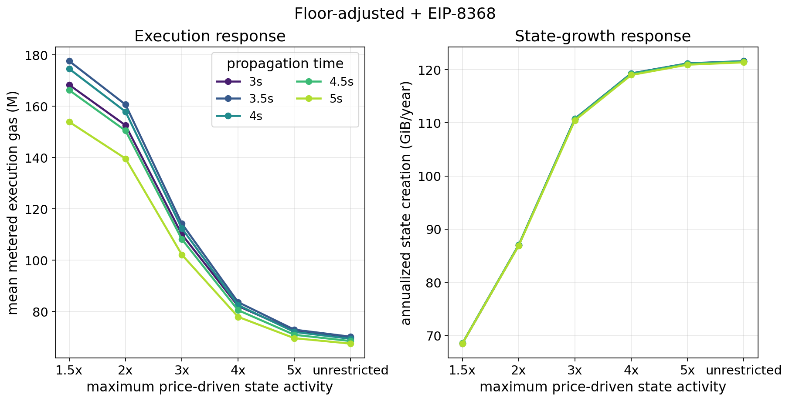

> The $1.5\times$ and $2\times$ caps change the equilibrium branch and sharply lower the common fee. Their precise execution and congestion values are more sensitive to the aggregate floor approximation because regular gas now controls the equilibrium and more fee updates.

The two intermediate counterfactuals—fixed floor with matched CPSB and adjusted floor with fixed CPSB—remain in the appendix. They isolate why the floor adjustment and state-growth matching have opposing effects.

### Floor-adjusted + EIP-8372 state saturation at three seconds

This extension uses the existing 534.0M common limit, 267.0M target, 96 gas-per-byte floor, CPSB of 20,538,083, and integer percentage scale of 377,122. These constants were calibrated under unrestricted 35-day demand and remain fixed across caps. Each row re-solves the capped equilibrium, initializes at its ceiling in integer wei, discards 7,200 burn-in blocks, and measures 50,400 blocks on each of the same 32 multiscale paths. The unrestricted control reproduces the original per-path metrics to numerical precision.

| State-demand tail | Equilibrium fee | Mean execution | State growth (GiB/year) | State as bottleneck | Hard-limit blocks | Fee variation |
|---|---:|---:|---:|---:|---:|---:|
| 1.5x | 88.22 wei | 173.5M | 65.7 | 12.84% | 3.01% | 0.0496 |
| 2x | 88.22 wei | 169.8M | 78.7 | 20.43% | 3.54% | 0.0510 |
| 3x | 88.22 wei | 167.0M | 87.6 | 27.39% | 4.01% | 0.0521 |
| 4x | 88.22 wei | 166.9M | 88.1 | 27.89% | 4.05% | 0.0522 |
| 5x | 88.22 wei | 166.9M | 88.1 | 27.89% | 4.05% | 0.0522 |
| Unrestricted | 88.22 wei | 166.9M | 88.1 | 27.89% | 4.05% | 0.0522 |

State as bottleneck counts included normalized state gas strictly above included regular gas, excluding ties. Fee variation is the within-path standard deviation of consecutive log fee changes, averaged across paths. The price-response cap is active in **84.34%, 57.58%, 8.59%, 0.05%, and 0.00%** of measured blocks for the five finite caps respectively. A 3x cap can therefore matter during dynamic operation even though the unshocked demand expansion is only about 2.53x. It binds when lower fees would otherwise induce a larger price response; it does not truncate the empirical shock itself. No measured block activates the 5x cap in this replay.

The deterministic fee is almost unchanged, but the dynamic fee path is not. Mean shared fees fall from 355.7 wei unrestricted to 344.3 wei at 2x and 318.1 wei at 1.5x; regular utilization rises from 89.16% to 91.06% and 93.45%. This is consistent with reduced state pressure allowing more regular activity, without implying that stochastic means equal the unshocked equilibrium.

The following gains subtract capped one-dimensional execution from the **fixed unrestricted** EIP-7999 references within each matched week. E175/D36 delivers 173.6M execution and E300/D67.5 delivers 252.9M. Neither reference is reselected. The p05–p95 column describes variation across simulated weeks, not a confidence interval for the estimated mean.

| EIP-8372 state cap | E175/D36 mean gain | E175/D36 weekly p05–p95 | Weeks E175/D36 delivers more | E300/D67.5 mean gain |
|---|---:|---:|---:|---:|
| 1.5x | 0.17M | −5.2M to 5.9M | 15/32 | 79.5M |
| 2x | 3.84M | −2.6M to 10.4M | 26/32 | 83.1M |
| 3x | 6.64M | −0.7M to 15.3M | 30/32 | 85.9M |
| 4x | 6.79M | −0.7M to 15.6M | 30/32 | 86.1M |
| 5x | 6.79M | −0.7M to 15.6M | 30/32 | 86.1M |
| Unrestricted | 6.79M | −0.7M to 15.6M | 30/32 | 86.1M |

E300/D67.5 delivers more execution in all 32 paired paths for every cap, with considerably more hard-limit operation. E175/D36's small mean lead under the 1.5x cap is not a stable weekly ranking. The state-growth outcomes also differ: both EIP-7999 references remain near 120 GiB/year. A symmetric capped-tail comparison would require separately applying the same behavioral assumption to EIP-7999.

## Appendix: Full unrestricted mechanism comparison

All five benchmark series use unrestricted demand. Fees are reported in wei; annualized state growth uses each row's own CPSB. The state-gas column reports normalized gas for floor-adjusted + EIP-8372. Physical state growth provides the common quantity comparison across different state-pricing coefficients.

| Propagation | Design | Configuration | Equilibrium fee(s) | Mean execution | Mean data/floor | Mean state | State growth | Hard-limit blocks |
|---:|---|---|---|---:|---:|---:|---:|---:|
| 3.0s | EIP-7999 maximum throughput | E300/D67.5 | $b_E$=1.00; $b_D$=46.42; $b_S$=1,184,471 wei | 252.9M | 67.4M | 75.0M | 120.0 GiB | 30.68% |
|  | EIP-7999 balanced (historically anchored) | E175/D36 | $b_E$=69.51; $b_D$=951.28; $b_S$=1,184,464 wei | 173.6M | 36.0M | 75.0M | 120.0 GiB | 1.75% |
|  | Baseline | G359.6 | 86,981 wei | 82.0M | 12.0M | 180.1M | 288.1 GiB | 7.99% |
|  | Floor-adjusted + EIP-8368 | G534.0 | 332,742 wei | 70.0M | 14.4M | 270.5M | 121.6 GiB | 8.47% |
|  | Floor-adjusted + EIP-8372 | G534.0 | 88.22 wei | 166.9M | 71.2M | 196.1M | 88.1 GiB | 4.05% |
| 3.5s | EIP-7999 maximum throughput | E300/D77 | $b_E$=1.00; $b_D$=23.92; $b_S$=1,184,471 wei | 263.8M | 76.8M | 75.0M | 120.0 GiB | 25.29% |
|  | EIP-7999 balanced (historically anchored) | E225/D52.5 | $b_E$=7.13; $b_D$=152.14; $b_S$=1,184,470 wei | 221.4M | 52.5M | 75.0M | 120.0 GiB | 4.78% |
|  | Baseline | G433.6 | 49,756 wei | 87.9M | 13.7M | 218.2M | 349.0 GiB | 8.17% |
|  | Floor-adjusted + EIP-8368 | G550.0 | 323,038 wei | 70.2M | 11.8M | 278.8M | 121.6 GiB | 8.49% |
|  | Floor-adjusted + EIP-8372 | G550.0 | 48.37 wei | 177.9M | 65.5M | 197.0M | 86.0 GiB | 3.65% |
| 4.0s | EIP-7999 maximum throughput | E300/D80 | $b_E$=1.00; $b_D$=19.73; $b_S$=1,184,471 wei | 270.7M | 79.8M | 75.0M | 120.0 GiB | 17.79% |
|  | EIP-7999 balanced (historically anchored) | E225/D60 | $b_E$=11.01; $b_D$=73.06; $b_S$=1,184,471 wei | 223.0M | 60.0M | 75.0M | 120.0 GiB | 4.82% |
|  | Baseline | G500.0 | 32,513 wei | 92.6M | 15.1M | 252.2M | 403.4 GiB | 8.27% |
|  | Floor-adjusted + EIP-8368 | G500.0 | 355,342 wei | 69.4M | 8.8M | 253.3M | 121.6 GiB | 8.48% |
|  | Floor-adjusted + EIP-8372 | G500.0 | 56.37 wei | 174.7M | 48.3M | 179.2M | 86.0 GiB | 3.56% |
| 4.5s | EIP-7999 maximum throughput | E300/D90 | $b_E$=1.00; $b_D$=10.88; $b_S$=1,184,471 wei | 272.6M | 89.3M | 75.0M | 120.0 GiB | 19.53% |
|  | EIP-7999 balanced (historically anchored) | E225/D60 | $b_E$=11.01; $b_D$=73.06; $b_S$=1,184,471 wei | 223.0M | 60.0M | 75.0M | 120.0 GiB | 4.52% |
|  | Baseline | G450.0 | 44,535 wei | 89.1M | 14.0M | 226.6M | 362.5 GiB | 8.20% |
|  | Floor-adjusted + EIP-8368 | G450.0 | 394,824 wei | 68.5M | 7.3M | 227.9M | 121.5 GiB | 8.44% |
|  | Floor-adjusted + EIP-8372 | G450.0 | 92.21 wei | 165.3M | 37.3M | 163.2M | 87.0 GiB | 3.67% |
| 5.0s | EIP-7999 maximum throughput | E300/D90 | $b_E$=1.00; $b_D$=10.88; $b_S$=1,184,471 wei | 271.0M | 89.4M | 75.0M | 120.0 GiB | 21.68% |
|  | EIP-7999 balanced (historically anchored) | E200/D67.5 | $b_E$=36.85; $b_D$=35.48; $b_S$=1,184,471 wei | 199.7M | 67.5M | 75.0M | 120.0 GiB | 4.78% |
|  | Baseline | G400.0 | 63,308 wei | 85.3M | 12.9M | 200.9M | 321.4 GiB | 8.10% |
|  | Floor-adjusted + EIP-8368 | G400.0 | 444,177 wei | 67.5M | 6.6M | 202.3M | 121.4 GiB | 8.39% |
|  | Floor-adjusted + EIP-8372 | G400.0 | 190.52 wei | 151.9M | 29.4M | 146.4M | 87.8 GiB | 3.80% |

### Execution and state-growth curves

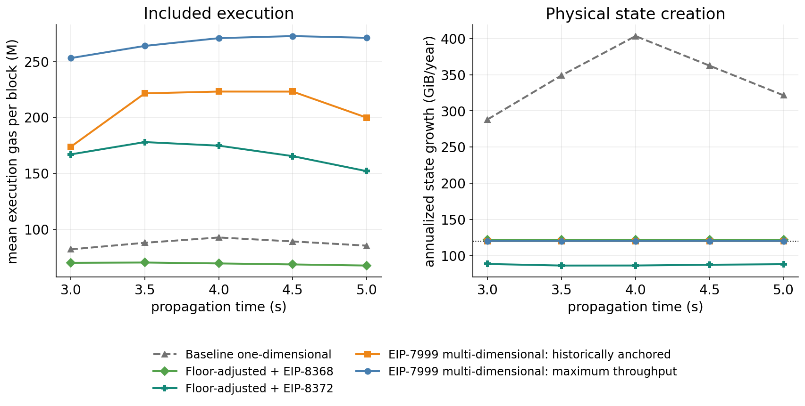

> The five unrestricted series use the same propagation allocation and workload paths under the central 35-day vector. The right panel reports physical state creation because raw state gas changes units with the calibrated CPSB. EIP-7999's two state-growth curves overlap near 120 GiB/year.

At four seconds, historically anchored EIP-7999 delivers **223.0M**, compared with **174.7M** under the calibrated one-dimensional design: a **48.3M** mean execution gain. It also realizes approximately **120.0 GiB/year**, compared with **86.0 GiB/year**. The capacity budgets are approximately aligned, but their realized state creation differs. The earlier 153.6M execution gap against the equal-raw-limit adjustment therefore overstates the gap against this better-calibrated reference.

## Appendix: Elasticity outcomes and fixed central configurations

### Scope of the broader elasticity experiment

For baseline and floor-adjusted + EIP-8368, the admissible common-limit grid contains 177 configurations across five propagation allocations, evaluated under each complete vector, giving 708 configuration–calibration combinations. Limits, floor metering rate, CPSB, and metering multipliers stay unchanged at a fixed configuration. The corresponding EIP-7999 target surfaces allow the maximum-throughput and historically anchored selections to be made again using the original eligibility conditions. This tests attainable performance after retuning the design; the main text instead tests frozen central designs against EIP-8372.

### How one-dimensional performance changes

For baseline and floor-adjusted + EIP-8368, we select the tested common limit with the highest mean included execution at each propagation allocation. In these results, the selected limit also happens to be the largest admissible tested limit under every vector. The third panel shows floor-adjusted + EIP-8372 at its frozen central configurations.

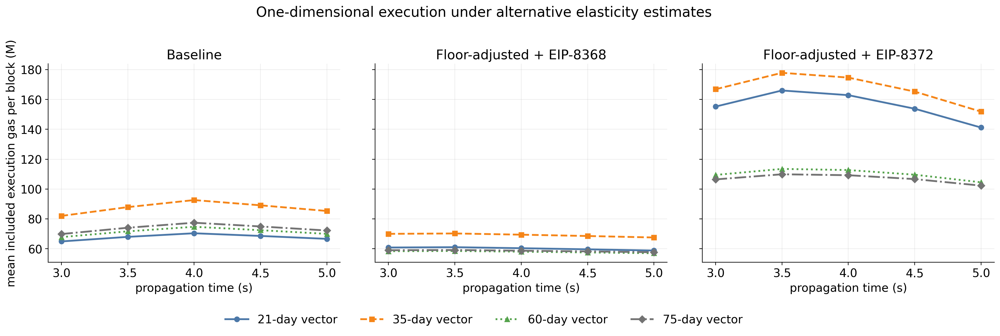

> Each line uses a complete elasticity vector. Points show mean included execution across 32 paths. The first two panels use reselected common limits; the third holds the central EIP-8372 calibration fixed. Line identities are reused in the state-growth, equilibrium-fee, and execution-gain figures.

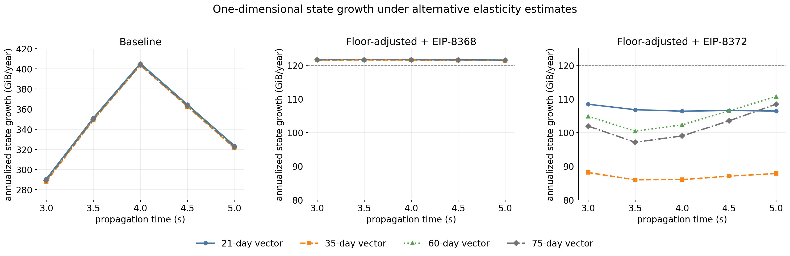

> State growth is annualized from mean included state bytes across the same 32 paths and configurations as the execution figure. The baseline panel has a different vertical range; the two floor-adjusted panels share the same scale. Dashed horizontal lines mark 120 GiB/year.

For the two equal-raw-limit benchmarks, the elasticity curves nearly overlap: alternative demand estimates mainly change the fee needed to sustain state usage near the controlling target. State growth remains **121.4–121.7 GiB/year** in the floor-adjusted + EIP-8368 benchmark. The demand-calibrated floor-adjusted + EIP-8372 benchmark is more sensitive: its central growth is **86.0–88.1 GiB/year**, compared with **97.1–110.7 GiB/year** across the alternative vectors and propagation allocations. Its fixed relative-price calibration therefore changes how much state capacity is used when the demand estimates change.

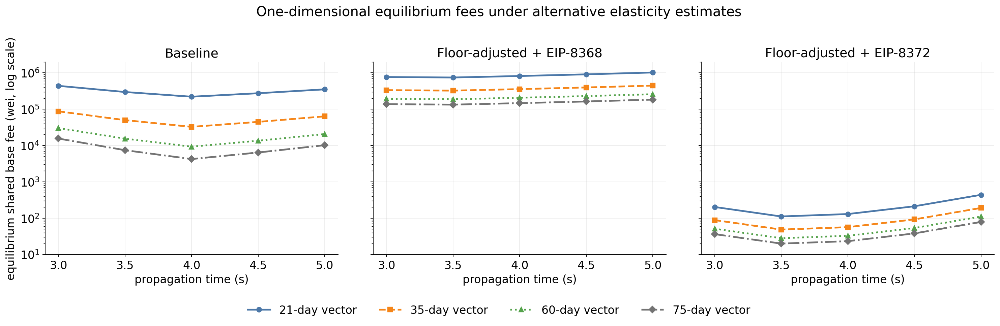

> The same four vectors are shown on a common logarithmic fee axis, in wei. Each point is the solved unshocked equilibrium shared base fee; the mean fee in the dynamic replay can differ. The floor-adjusted + EIP-8372 panel retains its centrally calibrated constants when solving each alternative equilibrium.

Similar state-growth outcomes can require very different fees. At 3.5 seconds, the floor-adjusted + EIP-8368 equilibrium fee ranges from **132,885 wei** under the 75-day vector to **741,771 wei** under the 21-day vector, while simulated state growth stays near 122 GiB/year. With the floor-adjusted + EIP-8372 constants frozen, the corresponding fees are **19.90, 28.00, 48.37, and 111.07 wei** for the 75-, 60-, 35-, and 21-day vectors.

For the two equal-raw-limit families, state controls the unshocked equilibrium in all 40 selected settings. In the dynamic replay, it is the larger branch in **92.5%–98.6%** of baseline blocks and **97.7%–99.2%** of floor-adjusted + EIP-8368 blocks. Thus, the alternative estimates change the common fee and delivered execution substantially without changing the prevailing bottleneck in these two families.

Across propagation times and vectors, baseline execution ranges from **64.9M to 92.6M**; floor-adjusted + EIP-8368 execution ranges from **57.0M to 70.2M**. The throughput-maximizing allocation remains four seconds for baseline and 3.5 seconds for floor-adjusted + EIP-8368. The 21-day vector illustrates why the whole vector matters: its execution elasticity is close to the 35-day estimate, but its higher state elasticity supports a much higher shared fee, leaving less execution. Equilibrium fees, branch frequencies, state growth, and fee variation for every selected setting are reported in the appendix.

### Reselecting designs under each elasticity vector

A second experiment allows target and common-limit selection to adapt to each elasticity vector. Here, we compare each reselected EIP-7999 design with the floor-adjusted + EIP-8368 benchmark at the **same propagation time and under the same elasticity vector**. This comparison uses the existing full design surfaces for those mechanisms; EIP-8372 retains the fixed-calibration test above. For selection rule $c$, the mean execution gain is

$
\Delta_E^{(w,c)}(\tau)
=
\overline g_E^{7999,(w,c)}(\tau)
-
\overline g_E^{\mathrm{adjusted},(w)}(\tau),
$

where $w$ identifies the elasticity vector and $\tau$ the propagation allocation. The floor-adjusted + EIP-8368 benchmark provides an approximately matched-state-growth reference for this reselected comparison: **121.4–121.7 GiB/year**, versus EIP-7999's approximately **120 GiB/year**.

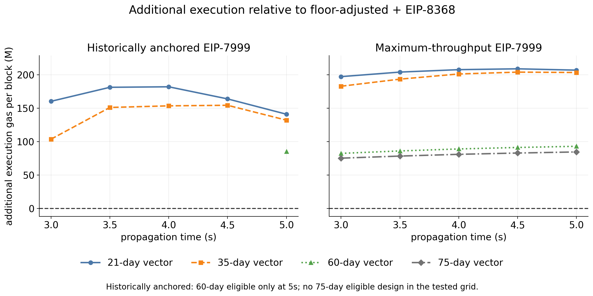

> Above zero, EIP-7999 delivers more execution at the common propagation allocation. Missing historically anchored points indicate that no configuration meets the eligibility conditions in the tested grid. The four lines represent alternative demand specifications; their spread is not a confidence interval.

The maximum-throughput selection has a positive mean gain at every tested allocation under all four vectors. Across propagation allocations, the gain is **197.4M–209.1M** for the 21-day vector, **183.0M–204.1M** for 35 days, **82.4M–93.0M** for 60 days, and **75.3M–84.6M** for 75 days. The direction survives these alternatives, while the size of the gain is much smaller under the two lower-execution-elasticity vectors.

The historically anchored selections also have positive gains wherever they qualify. They exist at all five allocations under the 21- and 35-day vectors. Under the 60-day vector, only **E150/D80 at five seconds** qualifies, delivering **142.3M**, or **85.3M** more execution than floor-adjusted + EIP-8368. No historically anchored configuration qualifies under the 75-day vector. This is a limitation of the tested grid and eligibility rule; lower-target candidates outside the grid may still qualify.

For sampling variation, we subtract the two mechanisms' mean execution **within each matched path** before summarizing the 32 differences. For example, the 35-day, four-second historically anchored gain averages **153.6M**. Its simulated-week p05–p95 range is **147.8M–160.2M**, while a paired bootstrap gives a **152.2M–154.9M** interval for the mean gain. The appendix distinguishes these two summaries and their limitations.

### Which configurations would we select?

The table selects the highest mean execution across the tested propagation allocations, applying the historical eligibility rule where required. Each cell reports the configuration, followed by **mean execution gas per block and annualized state growth**. Unlike the preceding gain figure, these selections can use different propagation times.

| Elasticity vector | Floor-adjusted + EIP-8368 | EIP-7999 maximum throughput | EIP-7999 historically anchored |
| --- | --- | --- | --- |
| 21-day | 3.5s, 550M limit 61.0M; 121.7 GiB/year | 4.5s, E300/D80 268.7M; 120.0 GiB/year | 4.0s, E250/D52.5 242.5M; 120.0 GiB/year |
| 35-day | 3.5s, 550M limit 70.2M; 121.6 GiB/year | 4.5s, E300/D90 272.6M; 120.0 GiB/year | 4.0s, E225/D60 223.0M; 120.0 GiB/year |
| 60-day | 3.5s, 550M limit 58.5M; 121.7 GiB/year | 5.0s, E300/D80 150.0M; 120.0 GiB/year | 5.0s, E150/D80 142.3M; 120.0 GiB/year |
| 75-day | 3.5s, 550M limit 59.1M; 121.7 GiB/year | 5.0s, E300/D80 142.2M; 120.0 GiB/year | No eligible configuration in the tested grid |

The preferred floor-adjusted + EIP-8368 allocation is unchanged, whereas EIP-7999's maximum-throughput choice moves from 4.5 to five seconds under the 60- and 75-day vectors. Its delivered execution falls from approximately 269M–273M to 142M–150M even after reselecting targets. The baseline reference remains at four seconds and a 500M common limit, delivering 70.3M, 92.6M, 74.7M, and 77.4M under the four vectors, respectively, with 403.4–405.3 GiB/year of state growth.

These results describe performance after adapting the design to the maintained demand estimate. The appendix separately freezes the configurations selected under the central 35-day vector. In particular, its historically anchored E225/D60 design delivers only **146.3M and 139.2M** under the 60- and 75-day vectors, so the central recommendation's utilization is sensitive to the assumed demand response.

### Does the execution gain survive with central designs held fixed?

The primary fixed-design test uses floor-adjusted + EIP-8372 as the one-dimensional reference. We keep each calibrated CPSB, percentage scale, common limit, and floor metering rate fixed. We also freeze the EIP-7999 target pairs selected under the 35-day vector. All three elasticities change together across the 21-, 35-, 60-, and 75-day estimates; $\lambda=0$, $\rho_A=1$, and the saved shock paths remain unchanged. Each alternative receives a newly solved equilibrium under its fixed design.

The frozen EIP-7999 pairs, ordered by propagation time from 3.0 to 5.0 seconds, are **E175/D36, E225/D52.5, E225/D60, E225/D60, E200/D67.5** for the central historically anchored selection, and **E300/D67.5, E300/D77, E300/D80, E300/D90, E300/D90** for the central maximum-throughput selection. These names describe how the designs were selected centrally; eligibility is not imposed again under the alternatives. EIP-7999 retains its existing cost-equivalent initialization and one-day burn-in, allowing its cached fixed-design outcomes to be reproduced.

| Elasticity vector | Floor-adjusted + EIP-8372 execution | State growth (GiB/year) | Frozen historically anchored EIP-7999 execution gain | Frozen maximum-throughput EIP-7999 execution gain |
|---|---:|---:|---:|---:|
| 21-day | 141.2M–166.0M | 106.4–108.4 | 19.1M–69.8M | 96.3M–124.6M |
| 35-day | 151.9M–177.9M | 86.0–88.1 | 6.8M–57.7M | 85.9M–119.2M |
| 60-day | 104.5M–113.5M | 100.4–110.7 | 19.9M–44.5M | 26.5M–45.4M |
| 75-day | 102.3M–109.9M | 97.1–108.5 | 18.3M–39.3M | 23.1M–39.8M |

Each range spans the five propagation allocations. Execution gains are calculated at the same allocation and within each matched simulated path before averaging. EIP-7999's realized state growth stays near 120 GiB/year throughout this fixed-design experiment.

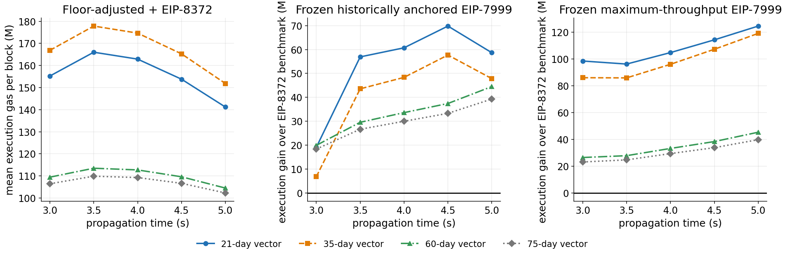

> All constants and target pairs retain their central values. Each line changes the complete elasticity vector. The two gain panels compare EIP-7999 with the calibrated one-dimensional benchmark at the same propagation time; zero marks equal mean execution. The lines represent alternative specifications rather than uncertainty intervals.

The mean execution gain is positive in all 40 paired comparisons, although its size is much smaller under the 60- and 75-day vectors. The closest central comparison is at three seconds: the historically anchored gain averages **6.8M**, with a simulated-week p05–p95 range of **−0.7M to 15.6M**. A positive mean therefore does not imply a gain in every simulated week. With the central state-pricing constants frozen, state again controls the unshocked shared-fee equilibrium under every alternative vector; its dynamic branch frequency rises to **51.8%–73.3%**. A calibration that aligns the central curves can become misaligned when demand differs from that estimate.

### Reselected one-dimensional outcomes

At each propagation allocation and under each complete vector, these tables retain the tested common limit with the highest mean included execution. **The unshocked equilibrium is state-controlled in every row.** The dynamic state-branch frequency is the fraction of measured blocks in which state gas exceeds regular gas; the regular-branch frequency is its complement. These are branch-selection frequencies, independent of whether usage reaches the target or limit.

All outcomes are means across the same 32 simulated weeks. Fee variation is $\operatorname{sd}(\Delta\log P)$ within each path, averaged across paths. Because $P_i=m_i b$ with a constant multiplier within a one-dimensional configuration, its log changes equal those of the shared base fee for all three resources. Equilibrium fees refer to the constant-anchor demand solution.

**Baseline one-dimensional**

| Vector | Propagation | Common limit | Equilibrium fee (wei) | Mean execution | State growth (GiB/year) | State is larger branch | Blocks at common limit | Fee variation |
| --- | --- | --- | --- | --- | --- | --- | --- | --- |
| 21-day | 3.0s | 359.6M | 437,291 | 64.9M | 290.7 | 97.11% | 8.31% | 0.0614 |
| 21-day | 3.5s | 433.6M | 295,792 | 67.9M | 351.1 | 98.08% | 8.40% | 0.0616 |
| 21-day | 4.0s | 500.0M | 219,611 | 70.3M | 405.3 | 98.56% | 8.44% | 0.0617 |
| 21-day | 4.5s | 450.0M | 273,711 | 68.6M | 364.5 | 98.22% | 8.41% | 0.0616 |
| 21-day | 5.0s | 400.0M | 350,113 | 66.6M | 323.7 | 97.73% | 8.36% | 0.0615 |
| 35-day | 3.0s | 359.6M | 86,981 | 82.0M | 288.1 | 92.49% | 7.99% | 0.0608 |
| 35-day | 3.5s | 433.6M | 49,756 | 87.9M | 349.0 | 95.02% | 8.17% | 0.0611 |
| 35-day | 4.0s | 500.0M | 32,513 | 92.6M | 403.4 | 96.27% | 8.27% | 0.0613 |
| 35-day | 4.5s | 450.0M | 44,535 | 89.1M | 362.5 | 95.39% | 8.20% | 0.0612 |
| 35-day | 5.0s | 400.0M | 63,308 | 85.3M | 321.4 | 94.08% | 8.10% | 0.0610 |
| 60-day | 3.0s | 359.6M | 30,077 | 67.8M | 289.8 | 95.59% | 8.24% | 0.0612 |
| 60-day | 3.5s | 433.6M | 15,410 | 71.6M | 350.3 | 97.00% | 8.36% | 0.0614 |
| 60-day | 4.0s | 500.0M | 9,258 | 74.7M | 404.5 | 97.72% | 8.43% | 0.0615 |
| 60-day | 4.5s | 450.0M | 13,494 | 72.4M | 363.7 | 97.21% | 8.38% | 0.0614 |
| 60-day | 5.0s | 400.0M | 20,561 | 69.9M | 322.9 | 96.48% | 8.31% | 0.0614 |
| 75-day | 3.0s | 359.6M | 15,487 | 69.8M | 289.3 | 94.75% | 8.20% | 0.0611 |
| 75-day | 3.5s | 433.6M | 7,406 | 74.0M | 349.8 | 96.40% | 8.33% | 0.0612 |
| 75-day | 4.0s | 500.0M | 4,222 | 77.4M | 403.9 | 97.22% | 8.39% | 0.0612 |
| 75-day | 4.5s | 450.0M | 6,398 | 74.9M | 363.2 | 96.64% | 8.35% | 0.0612 |
| 75-day | 5.0s | 400.0M | 10,180 | 72.2M | 322.4 | 95.78% | 8.28% | 0.0612 |

**Floor-adjusted + EIP-8368**

| Vector | Propagation | Common limit | Equilibrium fee (wei) | Mean execution | State growth (GiB/year) | State is larger branch | Blocks at common limit | Fee variation |
| --- | --- | --- | --- | --- | --- | --- | --- | --- |
| 21-day | 3.0s | 534.0M | 764,054 | 60.8M | 121.7 | 99.05% | 8.50% | 0.0618 |
| 21-day | 3.5s | 550.0M | 741,771 | 61.0M | 121.7 | 99.16% | 8.51% | 0.0618 |
| 21-day | 4.0s | 500.0M | 815,948 | 60.3M | 121.7 | 99.04% | 8.50% | 0.0618 |
| 21-day | 4.5s | 450.0M | 906,609 | 59.6M | 121.6 | 98.83% | 8.47% | 0.0618 |
| 21-day | 5.0s | 400.0M | 1,019,935 | 58.8M | 121.6 | 98.51% | 8.44% | 0.0617 |
| 35-day | 3.0s | 534.0M | 332,742 | 70.0M | 121.6 | 98.51% | 8.47% | 0.0618 |
| 35-day | 3.5s | 550.0M | 323,038 | 70.2M | 121.6 | 98.73% | 8.49% | 0.0618 |
| 35-day | 4.0s | 500.0M | 355,342 | 69.4M | 121.6 | 98.57% | 8.48% | 0.0618 |
| 35-day | 4.5s | 450.0M | 394,824 | 68.5M | 121.5 | 98.25% | 8.44% | 0.0617 |
| 35-day | 5.0s | 400.0M | 444,177 | 67.5M | 121.4 | 97.73% | 8.39% | 0.0616 |
| 60-day | 3.0s | 534.0M | 192,625 | 58.3M | 121.7 | 98.96% | 8.55% | 0.0619 |
| 60-day | 3.5s | 550.0M | 187,007 | 58.5M | 121.7 | 99.12% | 8.57% | 0.0620 |
| 60-day | 4.0s | 500.0M | 205,708 | 58.0M | 121.7 | 99.02% | 8.56% | 0.0619 |
| 60-day | 4.5s | 450.0M | 228,565 | 57.5M | 121.6 | 98.81% | 8.54% | 0.0619 |
| 60-day | 5.0s | 400.0M | 257,135 | 57.0M | 121.6 | 98.49% | 8.50% | 0.0618 |
| 75-day | 3.0s | 534.0M | 136,877 | 59.0M | 121.7 | 98.89% | 8.58% | 0.0619 |
| 75-day | 3.5s | 550.0M | 132,885 | 59.1M | 121.7 | 99.07% | 8.59% | 0.0620 |
| 75-day | 4.0s | 500.0M | 146,173 | 58.7M | 121.7 | 98.97% | 8.58% | 0.0619 |
| 75-day | 4.5s | 450.0M | 162,415 | 58.2M | 121.6 | 98.76% | 8.56% | 0.0619 |
| 75-day | 5.0s | 400.0M | 182,717 | 57.6M | 121.5 | 98.41% | 8.52% | 0.0618 |

The full reselected output also records EIP-7999 targets, equilibrium fees, hard-limit frequencies, target deviations, and each resource's effective-price variation in `data/shared_fee/shared_fee_elasticity_reselected.csv`.

### Frozen central candidates

Here the propagation allocation and all physical settings are held at the four configurations selected under the 35-day vector. Only the elasticity vector changes. The historically anchored label identifies the original selection; it does not imply that the frozen configuration remains eligible under the alternative vector.

| Central design family | Frozen configuration | Vector | Mean execution | State growth (GiB/year) | Hard-limit blocks | Target deviation |
| --- | --- | --- | --- | --- | --- | --- |
| Baseline | 4.0s, 500M limit | 21-day | 70.3M | 405.3 | 8.44% | 40.32% |
| Baseline | 4.0s, 500M limit | 35-day | 92.6M | 403.4 | 8.27% | 40.04% |
| Baseline | 4.0s, 500M limit | 60-day | 74.7M | 404.5 | 8.43% | 40.30% |
| Baseline | 4.0s, 500M limit | 75-day | 77.4M | 403.9 | 8.39% | 40.26% |
| Floor-adjusted + EIP-8368 | 3.5s, 550M limit | 21-day | 61.0M | 121.7 | 8.51% | 40.44% |
| Floor-adjusted + EIP-8368 | 3.5s, 550M limit | 35-day | 70.2M | 121.6 | 8.49% | 40.43% |
| Floor-adjusted + EIP-8368 | 3.5s, 550M limit | 60-day | 58.5M | 121.7 | 8.57% | 40.56% |
| Floor-adjusted + EIP-8368 | 3.5s, 550M limit | 75-day | 59.1M | 121.7 | 8.59% | 40.59% |
| EIP-7999 historically anchored | 4.0s, E225/D60 | 21-day | 223.6M | 120.0 | 4.75% | 31.47% |
| EIP-7999 historically anchored | 4.0s, E225/D60 | 35-day | 223.0M | 120.0 | 4.82% | 31.54% |
| EIP-7999 historically anchored | 4.0s, E225/D60 | 60-day | 146.3M | 120.0 | 4.83% | 39.64% |
| EIP-7999 historically anchored | 4.0s, E225/D60 | 75-day | 139.2M | 120.0 | 4.79% | 41.62% |
| EIP-7999 maximum throughput | 4.5s, E300/D90 | 21-day | 268.1M | 120.0 | 15.75% | 28.52% |
| EIP-7999 maximum throughput | 4.5s, E300/D90 | 35-day | 272.6M | 120.0 | 19.53% | 27.69% |
| EIP-7999 maximum throughput | 4.5s, E300/D90 | 60-day | 148.0M | 120.0 | 10.05% | 51.18% |
| EIP-7999 maximum throughput | 4.5s, E300/D90 | 75-day | 140.5M | 120.0 | 9.05% | 53.49% |

Target deviation is the path mean of $|g^{\mathrm{included}}-T|/T$, averaged across paths. For one-dimensional rows, $g$ is the shared controller's maximum of regular and state usage; for EIP-7999 it is included execution. The metric therefore describes different control quantities across mechanisms.

The central E225/D60 design remains near its execution target under the 21-day vector, although reselecting permits E250/D52.5. Under the 60- and 75-day vectors, execution falls well below the frozen target. Reselecting the 60-day historically anchored design to E150/D80 restores eligibility at a lower execution target. The 75-day grid has no eligible selection. The complete fixed-candidate output contains all 80 family/propagation/vector combinations in `data/shared_fee/shared_fee_elasticity_fixed_central.csv`, including fee variation and EIP-7999's execution-minimum diagnostics.

### Paired execution gains and sampling variation

Each gain is computed from matching workload replication numbers, with 32 pairs per available comparison. The p05–p95 range describes variation in the seven-day mean gain across simulated weeks. The 95% interval for the mean is obtained by resampling those paired weekly differences 10,000 times. It measures Monte Carlo uncertainty conditional on the saved shock model, elasticity vector, and selected designs.

The design selection itself uses these same 32 paths. The intervals hold the selected configurations fixed during resampling, so they omit selection uncertainty and may be optimistic for a near-tied winner. They also exclude uncertainty in the elasticity estimates and shock reconstruction. The full paired summaries and all 992 path-level differences are available in `data/shared_fee/shared_fee_elasticity_gains.csv` and `data/shared_fee/shared_fee_elasticity_gain_paths.csv`. Nine unavailable historically anchored comparisons are retained explicitly, with no numerical gain assigned.

## Appendix: State utilization and low-fee rounding diagnostic

To examine the rising state-utilization curves, we retain block-level traces for four existing EIP-8372 settings: the 60- and 75-day vectors at 3.5 and five seconds. They use the same frozen calibration, 32 paths, one-day burn-in, and seven measured days. Their state utilization and branch frequencies reproduce the cached outcomes. No controller or shock specification changes.

The monetary state-clearing price, $c b_S^*$, is approximately **1.049 billion wei per state byte** under the 60-day vector and **745.5 million wei per state byte** under the 75-day vector at both allocations. The corresponding clearing base fees differ because CPSB differs. To compare dynamic prices on the same economic scale, we divide each block's pre-update fee by its configuration-specific $b_S^*$.

| Vector | Propagation | Included state / target | Offered state / target | Median $b_t/b_S^*$ | State is larger branch | Below-target blocks with no fee decrease |
|---|---:|---:|---:|---:|---:|---:|
| 60-day | 3.5s | 83.7% | 87.5% | 1.04 | 68.7% | 44.2% |
| 60-day | 5.0s | 92.3% | 97.4% | 0.72 | 73.3% | 21.7% |
| 75-day | 3.5s | 81.0% | 84.4% | 1.23 | 67.2% | 49.9% |
| 75-day | 5.0s | 90.4% | 95.3% | 0.74 | 72.2% | 27.9% |

Each cell averages the corresponding metric across 32 paths; the median column is the mean of within-path medians. The last column is conditional on the **included controlling quantity**, $\max(g_{\mathrm{regular}},N_S)$, being below the common target. It measures how often the integer fee decrease rounds to zero despite that underfill. As a fraction of all measured blocks, these zero-decrease events occur in 29.2% and 13.0% of blocks under the 60-day vector, and 34.1% and 17.1% under the 75-day vector, at 3.5 and five seconds respectively.

Under the integer EIP-1559 update, a below-target block reduces a fee $b_t$ only if its relative shortfall is at least $8/b_t$. At 20 wei, the shortfall must reach 40%; at 80 wei, it must reach 10%. Above-target usage always increases the fee by at least one wei. This asymmetry can matter at the low absolute fees produced by the frozen calibration.

At five seconds, offered state is higher relative to target and the fee distribution is lower relative to its state-clearing level. The difference between offered and included state actually increases: from 3.8% to 5.1% of the target under the 60-day vector, and from 3.4% to 4.9% under 75 days. The utilization increase therefore does not reflect less state exclusion. The matched state-shock paths are unchanged, while their interaction with the price response differs. These observations are consistent with a role for low-fee integer rounding, alongside changes in regular/state competition and shock–price co-movement. Isolating how much rounding causes would require a separate counterfactual controller replay; this diagnostic does not perform that experiment.

## Appendix: Base-fee exposure proxy

The base-fee exposure proxy is calculated block by block before averaging. For EIP-7999:

$$
\overline C_{7999}^{\mathrm{proxy}}
=\frac{1}{N}\sum_t
\left(
b_{E,t}g_{E,t}+b_{D,t}g_{D,t}+b_{S,t}g_{S,t}
\right).
$$

For the one-dimensional mechanisms, use the state counter entering the monetary charge:

$$
\overline C_{\mathrm{shared}}^{\mathrm{proxy}}
=\frac{1}{N}\sum_t
b_t\left(g_{\mathrm{regular},t}+g_{S,t}\right).
$$

For baseline and EIP-8368, $g_{S,t}$ is the included state counter. For EIP-8372, it is the included **raw** state counter $g_{S,t}^{\mathrm{raw}}$, before normalization for capacity and fee updates. Each product uses the fee charged in block $t$, before computing the next block's fee. Burn-in blocks are excluded, and path means are averaged with equal weight across the 32 replications. Both quantities are divided by $10^{18}$ to report ETH per block. For the shared-fee mechanism, this is a resource-counter-weighted charge proxy rather than an exact reconstruction of sender payments or burned ETH. EIP-8037 computes transaction payment after refunds and the transaction-level floor maximum, while regular and state gas are recorded separately for block accounting. Summing the two counters can therefore overstate paid gas when the floor binds. EIP-8279 likewise retains a transaction-level maximum between execution gas and the accumulated floor; it does not add BAL as an independent payment. The proxy describes base-fee exposure at each design's own capacity vector and equilibrium and should not be interpreted as protocol revenue or welfare.

## Appendix: Floor and CPSB attribution

The complete $2\times2$ design changes the floor and CPSB separately:

| Benchmark | Floor metering rate | CPSB | Purpose |
|---|---:|---:|---|
| Baseline | 64 | 1,530 | Keeps the specified constants |
| State-matched 64 | 64 | Derived from the candidate target | Isolates state-growth repricing |
| Floor-adjusted only | $F^*(t,L_G)$ | 1,530 | Isolates the floor and larger retained limit |
| Floor-adjusted + EIP-8368 | $F^*(t,L_G)$ | Derived from the candidate target | Applies both adjustments |

The table selects the candidate with the highest mean parent execution activity within each fit-feasible benchmark family; in this sweep it is also the largest retained limit.

| Propagation | Benchmark | Selected limit | $F$ | CPSB | Equilibrium fee | Mean parent execution | Annualized state growth | Blocks at common limit |
|---:|---|---:|---:|---:|---:|---:|---:|---:|
| 3.0s | Baseline | 359.6M | 64 | 1,530 | 86,981 wei | 56.6M | 288.1 GiB | 7.99% |
|  | State-matched 64 | 359.6M | 64 | 3,668 | 494,032 wei | 46.0M | 121.2 GiB | 8.30% |
|  | Floor-adjusted only | 534.0M | 96 | 1,530 | 26,720 wei | 65.4M | 430.0 GiB | 8.22% |
|  | Floor-adjusted + EIP-8368 | 534.0M | 96 | 5,446 | 332,742 wei | 48.3M | 121.6 GiB | 8.47% |
| 3.5s | Baseline | 433.6M | 64 | 1,530 | 49,756 wei | 60.7M | 349.0 GiB | 8.17% |
|  | State-matched 64 | 433.6M | 64 | 4,423 | 409,755 wei | 47.1M | 121.4 GiB | 8.42% |
|  | Floor-adjusted only | 550.0M | 82 | 1,530 | 24,460 wei | 66.2M | 443.8 GiB | 8.28% |
|  | Floor-adjusted + EIP-8368 | 550.0M | 82 | 5,610 | 323,038 wei | 48.5M | 121.6 GiB | 8.49% |
| 4.0s | Baseline / floor-adjusted | 500.0M | 64 | 1,530 | 32,513 wei | 63.9M | 403.4 GiB | 8.27% |
|  | State-matched / both adjusted | 500.0M | 64 | 5,100 | 355,342 wei | 47.9M | 121.6 GiB | 8.48% |
| 4.5s | Baseline | 450.0M | 64 | 1,530 | 44,535 wei | 61.5M | 362.5 GiB | 8.20% |
|  | State-matched 64 | 450.0M | 64 | 4,590 | 394,824 wei | 47.3M | 121.5 GiB | 8.44% |
|  | Floor-adjusted only | 450.0M | 50 | 1,530 | 44,535 wei | 61.5M | 362.7 GiB | 8.22% |
|  | Floor-adjusted + EIP-8368 | 450.0M | 50 | 4,590 | 394,824 wei | 47.3M | 121.5 GiB | 8.44% |
| 5.0s | Baseline | 400.0M | 64 | 1,530 | 63,308 wei | 58.9M | 321.4 GiB | 8.10% |
|  | State-matched 64 | 400.0M | 64 | 4,080 | 444,177 wei | 46.6M | 121.3 GiB | 8.38% |
|  | Floor-adjusted only | 400.0M | 40 | 1,530 | 63,308 wei | 58.9M | 321.8 GiB | 8.14% |
|  | Floor-adjusted + EIP-8368 | 400.0M | 40 | 4,080 | 444,177 wei | 46.6M | 121.4 GiB | 8.39% |

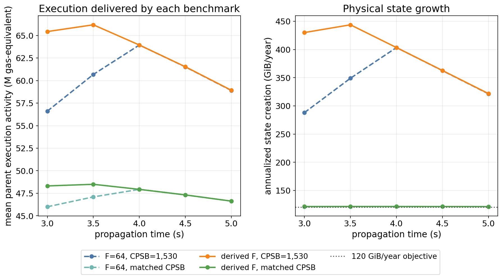

> Raising the floor expands the fit-feasible common limit at three and 3.5 seconds. Matching CPSB removes the accompanying increase in physical state growth, while the higher state multiplier raises the common fee and contracts execution. At four seconds, both floor choices equal 64. At 4.5 and five seconds, the adjusted prices fall to 50 and 40, changing the data multiplier while retaining the same execution-time limit.

## Appendix: State pricing and deployment capacity

Does the large calibrated CPSB make large deployments impossible? Not by itself: CPSB must be interpreted together with the scaled raw state-gas limit. This appendix checks state capacity under the central three-second configuration, rather than adding another performance comparison.

### State capacity under normalization

Let $c_0$ be the state-budget-matched CPSB before demand calibration. Scaling CPSB to $c=kc_0$ and the raw state limit to $L_S^{\mathrm{raw}}=kL_G$ leaves the capacity share consumed by $z$ metered state bytes unchanged:

$$
\frac{cz}{L_S^{\mathrm{raw}}}
=\frac{kc_0z}{kL_G}
=\frac{c_0z}{L_G}.
$$

The scale cancels: relative state pricing changes, while maximum byte capacity is preserved up to integer rounding. This is the distinction implemented by [EIP-8372](https://eips.ethereum.org/EIPS/eip-8372#specification).

For the three-second calibration, the common limit is **533,959,303 gas**, $c_0=5{,}446$, and calibrated CPSB is **20,538,083**. The implemented percentage scale gives a raw state limit of **2,013,678,002,659 gas**. Dividing that limit by CPSB gives approximately **98,046 metered state bytes per block**, with approximately **49,023 bytes** corresponding to the half-limit target.

For comparison, consider a reference with a 200M common limit, CPSB of 1,530, and equal raw limits:

| State-capacity measure | 200M / CPSB 1,530 reference | Calibrated three-second configuration |
|---|---:|---:|
| Maximum metered state bytes per block | 130,719 | 98,046 |
| State bytes corresponding to the half-limit target | 65,359 | 49,023 |
| Annualized growth at target | Approximately 160 GiB/year | Approximately 120 GiB/year |

Annualization assumes 2,628,000 blocks per year, following [EIP-8037's state-growth calibration](https://eips.ethereum.org/EIPS/eip-8037#deriving-the-cost-per-state-byte-cpsb). Relative to this reference, maximum byte capacity is approximately 25% lower, so each byte consumes approximately one third more of the available state capacity. **This difference comes from the lower state-growth budget, not the additional EIP-8372 demand-calibration scale.** The floor-adjusted + EIP-8368 configuration with the same growth budget has approximately the same byte capacity.

### Illustrative deployment check

Consider 64 KiB of new runtime code, matching the proposed maximum in [EIP-7954](https://eips.ethereum.org/EIPS/eip-7954#specification). Deployment into a new account adds a 120-byte account-creation contribution under [EIP-8037](https://eips.ethereum.org/EIPS/eip-8037#parameter-changes). With no additional state created by the constructor, this totals **65,536 + 120 = 65,656 metered state bytes** and uses approximately **67.0%** of the calibrated state capacity.

The example therefore fits within the modeled state-gas limit, although it exceeds the approximately 49,023-byte target. The target is not a per-block validity limit. This is **not a complete transaction-feasibility test**: execution and payload capacity, the applicable code and initialization-code limits, the declared gas allowance, and remaining block capacity must also permit inclusion. Constructor execution or additional state creation can add further requirements.

### Relative prices and average utilization

In the aggregate demand model, the state-byte price is $cb$, while one unit of metered execution gas costs $b$. At the three-second equilibrium, **20,538,083 gas per byte × 88.219808 wei per gas ≈ 1.812 gwei per state byte**. A large CPSB makes state expensive relative to execution, but does not by itself establish a higher ETH cost per state byte: the shared fee falls alongside the increase in CPSB.

Finally, the simulated **88.1 GiB/year** reflects average state utilization of **73.4% of target**, not a tighter per-block byte limit. Large individual deployments can fit within the state budget even when average state creation is below the calibrated target.

## Appendix: Floor-adjusted + EIP-8372 integer accounting and pulse diagnostics

Let $s$ denote the integer percentage scale. The experiment uses the proposal's percentage denominator and raw-state validity check:

$$
s=\left\lfloor\frac{100c}{c_0}\right\rfloor,\qquad
L_S^{\mathrm{raw}}=\left\lfloor\frac{L_Gs}{100}\right\rfloor,\qquad
N_S=\left\lfloor\frac{100g_S^{\mathrm{raw}}}{s}\right\rfloor.
$$

Included raw state must satisfy $g_S^{\mathrm{raw}}\leq L_S^{\mathrm{raw}}$, and the fee controller uses $\max(g_{\mathrm{regular}},N_S)$. State demand continues to use the raw CPSB in its price. These operations follow the [EIP-8372 specification](https://eips.ethereum.org/EIPS/eip-8372#specification). <!--ref:eip8372--><!--anchor:section:Specification-->

We retain the earlier byte budget implied by $75\mathrm{M}/1530$ bytes per target block and 2,628,000 blocks per year: **119.976 GiB/year**. The analytical baseline CPSB is rounded down to an integer. At three seconds, the common limit is **533,959,303 gas** and the target is **266,979,651 gas**; the main table rounds both to millions. At the other allocations, the limits and half-limit targets are already integers. Actual CPSB is rounded to the nearest integer, with half values rounded upward, before deriving $s$.

After rounding, both continuous branch quantities are within **0.001%** of the common target, and the byte-capacity change from percentage rounding is below **0.001%** relative to the integer baseline. The deterministic control starts from the equilibrium fee rounded up to integer wei and runs 10,000 unshocked blocks, discarding the first 7,200. Regular utilization is **99.80%–99.96%** and normalized state utilization is **99.57%–99.92%**. The much larger stochastic underutilization therefore persists beyond the small integer-fee discrepancy in this control.

The pulse diagnostic uses the first burn-in day and the following measured day from each of the same 32 paths. The pulse begins at measured block 1,200. Each scenario multiplies only the selected resource's demand factor by $1+2^{-u/120}$ for blocks $u\geq0$ after onset. Access intensity and the other parent factors retain their original draws. Each response is measured relative to that design's no-pulse replay of the identical path.

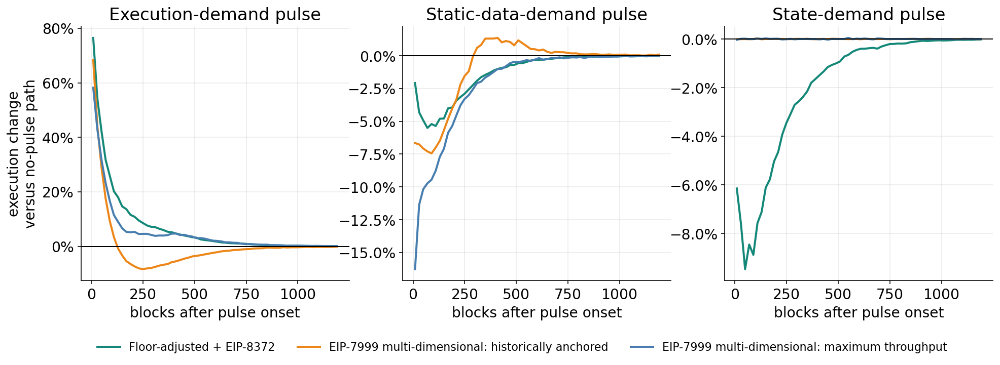

> Curves show the percentage change in execution, pooling gas across the 32 matched paths within consecutive 20-block intervals. The panels use different vertical scales. Scalar event summaries average each path's 600-block response; price peaks are computed within that event window, and recovery is searched over the remaining 6,000 blocks. Recovery measures all three effective prices against their matching no-pulse trajectories. Unrecovered paths would be censored; all paths recover in these nine tested design/pulse combinations.

Recovery in the pulse diagnostics is measured against the matching no-pulse trajectory, requiring all three effective prices to remain within a factor of 1.1 for 120 consecutive blocks after the event-window peak. The seven-day baseline and elasticity results use the unmodified empirical workload.

## Data and reproducibility

The complete report can be reproduced by running the four notebooks in
[`notebooks/one_dimensional_simulation`](../notebooks/one_dimensional_simulation/README.md)
in order: baseline simulation and data-multiplier calibration; floor-adjusted
EIP-8368; floor-adjusted EIP-8372; and comparison with EIP-7999. The folder's
README documents the upstream notebook sequence, executable Xatu/RPC refresh
procedures, reuse mode, and the results reproduced by each notebook.

The analysis uses the local 6,000-block transaction panel in `data/shared_fee/`, the February–May 2026 multiplier anchors, and the canonical 60-day multiscale workload used by the EIP-7999 dynamic simulation. The EIP-7999 inputs used here are the outputs regenerated under the updated execution schedule. This shared-fee comparison reads those inputs without overwriting them; its new window-comparison outputs are stored separately under `data/shared_fee/`. The preserved Glamsterdam artifacts remain unchanged.

The principal compact outputs are:

- `data/shared_fee/floor_rate_multiplier_sweep.csv`: transaction-floor calibration at rates 40, 50, and every integer from 64 through 96;
- `data/shared_fee/equilibrium_anchor_by_floor_rate.csv`: demand and metering anchors used by the replay;
- `data/shared_fee/shared_fee_factorial_scenarios.csv`: all 380 benchmark, propagation, and common-limit combinations;
- `data/shared_fee/shared_fee_factorial_paths.csv`: the corresponding 12,160 replication-level results;
- `data/shared_fee/shared_fee_state_tail.csv`: the 60 state-demand-tail settings for baseline and floor-adjusted + EIP-8368;
- `data/shared_fee/shared_fee_proposal_state_tail.csv` and `shared_fee_optimized_state_tail.csv`: the corresponding 30-row mechanism-specific views;
- `data/shared_fee/shared_fee_optimized_comparison.csv`: the six-design comparison at each of the five propagation allocations.
- `data/shared_fee/shared_fee_elasticity_comparison.csv`: 80 window/design/propagation rows, including nine explicitly unavailable historically anchored selections;
- `data/shared_fee/shared_fee_elasticity_comparison_paths.csv`: 2,272 path-level records for the 71 available settings;
- `data/shared_fee/shared_fee_elasticity_comparison_manifest.json`: input hashes and checks for the preserved largest-limit comparison;
- `data/shared_fee/shared_fee_elasticity_surface.csv` and `shared_fee_elasticity_surface_paths.csv`: 708 common-limit/vector settings and 22,656 matched-path outcomes;
- `data/shared_fee/shared_fee_elasticity_reselected.csv` and `shared_fee_elasticity_best_designs.csv`: selections at each propagation allocation and across allocations;
- `data/shared_fee/shared_fee_elasticity_gains.csv` and `shared_fee_elasticity_gain_paths.csv`: paired gain summaries and replication-level differences;
- `data/shared_fee/shared_fee_elasticity_fixed_central.csv`: 80 frozen-central-candidate outcomes;
- `data/shared_fee/shared_fee_elasticity_robustness_manifest.json`: workload and source hashes, reuse counts, and reproduction checks for the expanded sweep.
- `data/shared_fee/eip8372/calibration.csv` and `normalized_outcomes.csv`: the five central calibrations and 20 frozen-constant configuration/vector outcomes;
- `data/shared_fee/eip8372/fixed_7999_outcomes.csv` and `paired_gains.csv`: 40 frozen EIP-7999 outcomes and their matched gains against the calibrated benchmark;
- `data/shared_fee/eip8372/*_paths.csv`: replication-level outcomes and paired differences;
- `data/shared_fee/eip8372/unshocked_control.csv`, `stress_outcomes.csv`, and `stress_manifest.json`: deterministic rounding checks and controlled resource pulses;
- `data/shared_fee/eip8372/manifest.json`: unchanged-workload verification, preserved-source hashes, and calibration conventions.
- `data/shared_fee/eip8372/state_tail/normalized_outcomes.csv` and `normalized_paths.csv`: six three-second frozen-calibration cap settings and their 192 path-level results;
- `data/shared_fee/eip8372/state_tail/three_second_comparison.csv`, `paired_gains.csv`, and `paired_gain_paths.csv`: the combined three-mechanism cap table and paired gains against fixed unrestricted EIP-7999 references; the directory's manifest records workload and preservation hashes.

The executable implementation lives under `src/shared_fee/` and `scripts/shared_fee/`. Run `scripts/shared_fee/run_elasticity_comparison.py` after the central state-tail and EIP-7999 parameter-surface outputs exist, followed by `scripts/shared_fee/run_elasticity_robustness.py` to extend the common-limit sweep and compute reselected and fixed-candidate comparisons. Then regenerate figures with `scripts/shared_fee/make_figures.py`. Report tables are rendered from those outputs by `scripts/shared_fee/elasticity_report_tables.py`; notebook [`04-comparison-with-7999.ipynb`](../notebooks/one_dimensional_simulation/04-comparison-with-7999.ipynb) presents them without duplicating the solvers. The expanded experiment reuses all 177 central common-limit cases and adds 531 cases for the three alternative vectors. It does not change the saved shocks or previous simulation outputs.

The data retain their original identifiers for reproducibility: `proposal_faithful` means baseline, `fully_optimized` means floor-adjusted + EIP-8368, and `normalized_state` means floor-adjusted + EIP-8372. The five-series comparison joins the central rows of `shared_fee_elasticity_comparison.csv` and `eip8372/normalized_outcomes.csv`; the separate state-cap results are excluded from that figure.

For the floor-adjusted + EIP-8372 addition, run `scripts/shared_fee/run_eip8372_calibration.py`, followed by `run_eip8372_stresses.py` and `make_eip8372_figures.py` in the same directory. Notebook [`03-floor-adjusted-eip8372.ipynb`](../notebooks/one_dimensional_simulation/03-floor-adjusted-eip8372.ipynb) presents the calibration, fixed-design results, and pulse diagnostics; Notebook 04 presents the paired gains. The new normalized-state kernel is separate from the earlier shared-fee and EIP-7999 kernels. The 40 frozen EIP-7999 outcomes reproduce the existing cache to numerical precision, and the runner checks hashes of prior simulation data and source files before and after execution.

The EIP-8372 replay also records `base_fee_exposure_proxy_eth_per_block` block by block using the pre-update shared fee and included regular plus raw state counters. Adding this metric leaves the existing equilibrium and dynamic outcomes unchanged.

The combined three-mechanism execution/state-growth figure and supplementary fixed-calibration figures are generated by `make_eip8372_figures.py`. Run `scripts/shared_fee/diagnose_eip8372_state_utilization.py` for the four-setting block-level diagnostic. Its separate `state_utilization_diagnostics.csv`, `state_utilization_diagnostic_paths.csv`, and manifest under `data/shared_fee/eip8372/` record the mean and path-level metrics and verify that the source outcomes and workload remain unchanged.

Run `PYTHONPATH=src python scripts/shared_fee/run_eip8372_state_tail.py` for the three-second state-tail extension. It reuses the cached baseline, EIP-8368, and EIP-7999 paths, runs only the six EIP-8372 cap cases, and writes to the separate `eip8372/state_tail/` directory. The isolated capped kernel is checked against the original kernel with an infinite cap, and the runner verifies that the unrestricted case reproduces the original 32 per-path outcomes and that prior data and kernels remain unchanged. Notebooks [`03-floor-adjusted-eip8372.ipynb`](../notebooks/one_dimensional_simulation/03-floor-adjusted-eip8372.ipynb) and [`04-comparison-with-7999.ipynb`](../notebooks/one_dimensional_simulation/04-comparison-with-7999.ipynb) also display these results.
