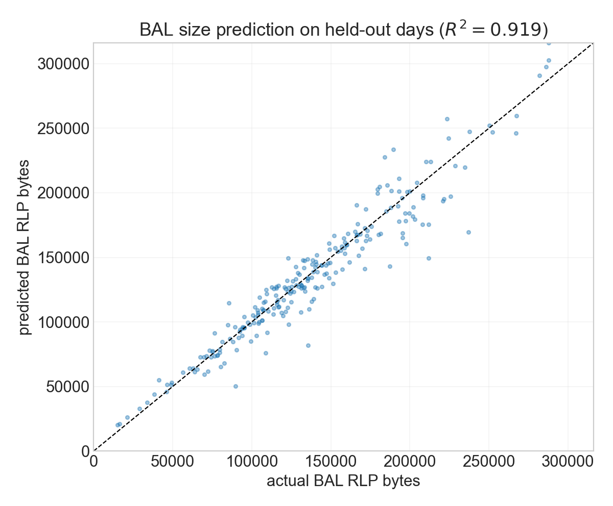

# BAL Demand and Data Metering Under EIP-7999

[EIP-7928](https://github.com/ethereum/EIPs/blob/master/EIPS/eip-7928.md) specifies Block-Level Access Lists (BALs) for Glamsterdam.
In Glamsterdam, BALs are not are not priced and do not consume gas. Under EIP-7999, BALs will be considered as a component in data (bandwidth) resource and consume data gas. Unlike other data resource components, BAL is generated by transaction execution, including access to existing state and persistent state creation, rather than being chosen independently by users.

The report first estimates BAL RLP size from historical execution and state activity, then constructs an induced BAL quantity model. In addition, we convert observed transaction data gas content into the universal 16 gas per byte accounting used by the EIP-7999 counterfactual. All empirical anchors use the 120 days from February 1 through May 31, 2026.

The main results are:

1. Estimated BAL size at the historical activity anchor is **132,377 RLP bytes per block**, or **2.118028 million data gas per block** at 16 gas per byte.
2. The selected BAL size regression has $R^2=0.9460$ in the 960-block training sample and **0.9191 in the 240-block held-out sample**. It is then applied to a wider 6,000-block sample.
3. We estimate **13.268%** of BAL bytes are directly linked to persistent state creation and **86.732%** remain linked to execution and access to existing state.
4. Static-data accounting in the EIP-7999 counterfactual, including calldata, transaction access lists, authorization tuples, and blob-versioned hashes, is **2.123622 million data gas per block**, giving a metering multiplier of **1.798834** relative to current EIP-7623 data gas.

## Predicting BAL size with Xatu data

A BAL is a block-level RLP object organized by account. For every included account, the encoded object contains the account address and up to five types of access or change:

- storage writes, including the storage slot and transaction-indexed new values;
- storage reads that were not also written in the block;
- balance changes and their transaction indices;
- nonce changes and their transaction indices; and
- code changes and their transaction indices.

Exact historical BALs can be constructed using [Toni's implementation](https://github.com/nerolation/eth-bal-analysis). Full prestate traces are expensive to retrieve repeatedly, so we select a deterministic sample of **1,200 blocks** (10 blocks per day for 120 days), construct the exact BAL for each block, and fit an OLS prediction model.

The selected OLS regression predicts exact block-level BAL bytes from features that can be obtained at scale from Xatu:

$$
\begin{aligned}
L_i={}&\beta_0+\beta_1\,\mathrm{transactions}_i
+\beta_2\,\mathrm{zeroToNonzeroWrites}_i
+\beta_3\,\mathrm{calldataBytes}_i\\
&+\beta_4\,\mathrm{storageDiffs}_i
+\beta_5\,\mathrm{balanceDiffs}_i
+\beta_6\,\mathrm{nonceDiffs}_i+\varepsilon_i.
\end{aligned}
$$

Here, $L_i$ is the exact RLP-encoded BAL size in bytes for block $i$. The coefficients are used for prediction, not as causal estimates of how individual features generate BAL bytes.

The split is chronological: the first 960 blocks, covering the first 80% of sampled days, train the model; the final 240 blocks provide a held-out evaluation.

| Regression used for BAL size | Features | Training blocks | Held-out blocks | Training $R^2$ | Held-out $R^2$ |
|---|---:|---:|---:|---:|---:|
| Selected Xatu state-diff regression | 6 | 960 | 240 | 0.9460 | **0.9191** |

  

The fitted model is applied to a wider 6,000-block sample (50 blocks per day). For each day, the wider sample uses the 10 exact BAL observations and regression predictions for the remaining 40 blocks; negative regression predictions are clipped at zero. Averaging those calibrated block sizes produces the historical BAL anchor:

| BAL quantity at the historical anchor | Estimate |
|---|---:|
| BAL RLP size | 132,377 bytes per block |
| BAL data gas at 16 gas per byte | 2.118028M gas per block |

Note: We assume BAL consume 16 gas per byte, the same as other data components. The actual gas cost of BAL bytes are TBD.

## Separating BAL bytes between state creation and execution/access

State creation and execution can both contribute BAL bytes. To understand how state and execution demand will affect BAL size, we therefore separate the observed BAL into bytes linked directly to persistent state creation and bytes linked to execution and access to existing state.

### BAL component decomposition

For each of the 1,200 sampled blocks, we record the exact RLP bytes contributed by storage writes, storage reads, balance changes, nonce changes, code changes. After assigning bytes to storage, balance, nonce, and code entries, the remaining bytes consist of the account address and the RLP bytes needed to organize the account entry and the overall BAL. We refer to these remaining bytes as the residual.

This decomposition is necessary because the state-creation indicators are counts of new storage slots, accounts, and code bytes, whereas we need to measure their share of total BAL bytes.

| BAL component | Fraction of BAL bytes |
|---|---:|
| Storage writes | 45.09% |
| Storage reads | 26.85% |
| Balance changes | 8.20% |
| Code changes | 2.24% |
| Nonce changes | 1.49% |
| Residual | 16.13% |

### Linking BAL components to state creation

A state-creating transaction can also execute code, read existing storage, update existing storage, and access existing accounts. Classifying its entire BAL as state-driven would therefore overstate the bytes linked to state creation and understate the bytes linked to execution.

We assign only the following entries to state creation:

- the storage-write entry for a newly created storage slot;
- the account shell for a newly created account; and
- new contract code or delegation-indicator bytes recorded as a code change.

Storage reads and writes to existing slots remain with execution and existing-state access. We also assign all balance- and nonce-change bytes to execution. Although some balance and nonce changes accompany account or contract creation, they usually update existing account fields rather than increase the persistent state footprint.

Within each block, the exact storage-write component bytes are allocated according to the fraction of BAL write slots that are newly created. Account-shell bytes are allocated according to the fraction of BAL accounts that are new, and code-change bytes according to the fraction of BAL code bytes identified as new code or delegation indicators.

| Direct matching diagnostic | Estimate |
|---|---:|
| New storage slots as a share of BAL write slots | 22.83% |
| New accounts as a share of BAL accounts | 5.18% |
| New code as a share of BAL code bytes | 99.26% |

| Strict linkage result | Estimate |
|---|---:|
| Direct state-creation weight $w_S$ | **0.132676** |
| Execution and existing-state-access weight $1-w_S$ | **0.867324** |
| Day-bootstrap 95% interval for $w_S$ | **0.124803–0.141094** |
| Calibration sample | 1,200 blocks across 120 days |

## BAL demand model

### Notation and relation to the Glamsterdam report

We retain the notation from the [Glamsterdam equilibrium report](https://hackmd.io/A3ZtS0bZSDCiMPsrdHAW-w?both). For resource $i$, $q_i^0$ denotes its current-regime gas-equivalent quantity at the historical anchor, $m_i$ converts that quantity into counterfactual gas, and $g_i=m_iq_i$ denotes gas under the counterfactual accounting. The subscripts $E$, $D$, and $S$ denote execution, data, and state. EIP-7999 has a separate base fee $p_i$ for each resource rather than one shared fee $b$. Relative to the same historical fee anchor, $b_{\mathrm{ref}}=0.1069$ gwei, define:

$$
r_i(p_i)=m_i\frac{p_i}{b_{\mathrm{ref}}}
=\frac{p_i}{p_i^0},
\qquad
p_i^0=\frac{b_{\mathrm{ref}}}{m_i}.
$$

The independent isoelastic quantities and their metered gas are therefore:

$$
q_i(p_i)=q_i^0r_i(p_i)^{-\epsilon_i},
\qquad
g_i(p_i)=m_iq_i(p_i).
$$

### Induced BAL quantity

Total data gas is the sum of independently demanded static transaction content and BAL gas induced by execution and state creation:

$$
g_D(p_E,p_D,p_S)
=g_{\mathrm{static}}(p_D)
+g_{\mathrm{BAL}}(p_E,p_D,p_S).
$$

The static component covers the user-controlled transaction-content fields in [EIP-8131](https://github.com/ethereum/EIPs/blob/master/EIPS/eip-8131.md): calldata, transaction access lists, authorization tuples, and blob-versioned hashes. BAL bytes are instead generated by execution and state activity. The reduced-form of BAL quantity can be modeled as:

$$
g_{\mathrm{BAL}}(p_E,p_D,p_S) =
g_{\mathrm{BAL}}^0
\left[
(1-w_S)\frac{q_E(p_E)}{q_E^0}
+w_S\frac{q_S(p_S)}{q_S^0}
\right]
r_D(p_D)^{-\gamma_{\mathrm{BAL}}},
$$

where $g_{\mathrm{BAL}}^0=2.118028$M BAL data gas per block (assume 16 gas per BAL byte), $q_E$ is execution quantity (including activity that accesses existing state), $q_S$ is persistent state-creation quantity, and $w_S$ is the fraction of baseline BAL bytes directly linked to state creation.

The parameter $\gamma_{\mathrm{BAL}}$ allows an additional direct response to the data price while holding $q_E$ and $q_S$ fixed. We assume $\gamma_{\mathrm{BAL}}=0$ because historical fee markets do not separately identify this response. In the current equilibrium model, a change in $p_D$ alone consequently does not reduce BAL gas.

Substituting the independent isoelastic curves gives:

$$
\frac{g_{\mathrm{BAL}}(p_E,p_D,p_S)}{g_{\mathrm{BAL}}^0} =
\left[
(1-w_S)r_E(p_E)^{-\epsilon_E}
+w_Sr_S(p_S)^{-\epsilon_S}
\right]
r_D(p_D)^{-\gamma_{\mathrm{BAL}}}.
$$

Thus, BAL gas is a weighted combination of execution and state demand responses. With the estimated attribution weights, the equation becomes:

$$
g_{\mathrm{BAL}}
=2.118028\text{M}
\left[
0.867324\frac{q_E}{q_E^0}
+0.132676\frac{q_S}{q_S^0}
\right].
$$

At the historical anchor, we attribute 86.73% of BAL gas to execution and access to existing state, and 13.27% to state creation. For the counterfactual calculation, we assume that the first part changes by the same percentage as execution quantity, while the second part changes by the same percentage as state-creation quantity. For example, if execution quantity increases by 10% while state creation remains unchanged, total BAL gas increases by approximately 8.67%. If both quantities increase by 10%, total BAL gas also increases by 10%.

## Static-data metering in the full-7999 counterfactual

The Glamsterdam static-data multiplier of 1.969 does not apply to EIP-7999 because the accounting differs. Specifically, the 64/64 EIP-7976 calldata floor will be removed. We therefore convert the same observed transaction content into the data-gas units of the EIP-7999 counterfactual before applying demand response.

Following the notation above, let $q_D^0$ be current EIP-7623 data gas and let $g_{\mathrm{static}}^0$ be the gas assigned to the same static transaction content under the EIP-7999 counterfactual. The static-data metering multiplier is:

$$
m_{D,\mathrm{static}}
=\frac{g_{\mathrm{static}}^0}{q_D^0}.
$$

The current anchor is $q_D^0=1.180555$M gas per block. Removing the EIP-7623 floor while retaining 4/16 calldata, as in the current EIP-7999 draft, reduces the same transaction content to 1.032928M gas per block. The counterfactual then meters every calldata byte at 16 data gas and adds access-list RLP bytes, authorization tuples, and blob-versioned hashes.

| Accounting step | Data gas per block | Change from previous step | Ratio to current EIP-7623 |
|---|---:|---:|---:|
| Current EIP-7623: 4/16 calldata plus floor uplift | 1.180555M | — | 1.000000 |
| Remove EIP-7623 floor; retain 4/16 calldata | 1.032928M | −0.147627M | 0.874952 |
| Meter every calldata byte at 16 gas | 2.008813M | +0.975884M | 1.701583 |
| Add sampled access-list RLP bytes | 2.100737M | +0.091924M | 1.779448 |
| Add sampled authorization-tuple bytes | 2.121778M | +0.021042M | 1.797272 |
| Add 32-byte blob-versioned hashes | **2.123622M** | **+0.001844M** | **1.798834** |

The static-data metering multiplier is therefore:

$$
m_{D,\mathrm{static}}
=\frac{2.123622}{1.180555}
=1.798834.
$$

The static component uses the independently estimated historical data elasticity. For this component, $r_D(p_D)=m_{D,\mathrm{static}}p_D/b_{\mathrm{ref}}=p_D/p_D^0$:

$$
g_{\mathrm{static}}(p_D)
=g_{\mathrm{static}}^0
r_D(p_D)^{-\epsilon_D},
\qquad
g_{\mathrm{static}}^0=2.123622\text{M},
\qquad
\epsilon_D=0.229.
$$

## Parameters carried into the EIP-7999 equilibrium model

| Parameter | Value | Interpretation |
|---|---:|---|
| BAL metered anchor $g_{\mathrm{BAL}}^0$ | 2.118028M data gas/block | BAL generated by observed parent activity at 16 data gas per byte |
| BAL RLP size | 132,377 bytes/block | Estimated historical BAL size |
| Strict state-creation weight $w_S$ | 0.132676 | Directly matched new slots, account shells, and code |
| Execution/access weight $1-w_S$ | 0.867324 | Remaining BAL entries |
| Direct BAL data-price elasticity $\gamma_{\mathrm{BAL}}$ | 0 | No separately identified response to the future data fee |
| Current EIP-7623 data quantity $q_D^0$ | 1.180555M gas/block | Historical static-data denominator |
| Counterfactual static-data anchor $g_{\mathrm{static}}^0$ | 2.123622M data gas/block | Flat-16 calldata plus access lists, authorizations, and blob hashes |
| Static-data metering multiplier $m_{D,\mathrm{static}}$ | 1.798834 | Accounting conversion applied to static-data demand |
| Total data anchor $g_D^0$ | 4.241651M data gas/block | Static data plus BAL at observed activity |

## What remains assumed

The main unresolved measurement issue is the parent activity for the 86.73% execution/access-linked BAL component. Total execution quantity is a broad proxy because equal amounts of execution gas can generate different numbers of account and storage accesses. The BAL anchor also uses regression predictions for 4,800 of the wider sample's 6,000 blocks; the held-out $R^2=0.9191$ supports this extrapolation within the same period but does not eliminate prediction error.

The model assumes one-for-one scaling between each BAL component and its parent quantity, no additional BAL response to the data fee, and one historical data elasticity for all static transaction-content fields. A transaction-bundle simulation should later allow data prices to change transaction inclusion and composition, and therefore the BAL gas generated by execution and state creation. The EIP-7999 reserve-price condition and fake-exponential fee update affect equilibrium and fee dynamics rather than these measurement anchors, so they remain outside this report.

## Reproducibility

- [Notebook 1.3: BAL size calibration](../notebooks/1.3-bal-size-calibration.ipynb)
- [Notebook 1.11: BAL state-creation coupling calibration](../notebooks/1.11-bal-state-creation-coupling-calibration.ipynb)
- [Notebook 2.0: full-7999 equilibrium model](../notebooks/2.0-full-7999-equilibrium-model.ipynb)
- [BAL size regression results](../data/calibration_bal_regression_2026-02-01_2026-06-01.csv)
- [Static-data metering bridge](../data/full_7999_data_metering_bridge_2026-02-01_2026-06-01.csv)
- [BAL driver calibration](../data/full_7999_bal_driver_calibration_2026-02-01_2026-06-01.csv)
- [BAL coupling parameter card](../data/bal_state_creation_coupling_parameter_card_2026-02-01_2026-06-01.csv)

## Appendix: data sources and construction details

### BAL size regression

| Source | Fields used in the BAL size model |
|---|---|
| Xatu `default.execution_transaction` | Transaction counts and calldata quantities |
| Xatu `default.canonical_execution_storage_diffs` | Storage-diff counts and zero-to-nonzero writes |
| Xatu `default.canonical_execution_balance_diffs` | Balance-diff counts |
| Xatu `default.canonical_execution_nonce_diffs` | Nonce-diff counts |
| Ethnodeops Erigon RPC | Exact BAL RLP size used as the regression target |

For each RPC target block, `debug_traceBlockByNumber` with `prestateTracer` is called with `diffMode=true` for writes and account changes and with `diffMode=false` for storage reads. `eth_getBlockReceipts` supplies transaction outcomes, and `eth_getBlockByNumber(..., true)` supplies full transaction objects. The responses are assembled in `data/calibration_rpc_bal_blocks_2026-02-01_2026-06-01.csv`. The regression uses 10 exact-RPC blocks per day; Xatu features extend the prediction sample to 50 blocks per day.

### BAL component and state-linkage calibration

The same deterministic **1,200-block sample** (10 blocks per day across 120 days) is used for the BAL-size regression and the state-linkage estimate. For every block, `data/calibration_rpc_bal_blocks_2026-02-01_2026-06-01.csv` stores exact RLP byte totals for storage writes, storage reads, balance changes, nonce changes, code changes, and account shells. Notebook 1.11 verifies that these components sum exactly to total BAL size and matches new storage slots, accounts, code, and delegation indicators within the same blocks. No separate component-map sample or byte-per-unit regression is used.

### Static-data bridge

| Source | Fields used in the static-data calculation |
|---|---|
| Xatu `default.canonical_execution_block` | Canonical block dates and block coverage |
| Xatu `default.canonical_execution_transaction` | Receipt gas and zero/nonzero calldata bytes used to reconstruct current EIP-7623 data gas |
| Xatu `default.execution_transaction` | Exact calldata bytes, zero/nonzero byte counts, type-4 transaction counts, and blob-versioned hashes |
| Ethnodeops Erigon RPC sample | Access-list contents and authorization tuples not fully exposed by the Xatu transaction tables |

The RPC input is `data/calibration_rpc_state_access_auth_blocks_2026-02-01_2026-06-01.csv`, a deterministic **5,997-block** sample from the same 120 days. `eth_getBlockByNumber(..., true)` supplies full transaction objects, including `accessList` and `authorizationList`. Access lists are RLP encoded and authorization tuples are decoded into the project's 7999 byte accounting. The resulting rate per block is applied to the observed block count for each day. Trace and receipt calls in the same calibration file are used for state fields, not for the static-data byte count.
