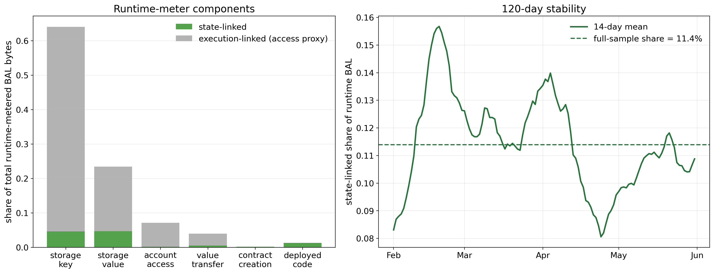
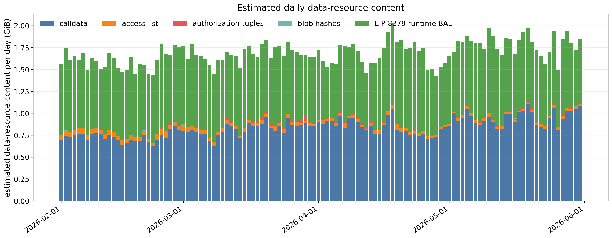

# BAL Demand and Data Metering Under EIP-7999

[EIP-7928](https://github.com/ethereum/EIPs/blob/master/EIPS/eip-7928.md) specifies Block-Level Access Lists (BALs) for Glamsterdam.
In Glamsterdam, BALs are not priced and do not consume gas. In the expanded full-7999 scenario modeled in this report, BALs are assigned to the data (bandwidth) resource and consume data gas. Unlike other data resource components, BAL is generated by transaction execution, including access to existing state and persistent state creation, rather than being chosen independently by users.

The fee model uses the transaction-local runtime byte counter specified by [EIP-8279](https://eips.ethereum.org/EIPS/eip-8279). We convert this counter and observed transaction content into the universal 16-data-gas-per-byte accounting assumed by this counterfactual extension. All empirical anchors use the 120 days from February 1 through May 31, 2026.

The main results are:

1. The EIP-8279 runtime-meter anchor is **119,944 bytes per block**, or **1.919100 million data gas per block** at 16 data gas per runtime byte.
2. Both the runtime counter and its state/execution attribution are reconstructed transaction by transaction for all **6,000 sampled blocks**. The transaction sums exactly match the independent block-level runtime reconstruction on every block.
3. In the same EIP-8279 runtime units, **11.393%** of metered BAL bytes are matched to persistent state creation. The remaining **88.607%** is execution-linked in the demand model because total execution is used as a proxy for existing-state access activity.
4. The execution-linked label does not mean that execution gas mechanically causes every remaining BAL byte. It identifies the component modeled with the execution proxy, under the assumption that access intensity remains constant as execution scales.
5. The central model sets $\gamma_{\mathrm{BAL}}=0$: BAL changes through state-creation and access activity, without an additional direct response to the data fee.
6. Static-data accounting, including calldata, transaction access lists, authorization tuples, and blob-versioned hashes, is **2.123622 million data gas per block**, giving a metering multiplier of **1.798834** relative to current EIP-7623 data gas.

## Estimating EIP-8279 runtime-metered BAL bytes

[EIP-8279](https://eips.ethereum.org/EIPS/eip-8279) defines a per-transaction `bal_data_bytes` counter. It adds fixed byte amounts for cold account and storage access, storage values that differ from their pre-transaction value, value-bearing calls and self-destructs, internal contract creation, and deployed code.

These protocol-event counts are available from Xatu for the wider block panel. The block-level estimator is:

$$
\begin{aligned}
\widehat M_i={}&
20N_{\mathrm{cold\ account},i}
+32N_{\mathrm{cold\ storage},i}
+32N_{\mathrm{changed\ value},i} \\
&+32N_{\mathrm{value\ call},i}
+32N_{\mathrm{selfdestruct},i}
+28N_{\mathrm{create},i} \\
&+32N_{\mathrm{endowed\ create},i}
+\mathrm{codeBytes}_i.
\end{aligned}
$$

Each internal `CREATE` or `CREATE2` counted by the runtime meter adds 28 bytes: 20 bytes for the new contract address and 8 bytes for its nonce. If the creation also transfers ETH to the new contract, the meter adds another 32 bytes for the contract's initial balance.

The same counter was previously fitted to six indirect block features. That regression achieved a held-out $R^2$ of 0.8387 and a held-out mean bias of +1.56%, but it is no longer needed for the anchor. Direct block-level event counts are available for all 6,000 sampled blocks and reproduce the transaction-level sums exactly on every block.

| Runtime-meter estimator | Blocks | Role | Validation result |
|---|---:|---|---:|
| Direct Xatu block-level reconstruction | 6,000 | Historical anchor | Used centrally |
| Transaction-level reconstruction | 6,000 | State/execution attribution | 6,000/6,000 exact block matches |

Daily sample means are weighted by the actual number of canonical blocks in each day.

| Priced BAL quantity at the historical anchor | Estimate |
|---|---:|
| EIP-8279 runtime counter | **119,944 bytes per block** |
| EIP-7999 data gas at 16 gas per runtime byte | **1.919100M gas per block** |

Xatu records cold accesses and value-bearing calls even when the surrounding call later reverts, so those EIP-8279 bytes are included. Storage writes are different: Xatu's storage-diff table contains only changes that remain after the transaction finishes. If a reverted call temporarily changes a storage value, EIP-8279 retains the 32-byte meter charge, but Xatu contains no final storage diff from which to recover it. The reconstruction therefore misses these specific reverted storage-value charges and may slightly understate the runtime counter.

EIP-8279 itself uses the runtime counter in a 64-gas-per-byte transaction floor. This report borrows the byte counter for the broader EIP-7999 scenario and applies the scenario's assumed 16 data gas per byte. The EIP-8279 static 51-byte allowance per authorization and automatic entries covered by transaction-base headroom are not part of `bal_data_bytes`; they are not included in the runtime anchor.

## Separating state-linked and execution-linked BAL

The demand decomposition uses the same EIP-8279 runtime-meter units on both sides:

$$
M_{\mathrm{BAL}}
=M_{\mathrm{state}}
+M_{\mathrm{execution}}.
$$

- $M_{\mathrm{state}}$ contains runtime bytes matched to new storage slots, new accounts, or deployed code.
- $M_{\mathrm{execution}}$ contains the remaining runtime bytes, including existing-state access and other EIP-8279 runtime events not matched to persistent state creation.

The state match is performed transaction by transaction over all 6,000 blocks. New storage slots are matched to cold storage-key and changed-value events. New accounts are matched to creation, cold-account, and value-transfer events. Deployed code is matched directly to runtime code bytes. Xatu's aggregated structlogs do not retain the target address or storage key for each cold-access count, so cold key, account, and balance matches are conservatively capped within each transaction. The state-linked result is a reproducible matched estimate rather than exact address-level attribution.

The execution suffix is model notation for the second component because total execution is used as its activity proxy. It does not mean that every byte in $M_{\mathrm{execution}}$ is mechanically generated by execution gas.

| Runtime-meter decomposition | Runtime bytes in the 6,000-block sample | Share of runtime BAL |
|---|---:|---:|
| State-linked $w_{\mathrm{state}}$ | 81,992,613 | **0.113932** |
| Execution-linked $w_{\mathrm{execution}}$ | 637,673,048 | **0.886068** |
| Total | 719,665,661 | 1.000000 |

The following table shows where the two weights come from. Percentages in parentheses are calculated within each runtime-meter component; the final column shows each component's share of total BAL bytes.

| EIP-8279 runtime-meter component | Total runtime bytes | State-linked bytes | Execution-linked bytes | Share of total BAL |
|---|---:|---:|---:|---:|
| Storage key | 460.553M | 33.140M (7.20%) | 427.412M (92.80%) | 64.00% |
| Storage value | 168.777M | 33.547M (19.88%) | 135.230M (80.12%) | 23.45% |
| Account access | 51.137M | 0.975M (1.91%) | 50.162M (98.09%) | 7.11% |
| Value transfer | 28.609M | 3.796M (13.27%) | 24.813M (86.73%) | 3.98% |
| Contract creation | 1.259M | 1.203M (95.56%) | 0.056M (4.44%) | 0.17% |
| Deployed code | 9.331M | 9.331M (100.00%) | 0 (0.00%) | 1.30% |
| **Total** | **719.666M** | **81.993M (11.39%)** | **637.673M (88.61%)** | **100.00%** |

Storage-key and storage-value entries account for 87.45% of runtime BAL bytes and are mostly execution-linked because most observed keys and values concern existing state. Contract creation and deployed code are almost entirely state-linked, but together they account for only 1.47% of total runtime BAL bytes.

> The left panel separates each EIP-8279 runtime-meter component into its state-linked and execution-linked portions. The right panel shows the 14-day mean state-linked share across the 6,000-block panel. The dashed line is the full-sample estimate of 11.39%.

## BAL demand model

Let:

- $B_t$ denote EIP-8279 runtime-metered BAL bytes;
- $S_t$ denote persistent state-creation activity;
- $A_t$ denote existing-state access activity; and
- the superscript or subscript $0$ denote the historical anchor.

The central model is:

$$
\frac{B_t}{B_0}
=
w_{\mathrm{state}}
\frac{S_t}{S_0}
+w_{\mathrm{execution}}
\frac{A_t}{A_0},
\qquad
w_{\mathrm{state}}=0.113932,
\quad
w_{\mathrm{execution}}=0.886068.
$$

The wider historical panel does not provide an independently priced state-access quantity. The central approximation therefore uses total execution activity $E_t$ as a proxy:

$$
\frac{A_t}{A_0}
\approx
\left(\frac{E_t}{E_0}\right)^{\rho_A},
\qquad
\rho_A=1.
$$

Substitution gives the central benchmark:

$$
\frac{B_t}{B_0}
=
0.113932\frac{S_t}{S_0}
+
0.886068\frac{E_t}{E_0}.
$$

The 88.607% execution-linked component is not empirically shown to follow execution demand. Total execution is a proxy for existing-state access activity, and $\rho_A=1$ means that the model holds state-access intensity constant as execution scales. An explicit access index should eventually replace this proxy.

The model also sets:

$$
\gamma_{\mathrm{BAL}}=0.
$$

This means BAL has no additional direct response to the data fee after state-creation and access activity have been determined. Users do not independently demand BAL bytes. The current fee market also does not identify how BAL-producing transactions would respond to a separate future data fee, so adding a BAL-specific elasticity would create an unidentified parameter. The assumption does not make BAL constant: BAL still changes with $S_t$ and $A_t$.

At 16 data gas per runtime byte, total data gas is:

$$
g_{D,t}
=g_{\mathrm{static},t}+16B_t.
$$

Static data and BAL therefore share the data meter and fee, but they do not share the same demand equation. Static transaction content follows the independently estimated historical data elasticity. BAL is induced by state-creation and access activity.

## Static-data metering in the full-7999 counterfactual

The Glamsterdam static-data multiplier of 1.969 does not apply to EIP-7999 because the accounting differs. The 64/64 EIP-7976 calldata floor is removed. We therefore convert the same observed transaction content into the data-gas units of the EIP-7999 counterfactual before applying demand response.

Let $q_D^0$ be current EIP-7623 data gas and let $g_{\mathrm{static}}^0$ be the gas assigned to the same static transaction content under the EIP-7999 counterfactual. The static-data metering multiplier is:

$$
m_{D,\mathrm{static}}
=\frac{g_{\mathrm{static}}^0}{q_D^0}.
$$

The current anchor is $q_D^0=1.180555$M gas per block. Removing the EIP-7623 floor while retaining 4/16 calldata, as in the current EIP-7999 draft, reduces the same transaction content to 1.032928M gas per block. The counterfactual then meters every calldata byte at 16 data gas and adds fixed access-list content bytes, authorization tuples, and blob-versioned hashes.

| Accounting step | Data gas per block | Change from previous step | Ratio to current EIP-7623 |
|---|---:|---:|---:|
| Current EIP-7623: 4/16 calldata plus floor uplift | 1.180555M | — | 1.000000 |
| Remove EIP-7623 floor; retain 4/16 calldata | 1.032928M | −0.147627M | 0.874952 |
| Meter every calldata byte at 16 gas | 2.008813M | +0.975884M | 1.701583 |
| Add sampled access-list content bytes | 2.100737M | +0.091924M | 1.779448 |
| Add sampled authorization-tuple bytes | 2.121778M | +0.021042M | 1.797272 |
| Add 32-byte blob-versioned hashes | **2.123622M** | **+0.001844M** | **1.798834** |

The static-data metering multiplier is therefore:

$$
m_{D,\mathrm{static}}
=\frac{2.123622}{1.180555}
=1.798834.
$$

The static component uses the independently estimated historical data elasticity. With $b_{\mathrm{ref}}$ denoting the historical fee anchor,

$$
r_D(p_D)
=m_{D,\mathrm{static}}\frac{p_D}{b_{\mathrm{ref}}}
=\frac{p_D}{p_D^0},
$$

and:

$$
g_{\mathrm{static}}(p_D)
=g_{\mathrm{static}}^0r_D(p_D)^{-\epsilon_D},
\qquad
g_{\mathrm{static}}^0=2.123622\text{M},
\qquad
\epsilon_D=0.229.
$$

> The bars show estimated daily data-resource content over the 120-day window. Calldata, access lists, authorization tuples, and blob hashes form the static component. The green portion is EIP-8279 runtime BAL from the direct block-level reconstruction; it is displayed in the same byte units but follows the separate induced-demand equation above.

## Model inputs

| Parameter | Value | Interpretation |
|---|---:|---|
| BAL runtime-meter anchor | 119,944 bytes/block | Direct EIP-8279 event reconstruction over 6,000 blocks |
| BAL metered anchor | 1.919100M data gas/block | Runtime counter at 16 data gas per byte |
| State-linked runtime weight $w_{\mathrm{state}}$ | 0.113932 | Runtime bytes matched to new slots, accounts, and code |
| Execution-linked runtime weight $w_{\mathrm{execution}}$ | 0.886068 | Remaining runtime BAL bytes represented by the execution access proxy |
| Access-proxy exponent $\rho_A$ | 1 | Constant access intensity as execution scales |
| BAL data-price response $\gamma_{\mathrm{BAL}}$ | 0 | No additional direct response after conditioning on parent activity |
| Current EIP-7623 data quantity $q_D^0$ | 1.180555M gas/block | Historical static-data denominator |
| Counterfactual static-data anchor $g_{\mathrm{static}}^0$ | 2.123622M data gas/block | Flat-16 calldata plus access lists, authorizations, and blob hashes |
| Static-data metering multiplier $m_{D,\mathrm{static}}$ | 1.798834 | Accounting conversion applied to static-data demand |

## What remains assumed

The main behavioral limitation is the execution proxy for existing-state access. Equal amounts of execution gas can generate very different account and storage access patterns. The choice $\rho_A=1$ is therefore a reduced-form scaling assumption, not an estimated structural relationship.

The choice $\gamma_{\mathrm{BAL}}=0$ is also an assumption. Current data cannot identify how future users will change transaction composition when runtime BAL receives its own data charge. A transaction-level bundle model could introduce that response once its exit or substitution elasticities are identified.

The state-linked attribution lacks exact targets for aggregated cold-account and cold-storage counts, so matches are capped within each transaction. Delegation-only state creation is not identified in the Xatu state proxy. Reverted-frame storage-value bytes unavailable from Xatu make the runtime anchor a lower bound for that component.

The static-data model uses one historical elasticity for calldata, access-list content, authorization tuples, and blob hashes. These fields may respond differently to a future data fee. This report measures the historical anchors and specifies the central BAL equation; it does not report equilibrium fees or dynamic fee-market outcomes.

## Reproducibility

- [Notebook 1.11: EIP-8279 runtime BAL meter and demand coupling](../notebooks/1.11-bal-state-creation-coupling-calibration.ipynb)
- [Direct 6,000-block EIP-8279 reconstruction](../data/calibration_xatu_bal_runtime_8279_blocks_2026-02-01_2026-06-01.csv)
- [Transaction-level state/execution attribution aggregated to 6,000 blocks](../data/calibration_xatu_bal_runtime_8279_state_execution_blocks_2026-02-01_2026-06-01.csv)
- [Two-way runtime decomposition](../data/bal_runtime_8279_two_way_decomposition_2026-02-01_2026-06-01.csv)
- [Runtime component attribution](../data/bal_runtime_8279_component_attribution_2026-02-01_2026-06-01.csv)
- [BAL-weighted cost exposure](../data/bal_runtime_8279_composite_cost_exposure_2026-02-01_2026-06-01.csv)
- [EIP-8279 runtime parameter card](../data/bal_runtime_8279_parameter_card_2026-02-01_2026-06-01.csv)
- [Static-data metering bridge](../data/full_7999_data_metering_bridge_2026-02-01_2026-06-01.csv)

## Appendix: Transaction-cost exposure diagnostic

At normalized anchor prices, each BAL-producing transaction's execution, data, and state cost shares are weighted by its EIP-8279 runtime bytes. This diagnostic retains the cached 1,200-block transaction panel; it does not set the central weights estimated from 6,000 blocks.

| Resource | BAL-weighted normalized cost exposure |
|---|---:|
| Execution | **80.20%** |
| Data | **7.81%** |
| State | **11.99%** |

The aggregate exposure is consistent with low additional state coupling beyond the state-linked component because execution dominates the normalized cost of BAL-producing transactions. Cost shares do not identify transaction exit elasticities and are not used to set the central BAL-demand coefficients. Transaction-level access-list, authorization, and blob-hash fields are unavailable in the joined panel and are omitted from this diagnostic.

## Appendix: Data sources and construction details

### EIP-8279 runtime counter and state/execution attribution

| Source | Runtime components used |
|---|---|
| Xatu `default.canonical_execution_transaction_structlog_agg` | Cold account and storage accesses |
| Xatu `default.canonical_execution_storage_diffs` | Storage values that remain different from their pre-transaction value |
| Xatu `default.canonical_execution_traces` | Value-bearing calls, self-destruct transfers, internal creation, endowment, and deployed code |
| Xatu storage, contract, balance, nonce, and address-appearance tables | Transaction-level new slots, accounts, and code used for state-linked matching |
| Xatu `default.execution_transaction` | Transaction membership and calldata byte counts |
| Xatu `default.canonical_execution_transaction` | Receipt gas used only for the appendix cost diagnostic |

The runtime anchor and state/execution attribution cover the same 6,000 sampled blocks. Transaction-level queries are aggregated to a compact block cache after the state-linked match, while the older 1,200-block transaction cache is retained for the appendix cost diagnostic. Xatu does not expose authorization-list entries at the required transaction level, so delegation-only state creation is not included in the state-linked match.

### Static-data bridge

| Source | Fields used in the static-data calculation |
|---|---|
| Xatu `default.canonical_execution_block` | Canonical block dates and block coverage |
| Xatu `default.canonical_execution_transaction` | Receipt gas and zero/nonzero calldata bytes used to reconstruct current EIP-7623 data gas |
| Xatu `default.execution_transaction` | Exact calldata bytes, zero/nonzero byte counts, type-4 transaction counts, and blob-versioned hashes |
| Ethnodeops Erigon RPC sample | Access-list contents and authorization tuples not fully exposed by the Xatu transaction tables |

The RPC input is `data/calibration_rpc_state_access_auth_blocks_2026-02-01_2026-06-01.csv`, a deterministic **5,997-block** sample from the same 120 days. `eth_getBlockByNumber(..., true)` supplies full transaction objects, including `accessList` and `authorizationList`. Access-list content is counted as 20 bytes per address plus 32 bytes per storage key; authorization tuples use the fixed 108-byte accounting. The resulting rate per block is applied to the observed block count for each day. Trace and receipt calls in the same calibration file are used for state fields, not for the static-data byte count.
