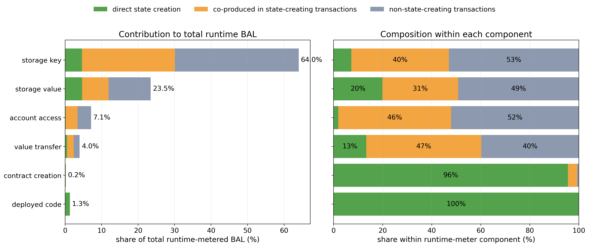

# BAL Demand and Data Metering Under EIP-7999

[EIP-7928](https://github.com/ethereum/EIPs/blob/master/EIPS/eip-7928.md) specifies Block-Level Access Lists (BALs) for Glamsterdam. Glamsterdam leaves BALs outside fee accounting. Under EIP-7999, BALs become part of the data resource and consume data gas. Transaction execution generates BAL through state creation and access to existing state.

The fee model uses the transaction-local runtime byte counter specified by [EIP-8279](https://eips.ethereum.org/EIPS/eip-8279). We convert this counter and observed transaction content into the universal 16-data-gas-per-byte accounting assumed by this counterfactual extension. All empirical anchors use the 120 days from February 1 through May 31, 2026.

The main results are:

1. The EIP-8279 runtime-meter anchor is **119,944 bytes per block**, or **1.919100 million data gas per block** at 16 data gas per runtime byte.
2. The transaction-level reconstruction over 6,000 sampled blocks separates runtime BAL into **11.394%** matched directly to state creation, **37.879%** of access bytes co-produced by state-creating transactions, and **50.727%** produced by transactions with no observed state creation.
3. BAL demand is modeled as a weighted combination of parent state and execution/access activity. Its response to the new data charge is unidentified historically, so we specify two alternative models: a two-sided demand curve with elasticity $\gamma_{\mathrm{BAL}}$, and a one-sided incremental surcharge with elasticity $\beta_{\mathrm{BAL}}$. The central benchmark sets the co-produced state allocation $\lambda=0$ and the null parameters $\gamma_{\mathrm{BAL}}=\beta_{\mathrm{BAL}}=0$, under which both models coincide.
4. Static-data accounting, including calldata, transaction access lists, authorization tuples and their EIP-8279 static BAL entries, and blob-versioned hashes, is **2.133559 million data gas per block**, giving a metering multiplier of **1.807251** relative to current EIP-7623 data gas.

## Estimating EIP-8279 runtime-metered BAL bytes

[EIP-8279](https://eips.ethereum.org/EIPS/eip-8279) defines a per-transaction `bal_data_bytes` counter. It adds fixed byte amounts for cold account and storage access, storage values that differ from their pre-transaction value, value-bearing calls and self-destructs, internal contract creation, and deployed code.

These protocol-event counts are available from Xatu for the wider block panel. The block-level estimator is:

$$
\begin{aligned}
\widehat M_{\mathrm{BAL},k}={}&
20N_{\mathrm{cold\ account},k}
+32N_{\mathrm{cold\ storage},k}
+32N_{\mathrm{changed\ value},k} \\
&+32N_{\mathrm{value\ call},k}
+32N_{\mathrm{selfdestruct},k}
+28N_{\mathrm{create},k} \\
&+32N_{\mathrm{endowed\ create},k}
+\mathrm{codeBytes}_k,
\end{aligned}
$$

where $k$ indexes blocks. Each internal `CREATE` or `CREATE2` counted by the runtime meter adds 28 bytes: 20 bytes for the new contract address and 8 bytes for its nonce. If the creation also transfers ETH to the new contract, the meter adds another 32 bytes for the contract's initial balance.

We reconstruct transaction-level runtime BAL for 6,000 sampled blocks from February through May 2026, using 50 blocks per day. Daily sample means are weighted by the actual number of canonical blocks in each day to obtain the historical anchor. The component totals and shares reported below are raw totals over the same 6,000-block panel; those shares are applied to the weighted anchor in the demand model.

| Priced BAL quantity at the historical anchor | Estimate |
|---|---:|
| EIP-8279 runtime counter | **119,944 bytes per block** |
| EIP-7999 data gas at 16 gas per runtime byte | **1.9191M gas per block** |
> Xatu's storage-diff table contains changes that remain after the transaction finishes. EIP-8279 retains a 32-byte meter charge when a reverted call temporarily changes a storage value; the final Xatu diff contains no corresponding entry. The reconstruction may therefore understate this specific source of runtime bytes.

EIP-8279 includes the runtime BAL counter in the transaction floor at 64 gas per byte. Under the EIP-7999 counterfactual, runtime BAL becomes a data-resource component. In this report, we assume 16 data gas per runtime byte; the final protocol value remains to be specified.

## BAL demand model

The notation follows the previous reports [Demand Model and Price Elasticities](/QIyttoYISby9hPAgqIw70g) and [Glamsterdam equilibrium](/A3ZtS0bZSDCiMPsrdHAW-w).
The resource index is $i \in \{\mathrm{execution},\mathrm{data},\mathrm{state}\}$, $q_i^0$ is the historical gas quantity, $p^0$ is the historical common-price anchor, and $\epsilon_i$ is the own-price elasticity. For execution and state, the multiplier $m_i$ converts historical activity into counterfactual gas $g_i=m_iq_i$. The data resource uses $m_{\mathrm{data,static}}$ for static transaction content and then adds runtime BAL gas.

EIP-7999 assigns each resource a protocol base fee $b_i$. Its effective price per historical gas unit is $p_i(b_i)=m_i b_i$, giving the price ratio:

$$
r_i(b_i)
=\frac{p_i(b_i)}{p^0}
=m_i\frac{b_i}{p^0}.
$$

For $i\in\{\mathrm{execution},\mathrm{state}\}$, the independent isoelastic quantity and its counterfactual gas are:

$$
q_i(b_i)=q_i^0r_i(b_i)^{-\epsilon_i},
\qquad
g_i(b_i)=m_iq_i(b_i).
$$

Here, $q_i(b_i)$ is shorthand for the demand function $q_i(p_i)$ from the elasticity report, evaluated at the effective price $p_i(b_i)=m_i b_i$. The elasticities were estimated under the historical shared base fee; the counterfactual evaluates each curve at its resource-specific effective price. Static data uses the same form with $m_{\mathrm{data,static}}$; the BAL component is specified below.

### Induced BAL gas quantity

Total data gas is the sum of independently demanded static transaction data and BAL gas induced by execution and state creation:

$$
g_{\mathrm{data}}(b_{\mathrm{execution}},b_{\mathrm{data}},b_{\mathrm{state}})
=g_{\mathrm{static}}(b_{\mathrm{data}})
+g_{\mathrm{BAL}}
$$

where the static component covers the user-controlled transaction-content fields in [EIP-8131](https://github.com/ethereum/EIPs/blob/master/EIPS/eip-8131.md)—calldata, transaction access lists, authorization tuples, and blob-versioned hashes—plus EIP-8279's 51 static BAL bytes per authorization.

Unlike static data components, BAL bytes are instead generated by state and execution activity and therefore respond to state and execution demand. A reduced-form of BAL gas quantity can be modeled as:

$$
\widetilde g_{\mathrm{BAL}}(b_{\mathrm{execution}},b_{\mathrm{state}}) =
g_{\mathrm{BAL}}^0
\left[
\omega_{\mathrm{execution}}
\frac{q_{\mathrm{execution}}(b_{\mathrm{execution}})}{q_{\mathrm{execution}}^0}
+\omega_{\mathrm{state}}
\frac{q_{\mathrm{state}}(b_{\mathrm{state}})}{q_{\mathrm{state}}^0}
\right],
$$

where $g_{\mathrm{BAL}}^0=1.9191\mathrm{M}$ is the BAL data-gas anchor at 16 gas per runtime byte, $\omega_{\mathrm{state}}$ is the share of BAL bytes that responds to state creation demand, and $\omega_{\mathrm{execution}}$ is the share of BAL bytes that responds to state access demand represented by the execution proxy.

Substituting the independent isoelastic curves gives:

$$
\frac{\widetilde g_{\mathrm{BAL}}(b_{\mathrm{execution}},b_{\mathrm{state}})}
{g_{\mathrm{BAL}}^0} =
\omega_{\mathrm{execution}}
r_{\mathrm{execution}}(b_{\mathrm{execution}})^{-\epsilon_{\mathrm{execution}}}
+\omega_{\mathrm{state}}
r_{\mathrm{state}}(b_{\mathrm{state}})^{-\epsilon_{\mathrm{state}}}.
$$

This quantity $\widetilde g_{\mathrm{BAL}}$ is BAL gas induced by parent activity alone, before any
response to the data fee. How BAL responds to being priced is not identified by historical data,
because BAL carried no data charge before EIP-7999. We therefore specify it two alternative ways and
compare the resulting equilibria:

| Model | Data-fee response | BAL gas |
|---|---|---|
| **A. Demand curve** | $r_{\mathrm{data}}(b_{\mathrm{data}})^{-\gamma_{\mathrm{BAL}}}$, two-sided | $g_{\mathrm{BAL}}=\widetilde g_{\mathrm{BAL}}\,r_{\mathrm{data}}^{-\gamma_{\mathrm{BAL}}}$ |
| **B. Incremental surcharge** | $\Psi_{\mathrm{BAL}}\in(0,1]$, one-sided | $g_{\mathrm{BAL}}=\widetilde g_{\mathrm{BAL}}\,\Psi_{\mathrm{BAL}}$ |

Both reduce to $g_{\mathrm{BAL}}=\widetilde g_{\mathrm{BAL}}$ under their respective null parameters,
$\gamma_{\mathrm{BAL}}=0$ and $\beta_{\mathrm{BAL}}=0$, which is the central bookkeeping benchmark:
the data fee then affects only static data demand, while parent execution and state activity govern
BAL gas. The two models are specified in the following sections.

<!-- At the historical anchor, we attribute 88.61% of BAL gas to execution and access to existing state, and 11.39% to state creation. For the counterfactual calculation, we assume that the first part changes by the same percentage as execution quantity, while the second part changes by the same percentage as state-creation quantity. For example, if execution quantity increases by 10% while state creation remains unchanged, total BAL gas increases by approximately 8.86%. If both quantities increase by 10%, total BAL gas also increases by 10%. -->

**Model limitation.** The model uses aggregate execution demand as the activity index for state-access runtime BAL that is not related to state creation activity in the same block. This keeps the historical amount of state access per unit of execution gas constant as execution expands. Marginal demand at larger gas limits may have a different mix of compute and state access. A richer model could use an auxiliary access index to separate access-generating execution from pure computation. Historical data leave the response of that access index to separate execution and data prices unidentified.

## Separating BAL bytes between state creation and execution

An important note is that a state-creating transaction also reads and modifies existing state. For example, a transaction may read existing slots before it creates a new slot. For such a transaction, the BAL bytes it creates can be related to both state creation and execution. **Therefore, the question is whether these execution-related BAL bytes of a state-creating transaction should respond to state demand or execution demand.**

This question concerns the parent-activity term $\widetilde g_{\mathrm{BAL}}$ and is therefore common
to both models; the data-fee response is applied afterwards. One step further from state and
execution, that term decomposes into three parts:

$$
\widetilde g_{\mathrm{BAL}}
=\widetilde g_{\mathrm{state-only}}
+\widetilde g_{\mathrm{coproduced}}
+\widetilde g_{\mathrm{nonstate}}.
$$

- $\widetilde g_{\mathrm{state-only}}$ is the BAL from state-creation activity that responds only to state demand, e.g., new storage slots, new accounts, or deployed code.
- $\widetilde g_{\mathrm{coproduced}}$ is the BAL from state-access (execution) activity that is related to state-creating transactions.
- $\widetilde g_{\mathrm{nonstate}}$ is the BAL from non-state-creation activity that responds only to execution demand.

Let $\lambda \in [0, 1]$ be a parameter that determines the fraction of the coproduced BAL gas responds to state demand, and $1-\lambda$ is the fraction of coproduced BAL gas responds to execution demand. Therefore, a richer model of BAL demand can be:

$$
\begin{align}
\frac{\widetilde g_{\mathrm{BAL}}}
{g_{\mathrm{BAL}}^0} = &
\;\omega_{\mathrm{state-only}}
r_{\mathrm{state}}(b_{\mathrm{state}})^{-\epsilon_{\mathrm{state}}}
\\ & +\omega_{\mathrm{coproduced}}[\lambda r_{\mathrm{state}}(b_{\mathrm{state}})^{-\epsilon_{\mathrm{state}}} + (1-\lambda)r_{\mathrm{execution}}
(b_{\mathrm{execution}})^{-\epsilon_{\mathrm{execution}}}]
\\ & +\omega_{\mathrm{nonstate}} r_{\mathrm{execution}}
(b_{\mathrm{execution}})^{-\epsilon_{\mathrm{execution}}}.
\end{align}
$$

The $\omega$ shares are measured directly from the decomposition; only their behavioral routing $\lambda$ is unresolved.

By decomposing the 6,000 sampled blocks, we get the following results:

| Runtime-meter group | Runtime BAL bytes | Share of runtime BAL |
|---|---:|---:|
| state creation | 81.997M | $\omega_{\mathrm{state-only}} = 11.394\%$|
| Co-produced access in state-creating transactions | 272.603M | $\omega_{\mathrm{coproduced}} = 37.879\%$ |
| non-state execution | 365.066M | $\omega_{\mathrm{nonstate}} = 50.727\%$ |
| **Total** | **719.666M** | **100.000%** |

>The co-produced group measures BAL bytes created by storage and account access that the transaction performs alongside state creation.

> Runtime-meter components across the 6,000-block panel. The first panel reports each component's contribution to total BAL bytes. The second separates direct state creation, co-produced access in state-creating transactions, and bytes from transactions with no observed state creation.

### Co-produced access inside state-creating transactions

The next question is the value of $\lambda$.
- $\lambda = 0$: BAL bytes from co-produced access in state-creating transactions scales entirely with execution.
- $\lambda = 1$: every BAL byte in a state-creating transaction follows state activity.

**Why assume $\lambda = 0$:** Our aggregate model starts from an independent own-price demand curves for each resource. This implies when the state price rises, the model reduces state gas usage, but it does not automatically remove the execution consumed by those state-creating transactions. This is a central assumption of our demand model. While the introduction of BAL may contest this independence further, setting $\lambda = 0$, i.e., a minimal bundling effect where only state creation themsleves follow state demand, is coherent with the spirit of the rest of the framework.
Another reason to assume $\lambda = 0$ is that it gives the upper bound of BAL pressure on the data target. At the equilibrium, state activity expands by roughly $2.5\times$ from its anchor (30M anchor to 75M fixed target), execution activity expands by at least $3\times$ from its anchor (37M anchor to 125M-300M target). Therefore, the induced BAL gas is monotonically decreasing in $\lambda$, the share that follows state demand. $\lambda = 0$ produces the largest induced BAL load. If a data target is feasible under this specification, i.e., there exists an equilibrium base fee for the data resource, it remains feasible for a larger $\lambda$.

Applying $\omega_{\mathrm{state-only}}, \omega_{\mathrm{coproduced}}, \omega_{\mathrm{nonstate}}$, and $\lambda=0$ gives the parent-activity term used by both models:

$$
\widetilde g_{\mathrm{BAL}} = 1.9191\text{M}
\left[ 0.8861
r_{\mathrm{execution}}(b_{\mathrm{execution}})^{-\epsilon_{\mathrm{execution}}} + 0.1139
r_{\mathrm{state}}(b_{\mathrm{state}})^{-\epsilon_{\mathrm{state}}}
\right].
$$

Model A multiplies this by $r_{\mathrm{data}}^{-\gamma_{\mathrm{BAL}}}$ and Model B by
$\Psi_{\mathrm{BAL}}$; at the null parameters both leave it unchanged.

## Model A: BAL demand curve

The first model gives BAL its own isoelastic demand curve in the data fee, measured against the
calldata-equivalent reference fee:

$$
g_{\mathrm{BAL}}(b_{\mathrm{execution}},b_{\mathrm{data}},b_{\mathrm{state}})
=\widetilde g_{\mathrm{BAL}}(b_{\mathrm{execution}},b_{\mathrm{state}})
\;r_{\mathrm{data}}(b_{\mathrm{data}})^{-\gamma_{\mathrm{BAL}}}.
$$

Two parts of $r_{\mathrm{data}}$ have different standing. The fee itself is genuinely BAL's own
price: under EIP-7999 a BAL byte is charged $b_{\mathrm{data}}$ per unit of data gas, exactly like a
calldata byte. The reference fee it is divided by is not BAL's, because BAL had no historical price;
$b_{\mathrm{data}}^0$ is constructed so that *static* data costs what it did historically. The ratio
therefore reads as the data fee expressed in units of the historical calldata price, which is why
the response below has to be interpreted through the carrier's calldata bill rather than through
BAL's own price history.

The elasticity $\gamma_{\mathrm{BAL}}$ is distinct from $\epsilon_{\mathrm{data}}$, which was estimated on calldata.

Because $r_{\mathrm{data}}$ is anchored at the cost-equivalent calldata fee, this specification is two-sided: **a data fee above the anchor reduces BAL, and a fee below it raises BAL.**

The phrase "below the anchor" refers to the constructed cost-equivalent reference fee $b_{\mathrm{data}}^0$ because no separate data fee existed historically. We set $b_{\mathrm{data}}^0$ so that static transaction data has the same effective price as in the historical period after the metering conversion. Thus,

$$
b_{\mathrm{data}}<b_{\mathrm{data}}^0
\quad\Longleftrightarrow\quad
r_{\mathrm{data}}<1
$$

means that calldata and the other static-data components are cheaper than at the historical anchor. This model interprets the resulting factor $r_{\mathrm{data}}^{-\gamma_{\mathrm{BAL}}}>1$ as an increase in the number of BAL-carrying transactions that users are willing to submit.

The reading matters because BAL itself had no historical price and cannot become cheaper than it
was. The expansion is attributed to the carrier's *other* data cost: its static content did pay the
historical price, so a data fee below the anchor genuinely lowers that transaction's bill and more
such transactions are submitted, each bringing its BAL footprint with it. Only that channel is
defensible here, which is also why $\gamma_{\mathrm{BAL}}$ must stay near
$\epsilon_{\mathrm{bundle}}\kappa_{\mathrm{data}}$ below; a large
$\gamma_{\mathrm{BAL}}$ would amount to letting BAL respond to a price history it never had. Model B
removes the ambiguity by charging BAL only as an increment and never crediting it.

The scale of $\gamma_{\mathrm{BAL}}$ can be related to the effect of the data fee on a transaction's
total cost. Let $\epsilon_{\mathrm{bundle}}$ be the transaction-submission elasticity with respect
to total transaction cost, and let $\kappa_{\mathrm{data}}$ be static data's share of that cost. A
1% change in the data price changes the total transaction cost by approximately
$\kappa_{\mathrm{data}}\%$, implying the approximation

$$
\gamma_{\mathrm{BAL}}\approx
\epsilon_{\mathrm{bundle}}\kappa_{\mathrm{data}}.
$$

The 6,000-block diagnostic estimates $\kappa_{\mathrm{data}}=7.83\%$ from the transaction-level
static-data fields available in the joined panel. Combining this share with
$\epsilon_{\mathrm{bundle}}=0.22$ to $0.335$ gives $\gamma_{\mathrm{BAL}}\approx0.017$ to $0.026$,
which motivates the $0.02$ to $0.03$ sensitivity range.

**Feasibility of a data target.** At $\gamma_{\mathrm{BAL}}=0$, BAL gas is fixed at
$\widetilde g_{\mathrm{BAL}}$ regardless of the data fee. Only static data can be reduced, so a
finite equilibrium requires $T_{\mathrm{data}}>\widetilde g_{\mathrm{BAL}}$: if parent-induced BAL
alone reaches the data target, no data fee clears it. That inequality is the minimum-data-target
boundary.

For $\gamma_{\mathrm{BAL}}>0$ the boundary disappears. Both components now fall as the data fee
rises, and $r_{\mathrm{data}}^{-\gamma_{\mathrm{BAL}}}\to0$ as $b_{\mathrm{data}}$ grows, so total
data demand can be driven arbitrarily close to zero. Every positive data target therefore has a
finite clearing fee: any capacity pair that is feasible at $\gamma_{\mathrm{BAL}}=0$ remains
feasible, and pairs that lie below the $\gamma_{\mathrm{BAL}}=0$ boundary become feasible as well.

Reachable does not mean cheap. The closer the data target sits to the BAL level, the higher the fee
has to go to clear it, without limit. A target just below the $\gamma_{\mathrm{BAL}}=0$ boundary is
reachable, but only at a data fee far above the cost-equivalent reference. The boundary is therefore
better read as the point where the required data fee becomes extreme than as a wall that a positive
$\gamma_{\mathrm{BAL}}$ knocks down. Model B behaves differently here: its one-sided response stops
falling at a positive floor, so some capacity pairs stay genuinely infeasible no matter how high the
data fee goes.

## Model B: incremental BAL surcharge

The second model treats the data charge on BAL bytes as an incremental surcharge on a BAL-carrying
transaction's existing bill. The transaction's static data had a historical effective price, while
its BAL bytes had no separate data price. Introducing the BAL charge can therefore only raise the
transaction's bill. The response is one-sided and weakly reduces activity among BAL-carrying
transactions, in contrast to the two-sided curve in Model A.

First compute the parent-activity ratios

$$
R_S=r_{\mathrm{state}}(b_{\mathrm{state}})^{-\epsilon_{\mathrm{state}}},
\qquad
R_A=r_{\mathrm{execution}}(b_{\mathrm{execution}})^{-\epsilon_{\mathrm{execution}}}.
$$

For a BAL-carrying transaction $j$, let $g_{d,j}$, $g_{c,j}$, and $g_{n,j}$ denote its direct-state,
co-produced, and non-state runtime BAL gas. Capacity expansion changes the frequency of
historical transaction types. The scenario weight of BAL-carrying transaction $j$ is

$$
\widetilde g_{\mathrm{BAL},j}(\lambda)
=R_S\left(g_{d,j}+\lambda g_{c,j}\right)
+R_A\left[g_{n,j}+(1-\lambda)g_{c,j}\right].
$$

Let $C_{\mathrm{noBAL},j}$ be the transaction's counterfactual gas fee before its BAL charge:

$$
C_{\mathrm{noBAL},j}
=b_{\mathrm{execution}}g_{\mathrm{execution},j}
+b_{\mathrm{state}}g_{\mathrm{state},j}
+b_{\mathrm{data}}g_{\mathrm{static},j}.
$$

The gas quantities $g_{\cdot,j}$ are the transaction's measured values from the panel, while
$b_{\mathrm{execution}}$, $b_{\mathrm{state}}$, and $b_{\mathrm{data}}$ are the scenario's solved
equilibrium fees. The bill therefore combines historical transaction composition with counterfactual
prices, which is what the surcharge needs: it asks how much the new BAL charge raises this
transaction's bill in the world being modeled. Using the historical reference prices in the
denominator instead would compare a counterfactual BAL charge against a historical bill and would
understate the surcharge in exactly the high-capacity scenarios where the execution fee falls far
below its anchor.

Here $g_{\mathrm{static},j}$ includes calldata, access-list content, 108-byte authorization tuples,
the 51 static BAL bytes associated with each authorization, and blob-versioned hashes. The new BAL
charge uses the transaction's measured runtime footprint:

$$
\Delta C_{\mathrm{BAL},j}=b_{\mathrm{data}}g_{\mathrm{BAL},j},
\qquad
g_{\mathrm{BAL},j}=g_{d,j}+g_{c,j}+g_{n,j}.
$$

The modeled response of BAL-carrying transaction $j$ is

$$
\left(
1+
\frac{b_{\mathrm{data}}g_{\mathrm{BAL},j}}
{C_{\mathrm{noBAL},j}}
\right)^{-\beta_{\mathrm{BAL}}}.
$$

Weighting this response by the scenario-specific BAL gas weights gives

$$
\Psi_{\mathrm{BAL}}
=\frac{
\sum_j \widetilde g_{\mathrm{BAL},j}(\lambda)
\left(
1+\dfrac{b_{\mathrm{data}}g_{\mathrm{BAL},j}}{C_{\mathrm{noBAL},j}}
\right)^{-\beta_{\mathrm{BAL}}}
}{
\sum_j \widetilde g_{\mathrm{BAL},j}(\lambda)
},
\qquad
0<\Psi_{\mathrm{BAL}}\le 1.
$$

The final BAL gas is
$$
g_{\mathrm{BAL}} =
\widetilde g_{\mathrm{BAL}}
\Psi_{\mathrm{BAL}}.
$$

> The response calculation uses all 996,163 BAL-carrying transactions in the 6,000-block panel. Each
> transaction retains its measured counterfactual resource use; $R_S$ and $R_A$ change its
> aggregation weight.

At $b_{\mathrm{data}}=0$, the BAL surcharge is zero and $\Psi_{\mathrm{BAL}}=1$. As the data fee
rises, the new BAL charge becomes a larger share of the transaction fee and
$\Psi_{\mathrm{BAL}}$ falls. Static data keeps its ordinary two-sided curve
$g_{\mathrm{static}}=g_{\mathrm{static}}^0\,r_{\mathrm{data}}^{-\epsilon_{\mathrm{data}}}$ because
calldata had a historical effective price and can expand when the fee falls.

> The central equilibrium sets $\Psi_{\mathrm{BAL}}=1$, or $\beta_{\mathrm{BAL}}=0$. The values
> $0.12$, $0.23$, and $0.335$ are heuristic sensitivity cases; they are not estimates of a
> transaction-activity elasticity for BAL-carrying transactions.

**Limitation:** The model lowers BAL gas per unit of parent execution and state activity while keeping
aggregate execution and state gas at their targets. If a BAL-carrying transaction is no longer
submitted, its execution, state, and calldata usage would also disappear; this response is not yet
modeled jointly.

## Static-data metering in the EIP-7999 counterfactual

The current EIP-7999 draft removes the EIP-7623 floor while retaining calldata tokens, equivalent to 4 gas per zero byte and 16 per nonzero byte. This project's broader EIP-8131/EIP-8279-style bandwidth counterfactual instead meters every encoded byte at 16 gas and adds the specified static-data fields. The accounting bridge below reports both steps so that the broader counterfactual is not attributed to the base EIP-7999 draft.

Following the notation above, let $q_{\mathrm{data}}^0$ be current EIP-7623 data gas and let $g_{\mathrm{static}}^0$ be the gas assigned to the same static transaction content under the EIP-7999 counterfactual. The static-data metering multiplier is:

$$
m_{\mathrm{data,static}}
=\frac{g_{\mathrm{static}}^0}{q_{\mathrm{data}}^0}.
$$

The current anchor is $q_{\mathrm{data}}^0=1.180555$M gas per block. Removing the EIP-7623 floor while retaining 4/16 calldata, as in the current EIP-7999 draft, reduces the same transaction content to 1.032928M gas per block. The counterfactual then meters every calldata byte at 16 data gas and adds access-list content bytes, authorization tuples, and blob-versioned hashes. EIP-8279 also adds 51 static BAL bytes for every authorization: 20 bytes for the authority address, 23 for its delegation code, and 8 for its nonce. These bytes are part of the static authorization charge rather than the runtime BAL counter.

| Accounting step | Data gas per block | Change from previous step | Ratio to current EIP-7623 |
|---|---:|---:|---:|
| Current EIP-7623: 4/16 calldata plus floor uplift | 1.180555M | — | 1.000000 |
| Remove EIP-7623 floor; retain 4/16 calldata | 1.032928M | −0.147627M | 0.874952 |
| Meter every calldata byte at 16 gas | 2.008813M | +0.975884M | 1.701583 |
| Add sampled access-list bytes | 2.100737M | +0.091924M | 1.779448 |
| Add sampled authorization-tuple bytes | 2.121778M | +0.021042M | 1.797272 |
| Add 51 static BAL bytes per authorization | 2.131715M | +0.009936M | 1.805688 |
| Add 32-byte blob-versioned hashes | **2.133559M** | **+0.001844M** | **1.807251** |

The static-data metering multiplier is therefore:

$$
m_{\mathrm{data,static}}
=\frac{2.133559}{1.180555}
=1.807251.
$$

The static component uses the independently estimated historical data elasticity. Its effective
price ratio is:

$$
r_{\mathrm{data}}(b_{\mathrm{data}})
=m_{\mathrm{data,static}}\frac{b_{\mathrm{data}}}{p^0}
=\frac{b_{\mathrm{data}}}{b_{\mathrm{data}}^0},
\qquad
b_{\mathrm{data}}^0=\frac{p^0}{m_{\mathrm{data,static}}}.
$$

Static data demand is therefore:

$$
g_{\mathrm{static}}(b_{\mathrm{data}})
=g_{\mathrm{static}}^0
r_{\mathrm{data}}(b_{\mathrm{data}})^{-\epsilon_{\mathrm{data}}},
\qquad
g_{\mathrm{static}}^0=2.133559\text{M},
\qquad
\epsilon_{\mathrm{data}}=0.229476.
$$

> Total data byte composition at the historical anchor under EIP-7999.

## Parameters carried into the EIP-7999 equilibrium model

| Parameter | Value | Interpretation |
|---|---:|---|
| BAL runtime-meter anchor | 119,944 bytes/block | Direct EIP-8279 event reconstruction over 6,000 blocks |
| BAL metered anchor | 1.919100M data gas/block | Runtime counter at 16 data gas per byte |
| Direct-state runtime share $d$ | 0.113937 | Runtime bytes matched to persistent state creation |
| Co-produced runtime share $c$ | 0.378791 | Remaining runtime bytes in state-creating transactions |
| Non-state-transaction runtime share $n$ | 0.507272 | Runtime bytes in transactions with no observed state creation |
| Co-produced allocation $\lambda$ | 0 centrally; 0.5 and 1 in sensitivity | Fraction of $c$ routed through state rather than execution/access activity |
| Effective state and execution/access weights at $\lambda=0$ | 0.113937; 0.886063 | Parent-activity weights in the central BAL model |
| Model A demand-curve elasticity $\gamma_{\mathrm{BAL}}$ | 0 centrally; 0.01 to 0.03 in sensitivity | Two-sided BAL response to the data fee, distinct from $\epsilon_{\mathrm{data}}$ |
| Model B surcharge elasticity $\beta_{\mathrm{BAL}}$ | 0 centrally; 0.12, 0.23, and 0.335 in sensitivity | One-sided heuristic response to the incremental BAL charge |
| Static-data cost share of BAL-carrying transactions $\kappa_{\mathrm{data}}$ | 0.0783 | BAL-weighted static-data share of normalized transaction cost; scales the interpretable range of $\gamma_{\mathrm{BAL}}$ |
| Current EIP-7623 data quantity $q_{\mathrm{data}}^0$ | 1.180555M gas/block | Historical static-data denominator |
| Counterfactual static-data anchor $g_{\mathrm{static}}^0$ | 2.133559M data gas/block | Flat-16 calldata plus access lists, authorizations and their static BAL entries, and blob hashes |
| Static-data metering multiplier $m_{\mathrm{data,static}}$ | 1.807251 | Accounting conversion applied to static-data demand |

## Appendix: Data sources

### EIP-8279 runtime counter and state/execution attribution

| Source | Runtime components used |
|---|---|
| Xatu `default.canonical_execution_transaction_structlog_agg` | Cold account and storage accesses |
| Xatu `default.canonical_execution_storage_diffs` | Storage values that remain different from their pre-transaction value |
| Xatu `default.canonical_execution_traces` | Value-bearing calls, self-destruct transfers, internal creation, endowment, and deployed code |
| Xatu storage, contract, balance, nonce, and address-appearance tables | Transaction-level new slots, accounts, and code used for state-linked matching |
| Xatu `default.execution_transaction` | Transaction and calldata byte counts |
| Xatu `default.canonical_execution_transaction` | Receipt gas used only for the appendix cost diagnostic |

### Static-data metering multiplier

| Source | Fields used in the static-data calculation |
|---|---|
| Xatu `default.canonical_execution_block` | Canonical block dates and block coverage |
| Xatu `default.canonical_execution_transaction` | Receipt gas and zero/nonzero calldata bytes used to reconstruct current EIP-7623 data gas |
| Xatu `default.execution_transaction` | Exact calldata bytes, zero/nonzero byte counts, type-4 transaction counts, and blob-versioned hashes |
| Ethnodeops Erigon RPC sample | Access-list contents and authorization tuples not fully exposed by the Xatu transaction tables |
