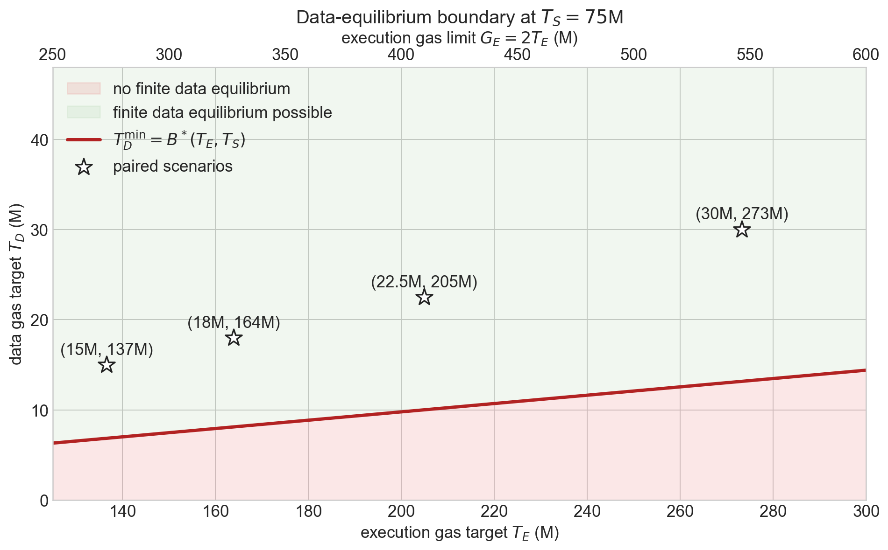
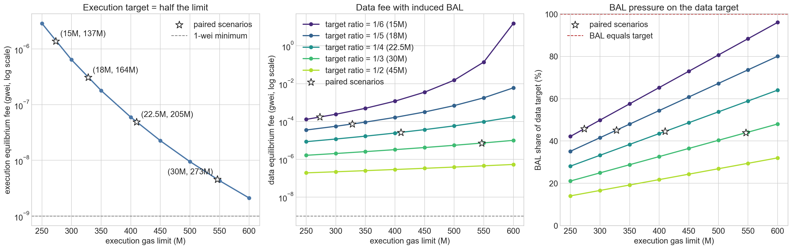
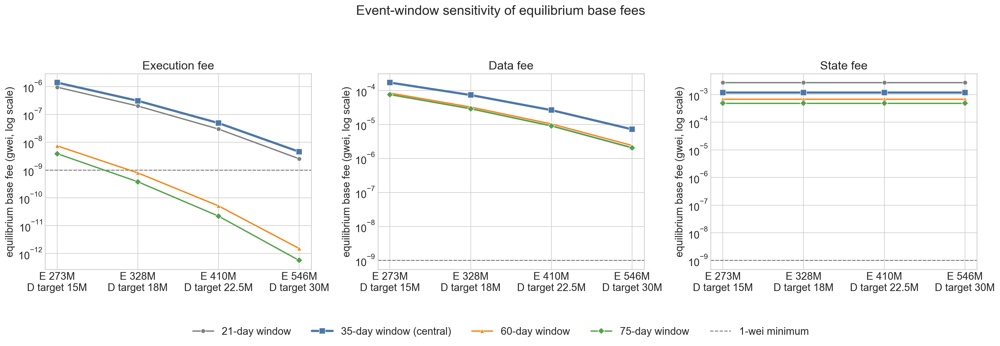

# Full EIP-7999 Equilibrium Base Fees

Under full EIP-7999, execution, data, and state have separate base fees. This report solves the fee at which demand for each resource equals its gas target. Execution and state use the independent isoelastic demand estimates. Data demand is split into static transaction data and EIP-8279 runtime BAL, which is generated by execution and state activity.

The data gas limit is fixed at 90M. We vary its target from 15M to 45M and compare it with execution limits from 250M to 600M. State has a 75M target and no hard limit. This report solves the reserve-free equilibrium. Reserve-dominated equilibria are deferred until a blob-fee path or reserve scenario is specified.

## Main results

1. The EIP-7999 anchor contains **36.821M execution gas**, **2.124M static data gas**, **1.919M runtime-BAL gas**, and **29.663M state gas** per block.
2. At the anchor, total data gas is 10.98% of execution gas. Preserving that ratio pairs data targets of 15M, 18M, 22.5M, and 30M with execution limits of approximately **273M, 328M, 410M, and 546M**.
3. With the 35-day elasticities, the protocol-representable execution fee falls from **1,388 wei** at the 273M limit to **5 wei** at the 546M limit. The corresponding data fee falls from **170,470 wei** to **7,188 wei**. The state fee remains **1,184,471 wei** because the state target does not change.
4. The high execution limits are not supported equally across the elasticity estimates. The 60- and 75-day estimates require execution fees below one wei from the matched 328M scenario onward. At a 600M limit, those two estimates support only 161M and 152M execution gas at the one-wei minimum, below the 300M target.
5. The execution and data targets should not be chosen independently. With a 600M execution limit and a 15M data target, induced BAL already consumes 14.407M gas, or **96.05%** of the data target. Static data is then squeezed into the remaining 0.593M gas, producing a data equilibrium fee of **15.48 gwei**.

## Notation

| Group | Notation | Meaning |
|---|---|---|
| Resources | $i\in\{E,D,S\}$ | Execution, data, and state |
| Activity and metering | $q_i^0$, $m_i$, $g_i^0=m_iq_i^0$ | Historical gas-equivalent activity, its EIP-7999 metering multiplier, and the resulting EIP-7999 gas |
| Fee anchors | $p^0$, $p_i^0=p^0/m_i$, $p_i$ | Historical fee anchor, cost-equivalent EIP-7999 fee anchor, and the fee at which demand is evaluated |
| Equilibrium and protocol fees | $p_i^*$, $\widetilde p_i$ | Model-implied equilibrium fee and the nearest fee represented by the integer fake exponential |
| Capacity and demand response | $G_i$, $T_i$, $\epsilon_i$ | Gas limit, gas target, and own-price elasticity. State has no hard limit. |
| static data components | $D_{\mathrm{static}}(p_D)$, $g_{D,\mathrm{static}}^0$ | Static-data demand, EIP-7999 static data anchor|
| BAL| $B_0$, $B^*$, $w_{\mathrm{state}}$, $w_{\mathrm{execution}}$|  runtime BAL gas at the historical anchor, runtime BAL gas at equilibrium, state/execution attribution weights to BAL|
| Capacity pairing | $\kappa_0$ | Total-data-to-execution gas ratio at the EIP-7999 anchor |

Superscript $0$ denotes the historical anchor, * denotes the solved equilibrium.

## Demand and metering anchors

The historical fee anchor is $p^0=0.1069$ gwei per historical gas. Repricing changes how much gas the same activity consumes. The cost-equivalent fee anchor adjusts for that accounting change:

$$
p_i^0=\frac{p^0}{m_i}.
$$

The equilibrium calculation moves away from this anchor until demand reaches the resource target. The following table summarizes the historical gas quantity, the multiplier, and the counterfactual EIP-7999 gas quantity and fee anchor for state, execution, and static data (BAL excluded).

| Resource | Historical gas-equivalent quantity $q_i^0$ | EIP-7999 multiplier $m_i$ | EIP-7999 gas $g_i^0$ | Cost-equivalent fee anchor $p_i^0$ |
|---|---:|---:|---:|---:|
| Execution | 23.942M | 1.537898 | 36.821M | 0.069529 gwei |
| Static data | 1.181M | 1.798834 | 2.124M | 0.059443 gwei |
| State | 5.244M | 5.656315 | 29.663M | 0.018904 gwei |

Runtime BAL is added separately rather than included in the static-data multiplier. Assuming a cost of 16 gas per byte, its EIP-8279 anchor is **1.919M data gas per block**.

The 35-day event window is used centrally. The other windows show how the equilibrium changes with the elasticity estimate.

| Event window | $\epsilon_E$ | $\epsilon_D$ | $\epsilon_S$ |
|---:|---:|---:|---:|
| 21 days | 0.117067 | 0.201790 | 0.478438 |
| **35 days** | **0.121160** | **0.229476** | **0.334864** |
| 60 days | 0.081668 | 0.204691 | 0.279676 |
| 75 days | 0.078511 | 0.201391 | 0.253556 |

## Equilibrium model

### Execution and state

Execution and state have independent isoelastic demand curves:

$$
g_i(p_i)=g_i^0\left(\frac{p_i}{p_i^0}\right)^{-\epsilon_i},
\qquad i\in\{E,S\}.
$$

Setting demand equal to the target gives the equilibrium fee:

$$
p_i^*=p_i^0\left(\frac{g_i^0}{T_i}\right)^{1/\epsilon_i}.
$$

### Data and runtime BAL

Data demand is the sum of static transaction data and runtime BAL:

$$
D_{\mathrm{total}}(p_D)
=D_{\mathrm{static}}(p_D)+B^*.
$$

where static transaction data demand follows its independent isoelastic demand curve as state and execution. BAL is evaluated at the execution and state targets:

$$
B^*=B_0\left[
w_{\mathrm{state}}\frac{T_S/m_S}{q_S^0}
+w_{\mathrm{execution}}
\left(\frac{T_E/m_E}{q_E^0}\right)
\right].
$$

The 6,000-block attribution gives $w_{\mathrm{state}}=0.113932$ and $w_{\mathrm{execution}}=0.886068$. Total execution acts as a proxy for existing-state access activity. We also assume that BAL demand is not affected by the data price. Therefore, once the execution and state quantities are fixed, raising the data fee reduces static data but does not directly reduce BAL. The data equilibrium is:

$$
D_{\mathrm{static}}(p_D^*)+B^*=T_D,
$$

or equivalently:

$$
p_D^*=p_D^0
\left(
\frac{g_{D,\mathrm{static}}^0}{T_D-B^*}
\right)^{1/\epsilon_D}.
$$

A data equilibrium exists only if $B^*<T_D$. If BAL alone reaches the data target, no data fee can reduce total demand to the target under the assumption that BAL does not respond to the data fee.

### Equilibrium fee and protocol fee

The equations above allow $p_i^*$ to take any positive real value. The protocol instead works in integer wei and derives the fee from integer excess gas through the fake exponential. The notebook therefore reports:

- the equilibrium fee $p_i^*$, which solves the demand equation exactly, and
- the nearest protocol-representable fee $\widetilde p_i$, which is used as the replay initialization.

The difference is normally less than one wei. It matters when $p_i^*<1$ wei, because the protocol cannot charge the fee required to reach the target. In that case, the report evaluates demand at the one-wei minimum instead of treating the algebraic solution as implementable.

## Capacity scenarios

The 90M data-gas limit is a scenario input stated in protocol-metered gas. At 16 gas per byte it represents 5,625,000 metered-byte units, or 5.625 MB, not a physical payload limit. The physical BAL adjustment replaces runtime-metered BAL with final BAL RLP rather than scaling the entire data resource. On the 1,200-block matched sample, final BAL RLP averages 134,087 bytes and runtime BAL averages 121,006 bytes, a difference of 13,080 bytes (0.0131 MB). If BAL stayed at that sample mean, the 90M limit would therefore correspond to approximately 5.638 MB after the BAL adjustment. At another operating point, the adjustment must use the runtime BAL quantity at that point. Complete transaction envelopes and other protocol framing remain outside this calculation. The target is varied through $1/6$, $1/5$, $1/4$, $1/3$, and $1/2$ of the limit. Execution limits range from 250M to 600M in 50M increments, with $T_E=G_E/2$. State has a 75M target and no hard limit.

For the main comparison, execution and data capacity are paired using the counterfactual EIP-7999 gas ratio:

$$
\kappa_0
=\frac{g_{D,\mathrm{static}}^0+B_0}{g_E^0}
=0.109795,
\qquad
T_E=\frac{T_D}{\kappa_0}.
$$

| Data target ratio | Data target | Paired execution target | Paired execution limit | Included in the main comparison? |
|---:|---:|---:|---:|:---:|
| 1/6 | 15.0M | 136.6M | 273.2M | Yes |
| 1/5 | 18.0M | 163.9M | 327.9M | Yes |
| 1/4 | 22.5M | 204.9M | 409.9M | Yes |
| 1/3 | 30.0M | 273.2M | 546.5M | Yes |
| 1/2 | 45.0M | 409.9M | 819.7M | No |

The 45M data target would pair with an execution limit of approximately 820M, outside the 250M--600M range. The ratio gives a transparent set of comparable targets. It is not an estimate of the optimal resource mix or a forecast that future demand will preserve the historical ratio.

## Minimum data target implied by BAL

With $\gamma_{\mathrm{BAL}}=0$, the data fee does not directly reduce BAL. For a fixed state target, the minimum data target compatible with a finite equilibrium is therefore determined by induced BAL:

$$
T_D^{\min}(T_E)=B^*(T_E,T_S).
$$

A finite data equilibrium requires $T_D>B^*$. On the boundary, static-data demand reaches zero only as the data fee tends to infinity. At or below the boundary, no finite data equilibrium exists under the central BAL assumption.

> The red line is runtime BAL induced by the execution target, holding the state target at 75M. It is the minimum data target under $\gamma_{\mathrm{BAL}}=0$. The shaded area below the line has no finite data equilibrium. Stars mark the four empirically paired capacity scenarios; each label reports (data target, execution target).

## Equilibrium fees for the paired scenarios

The table uses the 35-day elasticities and reports the nearest protocol-representable fee in integer wei. The parenthetical values are the same fees expressed in gwei.

| Execution limit | Data target | Execution fee $\widetilde p_E$ | Data fee $\widetilde p_D$ | State fee $\widetilde p_S$ | Runtime BAL $B^*$ | BAL share of data target |
|---:|---:|---:|---:|---:|---:|---:|
| 273.2M | 15.0M | 1,388 wei (0.000001388 gwei) | 170,470 wei (0.000170 gwei) | 1,184,471 wei (0.001184 gwei) | 6.862M | 45.75% |
| 327.9M | 18.0M | 308 wei (0.000000308 gwei) | 73,331 wei (0.000073 gwei) | 1,184,471 wei (0.001184 gwei) | 8.124M | 45.13% |
| 409.9M | 22.5M | 49 wei (0.000000049 gwei) | 26,418 wei (0.000026 gwei) | 1,184,471 wei (0.001184 gwei) | 10.017M | 44.52% |
| 546.5M | 30.0M | 5 wei (0.000000005 gwei) | 7,188 wei (0.000007 gwei) | 1,184,471 wei (0.001184 gwei) | 13.171M | 43.90% |

The state fee is identical across the four scenarios because neither the state target nor the state demand curve changes.

## Full capacity grid

> The left panel shows the execution equilibrium fee as the execution limit increases; each star label reports (data target, execution target) for the paired scenario. The middle panel shows the data equilibrium fee after adding BAL induced by the execution and state targets. The right panel reports the fraction of each data target occupied by BAL. Stars identify the same four paired scenarios. The dashed lines mark the one-wei execution minimum and the point at which BAL equals the data target.

Under the 35-day execution elasticity, the equilibrium fee falls from 2,891 wei at a 250M limit to 2.10 wei at 600M. Thus, the 300M target associated with the 600M limit can be reached under the central estimate, but only at a fee close to the protocol minimum.

The data results depend on both targets. Raising the execution target generates more BAL. If the data target is held fixed, less space remains for static transaction data and the data equilibrium fee rises. At 600M execution and a 15M data target, BAL consumes 14.407M gas. The remaining 0.593M static-data allowance produces a 15.48-gwei equilibrium fee.

## Event-window sensitivity

> Each vertical interval covers the equilibrium fees implied by the 21-, 35-, 60-, and 75-day elasticity estimates. The larger marker is the 35-day estimate. The dashed line is the one-wei protocol minimum.

Data and state remain above the one-wei minimum for all four event windows. Execution is more sensitive:

| Paired execution limit | Model-implied execution-fee range | Event windows below one wei |
|---:|---:|:---|
| 273.2M | 3.89--1,388 wei | None |
| 327.9M | 0.381--308 wei | 60 and 75 days |
| 409.9M | 0.022--48.9 wei | 60 and 75 days |
| 546.5M | 0.000569--4.55 wei | 60 and 75 days |

At the 600M execution limit, the model-implied execution fees are 1.15, 2.10, 0.000486, and 0.000173 wei for the 21-, 35-, 60-, and 75-day estimates. At the one-wei minimum, the last two demand curves support 160.9M and 152.0M execution gas, respectively, rather than the 300M target. Current demand therefore does not support a 300M execution target across the full elasticity range.

## Limitations

The capacity pairings preserve the observed data/execution gas ratio, but this ratio does not identify the optimal targets. Future transaction composition may also change after resources are priced separately.

Total execution is still a proxy for existing-state access activity. Equal amounts of execution gas can generate different amounts of runtime BAL, so an explicit access index would improve the coupling model.

The isoelastic demand curves are extrapolated well beyond the observed anchor. Equilibrium fees near one wei should be read as evidence that a target requires substantially more demand than observed, not as precise fee predictions.

This calculation does not model transaction selection, hard-limit frequency, shocks, backlog, or fee volatility. It solves the reserve-free equilibrium; reserve-dominated equilibria require a specified blob-fee path or reserve scenario. Dynamic outcomes require the driven replay.

## Data used

- February 1--May 31, 2026 accounting panel: 120 days and 860,505 blocks.
- Independent elasticities: 21-, 35-, 60-, and 75-day event-window estimates from notebook 1.8.
- Execution metering: 120-day EIP-8038 and EIP-2780 repricing with reconstructed EIP-8038 refunds.
- Static-data metering: 120-day calldata, access-list, authorization-tuple, and blob-hash accounting at 16 gas per byte.
- Runtime BAL anchor and attribution: EIP-8279 counter reconstructed and decomposed over the 6,000-block panel in notebook 1.11.
- State metering: 120-day EIP-8037 accounting with `CPSB = 1530`.

The executable calculation is in [notebook 2.0](../notebooks/2.0-full-7999-equilibrium-model.ipynb).
