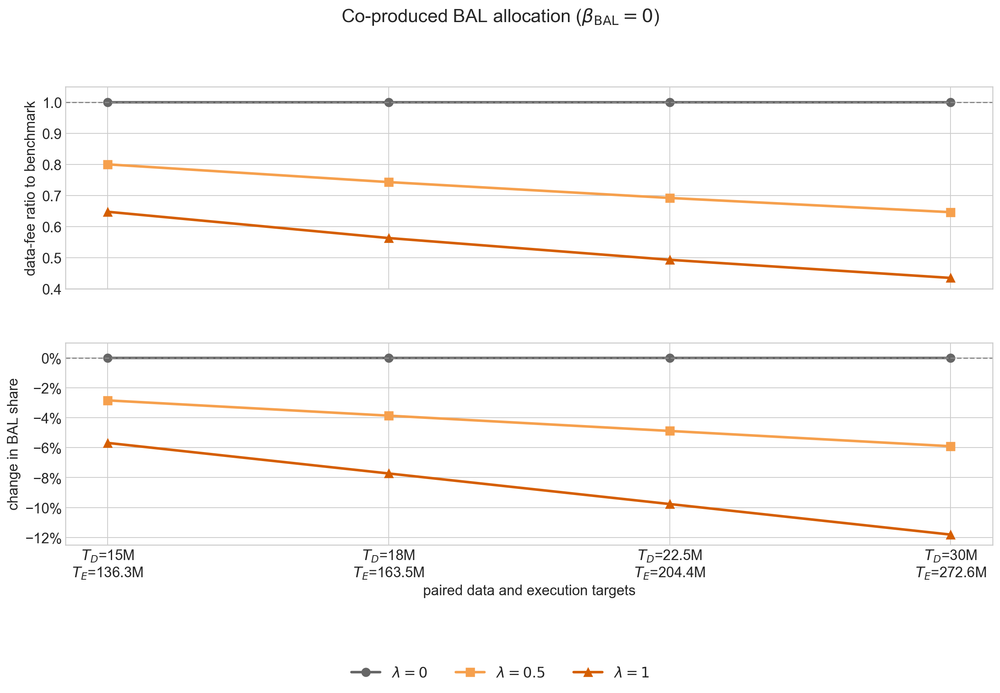
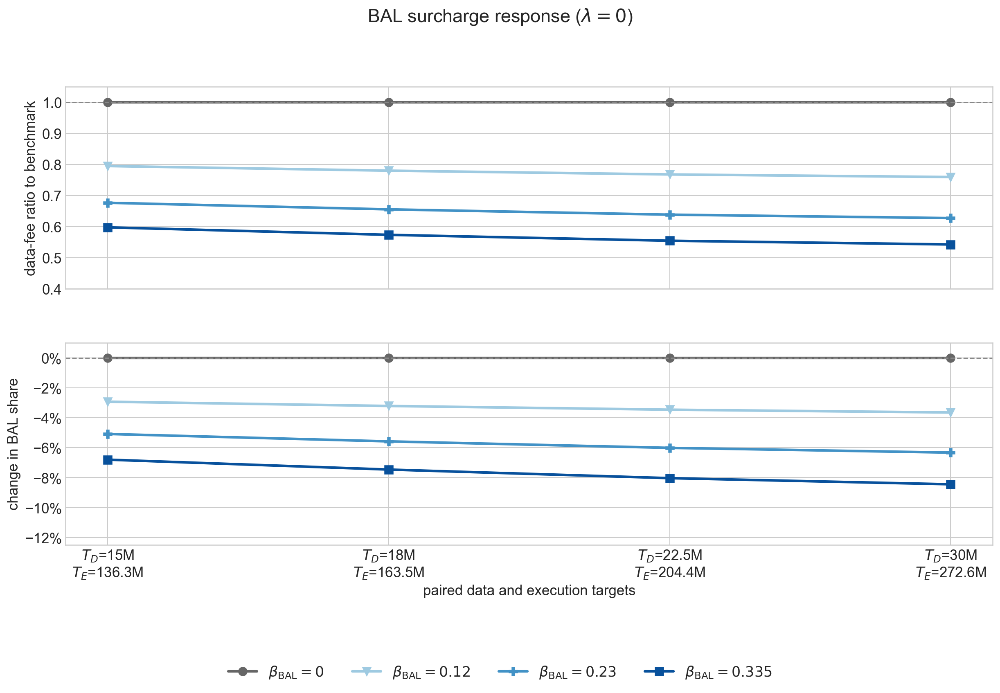
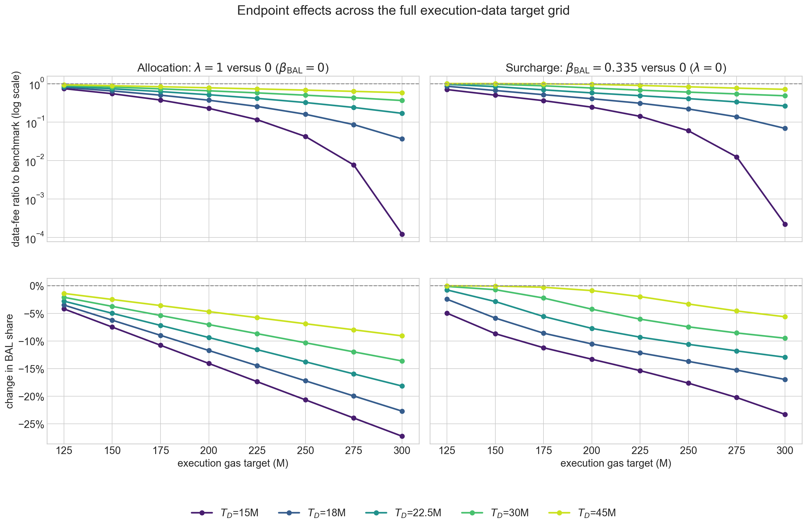
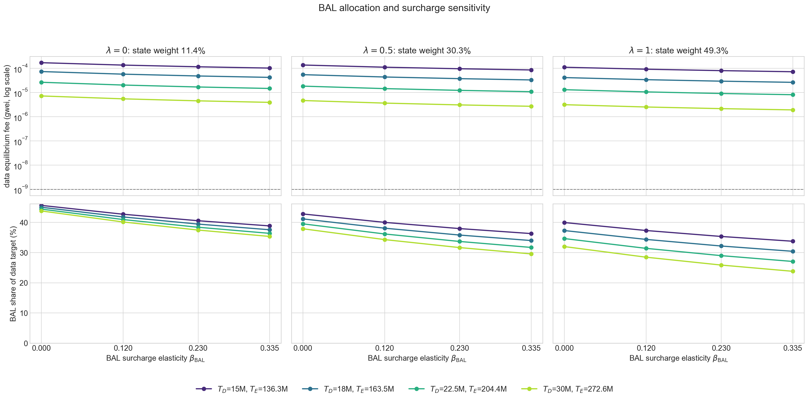
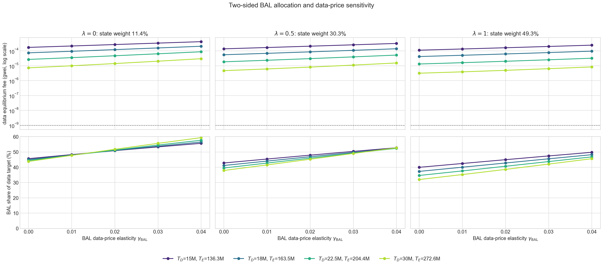

# Full EIP-7999 Equilibrium Base Fees

Under full EIP-7999, execution, data, and state have separate base fees. This report solves the fee
at which demand for each resource equals its gas target — the steady state that each dimension's
EIP-4844-style fake-exponential update rule drives toward when demand is stable. Execution and state
use the independent isoelastic demand estimates. Data demand is split into static transaction data
and EIP-8279 runtime BAL, which is generated by execution and state activity. BAL had no historical
per-byte data fee, so the main behavioral sensitivity treats its EIP-7999 charge as a new,
one-sided surcharge. Appendix B retains the earlier two-sided demand curve to show how anchoring BAL
to the historical static-data fee changes the result below that fee anchor.

The model carries forward the elasticities from the
[resource-elasticity report](three_way_resource_elasticity_report.md), the execution and state
metering multipliers from the
[Glamsterdam equilibrium report](three_way_glamsterdam_equilibrium_report.md), and the static-data
and runtime-BAL anchors from the
[BAL and data-metering report](full_7999_data_metering_and_bal_report.md).

The data gas limit is fixed at 90M. We vary its target from 15M to 45M and compare it with execution
limits from 250M to 600M. State has a 75M target and no hard limit. This report solves the
reserve-free equilibrium. Reserve-dominated equilibria are deferred until a blob-fee path or reserve
scenario is specified.

## Main results

1. **Execution and data targets cannot be chosen independently.** Runtime BAL is generated by
   execution and state activity but charged as data gas, so the execution target mechanically
   consumes part of the data target. Before its BAL-specific data-price response, induced BAL is
   linear in the execution target,
   $\widetilde B(0)\approx0.55\text{M}+0.046\,T_{\mathrm{execution}}$. Each additional 100M of
   execution target therefore generates about **4.6M of BAL data gas**.
2. **The active BAL surcharge materially reduces data pressure in imbalanced capacity scenarios.**
   Under the strong sensitivity $(\lambda,\beta_{\mathrm{BAL}})=(0,0.335)$, a 600M execution limit
   and 15M data target produce **10.916M BAL gas**, or **72.77%** of the target, and a **0.003492-gwei**
   data fee. The corresponding no-response benchmark produces 14.407M BAL gas and a 15.72-gwei
   fee. The comparison shows why the surcharge response must be applied before interpreting the
   high-execution, low-data corner. The positive response remains a sensitivity assumption rather
   than an empirical estimate.
3. **The ratio-matched scenarios are comparability benchmarks.** Preserving the anchor's 11.01%
   data/execution gas ratio pairs data targets of 15M, 18M, 22.5M, and 30M with execution limits of
   approximately **273M, 327M, 409M, and 545M**. At $\beta_{\mathrm{BAL}}=0$, induced BAL takes
   44--46% of each data target, and the fees fall from (execution **1,417 wei**, data **171,734
   wei**) to (**5 wei**, **7,243 wei**). The state fee is **1,184,471 wei** in every scenario because
   the 75M state target never changes.
4. **Demand adequacy binds the execution side before the data side.** Under the 60- and 75-day
   elasticity estimates, execution fees can fall below 1 wei. At a 600M limit, those estimates
   support only 161M and 152M execution gas at the 1-wei minimum, below the 300M target.
5. **A stronger surcharge response lowers modeled BAL pressure.** Holding $\lambda=0$ and raising
   $\beta_{\mathrm{BAL}}$ from 0 to 0.335 lowers the data fee by **40.2--45.7%** across the four
   paired scenarios. BAL's share of the data target falls by **6.8--8.4 percentage points**.
6. **The allocation of co-produced BAL is also material.** Moving from the benchmark
   $(\lambda,\beta_{\mathrm{BAL}})=(0,0)$ to the combined sensitivity $(1,0.335)$ lowers the data
   fee by **57.7--73.5%** and BAL's target share by **11.9--20.0 percentage points**. At a 300M
   execution target, the finite-equilibrium boundary ranges from **6.65M to 14.41M** across the
   tested surcharge specifications; the data target must lie above the relevant curve. All four
   paired scenarios lie above this envelope.

## Notation

| Group | Notation | Meaning |
|---|---|---|
| Resources | $i\in\{\mathrm{execution},\mathrm{data},\mathrm{state}\}$ | Resource index carried forward from the elasticity report |
| Execution and state metering | $q_i^0$, $m_i$, $g_i^0=m_iq_i^0$ | Historical gas-equivalent activity, EIP-7999 metering multiplier, and resulting gas for $i\in\{\mathrm{execution},\mathrm{state}\}$ |
| Effective prices | $p^0$, $p_i(b_i)=m_i b_i$, $r_i(b_i)=p_i(b_i)/p^0$ | Historical common-price anchor, effective resource price, and effective-price ratio |
| Protocol base fees | $b_i^0$, $b_i$, $b_i^*$, $\widetilde b_i$ | Cost-equivalent anchor, candidate fee, equilibrium fee, and nearest integer fake-exponential fee |
| Capacity and demand response | $G_i$, $T_i$, $\epsilon_i$ | Gas limit, gas target, and own-price elasticity. State has no hard limit. |
| Static data | $q_{\mathrm{data}}^0$, $m_{\mathrm{data,static}}$, $g_{\mathrm{static}}(b_{\mathrm{data}})$, $g_{\mathrm{static}}^0$ | Historical data quantity, static-data multiplier, gas demand, and EIP-7999 anchor |
| Runtime BAL | $M_{\mathrm{BAL}}$, $g_{\mathrm{BAL}}^0$, $\widetilde B$, $g_{\mathrm{BAL}}^*$ | Runtime-metered BAL bytes, historical anchor, induced BAL before its new data charge, and BAL at equilibrium |
| BAL attribution | $d$, $c$, $n$, $\lambda$, $\omega_{\mathrm{state}}(\lambda)$, $\omega_{\mathrm{execution}}(\lambda)$ | Direct-state, co-produced, and non-state-transaction shares; co-produced allocation; and effective parent weights |
| Legacy BAL demand curve | $\gamma_{\mathrm{BAL}}$ | Two-sided elasticity used only for the Appendix B anchoring diagnostic |
| BAL surcharge | $\beta_{\mathrm{BAL}}$, $\Psi_{\mathrm{BAL}}$, $\Psi_{\mathrm{BAL}}^{\min}$ | Heuristic BAL-carrying-transaction response to the new BAL charge, its scenario-weighted aggregate, and its limiting value as $b_{\mathrm{data}}\to\infty$ |
| Capacity pairing | $\kappa^0$ | Total-data-to-execution gas ratio at the EIP-7999 anchor |

The notation is inherited from the elasticity, Glamsterdam, and BAL reports. Superscript $0$
denotes the historical anchor, and $*$ denotes the solved equilibrium.
For the data price ratio, the multiplier is $m_{\mathrm{data,static}}$ because the independently
estimated data-demand curve applies to static transaction content. Runtime BAL enters as a separate
data-gas component.

## Demand and metering anchors

The demand curves were estimated in current gas units, while the EIP-7999 targets are stated in
EIP-7999 gas. The metering multipliers convert between these accounting systems, allowing the
equilibrium calculation to use the same reference activity on both sides.

The historical common-price anchor is $p^0=0.1069$ gwei per historical gas-equivalent unit.
Repricing changes how much gas the same activity consumes. The cost-equivalent EIP-7999 base-fee
anchor adjusts for that accounting change:

$$
b_i^0=\frac{p^0}{m_i},
\quad i\in\{\mathrm{execution},\mathrm{state}\},
\qquad
b_{\mathrm{data}}^0=\frac{p^0}{m_{\mathrm{data,static}}}.
$$

The equilibrium calculation moves away from this anchor until demand reaches the resource's gas
target. The following table summarizes the historical gas quantity, the multiplier, and the
counterfactual EIP-7999 gas quantity and fee anchor for state, execution, and static data (BAL
excluded).

| Resource | Historical gas-equivalent quantity | EIP-7999 multiplier | Counterfactual gas anchor | Cost-equivalent base-fee anchor |
|---|---:|---:|---:|---:|
| Execution | $q_{\mathrm{execution}}^0=23.942$M | $m_{\mathrm{execution}}=1.537898$ | $g_{\mathrm{execution}}^0=36.821$M | $b_{\mathrm{execution}}^0=0.069529$ gwei |
| Static data | $q_{\mathrm{data}}^0=1.181$M | $m_{\mathrm{data,static}}=1.807251$ | $g_{\mathrm{static}}^0=2.134$M | $b_{\mathrm{data}}^0=0.059166$ gwei |
| State | $q_{\mathrm{state}}^0=5.244$M | $m_{\mathrm{state}}=5.656315$ | $g_{\mathrm{state}}^0=29.663$M | $b_{\mathrm{state}}^0=0.018904$ gwei |

Runtime BAL has its own anchor, $g_{\mathrm{BAL}}^0=1.919$M data gas per block at 16 gas per
EIP-8279 runtime byte. Total data gas at the anchor is
$g_{\mathrm{data}}^0=g_{\mathrm{static}}^0+g_{\mathrm{BAL}}^0$.

The 35-day event window is used centrally. The other windows show how the equilibrium changes with
the elasticity estimate.

| Event window | $\epsilon_{\mathrm{execution}}$ | $\epsilon_{\mathrm{data}}$ | $\epsilon_{\mathrm{state}}$ |
|---:|---:|---:|---:|
| 21 days | 0.117067 | 0.201790 | 0.478438 |
| **35 days** | **0.121160** | **0.229476** | **0.334864** |
| 60 days | 0.081668 | 0.204691 | 0.279676 |
| 75 days | 0.078511 | 0.201391 | 0.253556 |

## Equilibrium model

The equilibrium is the fee at which modeled demand equals the gas target. If demand is stable and
the protocol is at the corresponding excess-gas value, target usage leaves the fee unchanged.
Computing it takes two ingredients: a demand curve for each resource, estimated from the gas-limit
events and anchored at the observed quantities and fee, and the resource target. The equilibrium
fee is where the curve crosses the target. This has a closed form for the independent isoelastic
curves used for execution and state.

Two complications enter the calculation. First, execution and state activity generate BAL gas, so
the data demand curve shifts with their targets. Second, the protocol has a 1-wei minimum. When
demand at 1 wei remains below the target, the fee stays at 1 wei and usage remains below target.

### Execution and state

Execution and state have independent isoelastic demand curves:

$$
g_i(b_i)
=g_i^0r_i(b_i)^{-\epsilon_i}
=g_i^0\left(\frac{b_i}{b_i^0}\right)^{-\epsilon_i},
\qquad
i\in\{\mathrm{execution},\mathrm{state}\}.
$$

Setting demand equal to the target gives the equilibrium fee:

$$
b_i^*=b_i^0\left(\frac{g_i^0}{T_i}\right)^{1/\epsilon_i}.
$$

### Data and runtime BAL

Data-gas demand is the sum of static transaction data and runtime BAL:

$$
g_{\mathrm{data}}(b_{\mathrm{data}};T_{\mathrm{execution}},T_{\mathrm{state}})
=g_{\mathrm{static}}(b_{\mathrm{data}})
+g_{\mathrm{BAL}}(b_{\mathrm{data}};T_{\mathrm{execution}},T_{\mathrm{state}}).
$$

Static transaction data follows the independent isoelastic curve defined in the BAL and data
metering report. Runtime BAL first scales with its parent state and execution/access activity, and
then responds to the new BAL surcharge through a transaction-level response. Appendix B evaluates
the earlier two-sided demand-curve specification separately.

The 6,000-block attribution gives a direct-state share $d=0.113937$, a co-produced access share
$c=0.378791$ inside state-creating transactions, and a non-state-transaction share $n=0.507272$.
These are raw-panel shares; the model applies them to the canonically day-weighted BAL anchor.
The effective weights are

$$
\omega_{\mathrm{state}}(\lambda)=d+\lambda c,
\qquad
\omega_{\mathrm{execution}}(\lambda)=n+(1-\lambda)c.
$$

The surcharge analysis and Appendix B use three allocation values: the two endpoints and their
midpoint.

| $\lambda$ | $\omega_{\mathrm{state}}(\lambda)$ | $\omega_{\mathrm{execution}}(\lambda)$ | Treatment of co-produced BAL |
|---:|---:|---:|---|
| **0** | **0.113937** | **0.886063** | Follows the execution/access proxy; central specification |
| 0.5 | 0.303333 | 0.696667 | Split equally between state and execution/access activity |
| 1 | 0.492728 | 0.507272 | Follows state demand |

Define the parent-activity ratios

$$
R_S=\frac{T_{\mathrm{state}}/m_{\mathrm{state}}}{q_{\mathrm{state}}^0},
\qquad
R_A=\left(
\frac{T_{\mathrm{execution}}/m_{\mathrm{execution}}}
{q_{\mathrm{execution}}^0}
\right)^{\rho_A},
\qquad \rho_A=1.
$$

Total execution is the available proxy for existing-state access activity. The induced BAL before
any response to its new data charge is

$$
\widetilde B(\lambda)=g_{\mathrm{BAL}}^0
\left[
\omega_{\mathrm{state}}(\lambda)R_S
+\omega_{\mathrm{execution}}(\lambda)R_A
\right].
$$

The central benchmark sets $\lambda=0$ and $\beta_{\mathrm{BAL}}=0$, giving
$g_{\mathrm{BAL}}^*=\widetilde B(0)$.

The data equilibrium is:

$$
g_{\mathrm{static}}(b_{\mathrm{data}}^*)+g_{\mathrm{BAL}}^*=T_{\mathrm{data}},
$$

or equivalently:

$$
b_{\mathrm{data}}^*=b_{\mathrm{data}}^0
\left(
\frac{g_{\mathrm{static}}^0}{T_{\mathrm{data}}-\widetilde B(0)}
\right)^{1/\epsilon_{\mathrm{data}}}.
$$

#### One-sided BAL surcharge

The surcharge uses the complete transaction-level panel of BAL-carrying transactions.
For transaction $j$, let
$g_{d,j}$, $g_{c,j}$, and $g_{n,j}$ denote direct-state, co-produced, and non-state BAL gas. Its
scenario weight is

$$
\widetilde g_{\mathrm{BAL},j}(\lambda)
=R_S\left(g_{d,j}+\lambda g_{c,j}\right)
+R_A\left[g_{n,j}+(1-\lambda)g_{c,j}\right].
$$

The measured transaction fee before its BAL charge is

$$
C_{\mathrm{noBAL},j}
=b_{\mathrm{execution}}g_{\mathrm{execution},j}
+b_{\mathrm{state}}g_{\mathrm{state},j}
+b_{\mathrm{data}}g_{\mathrm{static},j}.
$$

Here static data includes calldata, access-list content, 108-byte authorization tuples, the 51
static BAL bytes associated with each authorization, and blob-versioned hashes. Adding the BAL
charge gives the aggregate response

$$
\Psi_{\mathrm{BAL}}(b_{\mathrm{data}})
=
\frac{
\sum_j \widetilde g_{\mathrm{BAL},j}(\lambda)
\left(
1+\frac{b_{\mathrm{data}}g_{\mathrm{BAL},j}}
{C_{\mathrm{noBAL},j}}
\right)^{-\beta_{\mathrm{BAL}}}
}{
\sum_j \widetilde g_{\mathrm{BAL},j}(\lambda)
}.
$$

The data equilibrium then solves

$$
g_{\mathrm{static}}^0r_{\mathrm{data}}^{-\epsilon_{\mathrm{data}}}
+\widetilde B(\lambda)\Psi_{\mathrm{BAL}}(b_{\mathrm{data}})
=T_{\mathrm{data}}.
$$

At $\beta_{\mathrm{BAL}}=0$ every response term equals one, $\Psi_{\mathrm{BAL}}=1$, and this
reduces to the closed form above. For $\beta_{\mathrm{BAL}}>0$, the notebook solves the equation
numerically. The values $0.12$, $0.23$, and $0.335$ are heuristic sensitivities; current fee markets
do not identify the response of BAL-carrying transactions to the future combined transaction fee.

The surcharge is the main text's functional form because EIP-7999 introduces a BAL charge where none
existed before. Because every response term is at most one, a larger $\beta_{\mathrm{BAL}}$ can only
reduce induced BAL, never expand it.
<!--
### Equilibrium fee and protocol fee

The equations above allow $b_i^*$ to take any positive real value. The protocol instead works in integer wei and derives the fee from integer excess gas through the fake exponential. The notebook therefore reports:

- the equilibrium fee $b_i^*$, which solves the demand equation exactly, and
- the nearest protocol-representable fee $\widetilde b_i$, which is used as the replay initialization.

The difference is normally less than one wei. It matters when $b_i^*<1$ wei, because the protocol cannot charge the fee required to reach the target. In that case, the report evaluates demand at the one-wei minimum instead of treating the algebraic solution as implementable. -->

## Capacity scenarios

Because induced BAL ties the data market to the execution target, execution and data capacity have
to be chosen jointly. The scenarios therefore separate three inputs: the hard data limit, the data
target, and the execution limit with its target at one half.

At 16 gas per byte, the 90M data gas limit represents 5,625,000 metered-byte units, or 5.364 MiB.
Replacing runtime-metered BAL with the final BAL RLP object adds roughly 0.0125 MiB in the matched
sample. This gives approximately 5.377 MiB after the BAL adjustment; complete transaction envelopes
and other framing remain outside this estimate.

The data target is varied through $1/6$, $1/5$, $1/4$, $1/3$, and $1/2$ of
$G_{\mathrm{data}}=90$M. Execution limits range from 250M to 600M in 50M increments, with
$T_{\mathrm{execution}}=G_{\mathrm{execution}}/2$. State has a 75M target and no hard limit. For
the main comparison, execution and data capacity are paired using the counterfactual EIP-7999 gas
ratio at the anchor:

$$
\kappa^0
=\frac{g_{\mathrm{static}}^0+g_{\mathrm{BAL}}^0}{g_{\mathrm{execution}}^0}
=0.110065,
\qquad
T_{\mathrm{execution}}=\frac{T_{\mathrm{data}}}{\kappa^0}.
$$

| Data target ratio | Data target | Paired execution target | Paired execution limit | Included in the main comparison? |
|---:|---:|---:|---:|:---:|
| 1/6 | 15.0M | 136.3M | 272.6M | Yes |
| 1/5 | 18.0M | 163.5M | 327.1M | Yes |
| 1/4 | 22.5M | 204.4M | 408.9M | Yes |
| 1/3 | 30.0M | 272.6M | 545.1M | Yes |
| 1/2 | 45.0M | 408.9M | 817.7M | No |

The 45M data target would pair with an execution limit of approximately 818M, outside the
250M--600M range. The ratio supplies a transparent comparability benchmark. Optimal target selection
and future transaction composition require separate analysis.

## Minimum data target implied by BAL

BAL occupies part of the data target before any static transaction data is priced. This section asks
how much room that leaves, and whether some data fee can always clear the target.

### The boundary when BAL does not respond to the data fee

Under the no-response benchmark $\beta_{\mathrm{BAL}}=0$, BAL gas stays at
$\widetilde B(\lambda)$ whatever the data fee does. Static data still follows its own demand curve,
so a finite equilibrium requires

$$
T_{\mathrm{data}}>\widetilde B(\lambda).
$$

Equality is reached only as the fee tends to infinity, where static-data demand vanishes. With the
anchor values and the 75M state target, this minimum target is linear in the execution target for
any $\lambda$: the state-linked part of BAL is a constant because the state target is fixed, and the
execution-linked part scales with $T_{\mathrm{execution}}$.

$$
T_{\mathrm{data}}^{\min}
=\underbrace{g_{\mathrm{BAL}}^0\,\omega_{\mathrm{state}}(\lambda)R_S}_{\text{intercept}}
+\underbrace{\frac{g_{\mathrm{BAL}}^0\,\omega_{\mathrm{execution}}(\lambda)}{g_{\mathrm{execution}}^0}}_{\text{slope}}
\;T_{\mathrm{execution}}
\;\approx\;(0.55+1.84\lambda)\text{M}
+(0.046-0.020\lambda)\,T_{\mathrm{execution}}.
$$

| $\lambda$ | Intercept | Slope | $T_{\mathrm{data}}^{\min}$ at $T_{\mathrm{execution}}=300$M |
|---:|---:|---:|---:|
| **0** | **0.55M** | **0.0462** | **14.41M** |
| 0.5 | 1.47M | 0.0363 | 12.36M |
| 1 | 2.39M | 0.0264 | 10.32M |

At $\lambda=0$ each additional 100M of execution target raises the minimum data target by about
4.6M; at $\lambda=1$ only about 2.6M, because more of BAL is tied to the fixed state target instead.
Raising $\lambda$ therefore lifts the intercept and flattens the slope at the same time. The two
effects cancel at $T_{\mathrm{execution}}\approx93$M: below that point a larger $\lambda$ would raise
the minimum data target, and above it a larger $\lambda$ lowers it. The whole capacity grid
(250--600M) and every paired scenario (from 136M) sit well above that crossover, which is why
$\lambda=0$ is the tighter case throughout this report. The line depends on the measured BAL anchors
and metering and is invariant to the elasticity estimates.

### The boundary with a positive surcharge response

To determine whether any finite data fee can clear the target, take the mathematical limit
$b_{\mathrm{data}}\to\infty$. This limit is a feasibility calculation rather than a prediction of
the equilibrium fee. Static-data demand approaches zero, while BAL converges to a limiting quantity
under the surcharge model. With $\beta_{\mathrm{BAL}}=0$, all induced BAL remains. For
$\beta_{\mathrm{BAL}}>0$, the response of a BAL-carrying transaction converges to a finite value set
by its measured BAL-to-static-data ratio:

| Surcharge response | BAL as $b_{\mathrm{data}}\to\infty$ | Finite-equilibrium condition |
|---|---:|---:|
| $\beta_{\mathrm{BAL}}=0$ | $\widetilde B(\lambda)$ | $T_{\mathrm{data}}>\widetilde B(\lambda)$ |
| $\beta_{\mathrm{BAL}}>0$ | $\widetilde B(\lambda)\Psi_{\mathrm{BAL}}^{\min}$ | $T_{\mathrm{data}}>\widetilde B(\lambda)\Psi_{\mathrm{BAL}}^{\min}$ |

In the limit $b_{\mathrm{data}}\to\infty$, the static-data term
$b_{\mathrm{data}}g_{\mathrm{static},j}$ dominates the transaction's pre-BAL fee. Both its static
data and BAL charges are proportional to $b_{\mathrm{data}}$, so the common fee cancels from the
surcharge ratio, giving

$$
\Psi_{\mathrm{BAL}}^{\min}
=\frac{
\sum_j \widetilde g_{\mathrm{BAL},j}(\lambda)
\left(1+\frac{g_{\mathrm{BAL},j}}{g_{\mathrm{static},j}}\right)^{-\beta_{\mathrm{BAL}}}
}{
\sum_j \widetilde g_{\mathrm{BAL},j}(\lambda)
}.
$$

The quantity $\Psi_{\mathrm{BAL}}^{\min}$ is the fraction of parent-induced BAL retained in this
limit. For example, $\Psi_{\mathrm{BAL}}^{\min}=0.851$ means that 85.1% of induced BAL remains as
$b_{\mathrm{data}}\to\infty$. It does not mean that the equilibrium data fee is large. The aggregate
remains positive because almost every BAL-carrying transaction also contains static data. Of the
996,163 BAL-carrying transactions, 6,754 have zero static data and account for 0.08% of runtime BAL
gas; their term in the expression above is defined as zero because their individual limiting
response is zero.

The remaining BAL quantity is the data-target boundary. A finite equilibrium exists only when
$T_{\mathrm{data}}$ is strictly greater than this boundary. The one-wei minimum is a separate
upper-target demand-adequacy check.

### How BAL assumptions change the data-target boundary

Fixing the execution target makes the capacity implication direct: the calculation reports how much
data target is required under each BAL assumption. The table uses
$T_{\mathrm{execution}}=300$M, corresponding to the 600M execution limit at the upper end of the
analyzed capacity grid. Each $\Psi_{\mathrm{BAL}}^{\min}$ value uses transaction weights evaluated
at this same execution target.

| $\lambda$ | $\beta_{\mathrm{BAL}}$ | Limiting BAL fraction $\Psi_{\mathrm{BAL}}^{\min}$ | Boundary at $T_{\mathrm{execution}}=300$M |
|---:|---:|---:|---:|
| **0** | **0** | **1.000** | **14.41M** |
| 0 | 0.12 | 0.851 | 12.26M |
| 0 | 0.23 | 0.743 | 10.71M |
| 0 | 0.335 | 0.660 | 9.50M |
| 1 | 0 | 1.000 | 10.32M |
| 1 | 0.335 | 0.644 | 6.65M |

At $\lambda=0$, increasing $\beta_{\mathrm{BAL}}$ from 0 to 0.335 lowers the boundary from 14.41M
to 9.50M data gas, a 34.0% reduction. A larger $\lambda$ routes co-produced BAL through state
activity. Because execution/access activity scales further above its anchor than the fixed 75M
state target, this produces less BAL in the analyzed capacity range. With $\lambda=1$ and
$\beta_{\mathrm{BAL}}=0.335$, the boundary is 6.65M.

Across the tested surcharge grid, $(\lambda,\beta_{\mathrm{BAL}})=(0,0)$ gives the highest boundary
and $(1,0.335)$ gives the lowest. The data target must lie strictly above the relevant curve for a
finite equilibrium. The notebook evaluates $\Psi_{\mathrm{BAL}}^{\min}$ from scenario-specific
transaction weights at every point on each curve.

> The red line is the no-response benchmark and the blue line is the strong surcharge sensitivity.
> The lower and upper edges of the yellow band span all tested values of $\lambda$ and
> $\beta_{\mathrm{BAL}}$. Below the band, every tested specification lacks a finite data
> equilibrium; inside it, feasibility depends on the BAL assumptions; above it, every tested
> specification has a finite equilibrium. Stars report (data target, execution target) for the four
> ratio-matched scenarios. Equality with any boundary requires an infinite data fee.

## Equilibrium fees for the paired scenarios

The paired scenarios preserve the anchor data/execution ratio for comparison. As both targets scale,
induced BAL remains at 44--46% of the data target. This table uses the 35-day elasticities,
$\lambda=0$, and $\beta_{\mathrm{BAL}}=0$. It reports the nearest protocol-representable fee in
integer wei, with the same fees in gwei in parentheses. The surcharge sensitivity below varies
$\lambda$ and $\beta_{\mathrm{BAL}}$.

| Execution limit | Data target | Execution fee $\widetilde b_{\mathrm{execution}}$ | Data fee $\widetilde b_{\mathrm{data}}$ | State fee $\widetilde b_{\mathrm{state}}$ | Runtime BAL $g_{\mathrm{BAL}}^*$ | BAL share of data target |
|---:|---:|---:|---:|---:|---:|---:|
| 272.6M | 15.0M | 1,417 wei (0.000001417 gwei) | 171,734 wei (0.000172 gwei) | 1,184,471 wei (0.001184 gwei) | 6.847M | 45.64% |
| 327.1M | 18.0M | 315 wei (0.000000315 gwei) | 73,882 wei (0.000074 gwei) | 1,184,471 wei (0.001184 gwei) | 8.105M | 45.03% |
| 408.9M | 22.5M | 50 wei (0.000000050 gwei) | 26,619 wei (0.000027 gwei) | 1,184,471 wei (0.001184 gwei) | 9.994M | 44.42% |
| 545.1M | 30.0M | 5 wei (0.000000005 gwei) | 7,243 wei (0.000007 gwei) | 1,184,471 wei (0.001184 gwei) | 13.140M | 43.80% |

The state fee is identical across the four scenarios because the state target and the state demand curve do not change.

## The execution-data target interaction under the BAL surcharge

The full grid varies the execution limit and data target independently. This section summarizes its
results under the strong surcharge sensitivity; Appendix A reports the endpoint contrasts across the
same grid. The specification uses the 35-day elasticities, $\lambda=0$, and
$\beta_{\mathrm{BAL}}=0.335$. This positive response is not calibrated from historical data.

Under the 35-day execution elasticity, the equilibrium fee falls from 2,891 wei at a 250M limit to
2.10 wei at 600M. Thus, the 300M target associated with the 600M limit can be reached under the
central estimate, but only at a fee close to the protocol minimum.

The data results depend on both targets. Raising the execution target generates more BAL; if the
data target is held fixed, less space remains for static transaction data and the data equilibrium
fee rises. The surcharge response partly offsets that pressure because a higher data fee raises the
new BAL charge paid by BAL-carrying transactions. Across the 40 tested capacity combinations, the
data fee remains below its 0.059166-gwei cost-equivalent anchor.

The largest fee occurs at the most imbalanced point: a 600M execution limit, corresponding to a
300M target, together with a 15M data target. There
$\Psi_{\mathrm{BAL}}=0.7576$, BAL occupies **10.916M gas** or **72.77%** of the target, and
**4.084M gas** remains for static data. The resulting equilibrium data fee is **0.003492 gwei**,
about 5.9% of its cost-equivalent anchor. Under the no-response benchmark, the same point has
14.407M BAL gas and a 15.72-gwei data fee. The difference is the effect of applying the surcharge
response inside the equilibrium rather than holding BAL fixed as the data fee rises.

## BAL allocation and surcharge sensitivity

The figures separate the two BAL assumptions. The allocation figure fixes
$\beta_{\mathrm{BAL}}=0$ and varies $\lambda\in\{0,0.5,1\}$. The surcharge figure fixes
$\lambda=0$ and varies $\beta_{\mathrm{BAL}}\in\{0,0.12,0.23,0.335\}$. Execution and state fees
stay fixed within each capacity scenario because their independent demand curves do not change.
The positive values of $\beta_{\mathrm{BAL}}$ represent mild, moderate, and strong heuristic
responses. None is empirically calibrated.

| $\lambda$ | $\beta_{\mathrm{BAL}}$ | Data-fee range (gwei) | BAL share of target |
|---:|---:|---:|---:|
| **0** | **0** | **0.000007--0.000172** | **43.80--45.64%** |
| 0 | 0.12 | 0.000006--0.000137 | 40.15--42.71% |
| 0 | 0.23 | 0.000005--0.000116 | 37.47--40.56% |
| 0 | 0.335 | 0.000004--0.000103 | 35.35--38.84% |
| 0.5 | 0 | 0.000005--0.000138 | 37.90--42.80% |
| 0.5 | 0.12 | 0.000004--0.000112 | 34.31--40.02% |
| 0.5 | 0.23 | 0.000003--0.000096 | 31.66--37.95% |
| 0.5 | 0.335 | 0.000003--0.000086 | 29.57--36.30% |
| 1 | 0 | 0.000003--0.000111 | 31.99--39.96% |
| 1 | 0.12 | 0.000003--0.000092 | 28.47--37.32% |
| 1 | 0.23 | 0.000002--0.000081 | 25.87--35.35% |
| 1 | 0.335 | 0.000002--0.000073 | 23.80--33.76% |

> The upper panel divides each data equilibrium fee by the fee under
> $(\lambda,\beta_{\mathrm{BAL}})=(0,0)$ in the same paired scenario. The lower panel reports the
> change in BAL's share of the data target in percentage points. This figure holds
> $\beta_{\mathrm{BAL}}=0$ and varies the share of co-produced BAL allocated to state activity.

At $\beta_{\mathrm{BAL}}=0$, the midpoint allocation $\lambda=0.5$ lowers the fee by 19.9--35.3%
and the BAL share by 2.8--5.9 percentage points. Raising $\lambda$ to 1 lowers the fee by
35.2--56.4% and the BAL share by 5.7--11.8 percentage points. The direction depends on the target
range. In the scenarios studied here, execution/access activity is scaled further above its anchor
than state activity. Routing the 37.879% co-produced component toward state therefore lowers induced
BAL. The crossover occurs near a 93M execution target; the direction reverses below that point.

> This figure uses the same benchmark and vertical scales as the allocation figure. It holds
> $\lambda=0$ and varies the response to the new BAL surcharge. A fee ratio of 0.60 means a 40%
> reduction from the benchmark; a BAL-share change of $-8$ means eight percentage points less of
> the data target is occupied by BAL.

At $\lambda=0$, $\beta_{\mathrm{BAL}}=0.12$ lowers the data fee by 20.5--24.0% and BAL's target
share by 2.9--3.7 percentage points. Raising $\beta_{\mathrm{BAL}}$ to $0.23$ lowers the fee by
32.3--37.2% and the BAL share by 5.1--6.3 percentage points. At $0.335$, the corresponding
reductions are 40.2--45.7% and 6.8--8.4 percentage points. Combining $\lambda=1$ with
$\beta_{\mathrm{BAL}}=0.335$ lowers the fee by 57.7--73.5% and the BAL share by 11.9--20.0
percentage points. Appendix A reports both the full execution-data target grid and the complete
$\lambda\times\beta_{\mathrm{BAL}}$ grid for the paired scenarios.

## Limitations

Neither $\lambda$ nor $\beta_{\mathrm{BAL}}$ is identified by the historical fee market. The
reported positive values of $\beta_{\mathrm{BAL}}$ are heuristic response cases.

The surcharge benchmark sets $\beta_{\mathrm{BAL}}=0$, so the new BAL charge does not reduce
activity among BAL-carrying transactions. The positive-$\beta_{\mathrm{BAL}}$ sensitivity changes
BAL demand while holding aggregate execution, state, and static-data demand at their targets or
independent demand curves. A complete bundle model would remove all resource use from a transaction
that exits.

The 6,000-block surcharge panel uses transaction-level cost proxies. State gas excludes
delegation-only creation and uses the uncalibrated Xatu state counts; execution gas applies the
aggregate 1.537898 multiplier to every transaction. These approximations affect the
positive-$\beta_{\mathrm{BAL}}$ sensitivity. The $\beta_{\mathrm{BAL}}=0$ equilibrium does
not use the transaction-cost decomposition.

The capacity pairings preserve the observed data/execution gas ratio for comparability. Optimal
targets and transaction composition under separate prices remain open design questions.

The elasticity and BAL reports document the inherited estimation limitations: event-window
sensitivity, the state-creation proxy, total execution as the BAL access proxy, and the unidentified
$\lambda$ and $\beta_{\mathrm{BAL}}$. The isoelastic curves are
extrapolated far beyond the observed anchor. For the 60- and 75-day execution estimates, the data
calculation still conditions on the requested execution target even when the one-wei minimum
prevents execution from reaching it. A protocol-constrained dynamic replay should instead feed
realized execution usage into BAL demand.

The executable surcharge calculation is in
[archived notebook 2.0](../archived/notebooks/2.0-full-7999-equilibrium-model.ipynb). The two-sided demand-curve
calculation is in
[archived notebook 2.2](../archived/notebooks/2.2-full-7999-two-sided-bal-equilibrium.ipynb).

## Conclusion

Runtime BAL couples the execution and data targets even though EIP-7999 gives each resource its own
fee update. The no-response benchmark makes this coupling transparent: each additional 100M of
execution target produces about 4.6M data gas at $\lambda=0$, and the data fee rises sharply when
the target approaches induced BAL.

The one-sided surcharge sensitivity lowers BAL intensity because EIP-7999 adds a new charge to
BAL-carrying transactions. Across the paired scenarios, the strong surcharge case reduces the data
fee by 40.2--45.7%. Combining it with the high state-allocation case reduces the fee by
57.7--73.5%. The no-response benchmark is therefore the highest-BAL case within the tested
surcharge family. The size of the reduction remains conditional on $\lambda$ and
$\beta_{\mathrm{BAL}}$.

All four ratio-matched scenarios sit above the complete surcharge boundary envelope. The larger
execution targets still require substantial demand extrapolation, and the 60- and 75-day estimates
hit the one-wei execution-fee minimum. A dynamic replay is required to study reserve-price binding,
fee volatility, limit hits, and the feedback from realized execution usage into BAL.

## Appendix A: Full BAL sensitivity diagnostics

### Endpoint effects across the execution-data target grid

The main figures use the ratio-matched scenarios to keep the comparison one-dimensional. The
following figure uses all 40 combinations of eight execution targets from 125M to 300M and five
data targets from 15M to 45M. To keep the full grid readable, it reports the two endpoint contrasts:
$\lambda=1$ against $\lambda=0$ at $\beta_{\mathrm{BAL}}=0$, and
$\beta_{\mathrm{BAL}}=0.335$ against 0 at $\lambda=0$.

> Each line fixes the data target and varies the execution target. The upper panels report the
> data-fee ratio to the $(\lambda,\beta_{\mathrm{BAL}})=(0,0)$ result for the same capacity
> combination on a logarithmic scale. The lower panels report the change in BAL's share of the data
> target. The sharp effect at $T_{\mathrm{data}}=15$M and
> $T_{\mathrm{execution}}=300$M occurs because the no-response benchmark lies just above its BAL
> boundary, producing a 15.72-gwei data fee.

The full capacity grid shows that both mechanisms matter most when execution is high relative to the
data target. The ratio-matched scenarios avoid that near-boundary corner and therefore provide the
cleaner main comparison.

### Full allocation-response grid for the paired scenarios

The full robustness grid crosses $\lambda\in\{0,0.5,1\}$ with
$\beta_{\mathrm{BAL}}\in\{0,0.12,0.23,0.335\}$ for the four paired scenarios.

> Each column fixes the share of co-produced BAL allocated to state activity. The upper panels show
> the data equilibrium fee and the lower panels show BAL's share of the data target. Every line is
> one paired target scenario. The calculation uses all 996,163 BAL-carrying transactions in the
> 6,000-block panel.

The grid confirms the monotonicity summarized in the main text: increasing
$\beta_{\mathrm{BAL}}$ lowers BAL and the data fee. Increasing $\lambda$ also lowers both outcomes
over the tested execution-target range above the 93M crossover.

## Appendix B: Legacy two-sided BAL demand curve

The earlier specification applies a symmetric power law around the historical static-data fee
anchor:

$$
g_{\mathrm{BAL}}^{A}(b_{\mathrm{data}})
=\widetilde B(\lambda)
r_{\mathrm{data}}(b_{\mathrm{data}})^{-\gamma_{\mathrm{BAL}}}.
$$

Its data equilibrium solves

$$
g_{\mathrm{static}}^0r_{\mathrm{data}}^{-\epsilon_{\mathrm{data}}}
+\widetilde B(\lambda)r_{\mathrm{data}}^{-\gamma_{\mathrm{BAL}}}
=T_{\mathrm{data}}.
$$

Every paired solution lies below the cost-equivalent data-fee anchor of 0.059166 gwei. The power
law therefore expands the modeled number of BAL-carrying transactions as
$\gamma_{\mathrm{BAL}}$ rises. BAL itself had no historical per-byte fee, so this cheap-side
expansion reflects the chosen anchor and motivates using the one-sided surcharge in the main text.

The two specifications therefore move the paired scenarios in opposite directions:

| Specification | Effect of a larger response parameter in the paired scenarios | Role in this report |
|---|---|---|
| One-sided surcharge $\Psi_{\mathrm{BAL}}$ | BAL share and the data fee fall | Main text |
| Two-sided $r_{\mathrm{data}}^{-\gamma_{\mathrm{BAL}}}$ | BAL share and the data fee rise below the historical static-data fee anchor | This appendix; functional-form diagnostic |

> The columns show the two allocation endpoints and their midpoint. The upper panels report the
> data equilibrium fee, and the lower panels report BAL's share of the data target. At
> $\gamma_{\mathrm{BAL}}=0$, the results equal the no-response surcharge benchmark.

| $\lambda$ | $\gamma_{\mathrm{BAL}}$ | Data-fee range (gwei) | BAL share across paired targets |
|---:|---:|---:|---:|
| **0** | **0** | **0.000007--0.000172** | **43.80--45.64%** |
| 0 | 0.01 | 0.000010--0.000213 | 47.78--48.29% |
| 0 | 0.02 | 0.000014--0.000266 | 50.85--51.76% |
| 0 | 0.03 | 0.000020--0.000333 | 53.32--55.64% |
| 0 | 0.04 | 0.000030--0.000417 | 55.65--59.35% |
| 0.5 | 0 | 0.000005--0.000138 | 37.90--42.80% |
| 0.5 | 0.01 | 0.000006--0.000168 | 41.54--45.39% |
| 0.5 | 0.02 | 0.000008--0.000207 | 45.27--47.93% |
| 0.5 | 0.03 | 0.000011--0.000256 | 49.03--50.40% |
| 0.5 | 0.04 | 0.000015--0.000317 | 52.37--52.76% |
| 1 | 0 | 0.000003--0.000111 | 31.99--39.96% |
| 1 | 0.01 | 0.000004--0.000134 | 35.22--42.47% |
| 1 | 0.02 | 0.000005--0.000163 | 38.60--44.96% |
| 1 | 0.03 | 0.000006--0.000198 | 42.08--47.41% |
| 1 | 0.04 | 0.000008--0.000243 | 45.61--49.79% |

For scale, let $\epsilon_{\mathrm{bundle}}$ denote transaction-submission elasticity with respect
to total transaction cost and let $\kappa_{\mathrm{data}}$ denote static data's share of that cost.
The approximation
$\gamma_{\mathrm{BAL}}\approx\epsilon_{\mathrm{bundle}}\kappa_{\mathrm{data}}$, the measured
$\kappa_{\mathrm{data}}=7.83\%$, and
$\epsilon_{\mathrm{bundle}}=0.22$--$0.335$ give
$\gamma_{\mathrm{BAL}}\approx0.017$--$0.026$. This calculation motivates the 0.02--0.03 range as
an order-of-magnitude check; 0.04 is a functional-form stress case.

A positive $\gamma_{\mathrm{BAL}}$ sends modeled BAL to zero as the data fee tends to infinity, so
every positive data target has a mathematical solution. This disappearance of the BAL boundary is
another consequence of the symmetric functional form. The 35-day grid contains 660 cases, and the
four-window grid contains 2,640; all solve above the one-wei data-fee minimum.

## Appendix C: Event-window sensitivity

The elasticity estimates are the largest inherited parameter uncertainty, so this appendix isolates
them. The figure resolves the equilibrium across the 21-, 35-, 60-, and 75-day estimates while
holding the BAL specification at $\lambda=0$ and $\beta_{\mathrm{BAL}}=0$. That choice keeps the
comparison clean: at $\beta_{\mathrm{BAL}}=0$ the response term $\Psi_{\mathrm{BAL}}$ equals one in
every window, so the entire spread across windows is the elasticity. A positive
$\beta_{\mathrm{BAL}}$ would instead make $\Psi_{\mathrm{BAL}}$ window-specific, because the
transaction-cost denominator $C_{\mathrm{noBAL},j}$ contains the execution and state equilibrium
fees, and the execution fee alone spans four orders of magnitude across these windows.

> Each line shows the equilibrium fees implied by one event-window estimate across the paired
> targets, all at $\lambda=0$ and $\beta_{\mathrm{BAL}}=0$. The thicker line is the 35-day estimate,
> and the dashed horizontal line is the one-wei protocol minimum.

| Paired execution target | Model-implied execution-fee range | Data-fee range | Event windows below 1 wei |
|---:|---:|---:|:---|
| 136.3M | 4.01--1,417 wei | 0.0000760--0.0001717 gwei | None |
| 163.5M | 0.393--314.6 wei | 0.0000291--0.0000739 gwei | 60 and 75 days |
| 204.4M | 0.0229--49.87 wei | 0.00000909--0.0000266 gwei | 60 and 75 days |
| 272.6M | 0.000587--4.642 wei | 0.00000206--0.00000724 gwei | 60 and 75 days |

Each data-fee range is widest at the 35-day window, which has the largest
$\epsilon_{\mathrm{data}}$; those upper endpoints are the same 171,734, 73,882, 26,619, and 7,243
wei reported in the paired-scenario table, because that table uses the same specification. The
execution column does not depend on $\beta_{\mathrm{BAL}}$ at all, since execution clears its own
target independently of the data market.

Data and state remain above the one-wei minimum in all four windows. Under the 60- and 75-day
execution estimates, demand at one wei reaches 160.9M and 152.0M gas, respectively, below the 300M
target. The calculation extrapolates from the 36.8M execution anchor and serves as a
demand-adequacy sensitivity.

The data result is stronger than a check at one BAL specification. Induced BAL is never negative, so
the gas left for static data is at most $T_{\mathrm{data}}$, and the data fee is at least the value
the static-data curve alone requires:

$$
b_{\mathrm{data}}^*\;\ge\;b_{\mathrm{data}}^0
\left(\frac{g_{\mathrm{static}}^0}{T_{\mathrm{data}}}\right)^{1/\epsilon_{\mathrm{data}}}.
$$

This floor does not depend on $\lambda$, on $\beta_{\mathrm{BAL}}$, or on the choice between the
surcharge and the Appendix B demand curve, and every quantity in it is already fixed by the anchor
and window tables above. The softest case in this report is the 30M paired data target under the
75-day window, which has the smallest $\epsilon_{\mathrm{data}}$; there the floor is 118 wei. At the
45M target excluded from the main comparison it is still 16 wei. The static-data curve alone would
reach one wei only at a data target near 78M, against a 90M data gas limit. The one-wei minimum is
therefore an execution-side constraint in every scenario studied here.

<!-- ## Data used

- February 1--May 31, 2026 accounting panel: 120 days and 860,505 blocks.
- Independent elasticities: 21-, 35-, 60-, and 75-day event-window estimates from notebook 1.8.
- Execution metering: 120-day EIP-8038 and EIP-2780 repricing with reconstructed EIP-8038 refunds.
- Static-data metering: 120-day calldata, access-list, authorization-tuple, authorization-induced
  static BAL, and blob-hash accounting at 16 gas per byte.
- Runtime BAL anchor and attribution: EIP-8279 counter reconstructed and decomposed over the
  6,000-block panel in notebook 1.11.
- BAL surcharge distribution: complete panel of 996,163 BAL-carrying transactions over the same
  6,000 blocks, with full transaction bodies used for access lists and authorizations.
- State metering: 120-day EIP-8037 accounting with `CPSB = 1530`.

The executable calculations are in
[archived notebook 2.0](../archived/notebooks/2.0-full-7999-equilibrium-model.ipynb) and
[archived notebook 2.2](../archived/notebooks/2.2-full-7999-two-sided-bal-equilibrium.ipynb). -->
