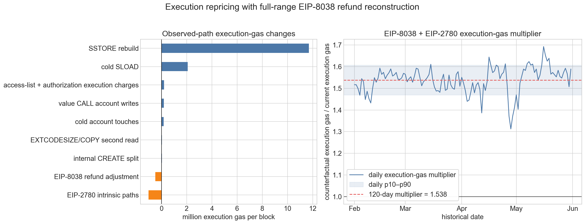
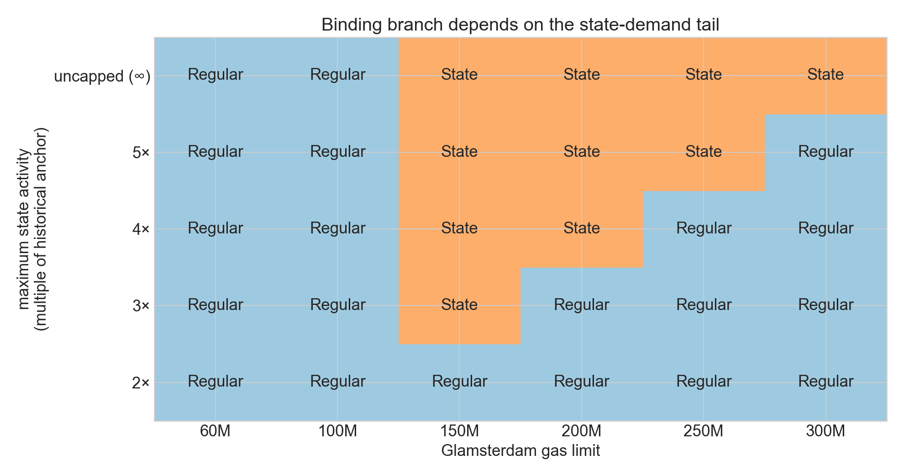
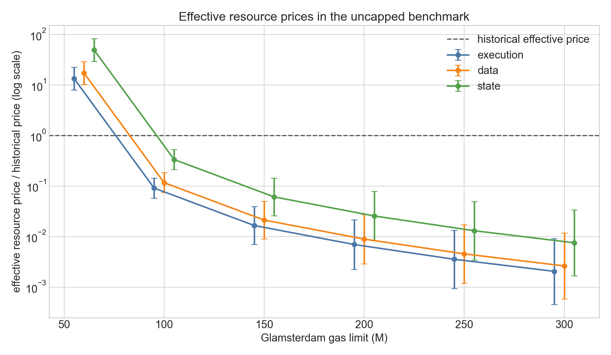

# Milestone 1: Resource-Demand Calibration and a Glamsterdam Equilibrium Benchmark

This milestone estimates price elasticities for Ethereum execution, data, and
state creation, remeters the same activity under Glamsterdam, and solves the
resulting shared-fee equilibrium. Gas-limit increases identify demand
responses under the historical common base fee. The equilibrium calculation
combines those responses with a February–May 2026 activity anchor and
counterfactual Glamsterdam gas accounting.

The model uses three independent isoelastic demand curves. The reported range
uses the four linked elasticity estimates from the 21-, 35-, 60-, and 75-day
event windows. The 75-day estimate remains an extended sensitivity because
its event windows are less symmetric. The resulting fees are static,
model-implied target-clearing values. They describe the fixed point of this
demand model and accounting specification; future base-fee paths can differ as
demand, transaction mix, and market conditions change.

Under unrestricted isoelastic demand, state is the candidate high-capacity
pressure point. The data do not yet identify whether state demand can expand
enough to become the actual binding branch at 200M–300M, so both the branch and
the exact fee in that region remain strongly model-dependent.

## Main results

1. Across the four event windows, the estimated resource-response
   elasticities span
   **0.079–0.121 for execution**, **0.201–0.229 for data**, and
   **0.254–0.478 for state creation**. State is the most price-responsive
   resource and execution the least responsive in every window. These become
   own-price elasticities under the independent-demand benchmark.
2. Replaying the February–May 2026 activity under the Glamsterdam accounting
   used here gives metering multipliers of **1.538 for execution**,
   **1.969 for data**, and **5.656 for state**.
3. In the uncapped isoelastic benchmark, the model-implied shared fee spans
   **0.553747–1.575098 gwei** at a 60M gas limit and
   **0.004004–0.009999 gwei** at 100M. Larger-limit fees are retained as
   demand-tail diagnostics rather than headline estimates because they require
   state activity between 2.53× and 5.06× its historical anchor.
4. Combining the shared fee with each metering multiplier shows the full price
   effect. At 100M, the effective price per historical gas-equivalent unit is
   **5.8–14.4% of its historical value for execution**, **7.4–18.4% for
   data**, and **21.2–52.9% for state**.
5. **The identity of the high-capacity bottleneck is conditional on the
   state-demand tail.** Under unrestricted isoelastic demand, regular gas
   binds at 60M and 100M, while state binds at every tested limit from 150M to
   300M across all four event-window estimates.
6. **The high-capacity state equilibria require substantial extrapolation.**
   Clearing the 150M, 200M, 250M, and 300M limits requires state activity at
   **2.53**, **3.37**, **4.21**, and **5.06 times** its historical anchor. A
   diagnostic 2× cap switches every 150M–300M case to regular binding and
   sharply lowers the shared fee. Both the binding branch and the precise
   high-capacity fee therefore depend on the maintained demand-tail
   assumption.

## Independent resource-demand model

Let

$$
i\in\{\mathrm{execution},\mathrm{data},\mathrm{state}\}.
$$

The notation is shared by the elasticity and equilibrium calculations:

| Notation | Meaning |
|---|---|
| $q_i$, $q_i^0$ | Resource-$i$ activity in historical gas-equivalent units, and its February–May 2026 anchor |
| $p_i$, $p^0$ | Effective resource price and historical common-price anchor |
| $\epsilon_i$ | Resource-$i$ common-price response, interpreted as an own-price elasticity in the independent benchmark |
| $Q$, $s_i=q_i/Q$ | Total measured gas-equivalent activity and resource share |
| $\bar q_i$, $\bar s_i$ | Quantity and share in the last clean 45M gas-limit regime used for elasticity recovery |
| $b$, $b^*$ | Candidate and equilibrium Glamsterdam shared base fee |
| $m_i$, $g_i=m_iq_i$ | Glamsterdam metering multiplier and resulting metered gas |
| $G$, $T=G/2$ | Glamsterdam gas limit and target |

The demand curve for each resource is

$$
q_i(p_i)
=q_i^0
\left(\frac{p_i}{p^0}\right)^{-\epsilon_i}.
$$

Under the historical one-dimensional fee market, all three resources face the
same base fee:

$$
p_{\mathrm{execution}}
=p_{\mathrm{data}}
=p_{\mathrm{state}}
=p.
$$

The historical fee market supplies common-price variation. More generally,
resource demand could depend on all three effective prices,
$q_i=q_i(p_{\mathrm{execution}},p_{\mathrm{data}},p_{\mathrm{state}})$. The
event study therefore identifies a directional response along
$p_{\mathrm{execution}}=p_{\mathrm{data}}=p_{\mathrm{state}}=p$:
$$
\epsilon_i
=-
\left.\frac{d\ln q_i}{d\ln p}\right|_{p_j=p}
=-
\sum_j
\frac{\partial\ln q_i}{\partial\ln p_j}.
$$

The independent benchmark sets the cross-price terms to zero. Under that
restriction, the common-price response becomes the resource's own-price
elasticity:
$$
\epsilon_i
=-
\frac{\partial\ln q_i}{\partial\ln p_i}
\approx-
\frac{\Delta\ln(q_i/\mathrm{block})}
{\Delta\ln p}.
$$

The resource responses relative to execution are

$$
\Delta_{\mathrm{data}}
=-
\frac{\Delta\ln(q_{\mathrm{data}}/q_{\mathrm{execution}})}
{\Delta\ln p}
=\epsilon_{\mathrm{data}}-\epsilon_{\mathrm{execution}},
$$

$$
\Delta_{\mathrm{state}}
=-
\frac{\Delta\ln(q_{\mathrm{state}}/q_{\mathrm{execution}})}
{\Delta\ln p}
=\epsilon_{\mathrm{state}}-\epsilon_{\mathrm{execution}}.
$$

A positive $\Delta_i$ means that resource $i$ expands more than execution
when the common fee falls. At the share anchor, aggregate elasticity is

$$
\epsilon_{\mathrm{agg}}
=\bar s_{\mathrm{execution}}\epsilon_{\mathrm{execution}}
+\bar s_{\mathrm{data}}\epsilon_{\mathrm{data}}
+\bar s_{\mathrm{state}}\epsilon_{\mathrm{state}}.
$$

The three resource elasticities therefore satisfy

$$
\epsilon_{\mathrm{execution}}
=\epsilon_{\mathrm{agg}}
-\bar s_{\mathrm{data}}\Delta_{\mathrm{data}}
-\bar s_{\mathrm{state}}\Delta_{\mathrm{state}},
$$

$$
\epsilon_{\mathrm{data}}
=\epsilon_{\mathrm{execution}}+\Delta_{\mathrm{data}},
\qquad
\epsilon_{\mathrm{state}}
=\epsilon_{\mathrm{execution}}+\Delta_{\mathrm{state}}.
$$

This specification makes each resource quantity a function of its own
effective price. Cross-price substitution and transaction-level bundling are
outside this Glamsterdam calculation.

### Why use the independence assumption

The gas-limit events move the historical common fee. Separate execution,
data, and state price movements are absent, so the data cannot identify a full
matrix of own- and cross-price responses. Independence gives a transparent aggregate
benchmark that reproduces the observed common-fee response with the fewest
additional parameters. It is most plausible when the resource mix of marginal
transactions remains reasonably stable as fees change.

Many transactions consume bundles of resources. Contract deployment and
storage writes combine execution, transaction data, and state creation;
rollup batches combine execution and calldata; and a sender decides whether
the entire transaction is worth its total fee. Counterfactual repricing can
therefore remove several resource quantities together or induce substitution,
such as replacing calldata with computation or storage.

There is no general signed bias from ignoring these links. If state-heavy
transactions leave after state repricing, the independent model can retain too
much associated execution and data. If execution- or data-intensive
transactions leave, it can retain too much associated state activity.
Substitution can move the estimates in either direction. The independent
curves should therefore be read as a reduced-form benchmark, with bundle
pricing reserved for models that have enough information to support it.

## Empirical elasticity estimates

### Data and gas-limit events

The daily sample runs from `2025-01-01` through `2026-05-31` and contains
three gas-limit increases:

| Event | Date | Gas-limit change |
|---|---:|---:|
| 30M to 36M | 2025-02-04 | +20% |
| 36M to 45M | 2025-07-21 | +25% |
| 45M to 60M | 2025-11-25 | +33% |

The current-rule accounting separates block gas into three mutually exclusive
components:

- **State** is positive account, storage, and contract-code creation,
  converted using 25,000 gas per 112-byte account, 20,000 gas per 32-byte
  storage slot, and 200 gas per contract-code byte.
- **Data** is charged calldata gas, including the EIP-7623 floor after Pectra.
- **Execution** is total block gas minus data and state gas. It retains the
  21,000 intrinsic gas per transaction so the three components sum to observed
  block gas.

Across the full sample, the mean resource mix is:

| Resource | Mean gas per block | Share |
|---|---:|---:|
| Execution | 17.33M | 73.6% |
| Data | 0.81M | 3.4% |
| State | 5.42M | 23.0% |

The elasticity recovery uses the last clean pre-Fusaka regime as its share
anchor: 75.7% execution, 3.6% data, and 20.7% state.

### Gas-limit event study

> Daily resource quantities and shares, the median base fee, and log quantity
> ratios relative to execution around the three gas-limit changes.

For the event-level table below, each pre- and post-period uses up to 35 days,
and the three days surrounding the gas-limit change are excluded. The first
event has 31 pre-event days because the sample begins on January 1. Resource
gas per block is calculated from the aggregate pre- and post-period totals;
the fee measure is the median of daily median base fees. The alternative
window lengths are reported in the next subsection.

| Event | $\Delta\ln p$ | $\epsilon_{\mathrm{agg}}$ | $\Delta_{\mathrm{state}}$ | $\Delta_{\mathrm{data}}$ | $\epsilon_{\mathrm{execution}}$ | $\epsilon_{\mathrm{data}}$ | $\epsilon_{\mathrm{state}}$ |
|---|---:|---:|---:|---:|---:|---:|---:|
| 30M to 36M | -2.114 | 0.087 | 0.311 | 0.117 | 0.011 | 0.128 | 0.322 |
| 36M to 45M | -0.887 | 0.251 | 0.116 | 0.100 | 0.223 | 0.323 | 0.339 |
| 45M to 60M | -1.254 | 0.234 | 0.233 | -0.094 | 0.180 | 0.086 | 0.413 |

The first two events form the clean-event sample. The third event's post-period
overlaps Fusaka and the first BPO blob-capacity increase, which changed the
relative appeal of blobs and L1 calldata during the same period.

A short diagnostic from November 26 through December 2 gives a fee decline
from 0.160 to 0.047 gwei and a 16% increase in calldata bytes per block,
implying $\Delta_{\mathrm{data}}\approx0.26$. The seven-day comparison cannot
separate all concurrent changes, but it supports excluding the third event
from the elasticity recovery.

### Window robustness

The following table averages the two clean-event statistics within each
window, then applies the fixed pre-Fusaka share anchor. Each row is one linked
elasticity vector used in the equilibrium solver.

| Window | $\epsilon_{\mathrm{agg}}$ | $\Delta_{\mathrm{data}}$ | $\Delta_{\mathrm{state}}$ | $\epsilon_{\mathrm{execution}}$ | $\epsilon_{\mathrm{data}}$ | $\epsilon_{\mathrm{state}}$ |
|---:|---:|---:|---:|---:|---:|---:|
| 21 days | 0.195 | 0.085 | 0.361 | 0.117 | 0.202 | 0.478 |
| 35 days | 0.169 | 0.108 | 0.214 | 0.121 | 0.229 | 0.335 |
| 60 days | 0.127 | 0.123 | 0.198 | 0.082 | 0.205 | 0.280 |
| 75 days | 0.119 | 0.123 | 0.175 | 0.079 | 0.201 | 0.254 |

Across these windows, aggregate elasticity spans 0.119–0.195. Execution,
data, and state elasticities span 0.079–0.121, 0.201–0.229, and 0.254–0.478,
respectively. The ordering is stable even though the magnitude of the state
response declines as the window expands.

These estimates describe responses around the historical operating point.
The clean events increased the gas limit by 20% and 25%; they do not directly
observe activity several times above its anchor or fees orders of magnitude
below $p^0$. Continuing the same elasticity over that distance is an
isoelastic functional-form assumption. The four-window range measures
sensitivity to the chosen window length, while uncertainty about the shape of demand far
from the anchor remains outside that range.

The 75-day row serves as an extended sensitivity. Its first-event pre-period
is still limited to 31 days, creating a more uneven comparison, and the longer
post-periods are more exposed to slow-moving changes. The equilibrium solver
preserves each observed row as a linked elasticity vector and avoids
componentwise endpoint combinations.

A daily ARDL check on the 516-day panel gives a long-run data-versus-execution
contrast near 0.11, close to the event estimate. Its state contrast is larger,
and its residual autocorrelation diagnostics are weak. The gas-limit events
therefore remain the basis for the reported ranges.

## Glamsterdam shared fee market

Glamsterdam retains one EIP-1559-style base fee while tracking regular gas and
state gas as separate branches. Regular gas contains execution and data; the
state branch contains state creation:

$$
g_{\mathrm{regular}}(b)
=m_{\mathrm{execution}}q_{\mathrm{execution}}(b)
+m_{\mathrm{data}}q_{\mathrm{data}}(b),
$$

$$
g_{\mathrm{state}}(b)
=m_{\mathrm{state}}q_{\mathrm{state}}(b).
$$

The shared fee responds to the branch with more metered gas:

$$
u(b)
=\max\left\{
g_{\mathrm{regular}}(b),
g_{\mathrm{state}}(b)
\right\}.
$$

For gas limit $G$, the target is $T=G/2$. The equilibrium base fee $b^*$ solves

$$
\max\left\{
g_{\mathrm{regular}}(b^*),
g_{\mathrm{state}}(b^*)
\right\}
=T.
$$

The calculation is a feedback loop. A trial shared fee $b$ is first multiplied
by $m_i$, giving a different effective price for each resource. Those prices
determine execution, data, and state activity through their respective demand
curves. The same multipliers then convert activity back into Glamsterdam gas,
and the larger of the regular and state branches is compared with the target.
The solver adjusts $b$ until the larger branch reaches $T$. This fixed point is
a static comparison of demand and capacity under the stated assumptions.

### February–May 2026 anchor

The equilibrium anchor covers February 1 through May 31, 2026: 120 days and
860,505 blocks. The historical price anchor $p^0$ is the median of daily median
base fees, **0.1069 gwei**.

| Resource | Historical gas-equivalent quantity per block | Share |
|---|---:|---:|
| Execution | 23.942M | 78.84% |
| Data | 1.181M | 3.89% |
| State | 5.244M | 17.27% |
| **Total** | **30.367M** | **100%** |

This recent anchor is distinct from the pre-Fusaka share anchor used to recover
the elasticities. The former sets $q_i^0$ and $p^0$ for equilibrium; the latter
supplies $\bar s_i$ in the elasticity decomposition.

### Why metering multipliers enter

The demand anchor uses the historical gas schedule, whereas the target is
defined in Glamsterdam gas. For the same underlying activity, the metering
multiplier is

$$
m_i
=\frac{g_i^{\mathrm{Glamsterdam},0}}{q_i^0}.
$$

At candidate base fee $b$, one historical gas-equivalent unit of resource $i$
has effective price

$$
p_i(b)=m_i b,
\qquad
r_i(b)=\frac{p_i(b)}{p^0}=m_i\frac{b}{p^0}.
$$

Demand responds to this price ratio, and the resulting activity is converted
back into Glamsterdam gas:

$$
q_i(b)
=q_i^0
\left(m_i\frac{b}{p^0}\right)^{-\epsilon_i},
\qquad
g_i(b)=m_iq_i(b).
$$

Each multiplier is calculated from total counterfactual gas divided by total
historical gas for the same February–May activity:

$$
m_i
=\frac{\sum_t g_{i,t}^{\mathrm{Glamsterdam}}}
{\sum_t q_{i,t}^{\mathrm{historical}}}.
$$

The resulting multipliers are:

| Resource | Multiplier | Accounting replay |
|---|---:|---|
| Execution | 1.538 | EIP-8038 and EIP-2780 opcode, transaction-path, and refund accounting |
| Data | 1.969 | EIP-7976 transaction floor plus the EIP-7981 access-list charge |
| State | 5.656 | EIP-8037 byte accounting with `CPSB = 1530` |

#### Execution under EIP-8038 and EIP-2780

The execution replay applies EIP-8038's state-access prices and EIP-2780's
intrinsic-gas paths to the observed transactions. Storage-write repricing is
the largest component. EIP-2780 offsets part of that increase by replacing the
21,000-gas transaction base charge with a 12,000-gas sender component, then
adding recipient and value-transfer charges according to the transaction path.

| Execution accounting | Gas per block |
|---|---:|
| Historical regular execution gas | 23.942M |
| EIP-8038 SSTORE increase | +11.687M |
| EIP-8038 cold SLOAD increase | +2.082M |
| Other EIP-8038 changes | +0.635M |
| EIP-2780 intrinsic-gas changes | -1.033M |
| Counterfactual gas before the new refunds | 37.312M |
| Additional effective EIP-8038 refunds | -0.492M |
| **Counterfactual execution gas after refunds** | **36.821M** |

Thus

$$
m_{\mathrm{execution}}
=\frac{36.821}{23.942}
=1.5379.
$$

Refunds are reconstructed for all 67.64 million refund-positive transactions
in the 120-day range. The integer reconstruction identifies 99.82% of the
observed refund counter; the remaining amount receives the same daily
correction rate as the identified transactions. Small access-list and
authorization-write components use the existing RPC calibration because Xatu
does not expose their complete transaction contents.

> The left panel decomposes the change in execution-gas accounting under
> EIP-8038 and EIP-2780. The right panel shows the daily counterfactual-to-
> historical execution-gas ratio across the 120-day sample.

#### Data under EIP-7976 and EIP-7981

Under the accounting analyzed here, EIP-7976 raises the calldata floor from
10/40 gas per zero/nonzero byte to 64 gas per byte. EIP-7981 charges 64 gas per
access-list content byte, with 20 bytes per address and 32 bytes per storage
key.

| Data accounting | Gas per block |
|---|---:|
| Historical data gas, including the EIP-7623 floor | 1.181M |
| EIP-7976 floor uplift | +0.776M |
| Calibrated EIP-7981 access-list gas | +0.368M |
| **Glamsterdam counterfactual data gas** | **2.324M** |

Therefore

$$
m_{\mathrm{data}}
=\frac{2.324}{1.181}
=1.9688.
$$

The EIP-7976 increment is calculated transaction by transaction:

$$
\Delta g_{7976,tx}
=\max\left\{
0,
64B_{tx}-g_{\mathrm{body},tx}^{\mathrm{current}}
\right\}.
$$

Here $B_{tx}$ is calldata size in bytes and
$g_{\mathrm{body},tx}^{\mathrm{current}}
=g_{\mathrm{used},tx}-21{,}000$ is the observed transaction gas excluding the
historical base charge. The calculation identifies 19.90 million of 270.78
million transactions, or 7.35%, as binding under the EIP-7976 floor. Those
transactions add 0.776M gas per block, equal to 65.7% of historical data gas.

Because the numerator adds access-list gas to a historical calldata anchor,
the constant data multiplier assumes that access-list activity scales with
the same data demand curve as calldata.

#### State under EIP-8037

The state-creation proxy is repriced under the EIP-8037 state-gas schedule with
`CPSB = 1530`:

| Accounting convention | State gas per block |
|---|---:|
| Historical gas-equivalent proxy | 5.244M |
| EIP-8037 state gas for the same estimated creation | 29.663M |

Hence

$$
m_{\mathrm{state}}
=\frac{29.663}{5.244}
=5.6563.
$$

## Glamsterdam equilibrium results

### Uncapped isoelastic equilibrium benchmark

The following values are fixed points of the unrestricted isoelastic demand
curves. At the larger limits, they require state activity several times above
the historical anchor and should not be interpreted as fee forecasts. The
three metering multipliers remain fixed, and the equilibrium is solved
separately for each linked elasticity vector. The 75-day estimate is included
as an extended sensitivity.

| Gas limit | Target | Model-implied base-fee range | Binding branch in every window |
|---:|---:|---:|---|
| 60M | 30M | 0.553747–1.575098 gwei | Regular |
| 100M | 50M | 0.004004–0.009999 gwei | Regular |
| 150M | 75M | 0.000487–0.002720 gwei | State |
| 200M | 100M | 0.000157–0.001491 gwei | State |
| 250M | 125M | 0.000065–0.000935 gwei | State |
| 300M | 150M | 0.000032–0.000639 gwei | State |

> The left panel shows the model-implied shared base fee for each event-window
> estimate; the shaded area spans the four results and the dashed 75-day line
> marks the extended sensitivity. The right panel reports regular- and
> state-branch gas as a percentage of the shared target. Points show the middle
> of each four-window range and error bars show its endpoints. A branch
> determines the fee where it reaches 100%.

### Scale of the state-demand extrapolation

Once state binds, its historical gas-equivalent activity is fixed by
$q_{\mathrm{state}}=T/m_{\mathrm{state}}$:

| Gas limit | State target | Implied state activity | Multiple of the 5.244M anchor |
|---:|---:|---:|---:|
| 150M | 75M | 13.26M | 2.53× |
| 200M | 100M | 17.68M | 3.37× |
| 250M | 125M | 22.10M | 4.21× |
| 300M | 150M | 26.52M | 5.06× |

The clean historical events increased the gas limit by 20% and 25%. The
high-capacity equilibria instead require state creation several times above
its February–May anchor and fees orders of magnitude below $p^0$. Their
numerical values are therefore determined largely by extending the
isoelastic functional form beyond the observed quantity range.

There is also a state-growth-policy implication.
[EIP-8037](https://eips.ethereum.org/EIPS/eip-8037) derives $CPSB=1530$ from
a 75M state-gas target at a 150M reference limit, which
corresponds to approximately 120 GiB/year of metered state creation. Holding
$CPSB$ fixed while state binds at 100M, 125M, or 150M implies approximately
160, 200, or 240 GiB/year. The 200M–300M scenarios therefore increase the
state-growth budget as well as execution capacity.

### State-demand saturation diagnostic

The first diagnostic caps historical gas-equivalent state activity at twice
its February–May anchor:

$$
q_{\mathrm{state}}^{\mathrm{cap}}(b)
=\min\left\{
q_{\mathrm{state}}^0
\left(m_{\mathrm{state}}\frac{b}{p^0}\right)^{-\epsilon_{\mathrm{state}}},
\;2q_{\mathrm{state}}^0
\right\}.
$$

The cap equals 10.488M historical gas-equivalent units, or 59.325M metered
state gas after applying $m_{\mathrm{state}}$. State would need to reach
2.53× its anchor to bind even the 75M target at a 150M limit. The 2× cap
therefore prevents state from reaching every target from 150M through 300M,
and the regular branch determines the shared fee.

| Gas limit | Branch: uncapped → capped | Model-implied capped fee | Capped / uncapped fee |
|---:|---|---:|---:|
| 60M | Regular → Regular | 0.553747–1.575098 gwei | 100% |
| 100M | Regular → Regular | 0.004004–0.009999 gwei | 100% |
| 150M | State → Regular | 0.0000465–0.000441 gwei | 8.60–37.20% |
| 200M | State → Regular | 0.00000240–0.0000502 gwei | 1.34–10.01% |
| 250M | State → Regular | $2.72\times10^{-7}$–$9.58\times10^{-6}$ gwei | 0.356–3.718% |
| 300M | State → Regular | $4.99\times10^{-8}$–$2.53\times10^{-6}$ gwei | 0.129–1.689% |

### Interpretation of the high-capacity results

> **Robust within the uncapped benchmark.** State has the largest estimated
> response to a common fee reduction in every event window. With unrestricted
> isoelastic expansion, the state branch overtakes regular gas as capacity
> rises.
>
> **Conditional across demand-tail assumptions.** State binds from 150M to
> 300M only when its activity can continue expanding to approximately
> 2.53–5.06× its historical anchor. A 2× cap makes regular gas bind throughout
> that range, while the wider sweep below moves the transition as the cap
> increases.
>
> **Most model-dependent output.** The precise shared fee at 250M–300M depends
> strongly on the assumed tail of state demand. These values are
> functional-form fixed points rather than fee forecasts.

At 250M, the capped fees are approximately 27–281 times lower than their
uncapped counterparts; at 300M, they are approximately 59–772 times lower.
The 60M and 100M results are unchanged because the cap does not bind there.

The wider cap sweep maps the branch result without treating any cap as a
forecast. A 3× cap permits state binding at 150M; a 4× cap extends it through
200M; and a 5× cap extends it through 250M. State binding at 300M requires
demand to remain unsaturated beyond approximately 5× the anchor.

> Each cell reports the branch that determines the shared fee for a gas limit
> and maximum state-activity multiple. The classification is identical across
> the four linked event-window estimates. The caps diagnose dependence on the
> unobserved state-demand tail; they are not estimated saturation points.

### Effective resource prices in the uncapped benchmark

The following ratios use the unrestricted isoelastic equilibria reported
above. The base fee alone does not show the full price change. One unit of
historical gas-equivalent activity for resource $i$ faces effective price
$m_i b^*$, so

$$
\frac{p_i(b^*)}{p^0}
=m_i\frac{b^*}{p^0}.
$$

This ratio is the effective price of one resource unit. A complete transaction
bill sums these prices over the amounts of execution, data, and state it
consumes.

| Gas limit | $b^*/p^0$ | Execution $p_{\mathrm{execution}}/p^0$ | Data $p_{\mathrm{data}}/p^0$ | State $p_{\mathrm{state}}/p^0$ |
|---:|---:|---:|---:|---:|
| 60M | 5.179–14.730× | 7.964–22.654× | 10.196–29.001× | 29.292–83.320× |
| 100M | 0.0374–0.0935× | 0.0576–0.1438× | 0.0737–0.1841× | 0.2118–0.5289× |
| 150M | 0.00456–0.02544× | 0.00701–0.03912× | 0.00897–0.05008× | 0.02577–0.14387× |
| 200M | 0.00147–0.01394× | 0.00225–0.02144× | 0.00288–0.02745× | 0.00829–0.07886× |
| 250M | 0.000608–0.008745× | 0.000935–0.01345× | 0.001196–0.01722× | 0.003437–0.04946× |
| 300M | 0.000296–0.005974× | 0.000455–0.009187× | 0.000583–0.01176× | 0.001675–0.03379× |

> Each interval combines the resource's Glamsterdam metering multiplier with
> the model-implied shared fee. A value below one means that the lower shared
> fee more than offsets the metering increase. Ranges span the linked 21-,
> 35-, 60-, and 75-day elasticity estimates.

At an unchanged base fee, metering alone would raise the effective price by
53.8% for execution, 96.9% for data, and 465.6% for state. The shared fee rises
in the tight 60M case, reinforcing those increases. At 100M and above, the fee
falls enough to offset all three multipliers. The very small ratios at
200M–300M also show how far those equilibria extend beyond the prices observed
in the event study.

### Why the binding branch changes

For the independent model, resource-$i$ metered demand can be written as

$$
g_i(b)
=q_i^0m_i^{1-\epsilon_i}
\left(\frac{b}{p^0}\right)^{-\epsilon_i}.
$$

At a candidate shared base fee equal to the historical anchor, $b=p^0$, the
four calibrations imply 36.94–37.63M regular gas and 12.95–19.12M state gas.
The effective resource prices at this point are $m_i p^0$. A 60M limit has a
30M target, so the fee must rise until regular gas contracts to the target. At
a 100M limit, both branches expand as the fee falls, but regular gas still
reaches the 50M target first.

State receives the largest metering increase, which initially makes state
creation much more expensive than execution or data. It also has the largest
estimated elasticity in every window. As additional capacity lowers the
shared fee, state demand rebounds faster than the regular branch. Under the
uncapped isoelastic curves, state reaches the shared target at every tested
limit from 150M through 300M. The regular branch then occupies progressively
less of the target, ranging from 77–88% at 150M to 46–58% at 300M.

When state binds, the fee solves

$$
T
=m_{\mathrm{state}}q_{\mathrm{state}}^0
\left(
m_{\mathrm{state}}\frac{b^*}{p^0}
\right)^{-\epsilon_{\mathrm{state}}},
$$

or

$$
\frac{b^*}{p^0}
=\left(
\frac{
q_{\mathrm{state}}^0
m_{\mathrm{state}}^{1-\epsilon_{\mathrm{state}}}
}{T}
\right)^{1/\epsilon_{\mathrm{state}}}.
$$

The exponent $1/\epsilon_{\mathrm{state}}$ spans 2.09–3.94 across the four
windows. This steep response explains why the multiplicative spread between
the window-specific fees grows at higher limits.

## Milestone conclusion

This milestone completes the path from historical resource activity to
elasticity recovery, counterfactual Glamsterdam metering, and a shared-fee
fixed point. The uncapped benchmark identifies state as the candidate
high-capacity pressure point. The historical variation does not determine
whether state demand can expand enough to become the actual binding branch at
200M–300M, and the exact fees in that range remain strongly model-dependent.
The next stage should study smoother saturation, demand shocks, and dynamic
base-fee behavior.

## Measurement limitation

The main empirical limitation is state measurement. Execution and historical
data gas come from protocol accounting. State creation is inferred from a
calibrated proxy and then translated into EIP-8037 gas. Bias in that proxy can
affect the state anchor, the recovered state elasticity, and every equilibrium
in which the state branch binds.

The event-window range shows sensitivity to window length around the two clean
gas-limit changes. All four rows reuse those events. The 75-day calculation
also combines a 31-day first-event pre-period with longer post-periods, making
it more exposed to slow-moving changes.

## Appendix: data sources and construction

The full February–May 2026 calculations use Xatu. A deterministic 6,000-block
sample, 50 blocks per day, uses the Erigon mainnet RPC only where complete
transaction objects or account-level traces are unavailable in Xatu.

### Elasticity estimation

| Source | Use |
|---|---|
| Xatu canonical block and transaction tables | Gas limits, base fees, total gas, transaction counts, and calldata accounting |
| Xatu storage, contract, balance, nonce, and address-appearance tables | Scalable state-creation proxy |
| Daily calibrated accounting panel | Mutually exclusive execution, data, and state quantities used in the event study |

### Execution multiplier

| Source | Use |
|---|---|
| `default.canonical_execution_block` | Canonical block numbers, dates, and block gas totals |
| `default.canonical_execution_transaction_structlog_agg` | Opcode gas, cold-access counts, SSTORE gas, and transaction refund counters |
| `default.canonical_execution_traces` | Internal contract creation and positive-value call paths |
| `default.execution_transaction` and `default.canonical_execution_transaction` | Transaction paths and receipt gas used |
| `default.canonical_execution_storage_diffs` | Final storage changes used in the EIP-8038 refund reconstruction |
| Erigon RPC sample | Complete access lists and authorization-write counts |

### Data multiplier

| Source | Use |
|---|---|
| `default.canonical_execution_transaction` | Receipt gas and zero/nonzero calldata counts for historical gas and the EIP-7976 calculation |
| `default.canonical_execution_block` | Canonical dates and block coverage |
| Erigon RPC sample | Access-list address and storage-key counts; EIP-7981 uses $20N_{\mathrm{address}}+32N_{\mathrm{key}}$ content bytes |

### State multiplier

| Source | Use |
|---|---|
| `default.canonical_execution_storage_diffs` | Newly created storage slots |
| `default.canonical_execution_contracts` | Contract accounts and code bytes |
| `default.canonical_execution_balance_diffs` and `default.canonical_execution_nonce_diffs` | New-account candidates |
| `default.canonical_execution_address_appearances` | First-seen account filter |
| `default.canonical_execution_block` | Dates and block coverage |
| CBT state-size tables | Inventory checks only |
| Erigon RPC sample | Account-proxy correction and delegation indicators |
