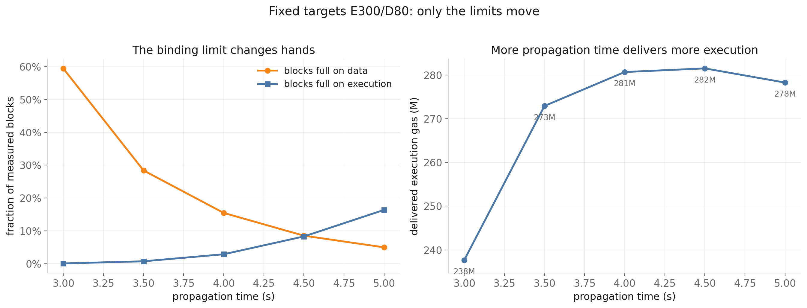
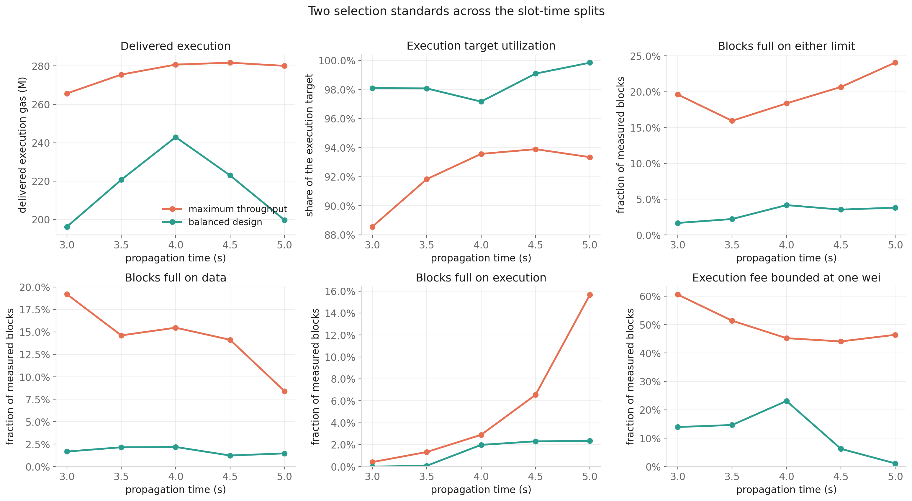
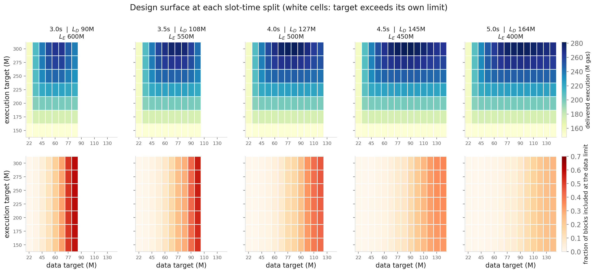
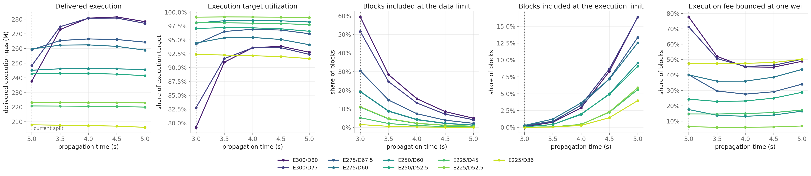
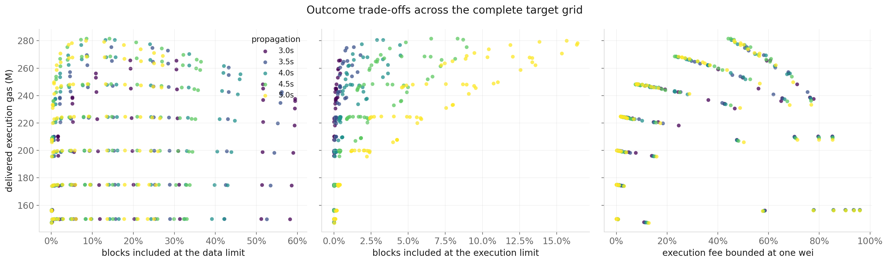

# Slot-Time Allocation Under Bundle-Priced EIP-7999

Slot-time allocation and fee-market targets are two distinct layers of protocol design. The propagation/execution split determines the physical data and execution limits. Within each limit pair, the execution and data targets determine the fee setpoints and available burst headroom.

The experiment therefore asks two questions in sequence, and the report follows them:

$$
\text{slot split} \rightarrow \text{physical limits}
\qquad\text{then}\qquad
\text{limits} \rightarrow \text{targets} \rightarrow \text{delivered outcomes}.
$$

Section 1 holds the targets fixed and moves the deadline, isolating the physical substitution. Section 2 chooses targets at each split under two explicit selection standards and compares what they deliver.

**Each metric has one role.** Mean delivered execution is the objective. Execution target utilization says whether the configured target is an honest description of delivered capacity. "Blocks full" — on data, on execution, or on either — says how often a block could not have carried more. Execution fee bounded at one wei says how often the fee sits at the protocol minimum while the controller is still calling for a decrease. Mean absolute execution target deviation measures how far block usage typically lies from its configured target, while average base-fee burn records the protocol charge paid on included execution, data, and state gas. None of these is optimized against the others; they are reported together because a configuration is only described by all of them.

**The 2.5s split is not carried into the design comparison.** Its 71.4M data limit removes most of the target grid, so it is a different design space rather than a shorter-propagation point on this one.

## Main results

1. **Moving the deadline toward propagation buys data capacity that converts into delivered execution.** Holding targets fixed at E300/D80, going from 3.0s to 4.0s trades 100M of execution limit for 37M of data limit and raises mean delivered execution from **237.7M to 280.7M** gas per block, an 18.1% increase. Execution is bundled with the BAL data it produces, so relieving the data limit releases execution headroom that was previously idle.
2. **The binding limit changes hands as propagation time rises.** Holding E300/D80 fixed, blocks full on data fall from 59.4% to 5.0% across the tested range while blocks full on execution rise from 0.1% to 16.4%. Total hard-limit frequency is lowest at 4.5s, where neither physical limit dominates as strongly.
3. **Delivered execution is often flat across a band of data targets.** At a fixed execution target, moving to the low end of the 99%-of-maximum band costs a median 0.44% of throughput while cutting blocks-full-on-data by a median factor of 6.4. The balanced-design filter exploits this trade-off by selecting lower-pressure target pairs from the complete grid.
4. **The balanced designs give up throughput to remain close to current operating ranges.** At 4.0s, maximum throughput delivers 280.7M execution gas, while the highest-throughput balanced configuration, E250/D52.5, delivers 242.9M. Near-limit frequency falls from 19.40% to 4.75%, and its solved execution equilibrium fee is 2.052 wei.
5. **Current mainnet provides a useful external benchmark, although it does not remove the design trade-off.** From February through May 2026, 4.73% of blocks came within 2% of the current gas limit and mean absolute execution distance from target was 35.35%. A balanced design may exceed each value by at most 10%, giving ceilings of 5.21% and 38.88%, and must also have a solved execution equilibrium fee above one wei. At the 4.0s split, E250/D52.5 is the highest-throughput tested point satisfying all three conditions.

## From slot time to resource limits

A slot divides a fixed time budget between propagating the payload and executing it. More propagation time permits a larger payload and therefore a larger data limit, while leaving less time for execution:

$$
L_{\mathrm{data}}=16\,\mathrm{payload}(t_{\mathrm{prop}}),
\qquad
L_{\mathrm{execution}}=v_{\mathrm{execution}}(B-t_{\mathrm{prop}}),
$$

where $B=9$ seconds is the modeled slot budget and $v_{\mathrm{execution}}=100$M gas per second is the assumed execution speed. Propagation time converts to payload size through the empirical fit from the [bandwidth-limit notebook](../notebooks/bandwidth-limit-scenarios.ipynb):

$$
t_{\mathrm{prop}}(\mathrm{ms})=569+0.443\frac{\mathrm{payload\ bytes}}{1024}.
$$

| Propagation time | Execution time | Payload under the fit | Data limit | Execution limit |
|---:|---:|---:|---:|---:|
| **3.0s** | **6.0s** | **5.36 MiB** | **89.9M** | **600M** |
| 3.5s | 5.5s | 6.46 MiB | 108.4M | 550M |
| 4.0s | 5.0s | 7.56 MiB | 126.9M | 500M |
| 4.5s | 4.5s | 8.67 MiB | 145.4M | 450M |
| 5.0s | 4.0s | 9.77 MiB | 163.9M | 400M |

The 3.0s row recovers the approximately 90M data limit used in the preceding analyses. Under this fit, another 0.5s of propagation adds about 18.5M data gas of capacity and removes 50M execution gas of capacity.

The data-limit conversion is a first-pass modeling bridge. Static transaction content is charged in counted bytes, while EIP-8279 runtime-metered BAL bytes differ from the final encoded BAL payload because the runtime meter is transaction-local and does not apply full block-level deduplication. The calculation also assumes 16 data gas per runtime BAL byte; that rate remains a protocol-design assumption in the expanded EIP-7999 proposal. The reported data limits should be read as metered-byte-equivalent capacities under this common-rate assumption.

## Dynamic experiment

For every slot split, the simulation reruns the complete feasible grid of execution and data targets. An execution target must be below its execution limit and a data target below its data limit, so some high-data-target cells are unavailable at the shorter propagation windows.

Every configuration uses the same full multiscale workload and the same random seeds. The fast shocks are recovered from **430,605 consecutive blocks from April 2 through May 31, 2026**, and sampled jointly in 3,200-block segments. The workload restores the recurring hourly profile and jointly samples daily demand factors from the longer February–May daily panel. Each configuration is evaluated on 32 paths containing one burn-in day and seven measured days. The central demand parameters are the 35-day elasticity vector, $\lambda=0$, $\rho_A=1$, and a 75M state target.

Reported quantities are first averaged over the measured blocks of each path and then across the 32 replications.

- **Blocks full on data / on execution** is the fraction of measured blocks whose included quantity reaches that resource's hard limit.
- **Blocks full on either limit** is the fraction of measured blocks that reached *some* hard limit, so the block could not have carried more of anything. In all 448 configurations no block ever reaches both limits at once, so this is exactly the sum of the two: whichever limit binds first stops packing, and the other is left slack. The state limit never binds anywhere in the sweep.
- **Execution fee bounded at one wei** is the fraction of measured blocks in which the execution fee is already one wei while execution remains below target, so the controller calls for a further decrease that the protocol minimum prevents.
- **Mean absolute execution target deviation** is $N^{-1}\sum_t|g_{\mathrm{execution},t}-T_{\mathrm{execution}}|/T_{\mathrm{execution}}$. It measures typical target-tracking error without allowing over-target and under-target blocks to cancel.
- **Average base-fee burn** is the measured-block average of

$$
g_{\mathrm{execution},t}b_{\mathrm{execution},t}+g_{\mathrm{data},t}b_{\mathrm{data},t}+g_{\mathrm{state},t}b_{\mathrm{state},t}.
$$

The fee in this expression is the base fee governing inclusion in block $t$. The measure excludes priority fees and blob fees, and it should be read as protocol base-fee burn rather than total user payments.

### Historical operating benchmark

The reference uses all **860,505 canonical blocks from February 1 through May 31, 2026**. Historical transactions are indivisible, so current blocks rarely equal the gas limit byte-for-byte even when no additional transaction fits. The comparable congestion measure therefore classifies a block as **near its limit** when usage reaches at least 98% of the limit, and applies the same rule to the simulated EIP-7999 blocks. The stricter **at limit** measure records exact hard-limit saturation. The historical execution target is each block's EIP-1559 gas target, $L_t/2$.

| Setting | Delivered execution | Mean absolute execution target deviation | At execution limit | At data limit | At either limit | Near either limit | Average base-fee burn |
|---|---:|---:|---:|---:|---:|---:|---:|
| Current blocks, Feb–May 2026 | 30.37M | **35.35%** | **0.00%** | — | **0.00%** | **4.73%** | 0.010000 ETH/block |
| E225/D52.5, 4.0s | 223.0M | 31.78% | 0.42% | 2.30% | 2.73% | 3.09% | 0.000241 ETH/block |
| E250/D52.5, 4.0s | **242.9M** | **31.58%** | **1.98%** | **2.19%** | **4.17%** | **4.75%** | 0.000242 ETH/block |
| E250/D60, 4.0s | 246.3M | 31.31% | 1.92% | 4.34% | 6.26% | 6.96% | 0.000238 ETH/block |
| E275/D60, 4.0s | 262.4M | 30.76% | 3.63% | 4.17% | 7.81% | 8.51% | 0.000238 ETH/block |
| E275/D67.5, 4.0s | 266.5M | 30.32% | 3.28% | 7.42% | 10.70% | 11.48% | 0.000233 ETH/block |
| E300/D77, 4.0s | 280.7M | 28.82% | 3.31% | 13.16% | 16.47% | 17.45% | 0.000223 ETH/block |
| E300/D80, 4.0s | 280.7M | 28.47% | 2.90% | 15.47% | 18.37% | 19.40% | 0.000219 ETH/block |

The exact and near-limit columns answer different questions. Exact saturation identifies blocks where the simulated aggregate packer exhausts a hard limit. The 98% threshold supports the historical comparison: no historical block in this sample equals its gas limit exactly, while 4.734% come within 2% of it. Section 2 uses these values to define a **balanced design** rather than requiring strict improvement over each historical point estimate. A configuration qualifies when its mean absolute execution target deviation is at most 110% of 35.35%, at most 110% of 4.734% of its blocks are near either hard limit, and its solved execution equilibrium base fee is strictly above one wei.

Base-fee burn is included for accounting rather than used as a balance criterion. The counterfactual values are much lower because the model clears greatly expanded targets at very low base fees, and state contributes almost all of the displayed EIP-7999 burn. The comparison is conditional on the isoelastic extrapolation and does not imply that lower burn is itself a protocol objective.

## 1. What propagation time buys

This section holds one target pair fixed and moves only the deadline. **E300/D80 is used because it is feasible at every split from 3.0s on, so its targets never change and every difference is attributable to the limits alone.**

| Propagation time | Execution limit | Data limit | Delivered execution | Utilization | Blocks full | Full on data | Full on execution | Execution fee bounded at one wei |
|---:|---:|---:|---:|---:|---:|---:|---:|---:|
| 3.0s | 600M | 90M | 237.7M | 79.2% | 59.5% | **59.4%** | 0.1% | 77.7% |
| 3.5s | 550M | 108.4M | 272.9M | 91.0% | 29.2% | 28.4% | 0.8% | 52.1% |
| 4.0s | 500M | 126.9M | 280.7M | 93.6% | 18.4% | 15.5% | 2.9% | 45.2% |
| 4.5s | 450M | 145.4M | **281.5M** | **93.8%** | **16.9%** | 8.5% | 8.3% | **45.1%** |
| 5.0s | 400M | 163.9M | 278.3M | 92.8% | 21.4% | 5.0% | **16.4%** | 48.9% |

> Left: how often blocks are full on each limit as the deadline moves, at fixed targets. Right: delivered execution for the same design.

The central result is the first two columns read together. Going from 3.0s to 4.0s **gives up 100M of execution limit and gains 37M of data limit, and delivered execution rises by 43.0M**. Nominal execution capacity fell by a sixth while realized execution rose by 18.1%.

That is only possible because execution and data are not independent here. Under bundle pricing a transaction's execution is priced together with the BAL bytes it produces, so a block that runs out of data gas stops admitting execution as well — even with more than 360M of execution limit unused on average. At 3.0s the data limit is reached in 59.4% of blocks and utilization sits at 79.2%: roughly a fifth of the configured execution target is unreachable, not because execution capacity is short but because the data limit is cutting bundles off. Relieving the data limit releases that trapped execution.

The mechanism runs out of room to do this. Blocks full on data fall from 59.4% to 5.0% while blocks full on execution rise from 0.1% to 16.4%, and the two cross near 4.5s. Delivered execution peaks at 4.5s and then falls:

| Change | Delivered execution | Full on data | Full on execution |
|---|---:|---:|---:|
| 3.0 → 3.5s | **+35.3M** | −31.0% | +0.6% |
| 3.5 → 4.0s | +7.8M | −12.9% | +2.1% |
| 4.0 → 4.5s | +0.8M | −6.9% | +5.4% |
| 4.5 → 5.0s | **−3.2M** | −3.5% | +8.1% |

The first half-second buys 80% of the total gain. By the last step the execution limit costs more than the data limit returns.

## 2. Two designs at each split

Section 1 fixed the targets. This section selects target pairs from the complete grid under two standards.

### The data-target trade-off

At a fixed split and execution target, delivered execution is flat across a wide band of data targets — at 4.0s and E250, everything from D60 to D100 delivers between 245.9M and 248.0M. Within that flat band the *low* end is close to free:

- it costs a median **0.44%** of the throughput available at that execution target, and at most 0.98%
- it reduces blocks full on data by a median factor of **6.4**, and rationed data by a median factor of 8.3
- the worst increase in execution fee bounded at one wei, across all 35 split-and-execution-target combinations, is **6.1%**

This plateau explains why configurations with relatively modest data targets can retain most of the available execution while materially reducing limit pressure. The two standards below are nevertheless applied to the complete target grid rather than imposing a data-target rule in advance.

### The two standards

**Maximum throughput** is the target pair delivering the most execution at that split. It needs no threshold — it is an argmax.

**Balanced design** first retains every configuration whose near-limit frequency is at most **5.208%**, whose mean absolute execution target deviation is at most **38.88%**, and whose central reserve-free execution equilibrium base fee is strictly above one wei. The first two values allow a 10% margin around the historical anchors. The third condition requires current modeled demand to support the configured execution target without asking the protocol fee to fall below its minimum. The selected design is the qualifying configuration delivering the most execution at that propagation time.

> Maximum throughput and the balanced design, followed across the slot splits on delivered execution, utilization, the three exact fullness measures, and the execution fee bounded at one wei.

**Maximum throughput:**

| Propagation time | Design | Equilibrium execution base fee | Delivered execution | Utilization | Blocks full | Full on data | Full on execution | Execution fee bounded at one wei |
|---:|---|---:|---:|---:|---:|---:|---:|---:|
| 3.0s | E300/D60 | 1.000 wei | 265.7M | 88.6% | 19.6% | 19.2% | 0.4% | 60.6% |
| 3.5s | E300/D67.5 | 1.000 wei | 275.5M | 91.8% | 15.9% | 14.6% | 1.3% | 51.4% |
| 4.0s | E300/D80 | 1.205 wei | 280.7M | 93.6% | **18.4%** | 15.5% | 2.9% | 45.2% |
| 4.5s | E300/D90 | 1.619 wei | **281.7M** | **93.9%** | 20.7% | 14.1% | 6.5% | **44.1%** |
| 5.0s | E300/D90 | 1.619 wei | 280.0M | 93.3% | 24.1% | 8.4% | 15.7% | 46.4% |

**Balanced designs:**

| Propagation | Configuration | Equilibrium execution fee | Delivered execution |
|---:|---|---:|---:|
| 3.0s | E200/D36 | 10.84 wei | 196.2M |
| 3.5s | E225/D45 | 6.98 wei | 220.7M |
| 4.0s | E250/D52.5 | 2.05 wei | **242.9M** |
| 4.5s | E225/D52.5 | 16.04 wei | 223.0M |
| 5.0s | E200/D60 | 56.87 wei | 199.7M |

The equilibrium execution base fee is the reserve-free, unit-shock solution of the static bundle-priced model for each target pair. It depends on the execution and data targets rather than the slot split. E300/D60 and E300/D67.5 in the maximum-throughput table have unconstrained equilibrium fees below one wei; the table reports the one-wei protocol minimum, and the balanced-design condition excludes them.

### What the tables say

**The balanced choice moves with the physical limits.** It selects E200/D36 at 3.0s, E225/D45 at 3.5s, E250/D52.5 at 4.0s, E225/D52.5 at 4.5s, and E200/D60 at 5.0s. Delivered execution peaks at 242.9M under the 4.0s split.

**Maximum throughput does move**, and it moves in the data dimension. The execution target is pinned at 300M — the top of the tested grid — at every split, while the data target climbs from 60M to 90M. Delivered execution rises 265.7M → 281.7M before easing to 280.0M, a 6.0% peak gain across the tested splits.

**At 4.0s, the balanced-design conditions remove the most congested portion of the throughput frontier.** Maximum throughput delivers 280.7M, while E250/D52.5 delivers 242.9M. Exact hard-limit saturation falls from 18.37% to 4.17%, near-limit frequency from 19.40% to 4.75%, and execution target utilization rises from 93.6% to 97.2%.

**The equilibrium-fee condition removes target pairs with systematic demand shortfalls.** Without it, the buffered historical metrics would select E250/D45 at 4.5s and E300/D36 at 5.0s even though they utilize only 93.2% and 69.3% of their execution targets and are dynamically bounded at one wei in 45.0% and 85.2% of blocks. The balanced designs at those splits instead utilize 99.1% and 99.8% of their targets, with dynamic floor-bound frequencies of 6.3% and 1.1%.

The balanced definition narrows the candidate set using observed operating conditions and modeled demand support, but it does not make the final protocol choice. The 10% margin is a transparent design tolerance rather than a statistical confidence interval.

## Limitations

**The propagation fit is the dominant physical uncertainty.** The experiment uses the empirical fit at safety factor 1.0, the most permissive candidate carried forward by the bandwidth notebook. Under the conservative fit at safety 0.75 a 3.0s window admits roughly 29M rather than 89.9M of data gas, so most of the target grid studied here would not exist. That is a different design space rather than a shifted one, and it requires a dedicated rerun rather than a reinterpretation of these results.

**The conversion from network payload to metered data gas is approximate.** Runtime BAL accounting and final encoded BAL size are different objects, and the composition of data changes endogenously across the target grid. A physical propagation model should eventually translate static content and final BAL payload separately.

**Execution speed is an assumed conversion.** The 100M gas per second figure determines how quickly the execution limit falls as propagation time rises, and it multiplies the same trade as the propagation fit.

**The nine-second budget abstracts from other slot activities.** Attestation timing, consensus processing, and overlap between propagation and execution are outside this experiment.

**Nothing in the reported measures represents propagation risk.** Longer windows extrapolate a p90 fit further and are less validated, but every measure in this report is a modeled outcome under the fit rather than a judgement about it. The report therefore describes what each split delivers and costs, and does not claim that a longer propagation window is safe merely because it scores well here.

**Mean outcomes do not establish tail safety.** Extending the fast-shock source to 60 days improves regime and tail coverage, and the 32 paired replications support consistent comparison across configurations. Claims about extreme propagation events, longest limit-hit runs, and worst rationing episodes still need tail-focused replication and explicit uncertainty for the extreme statistics.

**The target grid is discrete, and the execution target is at its ceiling.** Maximum-throughput designs select E300 at every split, which is the top of the tested grid, so the reported maximum is a boundary value rather than an interior optimum: a grid extended above 300M would likely deliver more. The solved data targets are interior and do not have this problem.

**The balanced-design standard depends on explicit threshold choices.** The 98% definition of near-limit operation, the 10% margin around the historical anchors, and the interior-fee condition are transparent, but they do not form a welfare criterion. `data/7999/slot_time_scenarios.csv` retains every configuration, so alternative thresholds can be applied to the same surface.

The remaining limitations of the dynamic model carry over, including isoelastic extrapolation, aggregate bundle packing, the construction of empirical multiscale shocks, and uncertainty in the BAL-access relationship.

## Appendix A: Complete slot-split target surfaces

> Each of the five columns is one slot split. The top row reports mean delivered execution across the complete feasible target grid; the bottom row the fraction of blocks included at the data limit. Colour scales are shared within each row, and white cells are target combinations exceeding a hard limit.

Two changes are visible across the columns. Higher data targets become mechanically feasible as the propagation window expands, and the larger data limit reduces bundle exclusion at target combinations that were feasible but congested under the 3.0s split. Higher execution targets benefit most because they generate more access-related BAL.

The 2.5s split, which the report does not carry, makes the same point in the extreme. Its 650M execution limit would be the largest tested, but its 71.4M data limit removes the D77, D80, and D90 rows entirely. Nominal execution capacity alone does not determine delivered execution under bundle pricing.

## Appendix B: Fixed-target responses

> Nine target combinations followed across the feasible slot splits, reporting delivered execution, execution target utilization, the fraction of blocks included at each hard limit, and the execution fee bounded at one wei. The added E250/D52.5, E275/D60, and E275/D67.5 paths make the transition from the lower-pressure designs to the E300 designs visible. The dotted line marks the 3.0s allocation.

The responses separate by whether a design was data-limit constrained at 3.0s. E300/D80 gains 40.6M across the range and E300/D77 gains 32.5M. Moderate combinations gain resilience rather than throughput: E225/D45 holds between 219.9M and 220.7M while its data-full frequency falls from 5.3% to 0.3%, and E250/D60 holds near 246M while its data-full frequency falls from 19.4% to 1.3%.

## Appendix C: Outcome trade-offs across all configurations

> Every feasible configuration, comparing delivered execution against each operating measure, coloured by propagation time.

The scatter shows the absence of a universal ranking directly: longer windows reduce data-limit frequency and permit higher data targets while raising execution-limit frequency, and the execution fee bounded at one wei depends on both targets and is not monotonic in the split. The third panel is the clearest: the band of configurations delivering above 260M never drops below roughly 20% of blocks with the execution fee bounded at one wei, at any split, which is the constraint section 2 turns into a choice.

## Appendix D: Complete balanced-design sets

Each table contains every tested target pair at that propagation time with near-limit frequency at or below 5.208%, mean absolute execution target deviation at or below 38.88%, and a solved execution equilibrium base fee strictly above one wei. Results are mean outcomes across the 32 simulated paths.

### 3.0s propagation ($L_{\mathrm{execution}}=600$M, $L_{\mathrm{data}}=89.9$M)

| Targets | Equilibrium execution fee | Delivered execution | Target utilization | Near either limit | Mean absolute target deviation | Average base-fee burn |
|---|---:|---:|---:|---:|---:|---:|
| E150/D22.5 | 88.485 wei | 147.7M | 98.4% | 0.16% | 32.24% | 0.000247 ETH |
| E150/D36 | 608.089 wei | 149.9M | 99.9% | 2.16% | 31.83% | 0.000242 ETH |
| E175/D36 | 139.337 wei | 174.3M | 99.6% | 1.99% | 31.94% | 0.000242 ETH |
| E200/D36 | 10.844 wei | 196.2M | 98.1% | 1.83% | 32.06% | 0.000243 ETH |

### 3.5s propagation ($L_{\mathrm{execution}}=550$M, $L_{\mathrm{data}}=108.4$M)

| Targets | Equilibrium execution fee | Delivered execution | Target utilization | Near either limit | Mean absolute target deviation | Average base-fee burn |
|---|---:|---:|---:|---:|---:|---:|
| E150/D22.5 | 88.485 wei | 147.6M | 98.4% | 0.08% | 32.20% | 0.000247 ETH |
| E150/D36 | 608.089 wei | 149.9M | 99.9% | 0.92% | 31.90% | 0.000244 ETH |
| E150/D45 | 631.693 wei | 150.0M | 100.0% | 2.82% | 31.72% | 0.000241 ETH |
| E175/D36 | 139.337 wei | 174.2M | 99.6% | 0.83% | 31.99% | 0.000244 ETH |
| E175/D45 | 168.125 wei | 174.7M | 99.9% | 2.65% | 31.77% | 0.000241 ETH |
| E200/D36 | 10.844 wei | 196.0M | 98.0% | 0.76% | 32.09% | 0.000244 ETH |
| E200/D45 | 46.234 wei | 198.9M | 99.5% | 2.50% | 31.86% | 0.000241 ETH |
| E225/D45 | 6.977 wei | 220.7M | 98.1% | 2.46% | 31.92% | 0.000242 ETH |

### 4.0s propagation ($L_{\mathrm{execution}}=500$M, $L_{\mathrm{data}}=126.9$M)

| Targets | Equilibrium execution fee | Delivered execution | Target utilization | Near either limit | Mean absolute target deviation | Average base-fee burn |
|---|---:|---:|---:|---:|---:|---:|
| E150/D22.5 | 88.485 wei | 147.4M | 98.3% | 0.06% | 32.16% | 0.000247 ETH |
| E150/D36 | 608.089 wei | 149.9M | 99.9% | 0.46% | 31.90% | 0.000245 ETH |
| E150/D45 | 631.693 wei | 150.0M | 100.0% | 1.39% | 31.81% | 0.000243 ETH |
| E150/D52.5 | 637.307 wei | 150.0M | 100.0% | 2.93% | 31.68% | 0.000241 ETH |
| E175/D36 | 139.337 wei | 174.2M | 99.5% | 0.42% | 31.99% | 0.000245 ETH |
| E175/D45 | 168.125 wei | 174.7M | 99.8% | 1.30% | 31.85% | 0.000243 ETH |
| E175/D52.5 | 174.678 wei | 174.9M | 100.0% | 2.79% | 31.71% | 0.000241 ETH |
| E200/D36 | 10.844 wei | 195.9M | 97.9% | 0.45% | 32.07% | 0.000245 ETH |
| E200/D45 | 46.234 wei | 198.9M | 99.4% | 1.29% | 31.93% | 0.000243 ETH |
| E200/D52.5 | 53.921 wei | 199.5M | 99.7% | 2.71% | 31.76% | 0.000241 ETH |
| E200/D60 | 56.867 wei | 199.7M | 99.9% | 5.13% | 31.51% | 0.000238 ETH |
| E225/D45 | 6.977 wei | 220.5M | 98.0% | 1.74% | 31.94% | 0.000244 ETH |
| E225/D52.5 | 16.037 wei | 223.0M | 99.1% | 3.09% | 31.78% | 0.000241 ETH |
| E250/D52.5 | 2.052 wei | 242.9M | 97.2% | 4.75% | 31.58% | 0.000242 ETH |

### 4.5s propagation ($L_{\mathrm{execution}}=450$M, $L_{\mathrm{data}}=145.4$M)

| Targets | Equilibrium execution fee | Delivered execution | Target utilization | Near either limit | Mean absolute target deviation | Average base-fee burn |
|---|---:|---:|---:|---:|---:|---:|
| E150/D22.5 | 88.485 wei | 147.3M | 98.2% | 0.05% | 32.12% | 0.000247 ETH |
| E150/D36 | 608.089 wei | 149.9M | 99.9% | 0.25% | 31.88% | 0.000246 ETH |
| E150/D45 | 631.693 wei | 150.0M | 100.0% | 0.77% | 31.83% | 0.000244 ETH |
| E150/D52.5 | 637.307 wei | 150.0M | 100.0% | 1.60% | 31.77% | 0.000243 ETH |
| E150/D60 | 639.571 wei | 150.0M | 100.0% | 3.01% | 31.66% | 0.000241 ETH |
| E150/D67.5 | 640.614 wei | 150.0M | 100.0% | 5.11% | 31.49% | 0.000238 ETH |
| E175/D36 | 139.337 wei | 174.1M | 99.5% | 0.26% | 31.97% | 0.000246 ETH |
| E175/D45 | 168.125 wei | 174.7M | 99.8% | 0.74% | 31.87% | 0.000244 ETH |
| E175/D52.5 | 174.678 wei | 174.9M | 99.9% | 1.55% | 31.80% | 0.000243 ETH |
| E175/D60 | 177.257 wei | 175.0M | 100.0% | 2.93% | 31.67% | 0.000241 ETH |
| E175/D67.5 | 178.424 wei | 175.0M | 100.0% | 5.00% | 31.49% | 0.000238 ETH |
| E200/D36 | 10.844 wei | 195.7M | 97.9% | 0.72% | 32.01% | 0.000246 ETH |
| E200/D45 | 46.234 wei | 198.8M | 99.4% | 1.18% | 31.90% | 0.000244 ETH |
| E200/D52.5 | 53.921 wei | 199.4M | 99.7% | 1.93% | 31.81% | 0.000243 ETH |
| E200/D60 | 56.867 wei | 199.7M | 99.9% | 3.24% | 31.67% | 0.000241 ETH |
| E225/D45 | 6.977 wei | 220.3M | 97.9% | 3.32% | 31.73% | 0.000245 ETH |
| E225/D52.5 | 16.037 wei | 223.0M | 99.1% | 4.13% | 31.63% | 0.000243 ETH |

### 5.0s propagation ($L_{\mathrm{execution}}=400$M, $L_{\mathrm{data}}=163.9$M)

| Targets | Equilibrium execution fee | Delivered execution | Target utilization | Near either limit | Mean absolute target deviation | Average base-fee burn |
|---|---:|---:|---:|---:|---:|---:|
| E150/D22.5 | 88.485 wei | 147.2M | 98.1% | 0.06% | 32.08% | 0.000247 ETH |
| E150/D36 | 608.089 wei | 149.8M | 99.9% | 0.16% | 31.87% | 0.000246 ETH |
| E150/D45 | 631.693 wei | 150.0M | 100.0% | 0.47% | 31.83% | 0.000245 ETH |
| E150/D52.5 | 637.307 wei | 150.0M | 100.0% | 0.97% | 31.80% | 0.000244 ETH |
| E150/D60 | 639.571 wei | 150.0M | 100.0% | 1.79% | 31.75% | 0.000243 ETH |
| E150/D67.5 | 640.614 wei | 150.0M | 100.0% | 3.08% | 31.65% | 0.000241 ETH |
| E175/D36 | 139.337 wei | 174.1M | 99.5% | 0.54% | 31.92% | 0.000246 ETH |
| E175/D45 | 168.125 wei | 174.7M | 99.8% | 0.83% | 31.84% | 0.000245 ETH |
| E175/D52.5 | 174.678 wei | 174.9M | 99.9% | 1.30% | 31.79% | 0.000244 ETH |
| E175/D60 | 177.257 wei | 175.0M | 100.0% | 2.08% | 31.73% | 0.000243 ETH |
| E175/D67.5 | 178.424 wei | 175.0M | 100.0% | 3.33% | 31.62% | 0.000241 ETH |
| E200/D36 | 10.844 wei | 195.5M | 97.8% | 2.82% | 31.76% | 0.000246 ETH |
| E200/D45 | 46.234 wei | 198.8M | 99.4% | 3.31% | 31.67% | 0.000245 ETH |
| E200/D52.5 | 53.921 wei | 199.4M | 99.7% | 3.76% | 31.60% | 0.000244 ETH |
| E200/D60 | 56.867 wei | 199.7M | 99.8% | 4.44% | 31.52% | 0.000243 ETH |
