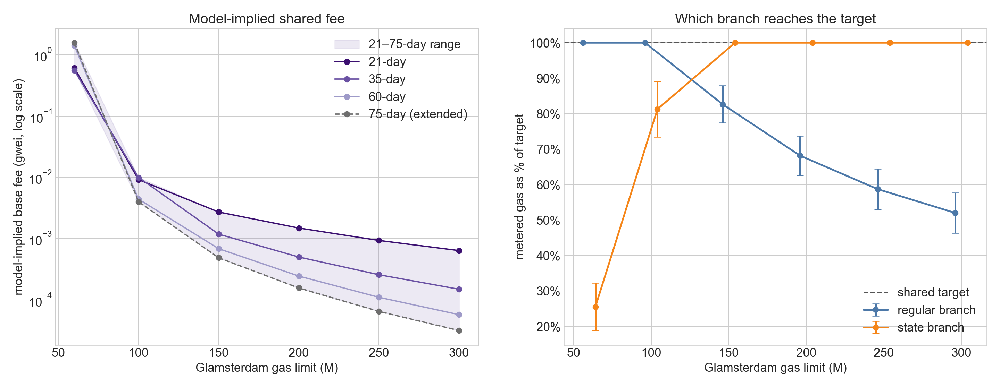

# Glamsterdam Equilibrium Base Fees Under Three-Resource Demand

This report solves the shared Glamsterdam base fee for execution, data, and state demand. The central calculation uses the independent isoelastic elasticities recovered in [notebook 1.8](../notebooks/1.8-three-way-share-model.ipynb). The aggregate-plus-softmax model, calibrated with the state-excluded EIP-7623 estimate, is retained as a structural sensitivity.

The calculations and figures are produced by [notebook 1.9](../notebooks/1.9-three-way-equilibrium-model.ipynb). The demand anchor and Glamsterdam metering multipliers come from the calibrated February–May 2026 panel.

## Main results

1. The 120-day accounting gives pooled multipliers of **1.969 for data** and **5.656 for state**.
2. With the 35-day independent elasticities, the equilibrium shared base fee is **0.00398 gwei** at a 100M gas limit and **0.000502 gwei** at a 200M limit.
3. State gas binds at both headline limits. Conditional on a binding state branch, the independent-model fee is controlled by the state demand curve and state multiplier; the data multiplier does not change it.
4. Across the 21-, 35-, and 60-day independent calibrations, the 100M result ranges from **0.00292 to 0.00635 gwei** and the 200M result from **0.000245 to 0.00149 gwei**.
5. Across the empirical multiplier grid, the independent-model p10–p90 band is **0.003747–0.004191 gwei** at 100M and **0.000473–0.000529 gwei** at 200M.
6. The state-excluded EIP-7623 softmax sensitivity gives **0.00216 gwei** at 100M and **0.000277 gwei** at 200M. These are high-response structural checks, not the central estimates.

These values are long-run fixed points of the demand model, not forecasts of the base fee immediately after activation.

## Shared Glamsterdam fee market

Glamsterdam retains one EIP-1559-style base fee but meters regular gas and state gas separately. For physical quantities $q_i$, the two metered branches are:

$$
g_{\mathrm{regular}}(b)
=m_{\mathrm{execution}}q_{\mathrm{execution}}(b)
+m_{\mathrm{data}}q_{\mathrm{data}}(b),
$$

$$
g_{\mathrm{state}}(b)
=m_{\mathrm{state}}q_{\mathrm{state}}(b).
$$

The shared fee responds to the larger branch:

$$
u(b)=\max\left\{g_{\mathrm{regular}}(b),g_{\mathrm{state}}(b)\right\}.
$$

For gas limit $G$, the target is $T=G/2$. The equilibrium fee $b^*$ solves:

$$
\max\left\{g_{\mathrm{regular}}(b^*),g_{\mathrm{state}}(b^*)\right\}=T.
$$

| Gas limit | Shared target |
|---:|---:|
| 100M | 50M |
| 200M | 100M |

## The 120-day accounting anchor

The anchor covers February 1 through May 31, 2026: 120 days and 860,505 blocks. Its reference base fee is the median of the daily median base fees, **0.1069 gwei**.

The three quantities use one intrinsic-inclusive accounting convention. Data is exact current EIP-7623 data gas. State is the calibrated scalable proxy expressed in historical gas-equivalent units. Execution is total current gas minus those data and state quantities, so the three components sum to observed block gas.

| Resource | Current quantity per block | Share |
|---|---:|---:|
| Execution | 23.942M | 78.84% |
| Data | 1.181M | 3.89% |
| State proxy | 5.244M | 17.27% |
| **Total** | **30.367M** | **100%** |

Using a recent common panel avoids combining demand from one period with metering ratios estimated from another.

## Data repricing under Glamsterdam

For the same observed blocks, Glamsterdam data gas is constructed as:

| Component | Gas per block |
|---|---:|
| Current EIP-7623 data gas | 1.181M |
| EIP-7976 floor uplift | 0.776M |
| Calibrated EIP-7981 access-list gas | 0.368M |
| **Glamsterdam data gas** | **2.324M** |

The pooled data multiplier is therefore:

$$
m_{\mathrm{data}}
=\frac{2.324}{1.181}
=1.969.
$$

The daily multiplier distribution is narrow enough to use directly for sensitivity checks:

| Daily statistic | p10 | p25 | Median | p75 | p90 |
|---|---:|---:|---:|---:|---:|
| $m_{\mathrm{data}}$ | 1.731 | 1.856 | 1.987 | 2.152 | 2.234 |

The EIP-7981 term uses the calibrated access-list estimator because exact RPC/RLP reconstruction for every block would be unnecessarily expensive. It changes the accounting cost, not the observed physical demand.

## State repricing under EIP-8037 accounting

The state proxy remains the scalable measure of physical state creation. We then price the same estimated account, storage, and code creation using the EIP-8037 state-gas schedule with `CPSB = 1530`.

| Accounting convention | State gas per block |
|---|---:|
| Historical gas-equivalent proxy | 5.244M |
| EIP-8037 state gas for the same activity | 29.663M |

Hence:

$$
m_{\mathrm{state}}
=\frac{29.663}{5.244}
=5.656.
$$

| Daily statistic | p10 | p25 | Median | p75 | p90 |
|---|---:|---:|---:|---:|---:|
| $m_{\mathrm{state}}$ | 5.490 | 5.587 | 5.660 | 5.738 | 5.809 |

This approach separates the two tasks cleanly: the proxy estimates how much state was created, while EIP-8037 determines how that same activity would be charged.

## Central demand model: independent isoelastic curves

The central model assumes three independent demands:

$$
q_i(b)=q_i^0\left(m_i\frac{b}{b_{\mathrm{ref}}}\right)^{-\epsilon_i}.
$$

Notebook 1.8 recovers the elasticities from the two clean gas-limit events. The 35-day calibration is central; 21 and 60 days measure sensitivity to the event window.

| Event window | $\epsilon_{\mathrm{execution}}$ | $\epsilon_{\mathrm{data}}$ | $\epsilon_{\mathrm{state}}$ |
|---:|---:|---:|---:|
| 21 days | 0.117 | 0.202 | 0.478 |
| **35 days** | **0.121** | **0.229** | **0.335** |
| 60 days | 0.082 | 0.205 | 0.280 |

The identifying assumption is that each resource responds to its own effective price without cross-price substitution. It provides a transparent benchmark that can be inserted directly into the equilibrium calculation.

## Why state determines the headline equilibrium

At 100M and 200M, state gas is the binding branch. The independent-model condition reduces to:

$$
T=m_{\mathrm{state}}q_{\mathrm{state}}^0
\left(m_{\mathrm{state}}\frac{b^*}{b_{\mathrm{ref}}}\right)^{-\epsilon_{\mathrm{state}}},
$$

and therefore:

$$
\frac{b^*}{b_{\mathrm{ref}}}
=
\left(
\frac{q_{\mathrm{state}}^0m_{\mathrm{state}}^{1-\epsilon_{\mathrm{state}}}}
{T}
\right)^{1/\epsilon_{\mathrm{state}}}.
$$

For $\epsilon_{\mathrm{state}}=0.335$:

$$
b^*\propto T^{-2.986}
\qquad\text{and}\qquad
b^*\propto m_{\mathrm{state}}^{1.986}.
$$

This is why doubling the target reduces the central equilibrium fee by a factor of about 7.9. It also explains why the state multiplier matters much more than the data multiplier at the headline limits. At 60M, by contrast, regular gas binds across the empirical multiplier grid, so data repricing matters there.

## Headline equilibrium results

The central accounting uses $m_{\mathrm{execution}}=1$, $m_{\mathrm{data}}=1.969$, and $m_{\mathrm{state}}=5.656$.

| Demand model | Gas limit | Target | Equilibrium fee | Fraction of 0.1069 gwei anchor | Binding branch |
|---|---:|---:|---:|---:|---|
| Independent isoelastic | 100M | 50M | **0.003975 gwei** | 3.72% | State |
| State-excluded EIP-7623 softmax | 100M | 50M | 0.002163 gwei | 2.02% | State |
| Independent isoelastic | 200M | 100M | **0.000502 gwei** | 0.469% | State |
| State-excluded EIP-7623 softmax | 200M | 100M | 0.000277 gwei | 0.259% | State |

The solved quantities show how the maximum condition works:

| Model | Limit | Execution | Data | State | Regular metered gas | State metered gas |
|---|---:|---:|---:|---:|---:|---:|
| Independent | 100M | 35.68M | 2.15M | 8.84M | 39.91M | **50.00M** |
| Softmax sensitivity | 100M | 44.29M | 2.49M | 8.84M | 49.20M | **50.00M** |
| Independent | 200M | 45.85M | 3.46M | 17.68M | 52.66M | **100.00M** |
| Softmax sensitivity | 200M | 57.09M | 4.01M | 17.68M | 64.99M | **100.00M** |

> The blue band spans the 21-, 35-, and 60-day independent calibrations. The green line is the state-excluded EIP-7623 softmax sensitivity. Both use the pooled 120-day multipliers.

## Sensitivity analysis
### Multiplier-grid sensitivity
The multiplier grid holds the 35-day independent elasticities fixed and uses the daily p10, p25, median, p75, and p90 ratios together with the pooled ratio. The reported band spans p10–p90 across the resulting multiplier combinations.

| Gas limit | p10 | Median | p90 | State binding |
|---:|---:|---:|---:|---:|
| 100M | 0.003747 gwei | 0.003978 gwei | 0.004191 gwei | 100% |
| 200M | 0.000473 gwei | 0.000502 gwei | 0.000529 gwei | 100% |
These are summaries of observed daily multiplier variation, not confidence intervals. At the headline limits, state binds throughout the grid, so the sensitivity is driven by the state multiplier; changing the data multiplier does not change the independent-model equilibrium fee.

### Event-window sensitivity
| Gas limit | Event window | Equilibrium fee | Binding branch | Physical state share |
|---:|---:|---:|---|---:|
| 100M | 21 days | 0.006347 gwei | State | 20.1% |
| 100M | **35 days** | **0.003975 gwei** | State | 18.9% |
| 100M | 60 days | 0.002923 gwei | State | 20.5% |
| 200M | 21 days | 0.001491 gwei | State | 29.7% |
| 200M | **35 days** | **0.000502 gwei** | State | 26.4% |
| 200M | 60 days | 0.000245 gwei | State | 29.2% |

The 200M calculation extrapolates farther from the anchor and is consequently more sensitive to the recovered state elasticity.

## State-excluded EIP-7623 softmax sensitivity

The alternative model allows total demand and resource shares to respond jointly:

$$
v_i=\ln s_i^0-\eta_i\ln r_i,
\qquad
s_i=\frac{e^{v_i}}{\sum_j e^{v_j}},
$$

$$
T_q=T_q^0\exp\left(-\epsilon_{\mathrm{agg}}\sum_j s_j^0\ln r_j\right),
\qquad
q_i=s_iT_q.
$$

EIP-7623 supplies a resource-specific data-price shock. For floor-bound transactions, the theoretical calldata charge rose by 2.5 times; including intrinsic and execution gas gives an effective treated-transaction price ratio of 2.1119. After excluding estimated state creation from the execution denominator, the floor-bound data share falls from 0.6536% to 0.4750%. Thus:

$$
\eta_{\mathrm{data}}^{7623}
=-\frac{\operatorname{logit}(0.004750)-\operatorname{logit}(0.006536)}
{\ln(2.1119)}
=0.429.
$$

The clean gas-limit events identify the differences $\Delta_{\mathrm{data}}=0.108$ and $\Delta_{\mathrm{state}}=0.214$. Therefore:

$$
\eta_{\mathrm{execution}}=0.429-0.108=0.321,
\qquad
\eta_{\mathrm{state}}=0.321+0.214=0.535.
$$

At the 120-day accounting shares, these imply own-price elasticities of approximately 0.201 for execution, 0.419 for data, and 0.472 for state. The softmax equilibrium is 46% below the independent result at 100M and 45% below it at 200M because relative-price substitution shifts activity toward execution before state reaches the target.

> The red marker is the selected state-excluded EIP-7623 calibration. The dashed horizontal line is the central independent equilibrium at the 100M limit.

## Interpretation

The low equilibrium fees do not mean that state activity is mechanically cheaper under Glamsterdam. State activity is first repriced by the 5.656 multiplier. The shared fee then falls because the 50M or 100M state target is above the anchor's repriced state use. At the 100M central equilibrium, the effective state price is about 21.0% of its current-regime anchor price; at 200M it is about 2.65%.

The 200M result requires physical state demand of 17.68M historical gas-equivalent units per block, 3.37 times the 5.24M anchor. It should therefore be read as the internal fixed point of the calibrated curve, not evidence that activity will immediately expand by that amount.

The independent and softmax calculations answer different behavioral questions. The independent model asks how each activity changes with its own effective price. The softmax sensitivity additionally allows relative prices to reallocate demand among resources. Their difference measures dependence on the demand structure, not sampling error.

## Measurement limitation

The main empirical limitation is state measurement. Execution and current data gas come from protocol accounting, while physical state creation is inferred from a calibrated proxy and then translated into EIP-8037 gas. Bias in that proxy can affect the state anchor, the recovered state elasticity, and—because state binds at the headline limits—the equilibrium fee. The 120-day panel improves coverage, but it does not turn the proxy into direct protocol measurement.

The independent-demand structure, the isoelastic extrapolation, and the use of a long-run fixed point are explicit modeling assumptions. They define what the calculation means; they are not additional measurement failures.

## Reproducibility

Primary notebook:

- `notebooks/1.9-three-way-equilibrium-model.ipynb`

Generated tables:

- `data/three_way_equilibrium_accounting_card_2026-02-01_2026-06-01.csv`
- `data/three_way_equilibrium_daily_multipliers_2026-02-01_2026-06-01.csv`
- `data/three_way_equilibrium_parameter_card_2026-02-01_2026-06-01.csv`
- `data/three_way_equilibrium_results_2026-02-01_2026-06-01.csv`
- `data/three_way_equilibrium_headline_2026-02-01_2026-06-01.csv`
- `data/three_way_equilibrium_window_sensitivity_2026-02-01_2026-06-01.csv`
- `data/three_way_equilibrium_multiplier_sensitivity_2026-02-01_2026-06-01.csv`
- `data/three_way_equilibrium_eta_exec_sweep_2026-02-01_2026-06-01.csv`

The notebook solves each of the six demand calibrations at the pooled 120-day multipliers and evaluates the central 35-day independent model over the six-by-six empirical multiplier grid at four gas limits, for 164 distinct solutions. All solutions converge; none reaches the fee floor or an unreachable target.
