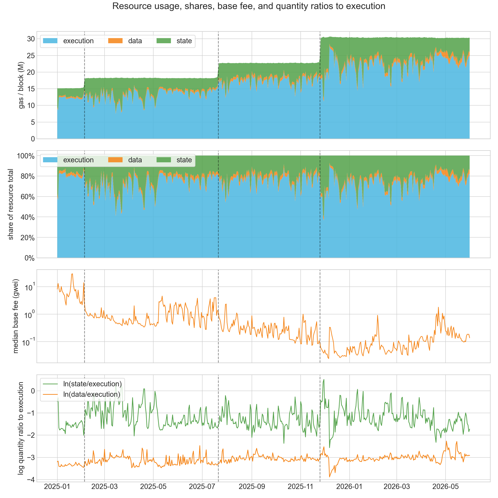
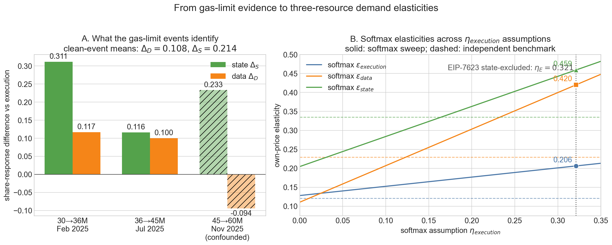

# Price Elasticities for Ethereum Execution, Data, and State Demand

This report extends the [prior state-versus-burst analysis](https://ethresear.ch/t/empirical-analysis-of-price-elasticities-for-ethereum-state-and-burst-resources/24166/1) to three resources: execution, data, and state. The purpose is to calibrate demand for an [EIP-7999](https://github.com/ethereum/EIPs/blob/master/EIPS/eip-7999.md) fee market in which those resources can receive separate prices.

We use daily Ethereum mainnet observations from January 2025 through May 2026. Gas-limit increases provide common base-fee shocks, while the EIP-7623 calldata floor provides a smaller treated-segment check for data demand.

## Main results

1. Across the two clean gas-limit events, aggregate demand is inelastic: $\epsilon_{\mathrm{agg}} \approx 0.169$. Including the Fusaka-confounded third event raises the three-event mean to 0.191.
2. If execution, data, and state each follow an independent isoelastic demand curve, the event estimates and pre-Fusaka resource shares imply:

   $$
   (\epsilon_{\mathrm{execution}},\epsilon_{\mathrm{data}},\epsilon_{\mathrm{state}})
   \approx (0.121, 0.229, 0.335).
   $$

3. State demand is the most price-responsive in both clean events. Data demand is more price-responsive than execution demand under the independent specification.
4. The clean events also show stable relative quantity responses: $\Delta_{\mathrm{data}} \approx 0.108$ and $\Delta_{\mathrm{state}} \approx 0.214$. These measure how data and state quantities change relative to execution when the common base fee moves.
5. The aggregate-plus-softmax model remains useful as a sensitivity check, but it needs an additional assumption that the common-price events cannot determine. Its EIP-7623 calibration should be read as a high-response case, not the preferred estimate.
6. Only two events support the headline calibration, and their execution responses differ substantially. The vector above is therefore a central calibration for simulation, not a precise statistical estimate.

## Central model: three independent isoelastic demands

Let:

$$
i \in \{\mathrm{execution},\ \mathrm{data},\ \mathrm{state}\}.
$$

For any period, define total measured resource gas and resource $i$'s share as:

$$
Q=\sum_j q_j,
\qquad
s_i=\frac{q_i}{Q},
\qquad
\sum_i s_i=1.
$$

Here $q_i$ is resource $i$'s gas-equivalent quantity per block. The current-rule accounting divides scalar block gas into mutually exclusive execution, data, and state components, so these shares add to one. A superscript zero denotes the pre-event anchor: $q_i^0$, $Q^0$, and $s_i^0=q_i^0/Q^0$.

The central specification assumes:

$$
q_i(p_i)
= q_i^0
\left(
\frac{p_i}{p_i^0}
\right)^{-\epsilon_i},
$$

where $q_i^0$ and $p_i^0$ are the anchor quantity and price, and $\epsilon_i$ is resource $i$'s own-price elasticity.

Under the historical one-dimensional fee market, all three resources pay the same base fee:

$$
p_{\mathrm{execution}}
=p_{\mathrm{data}}
=p_{\mathrm{state}}
=p.
$$

If the three demands are independent, a common fee shock identifies each elasticity directly:

$$
\epsilon_i
=-
\frac{\Delta\ln(q_i/\mathrm{block})}
{\Delta\ln p}.
$$

The changes in each resource quantity relative to execution provide an equivalent decomposition:

$$
\Delta_{\mathrm{data}}
=-
\frac{\Delta\ln(q_{\mathrm{data}}/q_{\mathrm{execution}})}
{\Delta\ln p}
=\epsilon_{\mathrm{data}}-\epsilon_{\mathrm{execution}},
$$

$$
\Delta_{\mathrm{state}}
=-
\frac{\Delta\ln(q_{\mathrm{state}}/q_{\mathrm{execution}})}
{\Delta\ln p}
=\epsilon_{\mathrm{state}}-\epsilon_{\mathrm{execution}}.
$$

Thus $\Delta_i$ is not a resource share and is not itself an own-price elasticity. A positive $\Delta_i$ means that resource $i$ increases more than execution when the common fee falls; a negative value means that it increases less than execution. The actual shares $s_i$ move because the relative quantities move.

At the anchor, aggregate elasticity is the resource-share-weighted mean:

$$
\epsilon_{\mathrm{agg}}
=s_{\mathrm{execution}}^0\epsilon_{\mathrm{execution}}
+s_{\mathrm{data}}^0\epsilon_{\mathrm{data}}
+s_{\mathrm{state}}^0\epsilon_{\mathrm{state}}.
$$

The three equations recover all three elasticities:

$$
\epsilon_{\mathrm{execution}}
=\epsilon_{\mathrm{agg}}
-s_{\mathrm{data}}^0\Delta_{\mathrm{data}}
-s_{\mathrm{state}}^0\Delta_{\mathrm{state}},
$$

$$
\epsilon_{\mathrm{data}}
=\epsilon_{\mathrm{execution}}+\Delta_{\mathrm{data}},
\qquad
\epsilon_{\mathrm{state}}
=\epsilon_{\mathrm{execution}}+\Delta_{\mathrm{state}}.
$$

This recovery does not use EIP-7623. It replaces the aggregate-plus-softmax assumption with a different, transparent assumption: each resource responds only to its own price. That excludes cross-price substitution and the fact that one transaction can consume all three resources, so it should be treated as the central benchmark rather than a complete transaction-bundle model.

## Aggregate-plus-softmax model as a sensitivity

The alternative model separates total demand from its execution, data, and state composition. It first assigns each resource a score $v_i$ and converts those scores into shares with a softmax:

$$
v_i=a_i-\eta_i\ln p_i,
\qquad
s_i=\frac{\exp(v_i)}{\sum_j\exp(v_j)},
\qquad
q_i=s_iT.
$$

The symbols have the following meanings:

| Symbol | Meaning |
|---|---|
| $T=\sum_j q_j$ | Total gas-equivalent demand across the three measured resources |
| $s_i=q_i/T$ | Resource $i$'s share of that total; the softmax ensures $s_i>0$ and $\sum_i s_i=1$ |
| $v_i$ | Resource $i$'s composition score; a larger score produces a larger $s_i$ |
| $a_i$ | Baseline composition constant, chosen so the model reproduces the anchor shares $s_i^0$ |
| $p_i$ | Effective price of resource $i$ |
| $\eta_i$ | Sensitivity of resource $i$'s composition score to its own log price |

Total demand responds to a weighted price index $R$:

$$
T=T_{\mathrm{ref}}
\left(
\frac{R}{R_{\mathrm{ref}}}
\right)^{-\epsilon_{\mathrm{agg}}},
\qquad
\ln R=\sum_j w_j\ln p_j,
$$

Here $T_{\mathrm{ref}}$ and $R_{\mathrm{ref}}$ are the anchor total and price index, $w_i$ is resource $i$'s price-index weight, $\sum_i w_i=1$, and $\epsilon_{\mathrm{agg}}$ is the elasticity of total demand with respect to $R$.

Under the historical common fee, $p_i=p$ for all resources. Relative to execution $E$:

$$
\ln\frac{s_i}{s_E}
=v_i-v_E
=(a_i-a_E)-(\eta_i-\eta_E)\ln p.
$$

Consequently, the event statistic defined above maps to $\Delta_i=\eta_i-\eta_E$ inside the softmax model. Historical common-price shocks identify $\eta_{\mathrm{data}}-\eta_{\mathrm{execution}}$ and $\eta_{\mathrm{state}}-\eta_{\mathrm{execution}}$, but during those common-price observations, adding the same constant to all three $\eta_i$ values shifts every $v_i$ by the same amount and leaves the shares unchanged. The softmax model therefore needs either an assumed $\eta_{\mathrm{execution}}$ or a calibration from an event in which relative resource prices move.

Its general own-price elasticity is:

$$
\epsilon_i
=\eta_i(1-s_i)+\epsilon_{\mathrm{agg}}w_i.
$$

At the common-price H0 anchor, we set price-index expenditure weights equal to measured resource gas shares, $w_i=s_i^0$. Gas shares and expenditure shares need not remain equal after EIP-7999 assigns different prices and units to each resource.

This ambiguity belongs to the softmax specification. It is not a general failure of the gas-limit events to identify independent isoelastic demand curves.

## Data

The daily sample runs from `2025-01-01` through `2026-05-31` and includes three gas-limit increases:

| Event | Date | Gas-limit change |
|---|---:|---:|
| 30M to 36M | 2025-02-04 | +20% |
| 36M to 45M | 2025-07-21 | +25% |
| 45M to 60M | 2025-11-25 | +33% |

We construct the three quantities in current-rule gas units:

- `state`: positive daily changes in account count, storage bytes, and contract-code bytes, converted using 25,000 gas per 112-byte account, 20,000 gas per 32-byte storage slot, and 200 gas per contract-code byte;
- `data`: charged calldata gas, including the EIP-7623 floor branch after Pectra;
- `execution`: total block gas minus data gas minus state gas, including the 21,000 intrinsic gas per transaction so the three quantities sum to observed block gas.

Across the full sample, the mean resource mix is:

| Resource | Mean gas per block | Share |
|---|---:|---:|
| Execution | 17.33M | 73.6% |
| Data | 0.81M | 3.4% |
| State | 5.42M | 23.0% |

The elasticity recovery uses the last clean pre-Fusaka regime as its anchor: execution 75.7%, data 3.6%, and state 20.7%.

## Gas-limit event study

> Resource quantities and shares, the median daily base fee, and log quantity ratios relative to execution.

For each event, we use 35-day pre- and post-windows, exclude three days around the event, pool resource quantities by block, and use the median of daily median base fees.

| Event | $\Delta\ln p$ | $\epsilon_{\mathrm{agg}}$ | $\Delta_{\mathrm{state}}$ | $\Delta_{\mathrm{data}}$ | $\epsilon_{\mathrm{execution}}$ | $\epsilon_{\mathrm{data}}$ | $\epsilon_{\mathrm{state}}$ |
|---|---:|---:|---:|---:|---:|---:|---:|
| 30M to 36M | -2.114 | 0.087 | 0.311 | 0.117 | 0.011 | 0.128 | 0.322 |
| 36M to 45M | -0.887 | 0.251 | 0.116 | 0.100 | 0.223 | 0.323 | 0.339 |
| 45M to 60M | -1.254 | 0.234 | 0.233 | -0.094 | 0.180 | 0.086 | 0.413 |

The third event is excluded from the headline calibration because its post-window overlaps Fusaka and the first BPO blob-capacity increase. Those changes altered the relative appeal of blobs and L1 calldata independently of the gas-limit shock.

The short window from November 26 through December 2 provides a supportive diagnostic: the fee fell from 0.160 to 0.047 gwei while calldata bytes rose 16% per block, implying $\Delta_{\mathrm{data}}\approx0.26$. Seven days are not enough to prove that Fusaka caused the full 35-day reversal, but the diagnostic supports treating the third event as confounded.

The pooled event contrasts are:

| Events included | Mean $\epsilon_{\mathrm{agg}}$ | Mean $\Delta_{\mathrm{state}}$ | Mean $\Delta_{\mathrm{data}}$ |
|---|---:|---:|---:|
| Events 1 and 2 | 0.169 | 0.214 | 0.108 |
| All three events | 0.191 | 0.220 | 0.041 |

Using the clean-event means and the 45M anchor shares gives:

| Recovery | $\epsilon_{\mathrm{execution}}$ | $\epsilon_{\mathrm{data}}$ | $\epsilon_{\mathrm{state}}$ |
|---|---:|---:|---:|
| Aggregate elasticity + relative quantity differences | 0.121 | 0.229 | 0.335 |
| Direct mean of the two resource responses | 0.117 | 0.225 | 0.331 |

The 0.004 difference for each resource comes from averaging the event parameters before applying fixed anchor shares, rather than averaging the two finite event responses directly.

## Window and event uncertainty

The window check repeats the clean-event recovery at 21, 35, 60, and 75 days:

| Window | $\epsilon_{\mathrm{agg}}$ | $\epsilon_{\mathrm{execution}}$ | $\epsilon_{\mathrm{data}}$ | $\epsilon_{\mathrm{state}}$ |
|---:|---:|---:|---:|---:|
| 21d | 0.195 | 0.117 | 0.202 | 0.478 |
| 35d | 0.169 | 0.121 | 0.229 | 0.335 |
| 60d | 0.127 | 0.082 | 0.205 | 0.280 |
| 75d | 0.119 | 0.079 | 0.201 | 0.254 |

Data elasticity is comparatively stable across windows, near 0.20–0.23. State elasticity falls as the window expands, consistent with a strong initial response that partly reverses. Execution elasticity also varies substantially between the two clean events. These patterns argue for sweeping the elasticities in simulations rather than fixing one vector.

A daily ARDL check on the full 516-day panel gives a long-run data-versus-execution contrast near 0.11, close to the event estimate. Its state contrast is larger and its residual autocorrelation diagnostics are weak. We therefore keep the daily regressions as supporting evidence and use the gas-limit events for the central calibration.

## Softmax sensitivity results

The softmax results depend on how the otherwise undetermined common component of the $\eta_i$ values is selected. The gas-limit events give:

$$
\eta_{\mathrm{data}}
=\eta_{\mathrm{execution}}+\Delta_{\mathrm{data}},
\qquad
\eta_{\mathrm{state}}
=\eta_{\mathrm{execution}}+\Delta_{\mathrm{state}},
$$

so choosing $\eta_{\mathrm{execution}}$ specifies the full triplet.

### Sweeping $\eta_{\mathrm{execution}}$

The first sensitivity check varies $\eta_{\mathrm{execution}}$ from 0 to 0.3. The zero row is the most conservative softmax case: execution's composition score $v_{\mathrm{execution}}$ has no direct own-price term, while data and state retain the $\eta$ differences measured in the gas-limit events. Values above 0.3 would push execution's implied elasticity beyond the upper end of the earlier burst-resource calibration, so they are not used in the main sweep.

Using the 45M anchor shares and

$$
\epsilon_i=\eta_i(1-s_i^0)+\epsilon_{\mathrm{agg}}s_i^0,
$$

the sweep gives:

| $\eta_{\mathrm{execution}}$ | $\eta_{\mathrm{data}}$ | $\eta_{\mathrm{state}}$ | $\epsilon_{\mathrm{execution}}$ | $\epsilon_{\mathrm{data}}$ | $\epsilon_{\mathrm{state}}$ |
|---:|---:|---:|---:|---:|---:|
| 0.000 | 0.108 | 0.214 | 0.128 | 0.111 | 0.205 |
| 0.050 | 0.158 | 0.264 | 0.140 | 0.159 | 0.244 |
| 0.100 | 0.208 | 0.314 | 0.152 | 0.207 | 0.284 |
| 0.200 | 0.308 | 0.414 | 0.177 | 0.303 | 0.363 |
| 0.300 | 0.408 | 0.514 | 0.201 | 0.400 | 0.442 |

This table also shows why a positive $\Delta_{\mathrm{data}}$ does not guarantee $\epsilon_{\mathrm{data}}>\epsilon_{\mathrm{execution}}$ in every softmax case. With the measured shares, data overtakes execution only when $\eta_{\mathrm{execution}}\gtrsim0.025$. State remains the most responsive resource throughout the sweep.

### Calibrating the softmax with EIP-7623

EIP-7623 supplies the only historical observation in this study where calldata-heavy transactions faced a resource-specific price increase. Before Pectra, the relevant calldata accounting was 4 gas per zero byte and 16 gas per nonzero byte. The floor branch raised those charges to 10 and 40 gas, giving the theoretical byte-price ratio:

$$
\frac{10}{4}=\frac{40}{16}=2.5.
$$

The all-in transaction price rose by less than 2.5 because the affected transactions also contain intrinsic and execution gas. Using the pre-fork treated transactions, notebook 1.4 estimates an effective transaction-body price ratio of:

$$
\rho_{7623}=2.1119.
$$

The main window contains 60 daily observations before and after activation, with May 6–8 excluded. The pre-window runs from March 7 through May 5, and the post-window from May 9 through July 7. About 1.81% of pre-fork transactions satisfy the floor-bound proxy; their fraction of transactions falls to 1.44% after activation. Their calldata falls from approximately 4.75 kB to 3.77 kB per block.

For the softmax calibration, let $D_t$ be treated standard calldata gas per block and $E_t$ be untreated execution gas per block in period $t\in\{\mathrm{pre},\mathrm{post}\}$. Define the two-category treated-data share:

$$
\alpha_t
=\alpha^{\mathrm{treated}}_{\mathrm{data}|\mathrm{execution},t}
=
\frac{D_t}{D_t+E_t}.
$$

This $\alpha_t$ is a gas-composition share used only for the treated data-versus-execution comparison. It is not the fraction of transactions that are floor-bound and it is not the three-resource share $s_i$. Its logit is the treated-data-to-execution log ratio:

$$
\operatorname{logit}(\alpha_t)
=\ln\frac{\alpha_t}{1-\alpha_t}
=\ln\frac{D_t}{E_t}.
$$

Let $\rho_{7623}=p_{\mathrm{post}}/p_{\mathrm{pre}}$ denote the effective treated-transaction price ratio. The treated data-versus-execution price response is:

$$
\eta_{\mathrm{data}}^{7623}
=-
\frac{
\operatorname{logit}(\alpha_{\mathrm{post}})
-\operatorname{logit}(\alpha_{\mathrm{pre}})
}
{\ln \rho_{7623}}.
$$

Two denominator conventions are reported:

| EIP-7623 calculation | $\alpha_{\mathrm{pre}}$ | $\alpha_{\mathrm{post}}$ | Theoretical-ratio $\eta_{\mathrm{data}}$ | Effective-ratio $\eta_{\mathrm{data}}$ |
|---|---:|---:|---:|---:|
| Main treated calculation | 0.467% | 0.366% | 0.266 | 0.326 |
| Excluding estimated state creation from execution | 0.654% | 0.475% | 0.350 | 0.429 |

The second calculation subtracts estimated state-creation gas from the execution denominator. This matches the three-resource decomposition, where state has already been removed before comparing data with execution. We therefore use only this state-excluded estimate in the softmax calibration; the main treated calculation is retained above to show the effect of the accounting adjustment. Substituting the selected values gives:

$$
\eta_{\mathrm{data}}^{7623}
=-
\frac{
\operatorname{logit}(0.004750)
-\operatorname{logit}(0.006536)
}
{\ln(2.1119)}
\approx0.429.
$$

The gas-limit estimates then map this data parameter into the remaining softmax parameters:

$$
\eta_{\mathrm{execution}}
=\eta_{\mathrm{data}}^{7623}-\Delta_{\mathrm{data}},
\qquad
\eta_{\mathrm{state}}
=\eta_{\mathrm{execution}}+\Delta_{\mathrm{state}}.
$$

For the state-excluded EIP-7623 calculation:

$$
(\eta_{\mathrm{execution}},\eta_{\mathrm{data}},\eta_{\mathrm{state}})
\approx(0.321,0.429,0.535),
$$

which implies:

$$
(\epsilon_{\mathrm{execution}},\epsilon_{\mathrm{data}},\epsilon_{\mathrm{state}})
\approx(0.206,0.420,0.459).
$$

### Comparison of demand specifications

The complete comparison is:

| Demand specification | $\epsilon_{\mathrm{execution}}$ | $\epsilon_{\mathrm{data}}$ | $\epsilon_{\mathrm{state}}$ |
|---|---:|---:|---:|
| Independent isoelastic, clean 35d events | 0.121 | 0.229 | 0.335 |
| Softmax, $\eta_{\mathrm{execution}}=0$ | 0.128 | 0.111 | 0.205 |
| Softmax, EIP-7623 state-excluded calibration | 0.206 | 0.420 | 0.459 |

> Panel A shows the event-identified relative quantity responses, with the Fusaka-confounded third event hatched. Panel B shows how softmax-implied elasticities change continuously with $\eta_{\mathrm{execution}}$. The vertical dotted line marks the selected state-excluded EIP-7623 calibration; dashed horizontal lines show the independent isoelastic benchmarks.

The state-excluded EIP-7623 estimate is useful for calibrating the softmax model, but it may overstate market-wide data responsiveness for three reasons:

1. Transactions are selected by remaining floor-bound, so some measured adjustment may reflect restructuring out of the treated category rather than fewer calldata bytes.
2. Pectra simultaneously increased blob capacity, making blobs a cheaper substitute for calldata-heavy transactions.
3. Floor-bound transactions are unusually exposed to calldata prices, while most calldata gas did not face the floor.

State is the most responsive resource throughout the sweep. The data-versus-execution ordering is not robust within the softmax family: with $\eta_{\mathrm{execution}}=0$, data elasticity is slightly below execution elasticity. The independent model and the selected EIP-7623 softmax calibration instead give state $>$ data $>$ execution.

## Implications for EIP-7999

The central calibration for equilibrium simulations is:

$$
(\epsilon_{\mathrm{execution}},\epsilon_{\mathrm{data}},\epsilon_{\mathrm{state}})
=(0.121,0.229,0.335),
$$

with the window table defining the first sensitivity range. The aggregate-plus-softmax results provide a separate structural check rather than the headline input.

The evidence supports treating data demand differently from execution demand. Combined with the propagation constraint and worst-case payload rationale for a bandwidth limit, this strengthens the case for a separate EIP-7999 data resource. The elasticity evidence alone does not prove that a separate resource is optimal.

These elasticities are reduced-form H0 priors. They do not by themselves solve future bundle demand. Under EIP-7999, one state-creating transaction can consume execution gas, data or BAL gas, and state gas simultaneously. Equilibrium simulations must preserve that coupling, either through transaction replay, bundle recipes, or explicit cross-price sensitivity checks.

## Measurement limitation

State creation is approximated from positive daily inventory changes rather than measured transaction by transaction. Over the 123 days where a transaction-derived measure is available, the two measurements have correlation 0.99, but the daily proxy is about 28% higher on average. This raises the state anchor share from roughly 16% to 20.7% and shifts the recovered elasticities by about 0.01–0.02. Some state-creating operations were also historically undercharged, including ETH transfers to new accounts.
